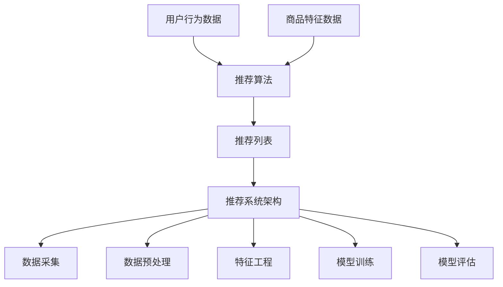

                 

# 大模型在电商推荐中的应用与挑战

> 关键词：大模型、电商推荐、深度学习、协同过滤、个性化推荐、用户行为分析、推荐系统

> 摘要：随着大数据和人工智能技术的迅猛发展，大模型在电商推荐系统中的应用越来越广泛。本文将从背景介绍、核心概念与联系、核心算法原理与具体操作步骤、数学模型和公式、项目实战、实际应用场景、工具和资源推荐、总结与未来发展趋势等方面，全面探讨大模型在电商推荐中的应用与挑战。通过深入分析，我们将揭示大模型如何提升推荐系统的准确性和个性化，同时也会讨论其面临的挑战和未来的发展方向。

## 1. 背景介绍

电商推荐系统是电子商务平台的核心组成部分之一，其主要目的是通过分析用户的历史行为、兴趣偏好等信息，为用户提供个性化的商品推荐。随着用户数据量的激增和计算能力的提升，传统的推荐算法已经难以满足日益复杂和多样化的推荐需求。因此，大模型在电商推荐中的应用逐渐成为研究热点。

### 1.1 电商推荐系统的发展历程

- **早期推荐系统**：基于内容的推荐和协同过滤推荐是早期推荐系统的主要技术。基于内容的推荐通过分析商品的特征信息来推荐相似的商品；协同过滤推荐则通过分析用户的历史行为来推荐相似用户喜欢的商品。
- **深度学习时代的到来**：随着深度学习技术的发展，基于深度学习的推荐系统逐渐崭露头角。深度学习模型能够从大规模用户行为数据中学习到更复杂的用户偏好和商品特征，从而提供更准确和个性化的推荐。

### 1.2 大模型在电商推荐中的优势

- **更强的表达能力**：大模型能够从海量数据中学习到更丰富的特征表示，从而提高推荐的准确性和个性化程度。
- **更好的泛化能力**：大模型通过深度学习技术，能够更好地捕捉用户行为的长期趋势和短期变化，从而提高推荐系统的泛化能力。
- **更高的计算效率**：现代大模型通常采用分布式训练和优化算法，能够在大规模数据集上实现高效的训练和推理。

## 2. 核心概念与联系

### 2.1 大模型概述

大模型通常指的是参数量巨大、结构复杂的机器学习模型，如深度神经网络、Transformer等。这些模型能够从大规模数据中学习到更复杂的特征表示，从而提高推荐系统的性能。

### 2.2 电商推荐系统的核心概念

- **用户行为数据**：包括用户的浏览记录、购买记录、评价记录等。
- **商品特征数据**：包括商品的类别、价格、品牌、描述等。
- **推荐算法**：用于从用户行为数据和商品特征数据中学习用户偏好和商品特征，从而生成推荐列表。
- **推荐系统架构**：包括数据采集、数据预处理、特征工程、模型训练、模型评估和推荐生成等环节。

### 2.3 核心概念之间的联系

- **用户行为数据**和**商品特征数据**是推荐系统的基础输入。
- **推荐算法**通过分析用户行为数据和商品特征数据，生成推荐列表。
- **推荐系统架构**涵盖了从数据采集到推荐生成的整个流程，确保推荐系统的高效运行。



## 3. 核心算法原理 & 具体操作步骤

### 3.1 基于深度学习的推荐算法

- **协同过滤推荐**：通过分析用户的历史行为数据，找到与目标用户行为相似的用户，推荐这些用户喜欢的商品。
- **基于内容的推荐**：通过分析商品的特征信息，找到与目标用户偏好相似的商品。
- **深度神经网络推荐**：通过构建多层神经网络模型，从用户行为数据和商品特征数据中学习到更复杂的特征表示，从而生成推荐列表。

### 3.2 具体操作步骤

1. **数据采集**：从电商平台获取用户行为数据和商品特征数据。
2. **数据预处理**：对数据进行清洗、去重、归一化等处理。
3. **特征工程**：提取用户行为特征和商品特征，构建特征向量。
4. **模型训练**：使用深度神经网络模型进行训练，学习用户偏好和商品特征。
5. **模型评估**：通过交叉验证等方法评估模型的性能。
6. **推荐生成**：根据用户行为数据和商品特征数据，生成推荐列表。

## 4. 数学模型和公式 & 详细讲解 & 举例说明

### 4.1 协同过滤推荐

- **用户-物品矩阵**：表示用户对物品的评分或行为数据。
- **相似度计算**：通过计算用户之间的相似度或物品之间的相似度，生成推荐列表。

$$
\text{相似度}(u_1, u_2) = \frac{\sum_{i \in I} \text{rating}(u_1, i) \cdot \text{rating}(u_2, i)}{\sqrt{\sum_{i \in I} \text{rating}(u_1, i)^2} \cdot \sqrt{\sum_{i \in I} \text{rating}(u_2, i)^2}}
$$

### 4.2 基于内容的推荐

- **商品特征向量**：表示商品的特征信息。
- **用户偏好向量**：表示用户的偏好信息。
- **相似度计算**：通过计算用户偏好向量和商品特征向量之间的相似度，生成推荐列表。

$$
\text{相似度}(u, i) = \frac{\text{user\_vector}(u) \cdot \text{item\_vector}(i)}{\|\text{user\_vector}(u)\| \cdot \|\text{item\_vector}(i)\|}
$$

### 4.3 深度神经网络推荐

- **多层神经网络模型**：包括输入层、隐藏层和输出层。
- **损失函数**：用于衡量模型预测结果与真实结果之间的差异。
- **优化算法**：用于更新模型参数，提高模型性能。

$$
\text{损失函数} = \frac{1}{N} \sum_{i=1}^{N} \left( \text{预测值}(x_i) - \text{真实值}(y_i) \right)^2
$$

## 5. 项目实战：代码实际案例和详细解释说明

### 5.1 开发环境搭建

- **Python版本**：3.8
- **深度学习框架**：TensorFlow 2.0
- **数据集**：MovieLens 100K

### 5.2 源代码详细实现和代码解读

```python
import tensorflow as tf
from tensorflow.keras.layers import Embedding, Dense, Flatten
from tensorflow.keras.models import Model

# 数据预处理
def preprocess_data():
    # 读取数据
    ratings = pd.read_csv('ratings.csv')
    # 构建用户-物品矩阵
    user_item_matrix = ratings.pivot_table(index='user_id', columns='item_id', values='rating', fill_value=0)
    # 划分训练集和测试集
    train_data, test_data = train_test_split(user_item_matrix, test_size=0.2, random_state=42)
    return train_data, test_data

# 构建模型
def build_model(user_count, item_count, embedding_dim):
    user_input = tf.keras.layers.Input(shape=(1,))
    item_input = tf.keras.layers.Input(shape=(1,))
    
    user_embedding = Embedding(user_count, embedding_dim)(user_input)
    item_embedding = Embedding(item_count, embedding_dim)(item_input)
    
    user_flatten = Flatten()(user_embedding)
    item_flatten = Flatten()(item_embedding)
    
    concat = tf.keras.layers.Concatenate()([user_flatten, item_flatten])
    dense1 = Dense(64, activation='relu')(concat)
    dense2 = Dense(32, activation='relu')(dense1)
    output = Dense(1, activation='sigmoid')(dense2)
    
    model = Model(inputs=[user_input, item_input], outputs=output)
    model.compile(optimizer='adam', loss='binary_crossentropy', metrics=['accuracy'])
    return model

# 训练模型
def train_model(model, train_data, epochs=10):
    user_ids = train_data.index.values
    item_ids = train_data.columns.values
    ratings = train_data.values
    
    history = model.fit(
        [user_ids, item_ids], ratings,
        epochs=epochs,
        batch_size=128,
        validation_split=0.2
    )
    return history

# 评估模型
def evaluate_model(model, test_data):
    user_ids = test_data.index.values
    item_ids = test_data.columns.values
    ratings = test_data.values
    
    loss, accuracy = model.evaluate([user_ids, item_ids], ratings)
    return loss, accuracy

# 主函数
def main():
    train_data, test_data = preprocess_data()
    user_count, item_count = train_data.shape[0], train_data.shape[1]
    embedding_dim = 16
    
    model = build_model(user_count, item_count, embedding_dim)
    history = train_model(model, train_data)
    loss, accuracy = evaluate_model(model, test_data)
    print(f'Loss: {loss}, Accuracy: {accuracy}')

if __name__ == '__main__':
    main()
```

### 5.3 代码解读与分析

- **数据预处理**：读取数据并构建用户-物品矩阵，划分训练集和测试集。
- **模型构建**：构建多层神经网络模型，包括输入层、嵌入层、全连接层和输出层。
- **模型训练**：使用训练数据训练模型，记录训练过程中的损失和准确率。
- **模型评估**：使用测试数据评估模型的性能。

## 6. 实际应用场景

### 6.1 个性化推荐

- **商品推荐**：根据用户的浏览记录和购买记录，推荐用户可能感兴趣的商品。
- **内容推荐**：根据用户的阅读记录和评论记录，推荐用户可能感兴趣的内容。

### 6.2 用户行为分析

- **用户画像**：通过分析用户的浏览记录和购买记录，构建用户画像，了解用户的兴趣偏好。
- **用户行为趋势**：通过分析用户的长期行为趋势，预测用户的未来行为。

## 7. 工具和资源推荐

### 7.1 学习资源推荐

- **书籍**：《推荐系统实践》、《深度学习》
- **论文**：《Deep Learning for Recommender Systems》、《Collaborative Filtering for Implicit Feedback Datasets》
- **博客**：阿里云推荐系统团队博客、京东推荐系统团队博客
- **网站**：Kaggle、GitHub

### 7.2 开发工具框架推荐

- **深度学习框架**：TensorFlow、PyTorch
- **数据处理工具**：Pandas、NumPy
- **可视化工具**：Matplotlib、Seaborn

### 7.3 相关论文著作推荐

- **论文**：《Deep Neural Networks for YouTube Recommendations》、《Neural Collaborative Filtering》
- **著作**：《推荐系统：原理与实践》、《深度学习与推荐系统》

## 8. 总结：未来发展趋势与挑战

### 8.1 未来发展趋势

- **更复杂的模型**：大模型将继续发展，从简单的线性模型发展到更复杂的深度学习模型。
- **更丰富的数据**：随着物联网和大数据技术的发展，推荐系统将能够从更丰富的数据中学习到更复杂的特征表示。
- **更个性化的推荐**：推荐系统将能够提供更个性化的推荐，满足用户多样化的需求。

### 8.2 面临的挑战

- **数据隐私**：如何在保护用户隐私的前提下，充分利用用户数据进行推荐。
- **计算资源**：如何在有限的计算资源下，实现高效的大模型训练和推理。
- **模型解释性**：如何提高大模型的解释性，让用户理解推荐结果的来源。

## 9. 附录：常见问题与解答

### 9.1 问题：如何处理冷启动问题？

- **回答**：可以通过引入用户行为数据和商品特征数据，结合协同过滤和基于内容的推荐方法，解决冷启动问题。

### 9.2 问题：如何提高模型的泛化能力？

- **回答**：可以通过增加训练数据量、引入正则化技术、使用迁移学习等方法，提高模型的泛化能力。

### 9.3 问题：如何评估推荐系统的性能？

- **回答**：可以通过准确率、召回率、F1值等指标，评估推荐系统的性能。

## 10. 扩展阅读 & 参考资料

- **书籍**：《推荐系统实践》、《深度学习》
- **论文**：《Deep Learning for Recommender Systems》、《Collaborative Filtering for Implicit Feedback Datasets》
- **博客**：阿里云推荐系统团队博客、京东推荐系统团队博客
- **网站**：Kaggle、GitHub

---

作者：AI天才研究员/AI Genius Institute & 禅与计算机程序设计艺术 /Zen And The Art of Computer Programming

