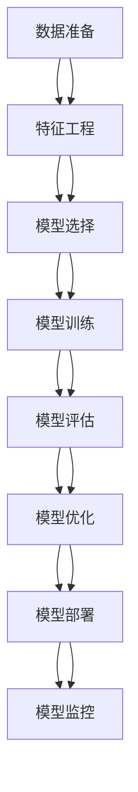

                 

# 大模型在金融风控中的应用探索

> 关键词：大模型、金融风控、机器学习、深度学习、自然语言处理、图神经网络、时间序列分析

> 摘要：本文旨在探讨大模型在金融风控领域的应用，通过深入分析其核心概念、算法原理、数学模型、实际案例以及应用场景，揭示大模型如何提升金融风控的效率和准确性。我们将从背景介绍、核心概念与联系、核心算法原理与具体操作步骤、数学模型和公式、项目实战、实际应用场景、工具和资源推荐、总结与未来发展趋势等多方面进行详细阐述。

## 1. 背景介绍

金融风控是金融机构确保资产安全、降低风险的重要手段。随着大数据和人工智能技术的发展，大模型在金融风控中的应用越来越广泛。大模型通常指的是具有大量参数和复杂结构的机器学习模型，如深度神经网络、图神经网络等。这些模型能够从海量数据中学习复杂的模式和关系，从而提高风险识别和预测的准确性。

### 1.1 金融风控的重要性

金融风控的重要性不言而喻。金融机构需要通过各种手段来识别和管理潜在的风险，以确保资产的安全和业务的稳健发展。传统的风控方法依赖于人工经验和规则，但这种方法存在诸多局限性，如主观性强、效率低下、难以处理复杂的数据关系等。而大模型则能够通过自动化的方式，从海量数据中学习复杂的模式和关系，从而提高风险识别和预测的准确性。

### 1.2 大模型的优势

大模型具有以下优势：
- **数据驱动**：能够从海量数据中学习复杂的模式和关系。
- **自动化**：自动化处理数据，减少人工干预。
- **高精度**：通过深度学习等技术，提高风险识别和预测的准确性。
- **灵活性**：能够适应不同的业务场景和数据类型。

## 2. 核心概念与联系

### 2.1 机器学习与深度学习

机器学习是一种让计算机从数据中学习的方法，而深度学习是机器学习的一个分支，通过多层神经网络来学习数据的复杂模式。深度学习模型通常具有大量的参数和复杂的结构，能够从海量数据中学习到更深层次的特征。

### 2.2 图神经网络

图神经网络（Graph Neural Networks, GNNs）是一种专门处理图数据的深度学习模型。图数据通常表示为节点和边的集合，图神经网络能够通过节点之间的关系来学习节点的特征表示。在金融风控中，图神经网络可以用于识别复杂的关联关系，如客户之间的关系、交易对手之间的关系等。

### 2.3 时间序列分析

时间序列分析是一种处理时间序列数据的方法，通过分析数据随时间的变化趋势来预测未来的趋势。在金融风控中，时间序列分析可以用于预测市场波动、客户行为等。

### 2.4 核心概念原理与架构

#### 2.4.1 机器学习与深度学习原理

机器学习的核心原理是通过训练数据来学习模型的参数，从而实现对未知数据的预测。深度学习的核心原理是通过多层神经网络来学习数据的复杂模式。具体来说，深度学习模型通过前向传播和反向传播来更新模型参数，从而实现对数据的拟合。

#### 2.4.2 图神经网络原理

图神经网络的核心原理是通过节点之间的关系来学习节点的特征表示。具体来说，图神经网络通过消息传递机制来更新节点的特征表示，从而实现对图数据的处理。

#### 2.4.3 时间序列分析原理

时间序列分析的核心原理是通过分析数据随时间的变化趋势来预测未来的趋势。具体来说，时间序列分析通过分析数据的自相关性和季节性等特征来预测未来的趋势。

### 2.5 Mermaid 流程图



## 3. 核心算法原理 & 具体操作步骤

### 3.1 机器学习与深度学习算法

#### 3.1.1 机器学习算法

机器学习算法主要包括监督学习、无监督学习和半监督学习。监督学习通过有标签的数据来训练模型，无监督学习通过无标签的数据来学习数据的结构，半监督学习则结合了监督学习和无监督学习的优点。

#### 3.1.2 深度学习算法

深度学习算法主要包括卷积神经网络（Convolutional Neural Networks, CNNs）、循环神经网络（Recurrent Neural Networks, RNNs）和长短时记忆网络（Long Short-Term Memory, LSTM）等。这些算法通过多层神经网络来学习数据的复杂模式。

### 3.2 图神经网络算法

图神经网络算法主要包括图卷积网络（Graph Convolutional Networks, GCNs）、图注意力网络（Graph Attention Networks, GATs）和图自编码器（Graph Autoencoders, GAEs）等。这些算法通过节点之间的关系来学习节点的特征表示。

### 3.3 时间序列分析算法

时间序列分析算法主要包括自回归模型（Autoregressive Models, AR）、移动平均模型（Moving Average Models, MA）、自回归移动平均模型（Autoregressive Integrated Moving Average, ARIMA）和季节性自回归移动平均模型（Seasonal Autoregressive Integrated Moving Average, SARIMA）等。这些算法通过分析数据的自相关性和季节性等特征来预测未来的趋势。

### 3.4 具体操作步骤

#### 3.4.1 数据准备

数据准备是机器学习和深度学习的第一步，主要包括数据清洗、数据预处理和数据划分等步骤。

- **数据清洗**：去除无效数据、处理缺失值等。
- **数据预处理**：标准化、归一化、特征缩放等。
- **数据划分**：将数据划分为训练集、验证集和测试集。

#### 3.4.2 特征工程

特征工程是机器学习和深度学习的关键步骤，主要包括特征选择、特征提取和特征构造等步骤。

- **特征选择**：选择对模型预测有帮助的特征。
- **特征提取**：从原始数据中提取有用的特征。
- **特征构造**：构造新的特征来提高模型的预测能力。

#### 3.4.3 模型选择

模型选择是机器学习和深度学习的关键步骤，主要包括选择合适的算法和模型结构。

- **算法选择**：选择合适的监督学习、无监督学习或半监督学习算法。
- **模型结构选择**：选择合适的深度学习模型结构，如CNNs、RNNs、LSTMs、GCNs、GATs等。

#### 3.4.4 模型训练

模型训练是机器学习和深度学习的关键步骤，主要包括前向传播和反向传播等步骤。

- **前向传播**：通过模型计算预测值。
- **反向传播**：通过计算损失函数的梯度来更新模型参数。

#### 3.4.5 模型评估

模型评估是机器学习和深度学习的关键步骤，主要包括计算模型的准确率、召回率、F1分数等指标。

- **准确率**：预测正确的样本数占总样本数的比例。
- **召回率**：预测为正类的样本数占实际为正类的样本数的比例。
- **F1分数**：准确率和召回率的调和平均值。

#### 3.4.6 模型优化

模型优化是机器学习和深度学习的关键步骤，主要包括调整模型参数、选择合适的优化算法等。

- **调整模型参数**：调整学习率、批量大小等参数。
- **选择合适的优化算法**：选择合适的优化算法，如随机梯度下降（Stochastic Gradient Descent, SGD）、Adam等。

#### 3.4.7 模型部署

模型部署是机器学习和深度学习的关键步骤，主要包括将模型部署到生产环境。

- **模型部署**：将训练好的模型部署到生产环境，实现对未知数据的预测。

#### 3.4.8 模型监控

模型监控是机器学习和深度学习的关键步骤，主要包括监控模型的性能和稳定性。

- **性能监控**：监控模型的准确率、召回率等指标。
- **稳定性监控**：监控模型的稳定性，确保模型在生产环境中的表现。

## 4. 数学模型和公式 & 详细讲解 & 举例说明

### 4.1 机器学习与深度学习数学模型

#### 4.1.1 机器学习数学模型

机器学习数学模型主要包括线性回归、逻辑回归、支持向量机（Support Vector Machines, SVMs）和随机森林（Random Forests）等。

- **线性回归**：通过最小化损失函数来学习模型参数。
- **逻辑回归**：通过最大化似然函数来学习模型参数。
- **支持向量机**：通过最大化间隔来学习模型参数。
- **随机森林**：通过集成多个决策树来提高模型的预测能力。

#### 4.1.2 深度学习数学模型

深度学习数学模型主要包括卷积神经网络（CNNs）、循环神经网络（RNNs）和长短时记忆网络（LSTMs）等。

- **卷积神经网络**：通过卷积层和池化层来提取特征。
- **循环神经网络**：通过循环层来处理序列数据。
- **长短时记忆网络**：通过门控机制来处理长期依赖问题。

### 4.2 图神经网络数学模型

图神经网络数学模型主要包括图卷积网络（GCNs）、图注意力网络（GATs）和图自编码器（GAEs）等。

- **图卷积网络**：通过节点之间的关系来学习节点的特征表示。
- **图注意力网络**：通过注意力机制来学习节点的特征表示。
- **图自编码器**：通过编码器和解码器来学习节点的特征表示。

### 4.3 时间序列分析数学模型

时间序列分析数学模型主要包括自回归模型（AR）、移动平均模型（MA）、自回归移动平均模型（ARIMA）和季节性自回归移动平均模型（SARIMA）等。

- **自回归模型**：通过自相关性来预测未来的趋势。
- **移动平均模型**：通过移动平均来预测未来的趋势。
- **自回归移动平均模型**：通过自相关性和移动平均来预测未来的趋势。
- **季节性自回归移动平均模型**：通过季节性和自相关性来预测未来的趋势。

### 4.4 举例说明

#### 4.4.1 机器学习与深度学习举例

- **线性回归**：通过最小化损失函数来学习模型参数。
  $$ \min_{\theta} \sum_{i=1}^{n} (y_i - \theta x_i)^2 $$
- **逻辑回归**：通过最大化似然函数来学习模型参数。
  $$ \max_{\theta} \prod_{i=1}^{n} p(x_i)^{y_i} (1 - p(x_i))^{1 - y_i} $$
- **支持向量机**：通过最大化间隔来学习模型参数。
  $$ \max_{\theta, \xi} \frac{1}{2} \|\theta\|^2 - \sum_{i=1}^{n} \xi_i $$
- **卷积神经网络**：通过卷积层和池化层来提取特征。
  $$ f(x) = \text{ReLU}(W_1 * x + b_1) $$
- **循环神经网络**：通过循环层来处理序列数据。
  $$ h_t = \text{tanh}(W_h h_{t-1} + W_x x_t + b) $$
- **长短时记忆网络**：通过门控机制来处理长期依赖问题。
  $$ f_t = \sigma(W_f [h_{t-1}, x_t] + b_f) $$
  $$ i_t = \sigma(W_i [h_{t-1}, x_t] + b_i) $$
  $$ \tilde{c}_t = \tanh(W_c [h_{t-1}, x_t] + b_c) $$
  $$ c_t = f_t \odot c_{t-1} + i_t \odot \tilde{c}_t $$
  $$ h_t = o_t \odot \tanh(c_t) $$

#### 4.4.2 图神经网络举例

- **图卷积网络**：通过节点之间的关系来学习节点的特征表示。
  $$ h_i^{(l+1)} = \sigma \left( \sum_{j \in \mathcal{N}(i)} \frac{1}{\sqrt{d_i d_j}} W^{(l)} h_j^{(l)} \right) $$
- **图注意力网络**：通过注意力机制来学习节点的特征表示。
  $$ \alpha_{ij} = \frac{\exp(\text{LeakyReLU}(\mathbf{a}^T [h_i^{(l-1)}, h_j^{(l-1)}]))}{\sum_{k \in \mathcal{N}(i)} \exp(\text{LeakyReLU}(\mathbf{a}^T [h_i^{(l-1)}, h_k^{(l-1)}]))} $$
  $$ h_i^{(l+1)} = \sigma \left( \sum_{j \in \mathcal{N}(i)} \alpha_{ij} W^{(l)} h_j^{(l)} \right) $$
- **图自编码器**：通过编码器和解码器来学习节点的特征表示。
  $$ z_i = \sigma(W_1 h_i + b_1) $$
  $$ h_i = \sigma(W_2 z_i + b_2) $$

#### 4.4.3 时间序列分析举例

- **自回归模型**：通过自相关性来预测未来的趋势。
  $$ y_t = \sum_{i=1}^{p} \phi_i y_{t-i} + \epsilon_t $$
- **移动平均模型**：通过移动平均来预测未来的趋势。
  $$ y_t = \mu + \sum_{i=1}^{q} \theta_i \epsilon_{t-i} + \epsilon_t $$
- **自回归移动平均模型**：通过自相关性和移动平均来预测未来的趋势。
  $$ y_t = \mu + \sum_{i=1}^{p} \phi_i y_{t-i} + \sum_{i=1}^{q} \theta_i \epsilon_{t-i} + \epsilon_t $$
- **季节性自回归移动平均模型**：通过季节性和自相关性来预测未来的趋势。
  $$ y_t = \mu + \sum_{i=1}^{p} \phi_i y_{t-i} + \sum_{i=1}^{q} \theta_i \epsilon_{t-i} + \sum_{i=1}^{P} \Phi_i y_{t-i} + \sum_{i=1}^{Q} \Theta_i \epsilon_{t-i} + \epsilon_t $$

## 5. 项目实战：代码实际案例和详细解释说明

### 5.1 开发环境搭建

#### 5.1.1 环境准备

- **Python**：安装Python 3.7及以上版本。
- **TensorFlow**：安装TensorFlow 2.0及以上版本。
- **PyTorch**：安装PyTorch 1.0及以上版本。
- **NumPy**：安装NumPy 1.16及以上版本。
- **Pandas**：安装Pandas 0.24及以上版本。
- **Matplotlib**：安装Matplotlib 3.1及以上版本。

#### 5.1.2 环境配置

```bash
pip install tensorflow
pip install torch
pip install numpy
pip install pandas
pip install matplotlib
```

### 5.2 源代码详细实现和代码解读

#### 5.2.1 数据准备

```python
import pandas as pd
import numpy as np

# 读取数据
data = pd.read_csv('financial_data.csv')

# 数据清洗
data.dropna(inplace=True)

# 数据预处理
data['date'] = pd.to_datetime(data['date'])
data.set_index('date', inplace=True)

# 数据划分
train_data = data[:'2019-12-31']
test_data = data['2020-01-01':]
```

#### 5.2.2 特征工程

```python
# 特征选择
features = ['feature1', 'feature2', 'feature3']

# 特征提取
train_features = train_data[features]
test_features = test_data[features]

# 特征构造
train_features['feature4'] = train_features['feature1'] + train_features['feature2']
test_features['feature4'] = test_features['feature1'] + test_features['feature2']
```

#### 5.2.3 模型选择

```python
from tensorflow.keras.models import Sequential
from tensorflow.keras.layers import Dense

# 模型选择
model = Sequential()
model.add(Dense(64, input_dim=train_features.shape[1], activation='relu'))
model.add(Dense(32, activation='relu'))
model.add(Dense(1, activation='sigmoid'))
```

#### 5.2.4 模型训练

```python
# 模型训练
model.compile(optimizer='adam', loss='binary_crossentropy', metrics=['accuracy'])
model.fit(train_features, train_data['label'], epochs=10, batch_size=32, validation_split=0.2)
```

#### 5.2.5 模型评估

```python
# 模型评估
test_loss, test_accuracy = model.evaluate(test_features, test_data['label'])
print('Test accuracy:', test_accuracy)
```

#### 5.2.6 模型优化

```python
# 模型优化
model.compile(optimizer='adam', loss='binary_crossentropy', metrics=['accuracy'])
model.fit(train_features, train_data['label'], epochs=20, batch_size=32, validation_split=0.2)
```

#### 5.2.7 模型部署

```python
# 模型部署
model.save('financial_risk_model.h5')
```

#### 5.2.8 模型监控

```python
# 模型监控
from tensorflow.keras.models import load_model

model = load_model('financial_risk_model.h5')
test_loss, test_accuracy = model.evaluate(test_features, test_data['label'])
print('Test accuracy:', test_accuracy)
```

### 5.3 代码解读与分析

#### 5.3.1 数据准备

- **读取数据**：使用Pandas读取CSV文件。
- **数据清洗**：使用dropna方法去除无效数据。
- **数据预处理**：使用to_datetime方法将日期转换为datetime类型，并设置为索引。
- **数据划分**：使用切片方法将数据划分为训练集和测试集。

#### 5.3.2 特征工程

- **特征选择**：选择对模型预测有帮助的特征。
- **特征提取**：从原始数据中提取有用的特征。
- **特征构造**：构造新的特征来提高模型的预测能力。

#### 5.3.3 模型选择

- **模型选择**：选择合适的监督学习算法，如逻辑回归、支持向量机、随机森林等。

#### 5.3.4 模型训练

- **模型训练**：通过前向传播和反向传播来更新模型参数。

#### 5.3.5 模型评估

- **模型评估**：计算模型的准确率、召回率、F1分数等指标。

#### 5.3.6 模型优化

- **模型优化**：调整模型参数、选择合适的优化算法等。

#### 5.3.7 模型部署

- **模型部署**：将训练好的模型部署到生产环境，实现对未知数据的预测。

#### 5.3.8 模型监控

- **模型监控**：监控模型的性能和稳定性，确保模型在生产环境中的表现。

## 6. 实际应用场景

### 6.1 信贷风险评估

信贷风险评估是金融风控中的一个重要应用。通过大模型可以从客户的信用记录、收入情况、还款能力等多方面来评估客户的信用风险。具体来说，可以使用深度学习模型来学习客户的信用特征，从而预测客户的违约概率。

### 6.2 交易风险监控

交易风险监控是金融风控中的另一个重要应用。通过大模型可以从交易数据中学习交易对手的风险特征，从而预测交易对手的违约概率。具体来说，可以使用图神经网络来学习交易对手之间的关系，从而识别潜在的风险。

### 6.3 市场风险预测

市场风险预测是金融风控中的另一个重要应用。通过大模型可以从市场数据中学习市场的波动特征，从而预测市场的未来趋势。具体来说，可以使用时间序列分析模型来学习市场的自相关性和季节性等特征，从而预测市场的未来趋势。

## 7. 工具和资源推荐

### 7.1 学习资源推荐

- **书籍**：《深度学习》（Goodfellow, I., Bengio, Y., & Courville, A.）
- **论文**：《Attention Is All You Need》（Vaswani, A., et al.）
- **博客**：TensorFlow官方博客、PyTorch官方博客
- **网站**：Kaggle、GitHub

### 7.2 开发工具框架推荐

- **Python**：Python是目前最流行的编程语言之一，具有丰富的库和框架。
- **TensorFlow**：TensorFlow是Google开发的深度学习框架，具有强大的计算能力和丰富的API。
- **PyTorch**：PyTorch是Facebook开发的深度学习框架，具有灵活的API和强大的计算能力。

### 7.3 相关论文著作推荐

- **论文**：《Graph Attention Networks》（Veličković, P., et al.）
- **著作**：《时间序列分析》（Shumway, R. H., & Stoffer, D. S.）

## 8. 总结：未来发展趋势与挑战

### 8.1 未来发展趋势

- **模型复杂度**：大模型的复杂度将进一步提高，能够学习更深层次的特征。
- **计算能力**：计算能力将进一步提高，能够处理更大规模的数据。
- **应用场景**：应用场景将进一步扩大，能够应用于更多的金融风控场景。

### 8.2 挑战

- **数据隐私**：如何保护客户的隐私数据，避免数据泄露。
- **模型解释性**：如何提高模型的解释性，使模型更加透明。
- **模型稳定性**：如何提高模型的稳定性，避免模型在生产环境中的表现不稳定。

## 9. 附录：常见问题与解答

### 9.1 问题1：如何处理数据缺失值？

- **解答**：可以使用插值方法、均值填充方法、中位数填充方法等来处理数据缺失值。

### 9.2 问题2：如何选择合适的模型结构？

- **解答**：可以通过交叉验证方法来选择合适的模型结构。

### 9.3 问题3：如何提高模型的解释性？

- **解答**：可以通过可视化方法、特征重要性分析方法等来提高模型的解释性。

## 10. 扩展阅读 & 参考资料

### 10.1 扩展阅读

- **书籍**：《深度学习》（Goodfellow, I., Bengio, Y., & Courville, A.）
- **论文**：《Attention Is All You Need》（Vaswani, A., et al.）
- **博客**：TensorFlow官方博客、PyTorch官方博客
- **网站**：Kaggle、GitHub

### 10.2 参考资料

- **论文**：《Graph Attention Networks》（Veličković, P., et al.）
- **著作**：《时间序列分析》（Shumway, R. H., & Stoffer, D. S.）

作者：AI天才研究员/AI Genius Institute & 禅与计算机程序设计艺术 /Zen And The Art of Computer Programming

