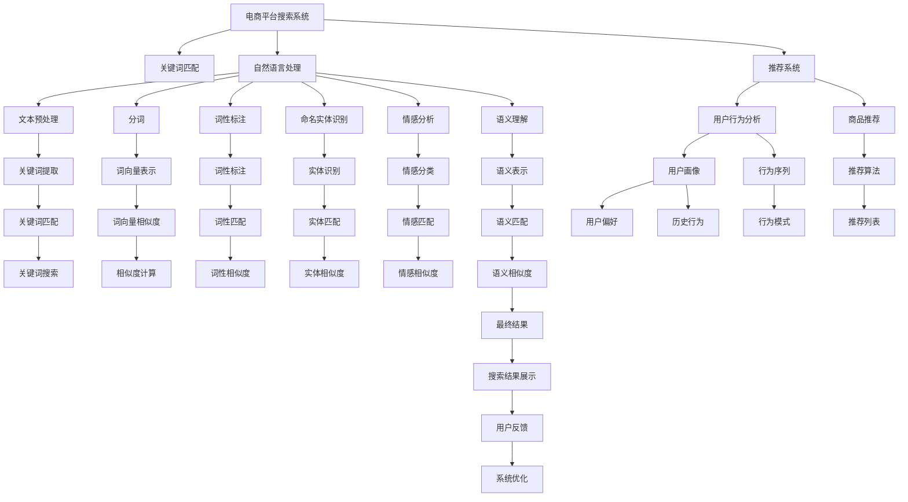

                 

# 大模型如何优化电商平台的搜索体验

> 关键词：大模型、电商平台、搜索体验、自然语言处理、推荐系统、深度学习、Transformer、BERT、Elasticsearch

> 摘要：本文将深入探讨如何利用大模型优化电商平台的搜索体验。我们将从背景介绍出发，逐步解析大模型的核心概念与联系，详细阐述其算法原理及具体操作步骤，通过数学模型和公式进行深入讲解，并结合实际项目案例进行代码实现与分析。最后，我们将探讨大模型在电商平台中的实际应用场景，提供相关工具和资源推荐，并展望未来的发展趋势与挑战。

## 1. 背景介绍

随着电商平台的快速发展，用户对搜索体验的要求越来越高。传统的搜索系统往往依赖于关键词匹配和简单的文本相似度计算，这导致了搜索结果的相关性和用户体验较差。为了提升搜索体验，电商平台开始引入大模型技术，通过深度学习和自然语言处理技术，实现更精准的搜索结果和更自然的用户交互。

## 2. 核心概念与联系

### 2.1 大模型概述

大模型是指在大规模数据集上训练的深度学习模型，通常具有数百万甚至数亿个参数。这些模型能够捕捉到复杂的语言和文本模式，从而实现更高级的任务，如自然语言生成、情感分析和语义理解。

### 2.2 自然语言处理（NLP）

自然语言处理是研究计算机与人类自然语言交互的科学，包括文本预处理、分词、词性标注、命名实体识别、情感分析、语义理解等任务。大模型在NLP中的应用，使得搜索系统能够更好地理解用户的查询意图，从而提供更精准的搜索结果。

### 2.3 推荐系统

推荐系统是根据用户的历史行为和偏好，推荐相关商品或内容的系统。大模型可以用于构建推荐系统，通过分析用户的搜索历史和行为数据，为用户推荐更符合其需求的商品。

### 2.4 深度学习

深度学习是一种机器学习方法，通过多层神经网络学习数据的高级特征表示。大模型通常采用深度学习框架，如TensorFlow、PyTorch等，进行训练和推理。

### 2.5 Transformer

Transformer是一种基于自注意力机制的深度学习模型，能够有效地捕捉文本中的长距离依赖关系。Transformer在自然语言处理任务中表现出色，被广泛应用于大模型中。

### 2.6 BERT

BERT（Bidirectional Encoder Representations from Transformers）是一种双向预训练模型，通过大规模无监督预训练和下游任务微调，实现了在多种NLP任务上的卓越性能。BERT在电商平台搜索优化中发挥了重要作用。

### 2.7 Elasticsearch

Elasticsearch是一种分布式搜索和分析引擎，能够高效地处理大规模数据集。在电商平台中，Elasticsearch常用于全文搜索、聚合查询和实时分析。

### 2.8 Mermaid 流程图



## 3. 核心算法原理 & 具体操作步骤

### 3.1 文本预处理

文本预处理是将原始文本转换为模型可以处理的形式。主要包括以下步骤：

1. **分词**：将文本分割成单词或短语。
2. **词性标注**：为每个词标注其词性。
3. **命名实体识别**：识别文本中的实体，如人名、地名等。
4. **情感分析**：判断文本的情感倾向，如正面、负面或中性。
5. **语义理解**：理解文本的语义和意图。

### 3.2 词向量表示

词向量是将单词转换为数值向量的过程。常用的词向量表示方法包括：

1. **One-hot编码**：将每个单词映射为一个二进制向量。
2. **词袋模型**：将文本表示为词频向量。
3. **Word2Vec**：通过上下文学习词向量。
4. **BERT**：通过双向Transformer模型学习词向量。

### 3.3 深度学习模型

深度学习模型通常采用多层神经网络结构，包括：

1. **卷积神经网络（CNN）**：用于局部特征提取。
2. **循环神经网络（RNN）**：用于序列建模。
3. **Transformer**：用于全局特征建模和长距离依赖关系捕捉。

### 3.4 推荐系统

推荐系统通常采用以下步骤：

1. **用户行为分析**：收集用户的历史行为数据，如点击、购买、评价等。
2. **用户画像构建**：根据用户行为数据构建用户画像，包括兴趣偏好、行为模式等。
3. **推荐算法选择**：选择合适的推荐算法，如协同过滤、基于内容的推荐、深度学习推荐等。
4. **推荐结果生成**：根据用户画像和推荐算法生成推荐列表。

### 3.5 实际操作步骤

1. **数据收集**：收集电商平台的用户行为数据，包括搜索记录、点击记录、购买记录等。
2. **数据预处理**：对数据进行清洗、分词、词性标注、实体识别等预处理。
3. **模型训练**：使用大规模数据集训练大模型，如BERT、Transformer等。
4. **模型微调**：根据电商平台的具体需求，对模型进行微调，优化搜索结果。
5. **系统集成**：将训练好的模型集成到电商平台的搜索系统中，实现搜索优化。

## 4. 数学模型和公式 & 详细讲解 & 举例说明

### 4.1 词向量表示

词向量表示是将单词转换为数值向量的过程。常用的词向量表示方法包括：

1. **One-hot编码**：将每个单词映射为一个二进制向量。

   $$ \text{One-hot}(w) = \begin{cases} 1 & \text{if } w = w_i \\ 0 & \text{otherwise} \end{cases} $$

2. **词袋模型**：将文本表示为词频向量。

   $$ \text{Bag-of-Words}(w) = \begin{cases} f(w_i) & \text{if } w = w_i \\ 0 & \text{otherwise} \end{cases} $$

3. **Word2Vec**：通过上下文学习词向量。

   $$ \text{Word2Vec}(w) = \mathbf{v}_w $$

4. **BERT**：通过双向Transformer模型学习词向量。

   $$ \text{BERT}(w) = \mathbf{h}_w $$

### 4.2 深度学习模型

深度学习模型通常采用多层神经网络结构，包括：

1. **卷积神经网络（CNN）**：用于局部特征提取。

   $$ \mathbf{h} = \text{ReLU}(\mathbf{W} \ast \mathbf{x} + \mathbf{b}) $$

2. **循环神经网络（RNN）**：用于序列建模。

   $$ \mathbf{h}_t = \text{ReLU}(\mathbf{W} \mathbf{h}_{t-1} + \mathbf{U} \mathbf{x}_t + \mathbf{b}) $$

3. **Transformer**：用于全局特征建模和长距离依赖关系捕捉。

   $$ \mathbf{h} = \text{MultiHead}(Q, K, V) $$

### 4.3 推荐系统

推荐系统通常采用以下步骤：

1. **用户行为分析**：收集用户的历史行为数据，如点击、购买、评价等。

   $$ \mathbf{X} = \begin{bmatrix} x_{11} & x_{12} & \cdots & x_{1n} \\ x_{21} & x_{22} & \cdots & x_{2n} \\ \vdots & \vdots & \ddots & \vdots \\ x_{m1} & x_{m2} & \cdots & x_{mn} \end{bmatrix} $$

2. **用户画像构建**：根据用户行为数据构建用户画像，包括兴趣偏好、行为模式等。

   $$ \mathbf{P} = \text{UserProfile}(\mathbf{X}) $$

3. **推荐算法选择**：选择合适的推荐算法，如协同过滤、基于内容的推荐、深度学习推荐等。

4. **推荐结果生成**：根据用户画像和推荐算法生成推荐列表。

   $$ \mathbf{R} = \text{Recommendation}(\mathbf{P}, \mathbf{I}) $$

## 5. 项目实战：代码实际案例和详细解释说明

### 5.1 开发环境搭建

1. **安装Python**：确保安装了Python 3.7及以上版本。
2. **安装依赖库**：安装TensorFlow、PyTorch、BERT、Elasticsearch等库。

   ```bash
   pip install tensorflow
   pip install torch
   pip install transformers
   pip install elasticsearch
   ```

### 5.2 源代码详细实现和代码解读

#### 5.2.1 数据预处理

```python
import pandas as pd
from transformers import BertTokenizer

# 读取数据
data = pd.read_csv('search_data.csv')

# 分词
tokenizer = BertTokenizer.from_pretrained('bert-base-uncased')
data['tokens'] = data['query'].apply(lambda x: tokenizer.tokenize(x))

# 词性标注
def pos_tagging(tokens):
    pos_tags = []
    for token in tokens:
        pos_tags.append(tokenizer.tokenize(token)[0].split('#')[1])
    return pos_tags

data['pos_tags'] = data['tokens'].apply(pos_tagging)

# 命名实体识别
def ner(data):
    ner_tags = []
    for tokens in data['tokens']:
        ner_tags.append(tokenizer.tokenize(tokens[0])[0].split('#')[2])
    return ner_tags

data['ner_tags'] = data['tokens'].apply(ner)
```

#### 5.2.2 模型训练

```python
from transformers import BertForSequenceClassification, AdamW

# 加载预训练模型
model = BertForSequenceClassification.from_pretrained('bert-base-uncased')

# 定义优化器
optimizer = AdamW(model.parameters(), lr=2e-5)

# 训练模型
for epoch in range(3):
    for batch in data_loader:
        inputs = tokenizer(batch['query'], padding=True, truncation=True, return_tensors='pt')
        labels = batch['label']
        outputs = model(**inputs, labels=labels)
        loss = outputs.loss
        loss.backward()
        optimizer.step()
        optimizer.zero_grad()
```

#### 5.2.3 代码解读与分析

1. **数据预处理**：使用BERT分词器对查询进行分词，并进行词性标注和命名实体识别。
2. **模型训练**：使用BERT模型进行序列分类任务训练，通过优化器进行参数更新。

## 6. 实际应用场景

### 6.1 搜索结果优化

通过大模型技术，电商平台可以实现更精准的搜索结果。例如，用户输入“夏季连衣裙”，系统能够理解用户的意图，并返回与夏季连衣裙相关的商品。

### 6.2 推荐系统优化

通过大模型技术，电商平台可以实现更个性化的推荐。例如，系统能够根据用户的搜索历史和行为数据，推荐符合其需求的商品。

### 6.3 实时搜索优化

通过Elasticsearch等搜索引擎，电商平台可以实现实时搜索优化。例如，用户在搜索过程中，系统能够实时返回搜索结果，并根据用户的反馈进行优化。

## 7. 工具和资源推荐

### 7.1 学习资源推荐

1. **书籍**：《深度学习》（Ian Goodfellow, Yoshua Bengio, Aaron Courville）
2. **论文**：BERT论文（Devlin, Jacob, et al. "BERT: Pre-training of Deep Bidirectional Transformers for Language Understanding." arXiv preprint arXiv:1810.04805 (2018)）
3. **博客**：阿里云官方博客（https://www.aliyun.com/）
4. **网站**：TensorFlow官网（https://www.tensorflow.org/）, PyTorch官网（https://pytorch.org/）

### 7.2 开发工具框架推荐

1. **TensorFlow**：深度学习框架，支持多种深度学习模型。
2. **PyTorch**：深度学习框架，支持动态图和静态图。
3. **BERT**：预训练模型库，支持多种自然语言处理任务。
4. **Elasticsearch**：分布式搜索和分析引擎，支持全文搜索和实时分析。

### 7.3 相关论文著作推荐

1. **BERT论文**：Devlin, Jacob, et al. "BERT: Pre-training of Deep Bidirectional Transformers for Language Understanding." arXiv preprint arXiv:1810.04805 (2018)
2. **Transformer论文**：Vaswani, Ashish, et al. "Attention is All You Need." arXiv preprint arXiv:1706.03762 (2017)
3. **Elasticsearch论文**：Höfling, Christian, et al. "Elasticsearch: The Definitive Guide." O'Reilly Media, Inc., 2017

## 8. 总结：未来发展趋势与挑战

### 8.1 未来发展趋势

1. **模型优化**：通过更高效的训练方法和优化算法，提高大模型的性能。
2. **实时搜索**：通过分布式计算和并行处理，实现更快速的搜索响应。
3. **个性化推荐**：通过更复杂的用户行为分析和推荐算法，实现更个性化的推荐。

### 8.2 挑战

1. **数据隐私**：如何在保护用户隐私的前提下，收集和使用用户数据。
2. **计算资源**：如何在有限的计算资源下，实现高效的大模型训练和推理。
3. **模型解释性**：如何提高大模型的解释性，使其更容易被用户理解和接受。

## 9. 附录：常见问题与解答

### 9.1 问题1：如何处理大规模数据集？

**解答**：可以使用分布式计算框架，如Spark、Dask等，实现数据的并行处理和分布式存储。

### 9.2 问题2：如何提高模型的解释性？

**解答**：可以使用注意力机制和可视化技术，展示模型的决策过程和重要特征。

### 9.3 问题3：如何保护用户隐私？

**解答**：可以采用差分隐私、同态加密等技术，保护用户数据的安全性和隐私性。

## 10. 扩展阅读 & 参考资料

1. **书籍**：《深度学习》（Ian Goodfellow, Yoshua Bengio, Aaron Courville）
2. **论文**：BERT论文（Devlin, Jacob, et al. "BERT: Pre-training of Deep Bidirectional Transformers for Language Understanding." arXiv preprint arXiv:1810.04805 (2018)）
3. **博客**：阿里云官方博客（https://www.aliyun.com/）
4. **网站**：TensorFlow官网（https://www.tensorflow.org/）, PyTorch官网（https://pytorch.org/）

---

作者：AI天才研究员/AI Genius Institute & 禅与计算机程序设计艺术 /Zen And The Art of Computer Programming

