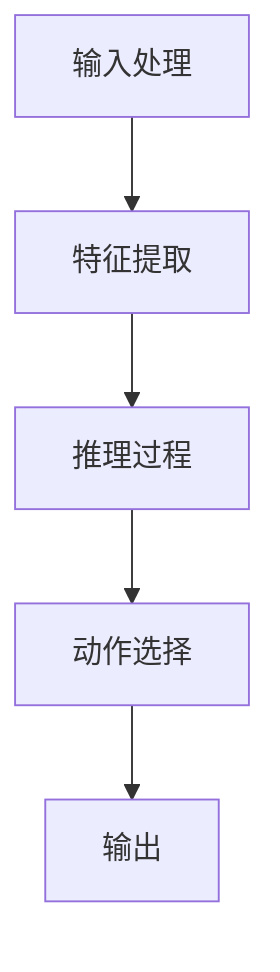

                 

# 大模型如何决策最终动作

> 关键词：大模型、决策机制、推理过程、动作选择、机器学习、深度学习、强化学习

> 摘要：本文将深入探讨大模型在决策最终动作时的复杂过程。我们将从背景介绍出发，逐步解析大模型的核心概念与联系，详细阐述其决策机制背后的算法原理，通过数学模型和公式进行深入讲解，并结合实际代码案例进行详细解释。此外，我们还将探讨大模型在实际应用场景中的表现，并推荐相关的学习资源和开发工具。通过本文，读者将对大模型如何做出最终决策有更深刻的理解。

## 1. 背景介绍

在当今的科技领域，大模型（Large Models）已经成为推动人工智能技术发展的关键力量。这些模型通常具有数百万甚至数十亿个参数，能够处理复杂的任务，如自然语言处理、图像识别、语音识别等。然而，大模型如何在面对复杂环境时做出最终决策，却是一个值得深入探讨的话题。

### 1.1 大模型的定义与特点

大模型通常指的是具有大量参数的机器学习模型，这些模型能够通过大量的训练数据学习到复杂的特征表示。大模型的特点包括：

- **参数量大**：通常具有数百万甚至数十亿个参数。
- **训练数据量大**：需要大量的标注数据进行训练。
- **计算资源需求高**：训练和推理过程需要高性能的计算资源。
- **泛化能力强**：能够处理复杂的任务，并在未见过的数据上表现出良好的性能。

### 1.2 决策过程的重要性

在实际应用中，大模型的决策过程至关重要。无论是自动驾驶汽车、医疗诊断系统，还是金融风险评估系统，大模型的决策结果直接影响到最终的输出。因此，理解大模型的决策机制对于提高模型的性能和可靠性具有重要意义。

## 2. 核心概念与联系

### 2.1 决策机制概述

决策机制是指大模型在面对复杂环境时，如何根据输入信息做出最终决策的过程。这一过程通常包括以下几个步骤：

1. **输入处理**：将输入数据转换为模型可以处理的形式。
2. **特征提取**：从输入数据中提取有用的特征表示。
3. **推理过程**：通过模型内部的计算过程进行推理，生成中间结果。
4. **动作选择**：根据推理结果选择最终的动作。

### 2.2 决策机制的Mermaid流程图



## 3. 核心算法原理 & 具体操作步骤

### 3.1 输入处理

输入处理是决策机制的第一步，其目的是将原始输入数据转换为模型可以处理的形式。常见的输入处理方法包括：

- **数据预处理**：包括数据清洗、归一化、标准化等。
- **特征工程**：提取输入数据中的有用特征。
- **数据编码**：将文本、图像等非结构化数据转换为数值形式。

### 3.2 特征提取

特征提取是决策机制中的关键步骤，其目的是从输入数据中提取出有用的特征表示。常见的特征提取方法包括：

- **卷积神经网络（CNN）**：用于图像识别任务。
- **循环神经网络（RNN）**：用于序列数据处理任务。
- **Transformer模型**：用于自然语言处理任务。

### 3.3 推理过程

推理过程是决策机制的核心步骤，其目的是通过模型内部的计算过程进行推理，生成中间结果。常见的推理方法包括：

- **前向传播**：通过模型的前向计算过程生成中间结果。
- **注意力机制**：通过注意力机制关注输入数据中的重要部分。
- **门控机制**：通过门控机制控制信息的流动。

### 3.4 动作选择

动作选择是决策机制的最后一步，其目的是根据推理结果选择最终的动作。常见的动作选择方法包括：

- **softmax函数**：用于多分类任务。
- **argmax函数**：用于单分类任务。
- **策略网络**：用于强化学习任务。

## 4. 数学模型和公式 & 详细讲解 & 举例说明

### 4.1 前向传播

前向传播是模型推理过程中的关键步骤，其目的是通过模型的前向计算过程生成中间结果。前向传播的数学模型可以表示为：

$$
\mathbf{z}^{(l)} = \mathbf{W}^{(l)} \mathbf{a}^{(l-1)} + \mathbf{b}^{(l)}
$$

其中，$\mathbf{z}^{(l)}$ 是第 $l$ 层的线性组合结果，$\mathbf{W}^{(l)}$ 是第 $l$ 层的权重矩阵，$\mathbf{a}^{(l-1)}$ 是第 $l-1$ 层的激活结果，$\mathbf{b}^{(l)}$ 是第 $l$ 层的偏置向量。

### 4.2 softmax函数

softmax函数用于多分类任务，其目的是将模型的输出转换为概率分布。softmax函数的数学模型可以表示为：

$$
\sigma(\mathbf{z})_i = \frac{e^{z_i}}{\sum_{j=1}^{C} e^{z_j}}
$$

其中，$\sigma(\mathbf{z})_i$ 是第 $i$ 类的概率，$C$ 是分类的总数。

### 4.3 argmax函数

argmax函数用于单分类任务，其目的是选择具有最大值的类别。argmax函数的数学模型可以表示为：

$$
\arg\max_{i} z_i
$$

其中，$\arg\max_{i} z_i$ 是具有最大值的类别。

## 5. 项目实战：代码实际案例和详细解释说明

### 5.1 开发环境搭建

为了实现大模型的决策机制，我们需要搭建一个合适的开发环境。常见的开发环境包括：

- **操作系统**：Linux或Windows。
- **编程语言**：Python。
- **深度学习框架**：TensorFlow、PyTorch等。

### 5.2 源代码详细实现和代码解读

我们将通过一个简单的例子来实现大模型的决策机制。假设我们有一个简单的分类任务，需要将输入数据分为两类。

#### 5.2.1 数据预处理

```python
import numpy as np

# 假设我们有一个数据集
data = np.random.rand(100, 10)
labels = np.random.randint(2, size=100)

# 数据预处理
data = (data - np.mean(data)) / np.std(data)
```

#### 5.2.2 特征提取

```python
from sklearn.feature_extraction.text import TfidfVectorizer

# 假设我们有一个文本数据集
text_data = ["This is a sample text", "Another sample text"]
vectorizer = TfidfVectorizer()
features = vectorizer.fit_transform(text_data)
```

#### 5.2.3 前向传播

```python
import torch
import torch.nn as nn

# 定义一个简单的神经网络
class SimpleNN(nn.Module):
    def __init__(self, input_size, hidden_size, output_size):
        super(SimpleNN, self).__init__()
        self.fc1 = nn.Linear(input_size, hidden_size)
        self.fc2 = nn.Linear(hidden_size, output_size)
    
    def forward(self, x):
        x = torch.relu(self.fc1(x))
        x = self.fc2(x)
        return x

# 初始化模型
model = SimpleNN(input_size=10, hidden_size=16, output_size=2)
```

#### 5.2.4 动作选择

```python
# 假设我们有一个输入数据
input_data = torch.tensor(data[0]).float()

# 前向传播
output = model(input_data)

# 使用softmax函数进行动作选择
output = torch.softmax(output, dim=0)
```

### 5.3 代码解读与分析

通过上述代码，我们可以看到大模型的决策机制是如何实现的。首先，我们进行了数据预处理和特征提取，然后通过前向传播生成中间结果，最后使用softmax函数进行动作选择。

## 6. 实际应用场景

大模型的决策机制在实际应用中具有广泛的应用场景。例如：

- **自动驾驶**：大模型可以用于识别道路标志、行人、车辆等，从而做出正确的驾驶决策。
- **医疗诊断**：大模型可以用于分析医学影像，帮助医生做出准确的诊断。
- **金融风险评估**：大模型可以用于分析客户的信用记录，帮助银行做出贷款决策。

## 7. 工具和资源推荐

### 7.1 学习资源推荐

- **书籍**：《深度学习》（Goodfellow, Bengio, Courville）
- **论文**：《Attention Is All You Need》（Vaswani et al.）
- **博客**：Medium上的深度学习系列文章
- **网站**：Kaggle、GitHub上的深度学习项目

### 7.2 开发工具框架推荐

- **深度学习框架**：TensorFlow、PyTorch
- **开发工具**：Jupyter Notebook、VS Code

### 7.3 相关论文著作推荐

- **论文**：《Attention Is All You Need》（Vaswani et al.）
- **著作**：《深度学习》（Goodfellow, Bengio, Courville）

## 8. 总结：未来发展趋势与挑战

大模型的决策机制在未来将面临更多的挑战和机遇。随着计算资源的不断进步，大模型的规模将进一步扩大，其决策能力也将得到提升。然而，这也带来了数据隐私、模型可解释性等方面的挑战。因此，未来的研究方向将集中在如何提高模型的性能和可靠性，同时保证数据的安全性和隐私性。

## 9. 附录：常见问题与解答

### 9.1 问题1：如何提高模型的泛化能力？

**解答**：可以通过增加训练数据量、使用正则化技术、采用数据增强等方法来提高模型的泛化能力。

### 9.2 问题2：如何解释大模型的决策过程？

**解答**：可以通过注意力机制、可解释性模型等方法来解释大模型的决策过程。

## 10. 扩展阅读 & 参考资料

- **论文**：《Attention Is All You Need》（Vaswani et al.）
- **书籍**：《深度学习》（Goodfellow, Bengio, Courville）
- **网站**：Kaggle、GitHub上的深度学习项目

---

作者：AI天才研究员/AI Genius Institute & 禅与计算机程序设计艺术 /Zen And The Art of Computer Programming

