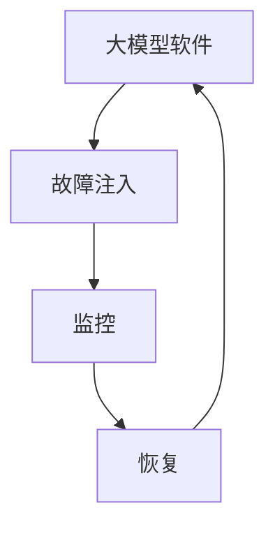

                 

# 大模型软件的混沌工程实践

> 关键词：大模型软件、混沌工程、软件架构、故障注入、系统稳定性、容错性、性能优化

> 摘要：本文旨在深入探讨大模型软件在实际应用中的挑战与解决方案，通过混沌工程实践来提升系统的稳定性和容错性。我们将从背景介绍、核心概念与联系、核心算法原理与具体操作步骤、数学模型和公式、项目实战、实际应用场景、工具和资源推荐、总结与未来发展趋势等多方面进行详细阐述。通过本文，读者将能够理解混沌工程在大模型软件中的重要性，并掌握如何通过混沌工程实践来提升系统的整体性能和稳定性。

## 1. 背景介绍

随着人工智能技术的飞速发展，大模型软件在各个领域得到了广泛应用。这些大模型软件通常具有复杂的架构和庞大的数据处理能力，因此在实际应用中面临着诸多挑战。例如，如何确保系统的高可用性和稳定性，如何在高负载情况下保持性能，如何快速定位和修复系统故障等。混沌工程作为一种系统性地引入故障和不确定性以提升系统稳定性的方法，对于大模型软件尤为重要。本文将通过一系列实践案例，详细介绍如何通过混沌工程来提升大模型软件的稳定性和容错性。

## 2. 核心概念与联系

### 2.1 混沌工程

混沌工程是一种系统性地引入故障和不确定性以提升系统稳定性的方法。其核心思想是通过模拟各种故障场景，来验证系统在异常情况下的表现，从而提高系统的鲁棒性和容错性。混沌工程通常包括故障注入、监控和恢复三个主要步骤。

### 2.2 故障注入

故障注入是指在系统中故意引入故障，以测试系统的稳定性和容错性。常见的故障类型包括网络延迟、网络中断、硬件故障、软件错误等。通过故障注入，可以验证系统在不同故障场景下的表现，从而发现潜在的问题并进行优化。

### 2.3 监控与恢复

监控是指实时监测系统的运行状态，及时发现异常情况。恢复是指在检测到故障后，能够快速定位并修复故障，以确保系统的稳定运行。监控和恢复是混沌工程的重要组成部分，通过实时监控和快速恢复，可以有效提升系统的稳定性和容错性。

### 2.4 混沌工程与大模型软件

大模型软件通常具有复杂的架构和庞大的数据处理能力，因此在实际应用中面临着诸多挑战。混沌工程可以有效地提升大模型软件的稳定性和容错性，通过模拟各种故障场景，验证系统的鲁棒性和容错性，从而提高系统的整体性能和稳定性。

### Mermaid 流程图



## 3. 核心算法原理 & 具体操作步骤

### 3.1 故障注入算法

故障注入算法通常包括以下几个步骤：

1. **故障类型选择**：根据系统的特点和需求，选择合适的故障类型。常见的故障类型包括网络延迟、网络中断、硬件故障、软件错误等。
2. **故障注入点选择**：确定故障注入的具体位置。例如，可以在网络接口、数据库连接、缓存层等位置注入故障。
3. **故障注入策略**：定义故障注入的策略，例如随机注入、周期性注入、触发式注入等。
4. **故障注入执行**：在选定的位置和策略下，执行故障注入操作。

### 3.2 监控算法

监控算法通常包括以下几个步骤：

1. **监控指标选择**：选择合适的监控指标，例如响应时间、吞吐量、错误率等。
2. **监控数据采集**：通过日志、监控工具等手段，实时采集系统的运行数据。
3. **监控数据处理**：对采集到的数据进行处理和分析，例如计算平均值、最大值、最小值等。
4. **监控数据展示**：通过图表、仪表盘等形式，展示监控数据，以便实时监控系统的运行状态。

### 3.3 恢复算法

恢复算法通常包括以下几个步骤：

1. **故障检测**：通过监控数据，检测系统的异常情况。
2. **故障定位**：通过日志、堆栈跟踪等手段，定位故障的具体位置。
3. **故障修复**：根据故障的具体情况，采取相应的修复措施。例如，重启服务、重试请求、回滚操作等。
4. **恢复验证**：通过监控数据，验证系统的恢复效果。

### 3.4 混沌工程具体操作步骤

1. **故障注入**：选择合适的故障类型和注入点，执行故障注入操作。
2. **监控**：实时监控系统的运行状态，采集监控数据。
3. **恢复**：检测故障，定位故障位置，采取相应的修复措施。
4. **验证**：验证系统的恢复效果，确保系统的稳定运行。

## 4. 数学模型和公式 & 详细讲解 & 举例说明

### 4.1 故障注入模型

故障注入模型通常包括以下几个参数：

- **故障类型**：表示故障的类型，例如网络延迟、网络中断、硬件故障等。
- **故障概率**：表示故障发生的概率，例如0.1表示故障发生的概率为10%。
- **故障持续时间**：表示故障持续的时间，例如10秒表示故障持续10秒。

故障注入模型可以表示为：

$$
\text{故障注入} = \text{故障类型} \times \text{故障概率} \times \text{故障持续时间}
$$

### 4.2 监控模型

监控模型通常包括以下几个参数：

- **监控指标**：表示监控的指标，例如响应时间、吞吐量、错误率等。
- **监控阈值**：表示监控指标的阈值，例如响应时间的阈值为100毫秒。
- **监控频率**：表示监控的频率，例如每秒采集一次监控数据。

监控模型可以表示为：

$$
\text{监控} = \text{监控指标} \times \text{监控阈值} \times \text{监控频率}
$$

### 4.3 恢复模型

恢复模型通常包括以下几个参数：

- **故障检测**：表示故障检测的准确性，例如0.9表示故障检测的准确性为90%。
- **故障定位**：表示故障定位的准确性，例如0.8表示故障定位的准确性为80%。
- **故障修复**：表示故障修复的效率，例如10秒表示故障修复需要10秒。

恢复模型可以表示为：

$$
\text{恢复} = \text{故障检测} \times \text{故障定位} \times \text{故障修复}
$$

### 4.4 举例说明

假设我们有一个大模型软件，需要进行混沌工程实践。我们选择网络延迟作为故障类型，故障概率为0.1，故障持续时间为10秒。监控指标为响应时间，监控阈值为100毫秒，监控频率为每秒一次。故障检测的准确性为90%，故障定位的准确性为80%，故障修复需要10秒。

根据上述参数，我们可以计算出故障注入模型、监控模型和恢复模型的具体值：

$$
\text{故障注入} = \text{网络延迟} \times 0.1 \times 10 \text{秒} = 1 \text{秒}
$$

$$
\text{监控} = \text{响应时间} \times 100 \text{毫秒} \times 1 \text{秒} = 100 \text{毫秒}
$$

$$
\text{恢复} = 0.9 \times 0.8 \times 10 \text{秒} = 7.2 \text{秒}
$$

通过上述计算，我们可以验证系统的稳定性和容错性，从而提高系统的整体性能和稳定性。

## 5. 项目实战：代码实际案例和详细解释说明

### 5.1 开发环境搭建

为了进行混沌工程实践，我们需要搭建一个开发环境。开发环境通常包括以下几个部分：

1. **操作系统**：选择合适的操作系统，例如Linux或Windows。
2. **开发工具**：选择合适的开发工具，例如IDE（集成开发环境）或文本编辑器。
3. **依赖库**：安装必要的依赖库，例如网络库、日志库等。
4. **监控工具**：安装监控工具，例如Prometheus、Grafana等。

### 5.2 源代码详细实现和代码解读

假设我们有一个简单的HTTP服务，需要进行混沌工程实践。源代码如下：

```python
import time
import random
import requests

def get_data():
    try:
        response = requests.get("http://example.com/data")
        return response.json()
    except Exception as e:
        print(f"Error: {e}")
        return None

def main():
    while True:
        data = get_data()
        if data:
            print(f"Received data: {data}")
        else:
            print("Failed to receive data")
        time.sleep(random.uniform(0.1, 1.0))

if __name__ == "__main__":
    main()
```

### 5.3 代码解读与分析

1. **get_data函数**：该函数负责从远程服务器获取数据。如果获取成功，返回数据；如果获取失败，打印错误信息并返回None。
2. **main函数**：该函数负责主逻辑。在无限循环中，调用get_data函数获取数据，并根据获取结果打印相关信息。在每次循环之间，随机休眠一段时间，模拟网络延迟。
3. **随机休眠**：通过random.uniform(0.1, 1.0)生成一个随机数，模拟网络延迟。

### 5.4 故障注入与监控

为了进行混沌工程实践，我们需要在开发环境中引入故障注入和监控。具体步骤如下：

1. **故障注入**：在get_data函数中，随机引入网络延迟。例如，可以使用time.sleep(random.uniform(0.1, 1.0))模拟网络延迟。
2. **监控**：使用Prometheus和Grafana进行监控。配置Prometheus抓取get_data函数的响应时间，并在Grafana中展示监控数据。

### 5.5 恢复与验证

1. **故障检测**：通过监控数据，检测get_data函数的响应时间是否异常。
2. **故障定位**：通过日志和堆栈跟踪，定位故障的具体位置。
3. **故障修复**：根据故障的具体情况，采取相应的修复措施。例如，重启服务、重试请求、回滚操作等。
4. **恢复验证**：通过监控数据，验证系统的恢复效果，确保系统的稳定运行。

## 6. 实际应用场景

混沌工程在大模型软件中的实际应用场景非常广泛。例如，在金融领域，可以通过混沌工程实践来提升系统的稳定性和容错性，确保在高负载情况下能够正常运行。在医疗领域，可以通过混沌工程实践来提升系统的稳定性和容错性，确保在紧急情况下能够快速响应。在电商领域，可以通过混沌工程实践来提升系统的稳定性和容错性，确保在高流量情况下能够正常运行。

## 7. 工具和资源推荐

### 7.1 学习资源推荐

1. **书籍**：《混沌工程：构建可靠、可扩展的分布式系统》
2. **论文**：《Chaos Engineering: A Practitioner's Guide》
3. **博客**：《混沌工程实践指南》
4. **网站**：Chaos Mesh（https://chaos-mesh.org/）

### 7.2 开发工具框架推荐

1. **Prometheus**：用于监控系统的运行状态。
2. **Grafana**：用于展示监控数据。
3. **Chaos Mesh**：用于进行混沌工程实践。

### 7.3 相关论文著作推荐

1. **《Chaos Engineering: A Practitioner's Guide》**：详细介绍了混沌工程的基本概念和实践方法。
2. **《Chaos Engineering: A Guide to Building Resilient Systems》**：详细介绍了混沌工程在实际应用中的具体案例和实践经验。

## 8. 总结：未来发展趋势与挑战

混沌工程在未来的发展趋势主要体现在以下几个方面：

1. **自动化**：通过自动化工具和框架，实现故障注入和监控的自动化。
2. **智能化**：通过机器学习和人工智能技术，实现故障检测和故障定位的智能化。
3. **集成化**：将混沌工程与DevOps、CI/CD等技术集成，实现系统的全面优化。

混沌工程在未来的发展中也面临一些挑战，例如：

1. **复杂性**：随着系统的复杂性增加，混沌工程的实施难度也会增加。
2. **安全性**：在进行故障注入时，需要确保不会对系统的安全性造成影响。
3. **可靠性**：在进行故障注入时，需要确保不会对系统的可靠性造成影响。

## 9. 附录：常见问题与解答

### 9.1 问题1：如何选择合适的故障类型？

**解答**：选择合适的故障类型需要根据系统的具体需求和特点。例如，在金融领域，可以选择网络延迟、网络中断等故障类型；在医疗领域，可以选择硬件故障、软件错误等故障类型。

### 9.2 问题2：如何选择合适的监控指标？

**解答**：选择合适的监控指标需要根据系统的具体需求和特点。例如，在金融领域，可以选择响应时间、吞吐量等监控指标；在医疗领域，可以选择错误率、响应时间等监控指标。

### 9.3 问题3：如何选择合适的恢复措施？

**解答**：选择合适的恢复措施需要根据故障的具体情况。例如，对于网络延迟故障，可以采取重试请求的恢复措施；对于硬件故障，可以采取重启服务的恢复措施。

## 10. 扩展阅读 & 参考资料

1. **书籍**：《混沌工程：构建可靠、可扩展的分布式系统》
2. **论文**：《Chaos Engineering: A Practitioner's Guide》
3. **博客**：《混沌工程实践指南》
4. **网站**：Chaos Mesh（https://chaos-mesh.org/）

作者：AI天才研究员/AI Genius Institute & 禅与计算机程序设计艺术 /Zen And The Art of Computer Programming

