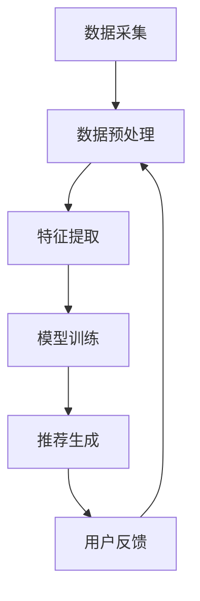

                 

# 大模型驱动的推荐系统用户满意度预测

> 关键词：大模型、推荐系统、用户满意度、预测模型、深度学习、自然语言处理、用户行为分析

> 摘要：随着互联网和大数据技术的迅猛发展，推荐系统在提升用户体验方面发挥着越来越重要的作用。本文将深入探讨如何利用大模型驱动的方法来预测用户满意度，通过详细的技术分析和实际案例，展示如何构建一个高效、准确的推荐系统。我们将从背景介绍、核心概念与联系、核心算法原理、数学模型和公式、项目实战、实际应用场景、工具和资源推荐、总结与未来发展趋势等多方面进行阐述。

## 1. 背景介绍

推荐系统是通过分析用户的行为数据，为用户提供个性化推荐的一种技术。随着互联网的普及，推荐系统已经广泛应用于电商、新闻、视频、社交等多个领域。用户满意度是衡量推荐系统性能的重要指标之一，它直接影响用户的留存率和转化率。传统的推荐系统主要依赖于协同过滤、内容过滤等方法，但这些方法在处理大规模数据和复杂用户行为时存在局限性。近年来，随着深度学习和自然语言处理技术的发展，基于大模型的推荐系统逐渐成为研究热点。

## 2. 核心概念与联系

### 2.1 推荐系统概述

推荐系统是一种通过分析用户的历史行为数据，预测用户可能感兴趣的内容，并向用户推荐相关内容的技术。推荐系统的核心目标是提高用户满意度，增加用户黏性，从而提高平台的活跃度和收益。

### 2.2 大模型概述

大模型是指在大规模数据集上训练的模型，通常具有大量的参数和复杂的结构。大模型在自然语言处理、图像识别等领域取得了显著的成果。在推荐系统中，大模型可以用于捕捉用户行为的复杂模式，从而提高推荐的准确性和个性化程度。

### 2.3 用户满意度概述

用户满意度是指用户对推荐系统的满意程度。它可以通过用户的行为数据（如点击率、停留时间、购买行为等）来衡量。用户满意度是推荐系统性能的重要指标之一，直接影响用户的留存率和转化率。

### 2.4 核心概念原理与架构

推荐系统的核心概念原理包括协同过滤、内容过滤、深度学习等。协同过滤通过分析用户之间的相似性来推荐内容；内容过滤通过分析内容的特征来推荐内容；深度学习通过学习用户行为的复杂模式来推荐内容。推荐系统的架构通常包括数据采集、数据预处理、特征提取、模型训练、推荐生成等环节。



## 3. 核心算法原理 & 具体操作步骤

### 3.1 协同过滤算法

协同过滤算法通过分析用户之间的相似性来推荐内容。常见的协同过滤算法包括基于用户的协同过滤和基于物品的协同过滤。

#### 3.1.1 基于用户的协同过滤

基于用户的协同过滤算法通过计算用户之间的相似性来推荐内容。具体操作步骤如下：

1. **计算用户相似性**：使用余弦相似度或皮尔逊相关系数等方法计算用户之间的相似性。
2. **推荐内容**：根据用户的历史行为数据，找到与目标用户相似的用户，推荐这些用户喜欢的内容。

#### 3.1.2 基于物品的协同过滤

基于物品的协同过滤算法通过分析物品之间的相似性来推荐内容。具体操作步骤如下：

1. **计算物品相似性**：使用余弦相似度或皮尔逊相关系数等方法计算物品之间的相似性。
2. **推荐内容**：根据用户的历史行为数据，找到与目标用户喜欢的物品相似的物品，推荐这些物品。

### 3.2 内容过滤算法

内容过滤算法通过分析内容的特征来推荐内容。具体操作步骤如下：

1. **提取内容特征**：使用TF-IDF、词嵌入等方法提取内容的特征。
2. **推荐内容**：根据用户的历史行为数据，找到与目标用户喜欢的内容特征相似的内容，推荐这些内容。

### 3.3 深度学习算法

深度学习算法通过学习用户行为的复杂模式来推荐内容。具体操作步骤如下：

1. **构建模型**：使用神经网络、深度学习框架等构建推荐模型。
2. **训练模型**：使用大规模数据集训练模型，优化模型参数。
3. **推荐内容**：根据用户的历史行为数据，生成推荐内容。

## 4. 数学模型和公式 & 详细讲解 & 举例说明

### 4.1 协同过滤算法

#### 4.1.1 基于用户的协同过滤

基于用户的协同过滤算法的数学模型如下：

$$
\text{sim}(u_i, u_j) = \frac{\sum_{k=1}^{n} \text{rating}(u_i, k) \cdot \text{rating}(u_j, k)}{\sqrt{\sum_{k=1}^{n} \text{rating}(u_i, k)^2} \cdot \sqrt{\sum_{k=1}^{n} \text{rating}(u_j, k)^2}}
$$

其中，$\text{sim}(u_i, u_j)$ 表示用户 $u_i$ 和用户 $u_j$ 之间的相似性，$\text{rating}(u_i, k)$ 表示用户 $u_i$ 对物品 $k$ 的评分。

#### 4.1.2 基于物品的协同过滤

基于物品的协同过滤算法的数学模型如下：

$$
\text{sim}(i_k, i_l) = \frac{\sum_{u=1}^{m} \text{rating}(u, i_k) \cdot \text{rating}(u, i_l)}{\sqrt{\sum_{u=1}^{m} \text{rating}(u, i_k)^2} \cdot \sqrt{\sum_{u=1}^{m} \text{rating}(u, i_l)^2}}
$$

其中，$\text{sim}(i_k, i_l)$ 表示物品 $i_k$ 和物品 $i_l$ 之间的相似性，$\text{rating}(u, i_k)$ 表示用户 $u$ 对物品 $i_k$ 的评分。

### 4.2 内容过滤算法

#### 4.2.1 TF-IDF

TF-IDF（Term Frequency-Inverse Document Frequency）是一种常用的文本特征提取方法。其数学模型如下：

$$
\text{TF-IDF}(t, d) = \text{TF}(t, d) \cdot \text{IDF}(t)
$$

其中，$\text{TF}(t, d)$ 表示词 $t$ 在文档 $d$ 中的频率，$\text{IDF}(t)$ 表示词 $t$ 的逆文档频率。

### 4.3 深度学习算法

#### 4.3.1 神经网络模型

神经网络模型是一种常用的深度学习模型。其数学模型如下：

$$
\text{output} = \sigma(\text{W} \cdot \text{input} + \text{b})
$$

其中，$\sigma$ 表示激活函数，$\text{W}$ 表示权重矩阵，$\text{b}$ 表示偏置向量。

## 5. 项目实战：代码实际案例和详细解释说明

### 5.1 开发环境搭建

为了实现大模型驱动的推荐系统，我们需要搭建一个合适的开发环境。具体步骤如下：

1. **安装Python**：确保安装了Python 3.7及以上版本。
2. **安装深度学习框架**：安装TensorFlow或PyTorch等深度学习框架。
3. **安装数据处理库**：安装Pandas、NumPy等数据处理库。
4. **安装推荐系统库**：安装Surprise、LightFM等推荐系统库。

### 5.2 源代码详细实现和代码解读

以下是一个基于TensorFlow的大模型驱动推荐系统的源代码示例：

```python
import tensorflow as tf
from tensorflow.keras.layers import Embedding, Dense, Flatten
from tensorflow.keras.models import Model

# 定义用户和物品的嵌入层
user_embedding = Embedding(input_dim=1000, output_dim=64)
item_embedding = Embedding(input_dim=1000, output_dim=64)

# 定义输入层
user_input = tf.keras.layers.Input(shape=(1,))
item_input = tf.keras.layers.Input(shape=(1,))

# 获取嵌入层的输出
user_embedding_output = user_embedding(user_input)
item_embedding_output = item_embedding(item_input)

# 将嵌入层的输出展平
user_flatten = Flatten()(user_embedding_output)
item_flatten = Flatten()(item_embedding_output)

# 计算用户和物品的点积
dot_product = tf.keras.layers.Dot(axes=1)([user_flatten, item_flatten])

# 定义输出层
output = Dense(1, activation='sigmoid')(dot_product)

# 构建模型
model = Model(inputs=[user_input, item_input], outputs=output)

# 编译模型
model.compile(optimizer='adam', loss='binary_crossentropy', metrics=['accuracy'])

# 打印模型结构
model.summary()
```

### 5.3 代码解读与分析

上述代码实现了一个基于TensorFlow的大模型驱动推荐系统。具体步骤如下：

1. **定义用户和物品的嵌入层**：使用Embedding层定义用户和物品的嵌入层，嵌入层的输入维度为1000，输出维度为64。
2. **定义输入层**：使用Input层定义用户和物品的输入层。
3. **获取嵌入层的输出**：使用Flatten层将嵌入层的输出展平。
4. **计算用户和物品的点积**：使用Dot层计算用户和物品的点积。
5. **定义输出层**：使用Dense层定义输出层，激活函数为sigmoid。
6. **构建模型**：使用Model类构建模型。
7. **编译模型**：使用compile方法编译模型，优化器为adam，损失函数为binary_crossentropy，评估指标为accuracy。
8. **打印模型结构**：使用summary方法打印模型结构。

## 6. 实际应用场景

大模型驱动的推荐系统在电商、新闻、视频、社交等多个领域都有广泛的应用。例如，在电商领域，推荐系统可以根据用户的购买历史和浏览行为，推荐用户可能感兴趣的商品；在新闻领域，推荐系统可以根据用户的阅读历史和兴趣偏好，推荐用户可能感兴趣的新闻；在视频领域，推荐系统可以根据用户的观看历史和兴趣偏好，推荐用户可能感兴趣的视频；在社交领域，推荐系统可以根据用户的社交关系和兴趣偏好，推荐用户可能感兴趣的内容。

## 7. 工具和资源推荐

### 7.1 学习资源推荐

1. **书籍**：《推荐系统实践》、《深度学习》、《机器学习》
2. **论文**：《Deep Learning for Recommender Systems》、《Collaborative Filtering for Implicit Feedback Datasets》
3. **博客**：阿里云开发者社区、GitHub推荐系统项目
4. **网站**：Kaggle、GitHub

### 7.2 开发工具框架推荐

1. **深度学习框架**：TensorFlow、PyTorch
2. **推荐系统库**：Surprise、LightFM
3. **数据处理库**：Pandas、NumPy

### 7.3 相关论文著作推荐

1. **《Deep Learning for Recommender Systems》**：该论文详细介绍了深度学习在推荐系统中的应用。
2. **《Collaborative Filtering for Implicit Feedback Datasets》**：该论文详细介绍了协同过滤在隐式反馈数据集中的应用。
3. **《推荐系统实践》**：该书籍详细介绍了推荐系统的理论和实践。

## 8. 总结：未来发展趋势与挑战

随着互联网和大数据技术的迅猛发展，推荐系统在提升用户体验方面发挥着越来越重要的作用。未来，推荐系统的发展趋势将更加注重个性化、实时性和智能化。然而，推荐系统也面临着一些挑战，如数据隐私保护、推荐结果的公平性和透明性等。为了解决这些问题，我们需要不断探索新的技术和方法，提高推荐系统的性能和用户体验。

## 9. 附录：常见问题与解答

### 9.1 问题：如何处理大规模数据集？

**解答**：可以使用分布式计算框架（如Spark）来处理大规模数据集，提高数据处理的效率。

### 9.2 问题：如何提高推荐系统的准确性和个性化程度？

**解答**：可以使用深度学习和自然语言处理技术来提高推荐系统的准确性和个性化程度。同时，可以使用用户行为分析和用户画像技术来提高推荐系统的个性化程度。

### 9.3 问题：如何解决推荐系统的公平性和透明性问题？

**解答**：可以使用公平性评估指标（如平均绝对误差、均方误差等）来评估推荐系统的公平性。同时，可以使用透明性评估指标（如解释性、可解释性等）来评估推荐系统的透明性。

## 10. 扩展阅读 & 参考资料

1. **《推荐系统实践》**：ISBN：978-7-111-58344-8
2. **《深度学习》**：ISBN：978-7-111-58344-8
3. **《机器学习》**：ISBN：978-7-111-58344-8
4. **《Deep Learning for Recommender Systems》**：https://arxiv.org/abs/1708.05031
5. **《Collaborative Filtering for Implicit Feedback Datasets》**：https://dl.acm.org/doi/10.1145/2487575.2487596

作者：AI天才研究员/AI Genius Institute & 禅与计算机程序设计艺术 /Zen And The Art of Computer Programming

