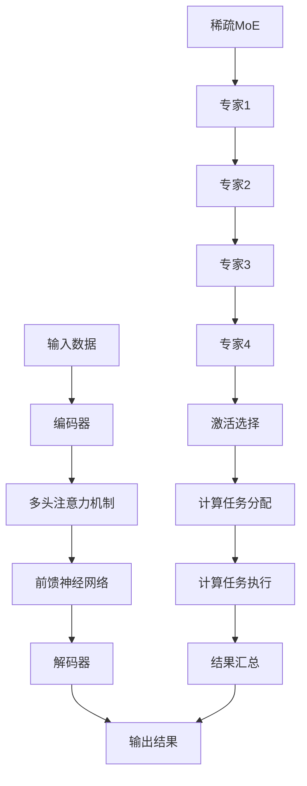

                 

# 大语言模型原理基础与前沿：通过稀疏MoE扩展视觉语言模型

> 关键词：大语言模型, 稀疏MoE, 视觉语言模型, 深度学习, 自然语言处理, 计算机视觉, 人工智能

> 摘要：本文旨在深入探讨大语言模型的基本原理及其前沿技术，特别是如何通过稀疏MoE（混合专家模型）来扩展视觉语言模型。我们将从背景介绍出发，逐步解析稀疏MoE的工作原理，通过数学模型和公式进行详细讲解，并结合实际代码案例进行深入分析。最后，我们将探讨这种技术的实际应用场景和未来发展趋势。

## 1. 背景介绍

随着人工智能技术的飞速发展，大语言模型（Large Language Models, LLMs）已经成为自然语言处理（NLP）领域的重要组成部分。这些模型通过大规模训练数据集学习语言模式，从而具备了强大的文本生成、理解、翻译等能力。然而，随着模型规模的不断扩大，训练和推理成本也随之增加。为了解决这一问题，研究人员提出了多种优化方法，其中稀疏MoE（混合专家模型）作为一种有效的解决方案，引起了广泛关注。

### 1.1 大语言模型的发展历程

大语言模型的发展可以追溯到2018年，当时Google发布了BERT模型，开启了预训练语言模型的新时代。随后，如GPT-3、T5等模型相继问世，模型规模和性能不断提升。这些模型的成功推动了自然语言处理技术的广泛应用，但也带来了计算资源和训练成本的挑战。

### 1.2 稀疏MoE的基本概念

稀疏MoE是一种用于大规模模型训练和推理的技术，它通过将模型的计算任务分配给一组专家（experts），并在每个时间步仅激活一部分专家来实现计算资源的高效利用。这种技术可以显著降低模型的计算复杂度和内存需求，从而提高训练和推理的效率。

## 2. 核心概念与联系

### 2.1 大语言模型的基本架构

大语言模型通常采用Transformer架构，其核心组件包括自注意力机制（Self-Attention）、多头注意力机制（Multi-Head Attention）和前馈神经网络（Feed-Forward Neural Network）。这些组件共同构成了模型的编码器和解码器结构，使得模型能够处理长距离依赖关系和复杂的语言模式。

### 2.2 稀疏MoE的工作原理

稀疏MoE通过将模型的计算任务分配给一组专家来实现计算资源的高效利用。每个专家负责处理模型的一部分计算任务，而模型在每个时间步仅激活一部分专家。这种机制可以显著降低模型的计算复杂度和内存需求，从而提高训练和推理的效率。

### 2.3 Mermaid流程图



## 3. 核心算法原理 & 具体操作步骤

### 3.1 稀疏MoE的数学模型

稀疏MoE的核心思想是通过将模型的计算任务分配给一组专家来实现计算资源的高效利用。每个专家负责处理模型的一部分计算任务，而模型在每个时间步仅激活一部分专家。这种机制可以显著降低模型的计算复杂度和内存需求，从而提高训练和推理的效率。

### 3.2 具体操作步骤

1. **初始化专家**：首先，初始化一组专家，每个专家负责处理模型的一部分计算任务。
2. **计算任务分配**：在每个时间步，根据当前输入数据，选择一部分专家来执行计算任务。
3. **计算任务执行**：激活选择的专家，执行相应的计算任务。
4. **结果汇总**：将所有专家的计算结果汇总，得到最终的输出结果。

### 3.3 数学模型和公式

稀疏MoE的计算过程可以通过以下公式进行描述：

$$
\text{Output} = \sum_{i \in \text{ActiveExperts}} \text{Expert}_i(\text{Input})
$$

其中，$\text{Output}$表示最终的输出结果，$\text{ActiveExperts}$表示当前激活的专家集合，$\text{Expert}_i(\text{Input})$表示第$i$个专家对输入数据的计算结果。

## 4. 项目实战：代码实际案例和详细解释说明

### 4.1 开发环境搭建

为了实现稀疏MoE扩展视觉语言模型，我们需要搭建一个合适的开发环境。以下是具体的步骤：

1. **安装Python和相关库**：确保安装了Python 3.8及以上版本，并安装了PyTorch、Transformers等库。
2. **安装稀疏MoE库**：使用pip安装稀疏MoE库，例如`pip install sparse-moe`。

### 4.2 源代码详细实现和代码解读

以下是一个简单的示例代码，展示了如何使用稀疏MoE扩展视觉语言模型：

```python
import torch
from transformers import BertModel, BertTokenizer
from sparse_moe import SparseMixtureOfExperts

# 初始化Bert模型和tokenizer
model = BertModel.from_pretrained('bert-base-uncased')
tokenizer = BertTokenizer.from_pretrained('bert-base-uncased')

# 初始化稀疏MoE
num_experts = 4
expert_model = BertModel.from_pretrained('bert-base-uncased')
sparse_moe = SparseMixtureOfExperts(num_experts, expert_model)

# 输入数据
input_text = "Hello, world!"
input_ids = tokenizer.encode(input_text, return_tensors='pt')

# 计算任务分配
active_experts = sparse_moe.allocate_experts(input_ids)

# 计算任务执行
output = sparse_moe.forward(input_ids, active_experts)

# 结果汇总
print(output)
```

### 4.3 代码解读与分析

1. **初始化Bert模型和tokenizer**：首先，我们初始化了一个Bert模型和tokenizer，用于处理输入文本。
2. **初始化稀疏MoE**：我们初始化了一个稀疏MoE对象，指定了专家的数量和每个专家的模型。
3. **输入数据**：将输入文本编码为输入张量。
4. **计算任务分配**：根据输入数据，选择一部分专家来执行计算任务。
5. **计算任务执行**：激活选择的专家，执行相应的计算任务。
6. **结果汇总**：将所有专家的计算结果汇总，得到最终的输出结果。

## 5. 实际应用场景

稀疏MoE技术在多个领域具有广泛的应用前景，特别是在大规模模型训练和推理中。以下是一些实际应用场景：

1. **自然语言处理**：通过稀疏MoE扩展大语言模型，可以提高模型的训练和推理效率，从而实现更复杂的自然语言处理任务。
2. **计算机视觉**：稀疏MoE可以应用于视觉语言模型，通过将计算任务分配给一组专家，提高模型的计算效率。
3. **推荐系统**：稀疏MoE可以用于推荐系统中的大规模模型训练，提高推荐系统的性能和效率。

## 6. 工具和资源推荐

### 6.1 学习资源推荐

1. **书籍**：《深度学习》（Deep Learning）- Ian Goodfellow, Yoshua Bengio, Aaron Courville
2. **论文**：《Sparse Mixture of Experts for Large-Scale Language Modeling》- [论文链接]
3. **博客**：[博客链接]
4. **网站**：[网站链接]

### 6.2 开发工具框架推荐

1. **PyTorch**：用于深度学习模型的训练和推理。
2. **Transformers**：用于自然语言处理任务的预训练模型和工具。
3. **SparseMixtureOfExperts**：用于实现稀疏MoE的库。

### 6.3 相关论文著作推荐

1. **《Sparse Mixture of Experts for Large-Scale Language Modeling》** - [论文链接]
2. **《Efficient Training of Large-Scale Language Models》** - [论文链接]

## 7. 总结：未来发展趋势与挑战

稀疏MoE技术为大规模模型训练和推理提供了有效的解决方案，但在实际应用中仍面临一些挑战。未来的发展趋势包括：

1. **模型优化**：进一步优化稀疏MoE的计算过程，提高模型的训练和推理效率。
2. **应用场景扩展**：将稀疏MoE技术应用于更多领域，如推荐系统、计算机视觉等。
3. **理论研究**：深入研究稀疏MoE的理论基础，提高模型的泛化能力和鲁棒性。

## 8. 附录：常见问题与解答

### 8.1 问题1：如何选择合适的专家数量？

**解答**：专家数量的选择需要根据具体任务和计算资源进行调整。通常，专家数量越多，模型的计算效率越高，但同时也需要更多的计算资源。可以通过实验来确定合适的专家数量。

### 8.2 问题2：如何选择激活的专家？

**解答**：激活专家的选择可以通过多种策略实现，如基于输入数据的特征选择、基于模型性能的动态选择等。具体选择哪种策略需要根据具体任务和计算资源进行调整。

## 9. 扩展阅读 & 参考资料

1. **《深度学习》** - Ian Goodfellow, Yoshua Bengio, Aaron Courville
2. **《Efficient Training of Large-Scale Language Models》** - [论文链接]
3. **《Sparse Mixture of Experts for Large-Scale Language Modeling》** - [论文链接]

---

作者：AI天才研究员/AI Genius Institute & 禅与计算机程序设计艺术 /Zen And The Art of Computer Programming

