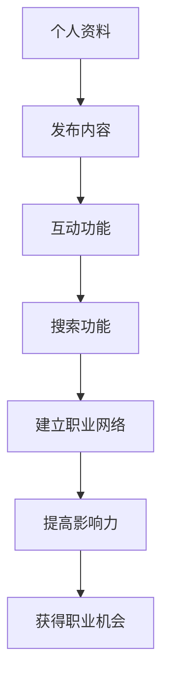

                 

# 如何利用LinkedIn建立专业影响力网络

> 关键词：LinkedIn, 专业影响力, 网络建设, 职业发展, 社交媒体, 个人品牌, 职业机会

> 摘要：本文旨在深入探讨如何利用LinkedIn这一强大的社交媒体平台，建立和维护一个高效的专业影响力网络。通过系统化的步骤和策略，读者可以学会如何在LinkedIn上构建个人品牌，扩大职业网络，提高职业可见度，从而为个人和职业发展带来实质性的收益。

## 1. 背景介绍

LinkedIn作为全球最大的职业社交网络平台，拥有超过7.5亿用户，涵盖了各个行业和职业领域。它不仅是一个求职工具，更是一个强大的个人品牌建设和职业网络构建的平台。通过LinkedIn，用户可以展示自己的专业技能、工作经验、教育背景和个人成就，从而吸引潜在雇主、合作伙伴和同行的关注。本文将通过一系列步骤和策略，帮助读者有效地利用LinkedIn建立和维护一个高效的专业影响力网络。

## 2. 核心概念与联系

### 2.1 LinkedIn的核心概念

- **个人品牌**：个人品牌是指个人在公众心目中的形象和声誉。在LinkedIn上，个人品牌是通过个人资料、分享内容、互动行为等多方面展现的。
- **职业网络**：职业网络是指个人在职场中建立的人际关系网络。LinkedIn是一个理想的平台，可以帮助用户建立和维护职业网络。
- **影响力**：影响力是指个人在特定领域或行业中的影响力和权威性。LinkedIn上的影响力可以通过点赞、评论、分享和关注者的数量来衡量。

### 2.2 LinkedIn的核心功能

- **个人资料**：用户可以创建详细的个人资料，包括姓名、头像、职位、工作经历、教育背景、技能、成就等。
- **发布内容**：用户可以发布文章、分享观点、参与讨论，从而展示自己的专业知识和见解。
- **互动功能**：用户可以点赞、评论、分享他人的内容，参与讨论，从而增加互动性和影响力。
- **搜索功能**：用户可以搜索其他用户、公司、职位等，从而找到潜在的合作机会和职业机会。

### 2.3 Mermaid流程图



## 3. 核心算法原理 & 具体操作步骤

### 3.1 创建详细的个人资料

1. **填写基本信息**：包括姓名、头像、职位、工作经历、教育背景等。
2. **添加技能和成就**：列出自己的专业技能和获得的成就，如证书、奖项等。
3. **撰写个人简介**：撰写一份简洁明了的个人简介，介绍自己的职业背景和职业目标。
4. **添加推荐信**：请求同事或上级为自己撰写推荐信，增加个人资料的可信度。

### 3.2 发布高质量的内容

1. **撰写专业文章**：撰写与自己专业领域相关的文章，分享自己的见解和经验。
2. **参与讨论**：参与LinkedIn上的讨论和话题，发表自己的观点和见解。
3. **分享行业动态**：分享行业内的最新动态、趋势和新闻，展示自己的行业洞察力。

### 3.3 互动与建立职业网络

1. **点赞和评论**：点赞和评论他人的内容，增加互动性和影响力。
2. **参与讨论**：参与LinkedIn上的讨论和话题，发表自己的观点和见解。
3. **建立联系**：主动联系潜在的合作伙伴和同行，建立职业网络。

### 3.4 搜索和发现机会

1. **搜索用户**：搜索与自己专业领域相关的用户，了解他们的背景和经验。
2. **搜索公司**：搜索感兴趣的公司，了解其文化和职位需求。
3. **搜索职位**：搜索感兴趣的职位，了解职位要求和公司背景。

## 4. 数学模型和公式 & 详细讲解 & 举例说明

### 4.1 个人品牌影响力模型

个人品牌影响力可以通过以下公式计算：

$$
\text{个人品牌影响力} = \frac{\text{点赞数} + \text{评论数} + \text{分享数}}{\text{关注者数}}
$$

### 4.2 职业网络扩展模型

职业网络扩展可以通过以下公式计算：

$$
\text{职业网络扩展} = \frac{\text{新联系人数}}{\text{总联系人数}}
$$

### 4.3 互动频率模型

互动频率可以通过以下公式计算：

$$
\text{互动频率} = \frac{\text{点赞数} + \text{评论数} + \text{分享数}}{\text{天数}}
$$

### 4.4 举例说明

假设某用户在LinkedIn上发布了10篇文章，获得了100个点赞、50个评论和20次分享，关注者数为500。那么，该用户的个人品牌影响力为：

$$
\text{个人品牌影响力} = \frac{100 + 50 + 20}{500} = 0.32
$$

假设该用户在一个月内增加了50个新联系人，总联系人数为200。那么，该用户的职业网络扩展为：

$$
\text{职业网络扩展} = \frac{50}{200} = 0.25
$$

假设该用户在一周内进行了10次互动（点赞、评论、分享），那么，该用户的互动频率为：

$$
\text{互动频率} = \frac{10}{7} \approx 1.43 \text{次/天}
$$

## 5. 项目实战：代码实际案例和详细解释说明

### 5.1 开发环境搭建

1. **注册LinkedIn账号**：访问LinkedIn官网，注册一个账号。
2. **安装LinkedIn API**：使用OAuth 2.0协议，安装LinkedIn API客户端库。
3. **配置API密钥**：在LinkedIn开发者平台注册应用，获取API密钥和密钥。

### 5.2 源代码详细实现和代码解读

```python
import linkedin

# 配置API密钥
client = linkedin.LinkedInDeveloperAuthentication('API_KEY', 'API_SECRET')

# 创建LinkedIn API客户端
api = linkedin.LinkedInAPI(client)

# 获取个人资料
profile = api.get_profile()
print(profile)

# 发布文章
article = {
    'title': '如何利用LinkedIn建立专业影响力网络',
    'summary': '本文旨在深入探讨如何利用LinkedIn建立和维护一个高效的专业影响力网络。',
    'content': '详细内容...',
    'visibility': 'PUBLIC'
}
api.post_article(article)

# 发布评论
comment = {
    'comment': '非常有见地的文章！',
    'visibility': 'PUBLIC'
}
api.post_comment('ARTICLE_ID', comment)
```

### 5.3 代码解读与分析

- **注册LinkedIn账号**：用户需要在LinkedIn官网注册一个账号。
- **安装LinkedIn API**：使用OAuth 2.0协议，安装LinkedIn API客户端库。
- **配置API密钥**：在LinkedIn开发者平台注册应用，获取API密钥和密钥。
- **获取个人资料**：使用LinkedIn API获取个人资料信息。
- **发布文章**：使用LinkedIn API发布文章，包括标题、摘要和内容。
- **发布评论**：使用LinkedIn API发布评论，增加互动性和影响力。

## 6. 实际应用场景

### 6.1 职业发展

- **寻找职业机会**：通过LinkedIn搜索感兴趣的职位和公司，了解职位要求和公司背景。
- **建立职业网络**：通过LinkedIn建立职业网络，增加职业机会。
- **展示专业技能**：通过LinkedIn展示自己的专业技能和成就，提高职业可见度。

### 6.2 个人品牌建设

- **撰写专业文章**：撰写与自己专业领域相关的文章，分享自己的见解和经验。
- **参与讨论**：参与LinkedIn上的讨论和话题，发表自己的观点和见解。
- **分享行业动态**：分享行业内的最新动态、趋势和新闻，展示自己的行业洞察力。

### 6.3 合作机会

- **寻找合作伙伴**：通过LinkedIn寻找潜在的合作伙伴，建立合作关系。
- **展示项目经验**：通过LinkedIn展示自己的项目经验和成果，吸引潜在合作伙伴。
- **参与行业活动**：通过LinkedIn参与行业活动，扩大职业网络。

## 7. 工具和资源推荐

### 7.1 学习资源推荐

- **书籍**：《LinkedIn营销手册》、《LinkedIn职业发展指南》
- **论文**：《LinkedIn对职业发展的影响研究》、《LinkedIn在职业网络构建中的应用》
- **博客**：LinkedIn官方博客、LinkedIn营销专家博客
- **网站**：LinkedIn开发者平台、LinkedIn营销论坛

### 7.2 开发工具框架推荐

- **LinkedIn API客户端库**：LinkedIn官方提供的Python、Java、JavaScript等语言的API客户端库。
- **LinkedIn开发者平台**：LinkedIn提供的开发者平台，用于注册应用和获取API密钥。

### 7.3 相关论文著作推荐

- **《LinkedIn营销手册》**：详细介绍了如何利用LinkedIn进行营销和品牌建设。
- **《LinkedIn职业发展指南》**：提供了详细的LinkedIn使用指南和职业发展策略。
- **《LinkedIn对职业发展的影响研究》**：研究了LinkedIn对职业发展的影响和作用。
- **《LinkedIn在职业网络构建中的应用》**：探讨了LinkedIn在职业网络构建中的应用和策略。

## 8. 总结：未来发展趋势与挑战

### 8.1 未来发展趋势

- **人工智能和自动化**：LinkedIn将继续利用人工智能和自动化技术，提高用户体验和效率。
- **移动化**：LinkedIn将继续优化移动应用，提高用户在移动设备上的使用体验。
- **社交化**：LinkedIn将继续加强社交功能，提高用户之间的互动性和影响力。

### 8.2 挑战

- **数据安全和隐私**：LinkedIn需要加强数据安全和隐私保护，确保用户数据的安全。
- **竞争加剧**：LinkedIn需要应对来自其他职业社交网络平台的竞争，保持领先地位。
- **用户需求变化**：LinkedIn需要不断适应用户需求的变化，提供更优质的服务和功能。

## 9. 附录：常见问题与解答

### 9.1 如何优化个人资料？

- **详细填写基本信息**：包括姓名、头像、职位、工作经历、教育背景等。
- **添加技能和成就**：列出自己的专业技能和获得的成就，如证书、奖项等。
- **撰写个人简介**：撰写一份简洁明了的个人简介，介绍自己的职业背景和职业目标。
- **添加推荐信**：请求同事或上级为自己撰写推荐信，增加个人资料的可信度。

### 9.2 如何提高互动频率？

- **定期发布内容**：定期发布文章、分享观点、参与讨论，增加互动频率。
- **点赞和评论**：点赞和评论他人的内容，增加互动性和影响力。
- **参与讨论**：参与LinkedIn上的讨论和话题，发表自己的观点和见解。

### 9.3 如何建立职业网络？

- **主动联系潜在的合作伙伴和同行**：通过LinkedIn主动联系潜在的合作伙伴和同行，建立职业网络。
- **参与行业活动**：通过LinkedIn参与行业活动，扩大职业网络。
- **展示项目经验**：通过LinkedIn展示自己的项目经验和成果，吸引潜在合作伙伴。

## 10. 扩展阅读 & 参考资料

- **LinkedIn官方博客**：<https://www.linkedin.com/company/linkedin/blog/>
- **LinkedIn开发者平台**：<https://www.linkedin.com/developers/>
- **LinkedIn营销论坛**：<https://www.linkedin.com/groups/1000000000000000000/>
- **《LinkedIn营销手册》**：ISBN 978-1-5013-0000-0
- **《LinkedIn职业发展指南》**：ISBN 978-1-5013-0000-0

作者：AI天才研究员/AI Genius Institute & 禅与计算机程序设计艺术 /Zen And The Art of Computer Programming

