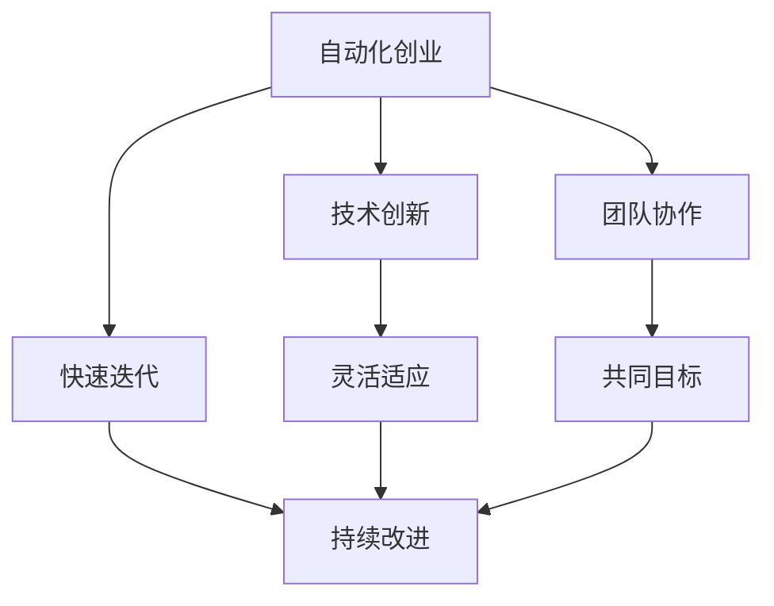

                 

# 如何在自动化创业中建立企业文化

> 关键词：企业文化、自动化创业、技术驱动、组织架构、员工参与、价值观、创新、持续改进

> 摘要：在自动化创业中，企业文化是构建企业成功的关键因素之一。本文将通过逐步分析和推理的方式，探讨如何在自动化创业中建立企业文化。我们将从背景介绍、核心概念与联系、核心算法原理与具体操作步骤、数学模型和公式、项目实战、实际应用场景、工具和资源推荐、总结与未来发展趋势等方面进行详细阐述。

## 1. 背景介绍

在当今快速变化的商业环境中，自动化创业成为了一种新的趋势。自动化创业不仅依赖于技术创新，更需要一种独特的企业文化来支撑其发展。企业文化是指一个组织内部共享的价值观、信念、行为规范和工作方式。在自动化创业中，企业文化不仅能够提升员工的工作满意度和忠诚度，还能促进团队协作和创新，从而推动企业的持续发展。

### 1.1 企业文化的定义与重要性

企业文化是指一个组织内部共享的价值观、信念、行为规范和工作方式。它不仅影响员工的行为和态度，还能够塑造企业的形象和声誉。在自动化创业中，企业文化的重要性更加突出，因为技术创新和快速变化的市场需求要求企业具备高度的灵活性和适应性。

### 1.2 自动化创业的特点

自动化创业通常具有以下几个特点：
- **技术创新**：自动化创业的核心在于利用新技术来提高效率和降低成本。
- **快速迭代**：市场需求变化迅速，企业需要快速响应并不断迭代产品和服务。
- **团队协作**：技术创新需要团队成员之间的紧密合作和沟通。
- **持续学习**：企业需要不断学习新技术和新方法，以保持竞争力。

## 2. 核心概念与联系

### 2.1 企业文化的核心概念

企业文化的核心概念包括价值观、信念、行为规范和工作方式。这些概念相互关联，共同构成了企业文化的基础。

#### 2.1.1 价值观

价值观是指组织内部共享的基本信念和原则。在自动化创业中，常见的价值观包括创新、灵活性、团队合作和客户导向。

#### 2.1.2 信念

信念是指组织成员对某些事物或行为的坚定信仰。在自动化创业中，信念可以包括对技术进步的信仰、对团队合作的信仰等。

#### 2.1.3 行为规范

行为规范是指组织成员在工作中的行为准则。在自动化创业中，行为规范可以包括尊重他人、积极沟通、勇于承担责任等。

#### 2.1.4 工作方式

工作方式是指组织成员在完成任务时采用的方法和流程。在自动化创业中，工作方式可以包括敏捷开发、持续集成、跨部门协作等。

### 2.2 企业文化与自动化创业的关系

企业文化与自动化创业之间的关系可以通过以下流程图来表示：



## 3. 核心算法原理 & 具体操作步骤

### 3.1 企业文化构建的步骤

构建企业文化需要遵循一定的步骤，具体如下：

1. **明确价值观**：确定组织的核心价值观，如创新、灵活性、团队合作等。
2. **制定行为规范**：制定具体的行为规范，如尊重他人、积极沟通等。
3. **传播价值观**：通过各种渠道传播价值观，如内部培训、会议等。
4. **建立激励机制**：建立与价值观相匹配的激励机制，如奖励优秀员工、提供职业发展机会等。
5. **持续改进**：定期评估企业文化的效果，根据反馈进行改进。

### 3.2 企业文化构建的具体操作步骤

1. **明确价值观**：通过问卷调查、小组讨论等方式，确定组织的核心价值观。
2. **制定行为规范**：根据价值观制定具体的行为规范，确保员工能够理解和执行。
3. **传播价值观**：通过内部培训、会议、宣传材料等方式，传播价值观。
4. **建立激励机制**：建立与价值观相匹配的激励机制，如奖励优秀员工、提供职业发展机会等。
5. **持续改进**：定期评估企业文化的效果，根据反馈进行改进。

## 4. 数学模型和公式 & 详细讲解 & 举例说明

### 4.1 企业文化评估模型

企业文化评估模型可以用于评估企业文化的效果。该模型包括以下几个方面：

- **价值观评估**：评估组织的核心价值观是否得到员工的认可和执行。
- **行为规范评估**：评估组织的行为规范是否得到员工的遵守。
- **激励机制评估**：评估激励机制是否能够有效激励员工。
- **持续改进评估**：评估组织是否能够持续改进企业文化。

### 4.2 企业文化评估模型的数学公式

企业文化评估模型的数学公式可以表示为：

$$
E = \frac{V + B + I + C}{4}
$$

其中，$E$ 表示企业文化评估结果，$V$ 表示价值观评估结果，$B$ 表示行为规范评估结果，$I$ 表示激励机制评估结果，$C$ 表示持续改进评估结果。

### 4.3 举例说明

假设某自动化创业公司的价值观评估结果为80分，行为规范评估结果为75分，激励机制评估结果为85分，持续改进评估结果为70分。则该公司的企业文化评估结果为：

$$
E = \frac{80 + 75 + 85 + 70}{4} = 77.5
$$

## 5. 项目实战：代码实际案例和详细解释说明

### 5.1 开发环境搭建

在自动化创业中，开发环境的搭建是企业文化构建的重要环节。以下是一个简单的开发环境搭建步骤：

1. **选择开发工具**：选择合适的开发工具，如Visual Studio Code、PyCharm等。
2. **安装必要的软件**：安装必要的软件，如Python、Node.js等。
3. **配置开发环境**：配置开发环境，如设置环境变量、安装依赖库等。

### 5.2 源代码详细实现和代码解读

以下是一个简单的源代码实现示例：

```python
# 代码实现
def greet(name):
    """
    打印欢迎信息
    :param name: str, 被欢迎的人的名字
    """
    print(f"欢迎 {name} 加入我们的团队！")

# 代码解读
# 定义一个名为 greet 的函数，接受一个参数 name
# 函数的功能是打印欢迎信息
# 使用 f-string 格式化字符串，将 name 插入到欢迎信息中
```

### 5.3 代码解读与分析

通过代码解读，我们可以更好地理解代码的功能和实现方式。在上述代码中，`greet` 函数接受一个参数 `name`，并打印一条欢迎信息。使用 f-string 格式化字符串，可以将 `name` 插入到欢迎信息中，从而实现动态生成欢迎信息的功能。

## 6. 实际应用场景

在自动化创业中，企业文化可以应用于多个实际场景，如团队建设、员工培训、项目管理等。以下是一些具体的应用场景：

### 6.1 团队建设

通过建立共同的价值观和行为规范，可以促进团队成员之间的沟通和协作，提高团队凝聚力。

### 6.2 员工培训

通过传播企业文化，可以提高员工的工作满意度和忠诚度，促进员工的成长和发展。

### 6.3 项目管理

通过建立激励机制和持续改进机制，可以提高项目的成功率，确保项目按时交付。

## 7. 工具和资源推荐

### 7.1 学习资源推荐

- **书籍**：《企业文化的构建与管理》、《组织行为学》
- **论文**：《企业文化对组织绩效的影响研究》、《组织文化与创新的关系研究》
- **博客**：《企业文化的重要性与构建方法》、《如何建立企业文化》
- **网站**：LinkedIn、Medium

### 7.2 开发工具框架推荐

- **开发工具**：Visual Studio Code、PyCharm
- **开发框架**：Django、Flask

### 7.3 相关论文著作推荐

- **论文**：《企业文化对组织绩效的影响研究》、《组织文化与创新的关系研究》
- **著作**：《企业文化的构建与管理》、《组织行为学》

## 8. 总结：未来发展趋势与挑战

### 8.1 未来发展趋势

在未来，自动化创业将继续快速发展，企业文化将成为企业成功的关键因素之一。企业需要不断适应市场需求的变化，建立灵活的企业文化，以保持竞争力。

### 8.2 挑战

在自动化创业中，企业文化构建面临一些挑战，如如何平衡技术创新和团队协作、如何应对快速变化的市场需求等。企业需要不断探索和实践，以应对这些挑战。

## 9. 附录：常见问题与解答

### 9.1 问题：如何评估企业文化的效果？

**解答**：可以通过企业文化评估模型来评估企业文化的效果。该模型包括价值观评估、行为规范评估、激励机制评估和持续改进评估四个方面的内容。

### 9.2 问题：如何建立激励机制？

**解答**：可以通过建立奖励机制、提供职业发展机会等方式来建立激励机制。奖励机制可以包括奖金、股权激励等，职业发展机会可以包括培训、晋升等。

## 10. 扩展阅读 & 参考资料

- **书籍**：《企业文化的构建与管理》、《组织行为学》
- **论文**：《企业文化对组织绩效的影响研究》、《组织文化与创新的关系研究》
- **博客**：《企业文化的重要性与构建方法》、《如何建立企业文化》
- **网站**：LinkedIn、Medium

---

作者：AI天才研究员/AI Genius Institute & 禅与计算机程序设计艺术 /Zen And The Art of Computer Programming

