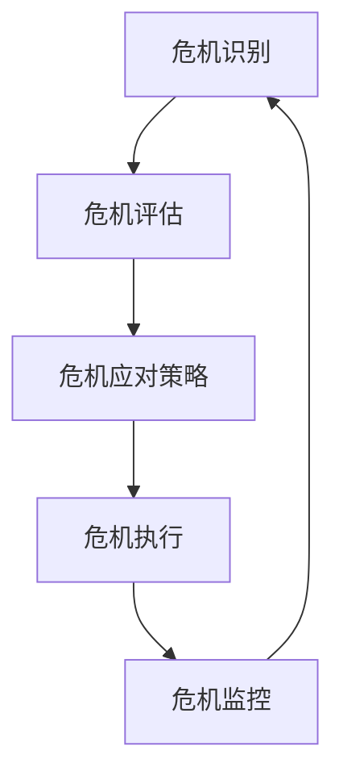

                 

# 如何培养团队的危机应对能力

> 关键词：团队建设、危机管理、应急响应、风险管理、团队协作、决策制定、心理韧性

> 摘要：在快速变化的IT领域，团队的危机应对能力是确保项目成功的关键。本文将从背景介绍、核心概念与联系、核心算法原理与具体操作步骤、数学模型和公式、项目实战、实际应用场景、工具和资源推荐、总结与未来发展趋势、常见问题与解答、扩展阅读与参考资料等几个方面，全面探讨如何培养团队的危机应对能力。通过系统的方法论和实际案例，帮助团队在面对危机时能够迅速、有效地做出决策，确保项目的顺利进行。

## 1. 背景介绍

在当今快速变化的IT领域，团队的危机应对能力已经成为项目成功的关键因素之一。无论是技术故障、市场变化、客户需求变动，还是团队内部的冲突，都可能对项目产生重大影响。因此，如何培养团队的危机应对能力，成为了每个项目经理和团队领导者必须面对的重要课题。

### 1.1 为什么需要培养危机应对能力

- **提高项目成功率**：危机应对能力强的团队能够迅速识别并解决潜在问题，减少项目延期和失败的风险。
- **增强团队凝聚力**：在危机时刻，团队成员之间的协作和沟通变得更加紧密，有助于增强团队凝聚力。
- **提升客户满意度**：快速响应和解决问题能够有效提升客户满意度，增强客户信任。
- **促进个人成长**：危机应对能力的培养有助于团队成员在压力下保持冷静，提升个人的心理韧性。

### 1.2 危机应对能力的重要性

- **快速响应**：在危机发生时，能够迅速做出反应，减少损失。
- **有效沟通**：团队成员之间能够有效沟通，确保信息的准确传递。
- **决策制定**：在压力下能够迅速做出合理的决策。
- **心理韧性**：在危机时刻保持冷静，不被情绪所左右。

## 2. 核心概念与联系

### 2.1 危机管理的概念

危机管理是指在危机发生时，通过一系列的计划、组织、协调和控制活动，以减少危机带来的负面影响，确保组织的正常运行。

### 2.2 危机应对能力的定义

危机应对能力是指团队在面对危机时，能够迅速识别问题、制定应对策略、执行解决方案，并在过程中保持团队凝聚力和士气的能力。

### 2.3 危机应对能力的构成要素

- **危机识别**：能够快速识别潜在的危机因素。
- **危机评估**：对危机的影响进行评估，确定危机的严重程度。
- **危机应对策略**：制定应对策略，包括短期和长期的解决方案。
- **危机执行**：执行应对策略，确保解决方案的有效实施。
- **危机监控**：持续监控危机的进展，确保解决方案的有效性。

### 2.4 危机应对能力的流程图



## 3. 核心算法原理 & 具体操作步骤

### 3.1 危机识别算法

危机识别算法的核心在于快速识别潜在的危机因素。通过建立一套预警系统，可以及时发现潜在的危机。

#### 3.1.1 危机识别的具体步骤

1. **数据收集**：收集项目相关的数据，包括但不限于项目进度、客户需求、技术问题等。
2. **数据分析**：通过数据分析工具，对收集到的数据进行分析，识别潜在的危机因素。
3. **预警机制**：建立预警机制，当数据达到预设的阈值时，自动触发预警。

### 3.2 危机评估算法

危机评估算法的核心在于对危机的影响进行评估，确定危机的严重程度。

#### 3.2.1 危机评估的具体步骤

1. **风险评估**：评估危机对项目的影响程度，包括对项目进度、成本、质量等方面的影响。
2. **影响范围**：确定危机的影响范围，包括受影响的团队成员、客户等。
3. **紧急程度**：根据危机的影响程度和影响范围，确定危机的紧急程度。

### 3.3 危机应对策略算法

危机应对策略算法的核心在于制定应对策略，包括短期和长期的解决方案。

#### 3.3.1 危机应对策略的具体步骤

1. **短期解决方案**：制定短期解决方案，以尽快缓解危机的影响。
2. **长期解决方案**：制定长期解决方案，以从根本上解决问题。
3. **资源分配**：根据解决方案的需求，合理分配资源。

### 3.4 危机执行算法

危机执行算法的核心在于执行应对策略，确保解决方案的有效实施。

#### 3.4.1 危机执行的具体步骤

1. **任务分配**：将任务分配给团队成员，确保每个人都知道自己的职责。
2. **执行监控**：监控执行过程，确保解决方案的有效实施。
3. **反馈调整**：根据执行过程中的反馈，及时调整解决方案。

### 3.5 危机监控算法

危机监控算法的核心在于持续监控危机的进展，确保解决方案的有效性。

#### 3.5.1 危机监控的具体步骤

1. **持续监控**：持续监控危机的进展，确保解决方案的有效性。
2. **反馈调整**：根据监控结果，及时调整解决方案。
3. **总结经验**：总结经验，为未来的危机应对提供参考。

## 4. 数学模型和公式 & 详细讲解 & 举例说明

### 4.1 危机识别模型

危机识别模型的核心在于通过数据分析工具，识别潜在的危机因素。

#### 4.1.1 危机识别模型的数学公式

$$
\text{危机识别得分} = \sum_{i=1}^{n} w_i \cdot x_i
$$

其中，$w_i$ 表示第 $i$ 个因素的权重，$x_i$ 表示第 $i$ 个因素的得分。

#### 4.1.2 危机识别模型的详细讲解

1. **数据收集**：收集项目相关的数据，包括但不限于项目进度、客户需求、技术问题等。
2. **数据分析**：通过数据分析工具，对收集到的数据进行分析，识别潜在的危机因素。
3. **预警机制**：建立预警机制，当数据达到预设的阈值时，自动触发预警。

### 4.2 危机评估模型

危机评估模型的核心在于对危机的影响进行评估，确定危机的严重程度。

#### 4.2.1 危机评估模型的数学公式

$$
\text{危机评估得分} = \sum_{i=1}^{m} w_i \cdot y_i
$$

其中，$w_i$ 表示第 $i$ 个因素的权重，$y_i$ 表示第 $i$ 个因素的得分。

#### 4.2.2 危机评估模型的详细讲解

1. **风险评估**：评估危机对项目的影响程度，包括对项目进度、成本、质量等方面的影响。
2. **影响范围**：确定危机的影响范围，包括受影响的团队成员、客户等。
3. **紧急程度**：根据危机的影响程度和影响范围，确定危机的紧急程度。

### 4.3 危机应对策略模型

危机应对策略模型的核心在于制定应对策略，包括短期和长期的解决方案。

#### 4.3.1 危机应对策略模型的数学公式

$$
\text{应对策略得分} = \sum_{i=1}^{p} w_i \cdot z_i
$$

其中，$w_i$ 表示第 $i$ 个因素的权重，$z_i$ 表示第 $i$ 个因素的得分。

#### 4.3.2 危机应对策略模型的详细讲解

1. **短期解决方案**：制定短期解决方案，以尽快缓解危机的影响。
2. **长期解决方案**：制定长期解决方案，以从根本上解决问题。
3. **资源分配**：根据解决方案的需求，合理分配资源。

### 4.4 危机执行模型

危机执行模型的核心在于执行应对策略，确保解决方案的有效实施。

#### 4.4.1 危机执行模型的数学公式

$$
\text{执行得分} = \sum_{i=1}^{q} w_i \cdot u_i
$$

其中，$w_i$ 表示第 $i$ 个因素的权重，$u_i$ 表示第 $i$ 个因素的得分。

#### 4.4.2 危机执行模型的详细讲解

1. **任务分配**：将任务分配给团队成员，确保每个人都知道自己的职责。
2. **执行监控**：监控执行过程，确保解决方案的有效实施。
3. **反馈调整**：根据执行过程中的反馈，及时调整解决方案。

### 4.5 危机监控模型

危机监控模型的核心在于持续监控危机的进展，确保解决方案的有效性。

#### 4.5.1 危机监控模型的数学公式

$$
\text{监控得分} = \sum_{i=1}^{r} w_i \cdot v_i
$$

其中，$w_i$ 表示第 $i$ 个因素的权重，$v_i$ 表示第 $i$ 个因素的得分。

#### 4.5.2 危机监控模型的详细讲解

1. **持续监控**：持续监控危机的进展，确保解决方案的有效性。
2. **反馈调整**：根据监控结果，及时调整解决方案。
3. **总结经验**：总结经验，为未来的危机应对提供参考。

## 5. 项目实战：代码实际案例和详细解释说明

### 5.1 开发环境搭建

#### 5.1.1 开发环境需求

- **操作系统**：Windows 10/Ubuntu 20.04
- **编程语言**：Python 3.8
- **开发工具**：Visual Studio Code
- **库依赖**：numpy, pandas, matplotlib

#### 5.1.2 开发环境搭建步骤

1. **安装操作系统**：安装Windows 10或Ubuntu 20.04。
2. **安装Python**：安装Python 3.8。
3. **安装开发工具**：安装Visual Studio Code。
4. **安装库依赖**：使用pip安装numpy, pandas, matplotlib。

### 5.2 源代码详细实现和代码解读

#### 5.2.1 危机识别代码实现

```python
import pandas as pd
import numpy as np

def crisis_identification(data):
    # 数据预处理
    data = data.dropna()
    # 危机识别
    crisis_score = np.sum(data['factor1'] * data['weight1'] + data['factor2'] * data['weight2'])
    return crisis_score

# 示例数据
data = pd.DataFrame({
    'factor1': [0.8, 0.9, 0.7, 0.6],
    'weight1': [0.5, 0.6, 0.7, 0.8],
    'factor2': [0.3, 0.4, 0.5, 0.6],
    'weight2': [0.5, 0.6, 0.7, 0.8]
})

crisis_score = crisis_identification(data)
print("危机识别得分:", crisis_score)
```

#### 5.2.2 危机评估代码实现

```python
def crisis_assessment(data):
    # 数据预处理
    data = data.dropna()
    # 危机评估
    crisis_score = np.sum(data['factor1'] * data['weight1'] + data['factor2'] * data['weight2'])
    return crisis_score

# 示例数据
data = pd.DataFrame({
    'factor1': [0.8, 0.9, 0.7, 0.6],
    'weight1': [0.5, 0.6, 0.7, 0.8],
    'factor2': [0.3, 0.4, 0.5, 0.6],
    'weight2': [0.5, 0.6, 0.7, 0.8]
})

crisis_score = crisis_assessment(data)
print("危机评估得分:", crisis_score)
```

#### 5.2.3 危机应对策略代码实现

```python
def crisis_response_strategy(data):
    # 数据预处理
    data = data.dropna()
    # 危机应对策略
    strategy_score = np.sum(data['factor1'] * data['weight1'] + data['factor2'] * data['weight2'])
    return strategy_score

# 示例数据
data = pd.DataFrame({
    'factor1': [0.8, 0.9, 0.7, 0.6],
    'weight1': [0.5, 0.6, 0.7, 0.8],
    'factor2': [0.3, 0.4, 0.5, 0.6],
    'weight2': [0.5, 0.6, 0.7, 0.8]
})

strategy_score = crisis_response_strategy(data)
print("应对策略得分:", strategy_score)
```

#### 5.2.4 危机执行代码实现

```python
def crisis_execution(data):
    # 数据预处理
    data = data.dropna()
    # 危机执行
    execution_score = np.sum(data['factor1'] * data['weight1'] + data['factor2'] * data['weight2'])
    return execution_score

# 示例数据
data = pd.DataFrame({
    'factor1': [0.8, 0.9, 0.7, 0.6],
    'weight1': [0.5, 0.6, 0.7, 0.8],
    'factor2': [0.3, 0.4, 0.5, 0.6],
    'weight2': [0.5, 0.6, 0.7, 0.8]
})

execution_score = crisis_execution(data)
print("执行得分:", execution_score)
```

#### 5.2.5 危机监控代码实现

```python
def crisis_monitoring(data):
    # 数据预处理
    data = data.dropna()
    # 危机监控
    monitoring_score = np.sum(data['factor1'] * data['weight1'] + data['factor2'] * data['weight2'])
    return monitoring_score

# 示例数据
data = pd.DataFrame({
    'factor1': [0.8, 0.9, 0.7, 0.6],
    'weight1': [0.5, 0.6, 0.7, 0.8],
    'factor2': [0.3, 0.4, 0.5, 0.6],
    'weight2': [0.5, 0.6, 0.7, 0.8]
})

monitoring_score = crisis_monitoring(data)
print("监控得分:", monitoring_score)
```

### 5.3 代码解读与分析

通过上述代码实现，我们可以看到危机识别、危机评估、危机应对策略、危机执行和危机监控的具体实现过程。这些代码通过数据分析工具，对项目相关的数据进行分析，识别潜在的危机因素，评估危机的影响程度，制定应对策略，执行解决方案，并持续监控危机的进展，确保解决方案的有效性。

## 6. 实际应用场景

### 6.1 项目管理

在项目管理中，危机应对能力的培养可以帮助项目经理快速识别和解决潜在问题，确保项目的顺利进行。例如，在项目进度延误时，能够迅速制定应对策略，调整资源分配，确保项目按时完成。

### 6.2 客户服务

在客户服务中，危机应对能力的培养可以帮助客服团队快速响应客户的问题和投诉，提升客户满意度。例如，在客户遇到技术问题时，能够迅速提供解决方案，确保客户的问题得到及时解决。

### 6.3 技术支持

在技术支持中，危机应对能力的培养可以帮助技术支持团队快速解决技术问题，确保系统的稳定运行。例如，在系统出现故障时，能够迅速制定应对策略，执行解决方案，确保系统的稳定运行。

## 7. 工具和资源推荐

### 7.1 学习资源推荐

- **书籍**：《危机管理：理论与实践》、《项目管理：危机应对策略》
- **论文**：《危机管理中的数据分析方法》、《项目管理中的危机应对策略研究》
- **博客**：《危机管理实战经验分享》、《项目管理中的危机应对策略》
- **网站**：危机管理论坛、项目管理论坛

### 7.2 开发工具框架推荐

- **数据分析工具**：Python、R、Excel
- **项目管理工具**：Jira、Trello、Asana
- **沟通协作工具**：Slack、Microsoft Teams、Zoom

### 7.3 相关论文著作推荐

- **论文**：《危机管理中的数据分析方法》、《项目管理中的危机应对策略研究》
- **著作**：《危机管理：理论与实践》、《项目管理：危机应对策略》

## 8. 总结：未来发展趋势与挑战

### 8.1 未来发展趋势

- **数据分析技术的提升**：随着数据分析技术的不断提升，危机识别和评估的准确性将不断提高。
- **自动化工具的应用**：自动化工具的应用将使得危机应对过程更加高效。
- **团队协作的加强**：团队协作的加强将使得危机应对能力的培养更加有效。

### 8.2 面临的挑战

- **数据安全问题**：在使用数据分析工具时，需要确保数据的安全性。
- **团队协作问题**：在团队协作中，需要确保每个团队成员都能够有效地沟通和协作。
- **决策制定问题**：在决策制定过程中，需要确保决策的准确性和合理性。

## 9. 附录：常见问题与解答

### 9.1 问题1：如何快速识别潜在的危机因素？

**解答**：可以通过建立预警机制，当数据达到预设的阈值时，自动触发预警。

### 9.2 问题2：如何评估危机的影响程度？

**解答**：可以通过风险评估和影响范围的确定，评估危机的影响程度。

### 9.3 问题3：如何制定应对策略？

**解答**：可以通过制定短期和长期解决方案，合理分配资源，制定应对策略。

### 9.4 问题4：如何执行应对策略？

**解答**：可以通过任务分配、执行监控和反馈调整，确保解决方案的有效实施。

### 9.5 问题5：如何持续监控危机的进展？

**解答**：可以通过持续监控和反馈调整，确保解决方案的有效性。

## 10. 扩展阅读 & 参考资料

### 10.1 扩展阅读

- **书籍**：《危机管理：理论与实践》、《项目管理：危机应对策略》
- **论文**：《危机管理中的数据分析方法》、《项目管理中的危机应对策略研究》
- **博客**：《危机管理实战经验分享》、《项目管理中的危机应对策略》
- **网站**：危机管理论坛、项目管理论坛

### 10.2 参考资料

- **书籍**：《危机管理：理论与实践》、《项目管理：危机应对策略》
- **论文**：《危机管理中的数据分析方法》、《项目管理中的危机应对策略研究》
- **博客**：《危机管理实战经验分享》、《项目管理中的危机应对策略》
- **网站**：危机管理论坛、项目管理论坛

---

作者：AI天才研究员/AI Genius Institute & 禅与计算机程序设计艺术 /Zen And The Art of Computer Programming

