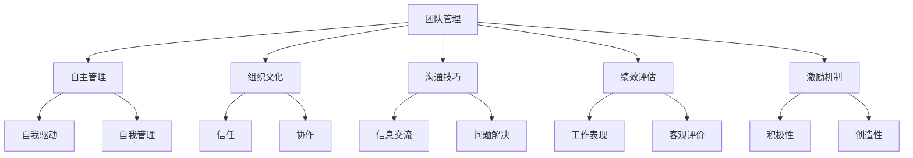

                 

# 如何培养团队的自主管理能力

> 关键词：团队管理、自主管理、领导力、组织文化、沟通技巧、绩效评估、激励机制

> 摘要：在当今快速变化的商业环境中，团队的自主管理能力成为了企业成功的关键因素之一。本文将从团队管理的核心概念出发，探讨如何通过构建有效的组织文化、提升沟通技巧、优化绩效评估体系和建立激励机制来培养团队的自主管理能力。通过具体的案例分析和实践操作，本文旨在为企业领导者提供一套系统的方法论，帮助他们打造一支高效、自主的团队。

## 1. 背景介绍

在过去的几十年里，随着信息技术的飞速发展，企业面临着前所未有的挑战和机遇。为了在激烈的市场竞争中脱颖而出，企业不仅需要不断提升自身的技术实力，还需要构建一支能够自主管理、高效协作的团队。团队的自主管理能力不仅能够提高工作效率，还能激发团队成员的创新潜能，为企业创造更大的价值。因此，培养团队的自主管理能力成为了现代企业管理的重要课题。

## 2. 核心概念与联系

### 2.1 团队管理

团队管理是指通过一系列策略和方法，确保团队成员能够高效协作，共同实现组织目标的过程。团队管理的核心在于如何激发团队成员的积极性，提升团队的整体效能。

### 2.2 自主管理

自主管理是指团队成员在完成任务时能够自我驱动、自我管理，不需要过多的外部干预。自主管理强调团队成员的自我意识和责任感，能够显著提高团队的工作效率和创新能力。

### 2.3 组织文化

组织文化是指企业在长期发展过程中形成的一套价值观念、行为规范和工作氛围。良好的组织文化能够促进团队成员之间的相互信任和协作，为自主管理提供坚实的基础。

### 2.4 沟通技巧

沟通技巧是指团队成员之间有效交流信息、分享想法和解决问题的能力。高效的沟通能够减少误解和冲突，提高团队协作的效率。

### 2.5 绩效评估

绩效评估是指通过一系列指标和方法，对团队成员的工作表现进行客观评价的过程。科学的绩效评估体系能够激励团队成员不断提升自己的工作能力，促进团队整体绩效的提升。

### 2.6 激励机制

激励机制是指通过一系列奖励和惩罚措施，激发团队成员的积极性和创造性。合理的激励机制能够提高团队成员的工作动力，促进团队整体绩效的提升。

### 2.7 Mermaid 流程图



## 3. 核心算法原理 & 具体操作步骤

### 3.1 构建有效的组织文化

#### 3.1.1 确定核心价值观

企业需要明确自己的核心价值观，这些价值观将成为组织文化的基础。例如，诚信、创新、团队合作等。

#### 3.1.2 传播核心价值观

通过内部培训、会议、宣传材料等多种方式，将核心价值观传播给每一位员工，确保每个人都能够理解和认同这些价值观。

#### 3.1.3 落实核心价值观

将核心价值观融入到企业的日常运营中，确保每一位员工都能够按照这些价值观行事。

### 3.2 提升沟通技巧

#### 3.2.1 开展沟通培训

定期组织沟通技巧培训，帮助团队成员掌握有效的沟通方法和技巧。

#### 3.2.2 建立开放的沟通环境

鼓励团队成员之间进行开放、诚实的沟通，减少误解和冲突。

#### 3.2.3 采用多种沟通方式

根据不同的沟通场景，采用面对面交流、电子邮件、即时通讯等多种沟通方式，确保信息能够准确传递。

### 3.3 优化绩效评估体系

#### 3.3.1 设定明确的绩效指标

根据团队的工作目标，设定一系列明确、可量化的绩效指标，确保每一位团队成员都能够清楚地了解自己的工作目标。

#### 3.3.2 定期进行绩效评估

定期对团队成员的工作表现进行评估，确保绩效评估的公正性和客观性。

#### 3.3.3 反馈评估结果

及时将绩效评估结果反馈给团队成员，帮助他们了解自己的工作表现，并提出改进建议。

### 3.4 建立激励机制

#### 3.4.1 设定合理的奖励制度

根据团队成员的工作表现，设定一系列合理的奖励制度，包括物质奖励和精神奖励。

#### 3.4.2 实施惩罚措施

对于表现不佳的团队成员，实施适当的惩罚措施，确保团队整体绩效的提升。

#### 3.4.3 保持激励机制的灵活性

根据团队成员的工作表现和组织目标的变化，适时调整激励机制，确保其能够持续激发团队成员的积极性和创造性。

## 4. 数学模型和公式 & 详细讲解 & 举例说明

### 4.1 绩效评估模型

绩效评估模型可以采用以下公式进行计算：

$$
\text{绩效得分} = \sum_{i=1}^{n} w_i \times x_i
$$

其中，$w_i$ 表示第 $i$ 个绩效指标的权重，$x_i$ 表示第 $i$ 个绩效指标的实际得分。通过设定合理的权重和得分标准，可以确保绩效评估的公正性和客观性。

### 4.2 激励机制模型

激励机制模型可以采用以下公式进行计算：

$$
\text{激励得分} = \sum_{i=1}^{m} r_i \times y_i
$$

其中，$r_i$ 表示第 $i$ 个奖励的权重，$y_i$ 表示第 $i$ 个奖励的实际得分。通过设定合理的权重和得分标准，可以确保激励机制的有效性和公正性。

### 4.3 举例说明

假设某团队有三个绩效指标：项目完成度、客户满意度和团队协作。设定的权重分别为0.4、0.3和0.3。团队成员A在项目完成度、客户满意度和团队协作方面的得分分别为80、70和90。根据上述公式，可以计算出团队成员A的绩效得分：

$$
\text{绩效得分} = 0.4 \times 80 + 0.3 \times 70 + 0.3 \times 90 = 79
$$

假设某团队有三种奖励：优秀员工奖、创新奖和团队协作奖。设定的权重分别为0.5、0.3和0.2。团队成员A在优秀员工奖、创新奖和团队协作奖方面的得分分别为80、70和90。根据上述公式，可以计算出团队成员A的激励得分：

$$
\text{激励得分} = 0.5 \times 80 + 0.3 \times 70 + 0.2 \times 90 = 77
$$

## 5. 项目实战：代码实际案例和详细解释说明

### 5.1 开发环境搭建

为了实现团队的自主管理能力，我们需要搭建一个支持自主管理的开发环境。具体步骤如下：

1. **选择合适的开发工具**：根据团队成员的需求和偏好，选择合适的开发工具，如Visual Studio Code、IntelliJ IDEA等。
2. **配置版本控制系统**：使用Git等版本控制系统，确保代码的版本管理。
3. **搭建持续集成/持续部署（CI/CD）平台**：使用Jenkins、GitLab CI等工具，实现代码的自动化构建和部署。
4. **设置代码审查流程**：通过代码审查工具，如GitHub、GitLab等，确保代码的质量。

### 5.2 源代码详细实现和代码解读

假设我们正在开发一个简单的项目管理工具，具体代码实现如下：

```python
# project_management.py

class Project:
    def __init__(self, name, description):
        self.name = name
        self.description = description
        self.tasks = []

    def add_task(self, task):
        self.tasks.append(task)

    def remove_task(self, task):
        self.tasks.remove(task)

    def get_tasks(self):
        return self.tasks

class Task:
    def __init__(self, name, description, status):
        self.name = name
        self.description = description
        self.status = status

    def update_status(self, status):
        self.status = status

# 示例代码
if __name__ == "__main__":
    project = Project("项目A", "这是一个示例项目")
    task1 = Task("任务1", "完成需求分析", "未开始")
    task2 = Task("任务2", "编写代码", "进行中")
    task3 = Task("任务3", "测试代码", "已完成")

    project.add_task(task1)
    project.add_task(task2)
    project.add_task(task3)

    print("项目任务列表：")
    for task in project.get_tasks():
        print(f"任务名称：{task.name}, 描述：{task.description}, 状态：{task.status}")
```

### 5.3 代码解读与分析

上述代码实现了一个简单的项目管理工具，主要包括以下几个部分：

1. **Project类**：用于管理项目的基本信息和任务列表。
2. **Task类**：用于管理任务的基本信息和状态。
3. **示例代码**：展示了如何创建项目和任务，并添加到项目中。

通过上述代码，我们可以实现基本的项目管理和任务管理功能，为团队的自主管理能力提供支持。

## 6. 实际应用场景

### 6.1 项目管理

在项目管理中，团队成员可以自主管理自己的任务，确保项目按时完成。通过团队协作和沟通，可以有效解决项目中的问题，提高项目的成功率。

### 6.2 团队协作

在团队协作中，团队成员可以自主管理自己的工作，确保团队成员之间的协作更加高效。通过定期的沟通和反馈，可以及时解决团队成员之间的矛盾，提高团队的整体效能。

### 6.3 创新管理

在创新管理中，团队成员可以自主管理自己的创新项目，确保创新项目的顺利进行。通过团队协作和沟通，可以有效解决创新项目中的问题，提高创新项目的成功率。

## 7. 工具和资源推荐

### 7.1 学习资源推荐

- 书籍：《团队管理的艺术》、《高效团队的12个法则》
- 论文：《组织文化对团队绩效的影响研究》
- 博客：《团队管理与领导力》
- 网站：GitHub、GitLab

### 7.2 开发工具框架推荐

- 开发工具：Visual Studio Code、IntelliJ IDEA
- 版本控制系统：Git
- CI/CD平台：Jenkins、GitLab CI

### 7.3 相关论文著作推荐

- 论文：《组织文化对团队绩效的影响研究》
- 著作：《团队管理的艺术》、《高效团队的12个法则》

## 8. 总结：未来发展趋势与挑战

### 8.1 未来发展趋势

随着信息技术的不断发展，团队的自主管理能力将成为企业成功的关键因素之一。未来，团队管理将更加注重团队成员的自我驱动和自我管理能力，通过构建有效的组织文化、提升沟通技巧、优化绩效评估体系和建立激励机制，实现团队的自主管理能力。

### 8.2 挑战

在培养团队的自主管理能力的过程中，企业将面临一些挑战，如如何平衡团队成员的自主性和团队的整体目标、如何确保绩效评估的公正性和客观性、如何建立合理的激励机制等。解决这些问题，需要企业领导者具备敏锐的洞察力和卓越的领导力。

## 9. 附录：常见问题与解答

### 9.1 问题：如何平衡团队成员的自主性和团队的整体目标？

**解答**：可以通过设定明确的团队目标和个体目标，确保团队成员的自主性与团队的整体目标相一致。同时，通过定期的沟通和反馈，确保团队成员能够及时了解团队的整体目标，并根据自己的工作情况调整自己的工作计划。

### 9.2 问题：如何确保绩效评估的公正性和客观性？

**解答**：可以通过设定明确的绩效指标和评分标准，确保绩效评估的公正性和客观性。同时，通过定期的沟通和反馈，确保团队成员能够及时了解自己的工作表现，并提出改进建议。

### 9.3 问题：如何建立合理的激励机制？

**解答**：可以通过设定合理的奖励制度和惩罚措施，确保激励机制的有效性和公正性。同时，通过定期的沟通和反馈，确保团队成员能够及时了解自己的工作表现，并提出改进建议。

## 10. 扩展阅读 & 参考资料

- 书籍：《团队管理的艺术》、《高效团队的12个法则》
- 论文：《组织文化对团队绩效的影响研究》
- 博客：《团队管理与领导力》
- 网站：GitHub、GitLab

---

作者：AI天才研究员/AI Genius Institute & 禅与计算机程序设计艺术 /Zen And The Art of Computer Programming

