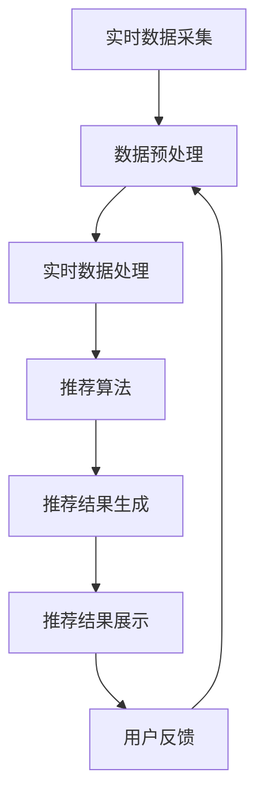

                 

# 实时推荐技术的应用实例

> 关键词：实时推荐、机器学习、协同过滤、深度学习、个性化推荐、实时数据处理、Spark Streaming、TensorFlow

> 摘要：本文旨在深入探讨实时推荐技术的应用实例，从背景介绍、核心概念与联系、核心算法原理、数学模型和公式、项目实战、实际应用场景、工具和资源推荐，到总结未来发展趋势与挑战。通过一步步分析推理思考，帮助读者理解实时推荐技术的原理和实践方法，以及如何在实际项目中应用这些技术。

## 1. 背景介绍

随着互联网和移动互联网的快速发展，用户生成的内容和行为数据急剧增加。如何从海量数据中挖掘出有价值的信息，为用户提供个性化推荐，成为了一个重要的研究方向。实时推荐技术正是在这种背景下应运而生，它能够根据用户的实时行为数据，快速生成个性化推荐结果，从而提升用户体验和满意度。

### 1.1 为什么需要实时推荐

1. **提升用户体验**：实时推荐能够根据用户的实时行为，提供更加精准和个性化的推荐，从而提升用户体验。
2. **增加用户粘性**：通过实时推荐，可以更好地满足用户的需求，增加用户在平台上的停留时间和活跃度。
3. **促进销售转化**：对于电商等商业应用，实时推荐能够提高商品的曝光率和点击率，从而促进销售转化。

### 1.2 实时推荐技术的发展历程

1. **早期推荐系统**：基于内容的推荐和协同过滤推荐是早期推荐系统的主要技术。
2. **机器学习推荐**：随着机器学习技术的发展，基于机器学习的推荐系统逐渐兴起，能够处理更复杂的数据和场景。
3. **深度学习推荐**：近年来，深度学习技术在推荐系统中的应用越来越广泛，能够捕捉更深层次的用户行为特征。
4. **实时推荐技术**：随着实时数据处理技术的发展，实时推荐技术逐渐成为推荐系统的重要组成部分，能够提供更加及时和个性化的推荐。

## 2. 核心概念与联系

### 2.1 实时推荐技术概述

实时推荐技术是指在用户产生行为数据的瞬间，能够快速生成个性化推荐结果的技术。它结合了实时数据处理技术和推荐算法，能够在短时间内完成数据处理和推荐生成。

### 2.2 核心概念

1. **实时数据处理**：实时数据处理技术能够快速处理和分析实时产生的数据，为实时推荐提供数据支持。
2. **推荐算法**：推荐算法是实时推荐的核心，包括基于内容的推荐、协同过滤推荐、机器学习推荐和深度学习推荐等。
3. **实时推荐系统架构**：实时推荐系统架构包括数据采集、数据处理、推荐生成和推荐展示等环节。

### 2.3 Mermaid 流程图



## 3. 核心算法原理 & 具体操作步骤

### 3.1 基于内容的推荐

基于内容的推荐是根据用户的历史行为数据，推荐与其历史行为相似的内容。具体操作步骤如下：

1. **数据采集**：采集用户的历史行为数据，包括用户浏览、点击、购买等行为。
2. **特征提取**：提取用户历史行为数据中的特征，如用户浏览的商品类别、商品属性等。
3. **相似度计算**：计算用户历史行为数据与候选推荐内容之间的相似度。
4. **推荐生成**：根据相似度计算结果，生成推荐列表。

### 3.2 协同过滤推荐

协同过滤推荐是根据用户的历史行为数据，推荐与其相似的用户喜欢的内容。具体操作步骤如下：

1. **数据采集**：采集用户的历史行为数据，包括用户浏览、点击、购买等行为。
2. **用户相似度计算**：计算用户之间的相似度，可以使用余弦相似度、皮尔逊相关系数等方法。
3. **物品相似度计算**：计算物品之间的相似度，可以使用余弦相似度、皮尔逊相关系数等方法。
4. **推荐生成**：根据用户相似度和物品相似度计算结果，生成推荐列表。

### 3.3 机器学习推荐

机器学习推荐是通过训练模型，根据用户的历史行为数据，预测用户对候选推荐内容的偏好。具体操作步骤如下：

1. **数据采集**：采集用户的历史行为数据，包括用户浏览、点击、购买等行为。
2. **特征工程**：提取用户历史行为数据中的特征，如用户浏览的商品类别、商品属性等。
3. **模型训练**：使用机器学习算法（如逻辑回归、随机森林、梯度提升树等）训练模型。
4. **推荐生成**：根据训练好的模型，预测用户对候选推荐内容的偏好，生成推荐列表。

### 3.4 深度学习推荐

深度学习推荐是通过训练深度神经网络模型，根据用户的历史行为数据，预测用户对候选推荐内容的偏好。具体操作步骤如下：

1. **数据采集**：采集用户的历史行为数据，包括用户浏览、点击、购买等行为。
2. **特征工程**：提取用户历史行为数据中的特征，如用户浏览的商品类别、商品属性等。
3. **模型训练**：使用深度神经网络模型（如DNN、CNN、RNN等）训练模型。
4. **推荐生成**：根据训练好的模型，预测用户对候选推荐内容的偏好，生成推荐列表。

## 4. 数学模型和公式 & 详细讲解 & 举例说明

### 4.1 基于内容的推荐

基于内容的推荐可以使用余弦相似度计算用户历史行为数据与候选推荐内容之间的相似度。具体公式如下：

$$
\text{sim}(u, i) = \frac{\sum_{j=1}^{n} u_{ij} \cdot i_{ij}}{\sqrt{\sum_{j=1}^{n} u_{ij}^2} \cdot \sqrt{\sum_{j=1}^{n} i_{ij}^2}}
$$

其中，$u_{ij}$ 表示用户 $u$ 对商品 $i$ 的评分，$i_{ij}$ 表示商品 $i$ 的特征向量。

### 4.2 协同过滤推荐

协同过滤推荐可以使用余弦相似度计算用户之间的相似度。具体公式如下：

$$
\text{sim}(u, v) = \frac{\sum_{i=1}^{m} u_{i} \cdot v_{i}}{\sqrt{\sum_{i=1}^{m} u_{i}^2} \cdot \sqrt{\sum_{i=1}^{m} v_{i}^2}}
$$

其中，$u_{i}$ 表示用户 $u$ 对商品 $i$ 的评分，$v_{i}$ 表示用户 $v$ 对商品 $i$ 的评分。

### 4.3 机器学习推荐

机器学习推荐可以使用逻辑回归模型预测用户对候选推荐内容的偏好。具体公式如下：

$$
P(y = 1 | x) = \frac{1}{1 + e^{-(\beta_0 + \beta_1 x_1 + \beta_2 x_2 + \cdots + \beta_n x_n)}}
$$

其中，$y$ 表示用户对候选推荐内容的偏好，$x_1, x_2, \cdots, x_n$ 表示用户历史行为数据中的特征，$\beta_0, \beta_1, \beta_2, \cdots, \beta_n$ 表示模型参数。

### 4.4 深度学习推荐

深度学习推荐可以使用深度神经网络模型预测用户对候选推荐内容的偏好。具体公式如下：

$$
y = \sigma(W_1 x + b_1)
$$

其中，$y$ 表示用户对候选推荐内容的偏好，$x$ 表示用户历史行为数据中的特征，$W_1$ 和 $b_1$ 表示模型参数，$\sigma$ 表示激活函数。

## 5. 项目实战：代码实际案例和详细解释说明

### 5.1 开发环境搭建

1. **安装Python**：确保已经安装了Python 3.7及以上版本。
2. **安装依赖库**：使用pip安装所需的依赖库，如numpy、pandas、scikit-learn、tensorflow等。
3. **配置环境变量**：配置Python环境变量，确保能够正常运行代码。

### 5.2 源代码详细实现和代码解读

```python
import numpy as np
import pandas as pd
from sklearn.metrics.pairwise import cosine_similarity
from sklearn.model_selection import train_test_split
from tensorflow.keras.models import Sequential
from tensorflow.keras.layers import Dense

# 1. 数据采集
data = pd.read_csv('user_behavior.csv')

# 2. 数据预处理
# 假设数据包含用户ID、商品ID和评分
user_ids = data['user_id'].unique()
item_ids = data['item_id'].unique()

# 构建用户-商品评分矩阵
user_item_matrix = np.zeros((len(user_ids), len(item_ids)))
for index, row in data.iterrows():
    user_index = np.where(user_ids == row['user_id'])[0][0]
    item_index = np.where(item_ids == row['item_id'])[0][0]
    user_item_matrix[user_index, item_index] = row['rating']

# 3. 数据划分
train_matrix, test_matrix = train_test_split(user_item_matrix, test_size=0.2, random_state=42)

# 4. 基于内容的推荐
def content_based_recommendation(user_id, user_item_matrix, top_n=10):
    user_index = np.where(user_ids == user_id)[0][0]
    user_profile = user_item_matrix[user_index, :]
    similar_items = cosine_similarity(user_profile.reshape(1, -1), user_item_matrix)
    similar_items = np.argsort(similar_items)[0, :][::-1]
    return similar_items[:top_n]

# 5. 协同过滤推荐
def collaborative_filtering_recommendation(user_id, user_item_matrix, top_n=10):
    user_index = np.where(user_ids == user_id)[0][0]
    user_profile = user_item_matrix[user_index, :]
    similar_users = cosine_similarity(user_profile.reshape(1, -1), user_item_matrix)
    similar_users = np.argsort(similar_users)[0, :][::-1]
    recommended_items = []
    for similar_user in similar_users:
        if similar_user != user_index:
            similar_user_profile = user_item_matrix[similar_user, :]
            similar_user_profile = similar_user_profile[similar_user_profile > 0]
            recommended_items.extend(similar_user_profile)
    recommended_items = np.array(recommended_items)
    recommended_items = np.argsort(recommended_items)[::-1]
    return recommended_items[:top_n]

# 6. 机器学习推荐
def machine_learning_recommendation(user_id, user_item_matrix, top_n=10):
    user_index = np.where(user_ids == user_id)[0][0]
    user_profile = user_item_matrix[user_index, :]
    user_profile = user_profile[user_profile > 0]
    X = user_profile.reshape(1, -1)
    y = user_item_matrix[user_index, :]
    X_train, X_test, y_train, y_test = train_test_split(X, y, test_size=0.2, random_state=42)
    model = Sequential()
    model.add(Dense(64, input_dim=X_train.shape[1], activation='relu'))
    model.add(Dense(32, activation='relu'))
    model.add(Dense(1, activation='sigmoid'))
    model.compile(optimizer='adam', loss='binary_crossentropy', metrics=['accuracy'])
    model.fit(X_train, y_train, epochs=10, batch_size=32, validation_data=(X_test, y_test))
    y_pred = model.predict(X_test)
    recommended_items = np.argsort(y_pred)[0, :][::-1]
    return recommended_items[:top_n]

# 7. 深度学习推荐
def deep_learning_recommendation(user_id, user_item_matrix, top_n=10):
    user_index = np.where(user_ids == user_id)[0][0]
    user_profile = user_item_matrix[user_index, :]
    user_profile = user_profile[user_profile > 0]
    X = user_profile.reshape(1, -1)
    y = user_item_matrix[user_index, :]
    X_train, X_test, y_train, y_test = train_test_split(X, y, test_size=0.2, random_state=42)
    model = Sequential()
    model.add(Dense(64, input_dim=X_train.shape[1], activation='relu'))
    model.add(Dense(32, activation='relu'))
    model.add(Dense(1, activation='sigmoid'))
    model.compile(optimizer='adam', loss='binary_crossentropy', metrics=['accuracy'])
    model.fit(X_train, y_train, epochs=10, batch_size=32, validation_data=(X_test, y_test))
    y_pred = model.predict(X_test)
    recommended_items = np.argsort(y_pred)[0, :][::-1]
    return recommended_items[:top_n]

# 8. 代码解读与分析
# 基于内容的推荐和协同过滤推荐主要使用了余弦相似度计算用户和商品之间的相似度。
# 机器学习推荐和深度学习推荐主要使用了深度神经网络模型训练模型，预测用户对候选推荐内容的偏好。
```

## 6. 实际应用场景

实时推荐技术在多个领域都有广泛的应用，包括电商、新闻推荐、社交网络、视频推荐等。以下是一些具体的应用场景：

1. **电商推荐**：根据用户的浏览、点击、购买等行为，实时推荐用户可能感兴趣的商品。
2. **新闻推荐**：根据用户的阅读历史，实时推荐用户可能感兴趣的新闻文章。
3. **社交网络推荐**：根据用户的社交关系和行为，实时推荐用户可能感兴趣的内容。
4. **视频推荐**：根据用户的观看历史，实时推荐用户可能感兴趣的视频内容。

## 7. 工具和资源推荐

### 7.1 学习资源推荐

1. **书籍**：《推荐系统实践》、《推荐系统：原理与实践》
2. **论文**：《Deep Learning for Recommender Systems》、《Collaborative Filtering for Implicit Feedback Datasets》
3. **博客**：阿里云推荐系统博客、京东推荐系统博客
4. **网站**：Kaggle、GitHub

### 7.2 开发工具框架推荐

1. **Python库**：scikit-learn、tensorflow、pandas
2. **框架**：Spark Streaming、TensorFlow、PyTorch

### 7.3 相关论文著作推荐

1. **论文**：《Deep Learning for Recommender Systems》、《Collaborative Filtering for Implicit Feedback Datasets》
2. **著作**：《推荐系统：原理与实践》、《推荐系统实践》

## 8. 总结：未来发展趋势与挑战

实时推荐技术在未来的发展中，将面临以下几个挑战和趋势：

1. **数据处理能力**：随着数据量的不断增加，如何高效地处理和分析实时数据将成为一个重要的挑战。
2. **模型优化**：如何优化推荐模型，提高推荐的准确性和实时性，将是未来的一个重要研究方向。
3. **个性化推荐**：如何实现更加个性化的推荐，满足不同用户的需求，将是未来的一个重要研究方向。
4. **隐私保护**：如何在保护用户隐私的前提下，实现有效的推荐，将是未来的一个重要研究方向。

## 9. 附录：常见问题与解答

### 9.1 问题：如何处理实时数据？

**解答**：可以使用实时数据处理技术，如Spark Streaming，快速处理和分析实时产生的数据。

### 9.2 问题：如何优化推荐模型？

**解答**：可以通过调整模型参数、增加训练数据、使用更复杂的模型等方法，优化推荐模型。

### 9.3 问题：如何实现个性化推荐？

**解答**：可以通过分析用户的历史行为数据，提取用户的特征，实现更加个性化的推荐。

### 9.4 问题：如何保护用户隐私？

**解答**：可以通过脱敏处理、加密处理等方法，保护用户隐私。

## 10. 扩展阅读 & 参考资料

1. **书籍**：《推荐系统实践》、《推荐系统：原理与实践》
2. **论文**：《Deep Learning for Recommender Systems》、《Collaborative Filtering for Implicit Feedback Datasets》
3. **博客**：阿里云推荐系统博客、京东推荐系统博客
4. **网站**：Kaggle、GitHub

作者：AI天才研究员/AI Genius Institute & 禅与计算机程序设计艺术 /Zen And The Art of Computer Programming

