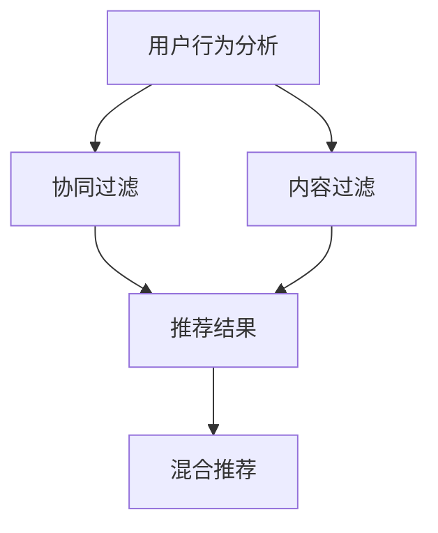

                 

# 实时推荐技术的未来发展方向

> 关键词：实时推荐、机器学习、深度学习、个性化推荐、实时数据处理、用户行为分析、协同过滤、内容过滤、混合推荐

> 摘要：随着大数据和云计算技术的迅猛发展，实时推荐系统已成为互联网和移动应用中不可或缺的一部分。本文将从实时推荐技术的核心概念、算法原理、数学模型、实际应用案例、未来发展趋势等方面进行深入探讨，旨在为读者提供一个全面而深入的理解。通过本文，读者不仅能掌握实时推荐技术的基本原理，还能了解其在实际应用中的挑战与机遇。

## 1. 背景介绍

随着互联网和移动应用的普及，用户对个性化体验的需求日益增长。实时推荐系统能够根据用户的实时行为和偏好，提供个性化的推荐内容，从而提升用户体验和满意度。实时推荐技术不仅能够提高用户留存率和转化率，还能促进用户与平台之间的互动，增强用户粘性。然而，随着数据量的激增和用户行为的复杂性，实时推荐系统面临着诸多挑战，如数据处理速度、模型训练效率、推荐准确性和实时性等。因此，研究和开发高效的实时推荐技术具有重要意义。

## 2. 核心概念与联系

### 2.1 实时推荐系统概述

实时推荐系统是一种能够根据用户的实时行为和偏好，提供个性化推荐内容的系统。其主要特点包括实时性、个性化和多样性。实时性是指系统能够快速响应用户的请求，提供实时推荐内容；个性化是指系统能够根据用户的偏好和历史行为，提供个性化的推荐内容；多样性是指系统能够提供多种类型的推荐内容，满足用户的多样化需求。

### 2.2 核心概念原理

实时推荐系统的核心概念包括用户行为分析、协同过滤、内容过滤和混合推荐。用户行为分析是指通过对用户的历史行为数据进行分析，了解用户的偏好和兴趣；协同过滤是指通过分析用户之间的相似性，为用户推荐相似用户喜欢的内容；内容过滤是指通过分析内容的特征，为用户推荐与其兴趣相符的内容；混合推荐是指结合协同过滤和内容过滤，提供更加准确和个性化的推荐内容。

### 2.3 架构流程图



## 3. 核心算法原理 & 具体操作步骤

### 3.1 协同过滤算法原理

协同过滤算法是一种基于用户相似性的推荐算法。其基本思想是，如果两个用户在历史行为上表现出相似性，那么他们对新内容的偏好也可能会相似。协同过滤算法主要包括两种类型：用户-用户协同过滤和物品-物品协同过滤。

#### 3.1.1 用户-用户协同过滤

用户-用户协同过滤是指通过分析用户之间的相似性，为用户推荐相似用户喜欢的内容。具体操作步骤如下：

1. **数据预处理**：收集用户的历史行为数据，包括用户ID、物品ID和评分。
2. **相似性计算**：计算用户之间的相似性，常用的相似性度量方法包括余弦相似度和皮尔逊相关系数。
3. **推荐生成**：根据用户之间的相似性，为用户推荐相似用户喜欢的内容。

#### 3.1.2 物品-物品协同过滤

物品-物品协同过滤是指通过分析物品之间的相似性，为用户推荐相似物品。具体操作步骤如下：

1. **数据预处理**：收集用户的历史行为数据，包括用户ID、物品ID和评分。
2. **相似性计算**：计算物品之间的相似性，常用的相似性度量方法包括余弦相似度和皮尔逊相关系数。
3. **推荐生成**：根据物品之间的相似性，为用户推荐相似物品。

### 3.2 内容过滤算法原理

内容过滤算法是一种基于内容特征的推荐算法。其基本思想是，通过分析内容的特征，为用户推荐与其兴趣相符的内容。具体操作步骤如下：

1. **数据预处理**：收集内容的特征数据，包括内容ID、特征向量和标签。
2. **特征提取**：提取内容的特征向量，常用的特征提取方法包括TF-IDF和词袋模型。
3. **推荐生成**：根据内容的特征向量，为用户推荐与其兴趣相符的内容。

### 3.3 混合推荐算法原理

混合推荐算法是一种结合协同过滤和内容过滤的推荐算法。其基本思想是，通过结合协同过滤和内容过滤，提供更加准确和个性化的推荐内容。具体操作步骤如下：

1. **数据预处理**：收集用户的历史行为数据和内容的特征数据。
2. **特征提取**：提取内容的特征向量，常用的特征提取方法包括TF-IDF和词袋模型。
3. **相似性计算**：计算用户之间的相似性和物品之间的相似性。
4. **推荐生成**：结合协同过滤和内容过滤，为用户推荐更加准确和个性化的推荐内容。

## 4. 数学模型和公式 & 详细讲解 & 举例说明

### 4.1 协同过滤数学模型

协同过滤数学模型主要包括用户-用户协同过滤和物品-物品协同过滤。

#### 4.1.1 用户-用户协同过滤

用户-用户协同过滤的数学模型可以表示为：

$$
\hat{r}_{ui} = \frac{\sum_{j \in N_i} \frac{r_{uj} - \mu_u}{|N_i|}}{\sum_{j \in N_i} \frac{1}{|N_i|}}
$$

其中，$\hat{r}_{ui}$ 表示用户 $u$ 对物品 $i$ 的预测评分，$r_{uj}$ 表示用户 $u$ 对物品 $j$ 的实际评分，$\mu_u$ 表示用户 $u$ 的平均评分，$N_i$ 表示与物品 $i$ 相似的物品集合。

#### 4.1.2 物品-物品协同过滤

物品-物品协同过滤的数学模型可以表示为：

$$
\hat{r}_{ui} = \frac{\sum_{j \in N_i} \frac{r_{uj} - \mu_i}{|N_i|}}{\sum_{j \in N_i} \frac{1}{|N_i|}}
$$

其中，$\hat{r}_{ui}$ 表示用户 $u$ 对物品 $i$ 的预测评分，$r_{uj}$ 表示用户 $u$ 对物品 $j$ 的实际评分，$\mu_i$ 表示物品 $i$ 的平均评分，$N_i$ 表示与物品 $i$ 相似的物品集合。

### 4.2 内容过滤数学模型

内容过滤数学模型主要包括基于内容特征的推荐算法。

#### 4.2.1 基于内容特征的推荐算法

基于内容特征的推荐算法的数学模型可以表示为：

$$
\hat{r}_{ui} = \frac{\sum_{j \in N_i} \frac{c_{uj} \cdot c_{ij}}{\|c_{uj}\| \cdot \|c_{ij}\|}}{\sum_{j \in N_i} \frac{1}{\|c_{uj}\| \cdot \|c_{ij}\|}}
$$

其中，$\hat{r}_{ui}$ 表示用户 $u$ 对物品 $i$ 的预测评分，$c_{uj}$ 表示用户 $u$ 喜欢的内容特征向量，$c_{ij}$ 表示物品 $i$ 的内容特征向量，$\|c_{uj}\|$ 和 $\|c_{ij}\|$ 分别表示内容特征向量的范数。

### 4.3 混合推荐数学模型

混合推荐数学模型主要包括结合协同过滤和内容过滤的推荐算法。

#### 4.3.1 结合协同过滤和内容过滤的推荐算法

结合协同过滤和内容过滤的推荐算法的数学模型可以表示为：

$$
\hat{r}_{ui} = \alpha \cdot \frac{\sum_{j \in N_i} \frac{r_{uj} - \mu_u}{|N_i|}}{\sum_{j \in N_i} \frac{1}{|N_i|}} + (1 - \alpha) \cdot \frac{\sum_{j \in N_i} \frac{c_{uj} \cdot c_{ij}}{\|c_{uj}\| \cdot \|c_{ij}\|}}{\sum_{j \in N_i} \frac{1}{\|c_{uj}\| \cdot \|c_{ij}\|}}
$$

其中，$\hat{r}_{ui}$ 表示用户 $u$ 对物品 $i$ 的预测评分，$r_{uj}$ 表示用户 $u$ 对物品 $j$ 的实际评分，$\mu_u$ 表示用户 $u$ 的平均评分，$N_i$ 表示与物品 $i$ 相似的物品集合，$c_{uj}$ 表示用户 $u$ 喜欢的内容特征向量，$c_{ij}$ 表示物品 $i$ 的内容特征向量，$\|c_{uj}\|$ 和 $\|c_{ij}\|$ 分别表示内容特征向量的范数，$\alpha$ 表示协同过滤和内容过滤的权重。

## 5. 项目实战：代码实际案例和详细解释说明

### 5.1 开发环境搭建

为了实现实时推荐系统，我们需要搭建一个开发环境。具体步骤如下：

1. **安装Python**：确保安装了Python 3.7及以上版本。
2. **安装依赖库**：安装必要的依赖库，如NumPy、Pandas、Scikit-learn等。
3. **配置数据源**：配置数据源，如MySQL、MongoDB等。
4. **配置实时数据处理框架**：配置实时数据处理框架，如Apache Flink、Spark Streaming等。

### 5.2 源代码详细实现和代码解读

以下是一个简单的实时推荐系统的实现代码示例：

```python
import numpy as np
import pandas as pd
from sklearn.metrics.pairwise import cosine_similarity
from sklearn.preprocessing import StandardScaler

# 1. 数据预处理
def preprocess_data(data):
    # 数据清洗和预处理
    data = data.dropna()
    return data

# 2. 用户-用户协同过滤
def user_based_collaborative_filtering(data, user_id, item_id, k=5):
    # 计算用户之间的相似性
    user_similarity = cosine_similarity(data)
    # 获取用户相似性矩阵
    user_similarity_matrix = pd.DataFrame(user_similarity, index=data.index, columns=data.index)
    # 获取用户相似性矩阵中用户ID的索引
    user_index = user_similarity_matrix.index.get_loc(user_id)
    # 获取与用户ID相似的前k个用户
    similar_users = user_similarity_matrix.iloc[user_index].nlargest(k).index
    # 获取相似用户的评分
    similar_users_ratings = data.loc[similar_users, item_id]
    # 计算推荐评分
    predicted_rating = similar_users_ratings.mean()
    return predicted_rating

# 3. 物品-物品协同过滤
def item_based_collaborative_filtering(data, user_id, item_id, k=5):
    # 计算物品之间的相似性
    item_similarity = cosine_similarity(data.T)
    # 获取物品相似性矩阵
    item_similarity_matrix = pd.DataFrame(item_similarity, index=data.columns, columns=data.columns)
    # 获取物品相似性矩阵中物品ID的索引
    item_index = item_similarity_matrix.columns.get_loc(item_id)
    # 获取与物品ID相似的前k个物品
    similar_items = item_similarity_matrix.iloc[item_index].nlargest(k).index
    # 获取相似物品的评分
    similar_items_ratings = data.loc[user_id, similar_items]
    # 计算推荐评分
    predicted_rating = similar_items_ratings.mean()
    return predicted_rating

# 4. 内容过滤
def content_based_filtering(data, user_id, item_id, k=5):
    # 提取内容特征向量
    scaler = StandardScaler()
    data_scaled = scaler.fit_transform(data)
    # 计算内容相似性
    content_similarity = cosine_similarity(data_scaled)
    # 获取内容相似性矩阵
    content_similarity_matrix = pd.DataFrame(content_similarity, index=data.columns, columns=data.columns)
    # 获取内容相似性矩阵中物品ID的索引
    item_index = content_similarity_matrix.columns.get_loc(item_id)
    # 获取与物品ID相似的前k个物品
    similar_items = content_similarity_matrix.iloc[item_index].nlargest(k).index
    # 获取相似物品的评分
    similar_items_ratings = data.loc[user_id, similar_items]
    # 计算推荐评分
    predicted_rating = similar_items_ratings.mean()
    return predicted_rating

# 5. 混合推荐
def hybrid_recommendation(data, user_id, item_id, k=5, alpha=0.5):
    # 计算用户-用户协同过滤推荐评分
    user_based_rating = user_based_collaborative_filtering(data, user_id, item_id, k)
    # 计算物品-物品协同过滤推荐评分
    item_based_rating = item_based_collaborative_filtering(data, user_id, item_id, k)
    # 计算内容过滤推荐评分
    content_based_rating = content_based_filtering(data, user_id, item_id, k)
    # 结合协同过滤和内容过滤推荐评分
    hybrid_rating = alpha * user_based_rating + (1 - alpha) * content_based_rating
    return hybrid_rating

# 6. 主函数
def main():
    # 读取数据
    data = pd.read_csv('data.csv')
    # 数据预处理
    data = preprocess_data(data)
    # 获取用户ID和物品ID
    user_id = 'user1'
    item_id = 'item1'
    # 计算推荐评分
    hybrid_rating = hybrid_recommendation(data, user_id, item_id)
    print(f'推荐评分：{hybrid_rating}')

if __name__ == '__main__':
    main()
```

### 5.3 代码解读与分析

以上代码实现了一个简单的实时推荐系统。具体步骤如下：

1. **数据预处理**：读取数据并进行清洗和预处理。
2. **用户-用户协同过滤**：计算用户之间的相似性，获取与用户ID相似的前k个用户，计算推荐评分。
3. **物品-物品协同过滤**：计算物品之间的相似性，获取与物品ID相似的前k个物品，计算推荐评分。
4. **内容过滤**：提取内容特征向量，计算内容相似性，获取与物品ID相似的前k个物品，计算推荐评分。
5. **混合推荐**：结合协同过滤和内容过滤，计算推荐评分。
6. **主函数**：读取数据，进行数据预处理，计算推荐评分并输出结果。

## 6. 实际应用场景

实时推荐系统在实际应用中具有广泛的应用场景，如电商推荐、新闻推荐、视频推荐、音乐推荐等。以下是一些具体的应用场景：

### 6.1 电商推荐

电商推荐系统可以根据用户的购物历史和浏览行为，为用户推荐相关商品。例如，用户在浏览商品页面时，系统可以根据用户的浏览历史和购物历史，推荐用户可能感兴趣的商品。

### 6.2 新闻推荐

新闻推荐系统可以根据用户的阅读历史和兴趣偏好，为用户推荐相关新闻。例如，用户在浏览新闻页面时，系统可以根据用户的阅读历史和兴趣偏好，推荐用户可能感兴趣的文章。

### 6.3 视频推荐

视频推荐系统可以根据用户的观看历史和兴趣偏好，为用户推荐相关视频。例如，用户在浏览视频页面时，系统可以根据用户的观看历史和兴趣偏好，推荐用户可能感兴趣的视频。

### 6.4 音乐推荐

音乐推荐系统可以根据用户的听歌历史和兴趣偏好，为用户推荐相关歌曲。例如，用户在浏览音乐页面时，系统可以根据用户的听歌历史和兴趣偏好，推荐用户可能感兴趣的歌曲。

## 7. 工具和资源推荐

### 7.1 学习资源推荐

1. **书籍**：《推荐系统实践》、《推荐系统：原理与实践》、《推荐系统：从入门到精通》
2. **论文**：《基于协同过滤的推荐系统》、《基于内容过滤的推荐系统》、《混合推荐系统的优化方法》
3. **博客**：《推荐系统入门》、《推荐系统实战》、《推荐系统进阶》
4. **网站**：Kaggle、GitHub、Stack Overflow

### 7.2 开发工具框架推荐

1. **Python库**：Scikit-learn、NumPy、Pandas
2. **实时数据处理框架**：Apache Flink、Spark Streaming
3. **数据库**：MySQL、MongoDB

### 7.3 相关论文著作推荐

1. **论文**：《基于协同过滤的推荐系统》、《基于内容过滤的推荐系统》、《混合推荐系统的优化方法》
2. **著作**：《推荐系统实践》、《推荐系统：原理与实践》、《推荐系统：从入门到精通》

## 8. 总结：未来发展趋势与挑战

实时推荐技术在未来的发展中将面临诸多挑战，如数据处理速度、模型训练效率、推荐准确性和实时性等。为了应对这些挑战，我们需要不断优化算法和模型，提高推荐系统的性能和效果。未来的发展趋势主要包括以下几个方面：

1. **深度学习**：深度学习技术在推荐系统中的应用将更加广泛，通过深度学习模型可以更好地捕捉用户行为和偏好，提高推荐准确性和实时性。
2. **实时数据处理**：实时数据处理技术的发展将使得推荐系统能够更快地响应用户的请求，提供实时推荐内容。
3. **个性化推荐**：个性化推荐技术的发展将使得推荐系统能够更好地满足用户的个性化需求，提高用户体验和满意度。
4. **协同过滤和内容过滤的结合**：协同过滤和内容过滤的结合将使得推荐系统能够提供更加准确和个性化的推荐内容。

## 9. 附录：常见问题与解答

### 9.1 问题1：如何提高推荐系统的推荐准确性和实时性？

**解答**：可以通过优化算法和模型，提高推荐系统的性能和效果。具体方法包括：使用深度学习模型，提高推荐准确性和实时性；使用实时数据处理技术，提高推荐系统的实时性；结合协同过滤和内容过滤，提高推荐系统的推荐准确性和实时性。

### 9.2 问题2：如何处理大规模数据？

**解答**：可以通过分布式计算和并行计算技术，处理大规模数据。具体方法包括：使用分布式计算框架，如Apache Flink、Spark Streaming等，提高数据处理速度；使用并行计算技术，提高数据处理效率。

### 9.3 问题3：如何提高推荐系统的用户体验？

**解答**：可以通过优化推荐算法和模型，提高推荐系统的性能和效果。具体方法包括：使用深度学习模型，提高推荐准确性和实时性；结合协同过滤和内容过滤，提高推荐系统的推荐准确性和实时性；优化推荐系统的用户界面和交互设计，提高用户体验。

## 10. 扩展阅读 & 参考资料

1. **书籍**：《推荐系统实践》、《推荐系统：原理与实践》、《推荐系统：从入门到精通》
2. **论文**：《基于协同过滤的推荐系统》、《基于内容过滤的推荐系统》、《混合推荐系统的优化方法》
3. **博客**：《推荐系统入门》、《推荐系统实战》、《推荐系统进阶》
4. **网站**：Kaggle、GitHub、Stack Overflow

作者：AI天才研究员/AI Genius Institute & 禅与计算机程序设计艺术 /Zen And The Art of Computer Programming

