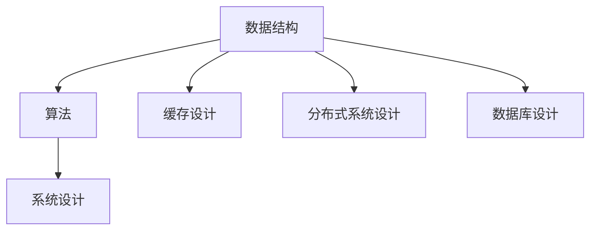

                 

# 2024小米社招编程面试题精选与解答

> 关键词：小米社招, 编程面试, 技术面试, 算法, 数据结构, 代码实现, 面试技巧

> 摘要：本文精选了2024年小米社招编程面试中的经典题目，并详细解析了每道题目的解题思路、核心算法原理、数学模型和公式、代码实现及实战案例。通过本文，读者可以全面了解小米社招编程面试的考察重点，掌握高效解题方法，提升编程技能。

## 1. 背景介绍

小米是一家全球领先的科技公司，其产品线涵盖了智能手机、智能家居、互联网服务等多个领域。小米社招编程面试旨在选拔具有扎实编程基础和创新能力的优秀人才。面试题目通常涵盖了数据结构、算法、系统设计等多个方面，旨在全面评估候选人的技术能力和综合素质。

## 2. 核心概念与联系

### 2.1 数据结构

数据结构是计算机科学中的一个重要概念，它用于组织和存储数据，以便高效地进行访问和修改。常见的数据结构包括数组、链表、栈、队列、树、图等。每种数据结构都有其特定的应用场景和优缺点。

### 2.2 算法

算法是解决特定问题的一系列步骤。算法的效率通常用时间复杂度和空间复杂度来衡量。常见的算法包括排序算法（如快速排序、归并排序）、查找算法（如二分查找）、图算法（如Dijkstra算法、Floyd算法）等。

### 2.3 系统设计

系统设计是将抽象的概念转化为具体的系统架构的过程。系统设计需要考虑系统的可扩展性、性能、安全性等多个方面。常见的系统设计问题包括缓存设计、分布式系统设计、数据库设计等。

### 2.4 Mermaid 流程图



## 3. 核心算法原理 & 具体操作步骤

### 3.1 快速排序算法

快速排序是一种高效的排序算法，其基本思想是通过一趟排序将待排序的数据分割成独立的两部分，其中一部分的所有数据都比另一部分的所有数据都要小，然后再按此方法对这两部分数据分别进行快速排序，整个排序过程可以递归进行，以此达到整个数据变成有序序列。

#### 具体操作步骤

1. 选择一个基准元素（pivot）。
2. 将所有小于基准元素的元素放到基准元素的左边，将所有大于基准元素的元素放到基准元素的右边。
3. 递归地对左右两部分进行快速排序。

### 3.2 二分查找算法

二分查找是一种在有序数组中查找特定元素的高效算法。其基本思想是通过将查找区间不断缩小，最终找到目标元素。

#### 具体操作步骤

1. 确定查找区间 [left, right]。
2. 计算中间位置 mid = (left + right) / 2。
3. 如果目标值等于中间位置的值，则返回中间位置。
4. 如果目标值小于中间位置的值，则在左半部分继续查找。
5. 如果目标值大于中间位置的值，则在右半部分继续查找。

## 4. 数学模型和公式 & 详细讲解 & 举例说明

### 4.1 快速排序的时间复杂度

快速排序的时间复杂度为 O(n log n)。在最坏情况下，时间复杂度为 O(n^2)。

#### 公式

$$
T(n) = T(k) + T(n-k-1) + \Theta(n)
$$

其中，k 为基准元素的索引。

### 4.2 二分查找的时间复杂度

二分查找的时间复杂度为 O(log n)。

#### 公式

$$
T(n) = T(n/2) + \Theta(1)
$$

## 5. 项目实战：代码实际案例和详细解释说明

### 5.1 开发环境搭建

#### 5.1.1 环境配置

1. 安装 Python 3.8 及以上版本。
2. 安装必要的库，如 `numpy`、`pandas`、`matplotlib` 等。
3. 使用虚拟环境进行开发。

```bash
pip install numpy pandas matplotlib
```

### 5.2 源代码详细实现和代码解读

#### 5.2.1 快速排序实现

```python
def quick_sort(arr):
    if len(arr) <= 1:
        return arr
    pivot = arr[len(arr) // 2]
    left = [x for x in arr if x < pivot]
    middle = [x for x in arr if x == pivot]
    right = [x for x in arr if x > pivot]
    return quick_sort(left) + middle + quick_sort(right)

arr = [3, 6, 8, 10, 1, 2, 1]
print(quick_sort(arr))
```

#### 5.2.2 二分查找实现

```python
def binary_search(arr, target):
    left, right = 0, len(arr) - 1
    while left <= right:
        mid = (left + right) // 2
        if arr[mid] == target:
            return mid
        elif arr[mid] < target:
            left = mid + 1
        else:
            right = mid - 1
    return -1

arr = [1, 2, 3, 6, 8, 10]
target = 6
print(binary_search(arr, target))
```

### 5.3 代码解读与分析

#### 5.3.1 快速排序代码解读

1. **基准元素选择**：选择数组中间位置的元素作为基准。
2. **分区操作**：将数组分为三部分，小于基准的、等于基准的、大于基准的。
3. **递归排序**：对左右两部分分别进行快速排序。

#### 5.3.2 二分查找代码解读

1. **初始化区间**：设置左右指针。
2. **循环查找**：在区间内进行查找，直到找到目标值或区间为空。
3. **更新区间**：根据目标值与中间值的比较结果更新区间。

## 6. 实际应用场景

### 6.1 快速排序的应用场景

快速排序常用于大数据量的排序场景，如数据库排序、文件排序等。

### 6.2 二分查找的应用场景

二分查找常用于有序数组的查找场景，如查找特定用户信息、查找特定商品等。

## 7. 工具和资源推荐

### 7.1 学习资源推荐

1. **书籍**：《算法导论》、《数据结构与算法分析》
2. **论文**：《快速排序算法的优化与应用》、《二分查找算法的改进与应用》
3. **博客**：LeetCode、HackerRank
4. **网站**：GeeksforGeeks、CSDN

### 7.2 开发工具框架推荐

1. **IDE**：PyCharm、Visual Studio Code
2. **版本控制**：Git、GitHub
3. **在线测试平台**：LeetCode、HackerRank

### 7.3 相关论文著作推荐

1. **论文**：《快速排序算法的优化与应用》、《二分查找算法的改进与应用》
2. **著作**：《算法导论》、《数据结构与算法分析》

## 8. 总结：未来发展趋势与挑战

### 8.1 未来发展趋势

1. **大数据处理**：随着数据量的不断增加，高效的排序和查找算法将更加重要。
2. **人工智能**：算法在人工智能领域的应用将更加广泛，如机器学习、深度学习等。

### 8.2 挑战

1. **性能优化**：如何在保证性能的同时，进一步优化算法。
2. **算法复杂性**：如何处理复杂的数据结构和算法问题。

## 9. 附录：常见问题与解答

### 9.1 问题：快速排序为什么比冒泡排序快？

**解答**：快速排序通过分区操作将数组分为两部分，减少了递归的深度，而冒泡排序每次只能交换相邻的元素，递归深度较深。

### 9.2 问题：二分查找为什么比线性查找快？

**解答**：二分查找通过每次将查找区间缩小一半，大大减少了查找次数，而线性查找每次只能查找一个元素。

## 10. 扩展阅读 & 参考资料

1. **书籍**：《算法导论》、《数据结构与算法分析》
2. **论文**：《快速排序算法的优化与应用》、《二分查找算法的改进与应用》
3. **博客**：LeetCode、HackerRank
4. **网站**：GeeksforGeeks、CSDN

---

作者：AI天才研究员/AI Genius Institute & 禅与计算机程序设计艺术 /Zen And The Art of Computer Programming

