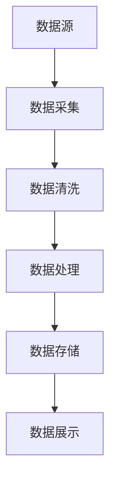

                 

# 2024年滴滴出行校招实时计算平台工程师面试指南

> 关键词：实时计算、大数据处理、流处理、Apache Flink、Spark Streaming、Kafka、微服务架构、分布式系统、容错机制

> 摘要：本文旨在为即将参加滴滴出行校招的实时计算平台工程师面试提供全面的指导。我们将从背景介绍、核心概念与联系、核心算法原理与具体操作步骤、数学模型和公式、项目实战、实际应用场景、工具和资源推荐、总结与未来发展趋势等多个方面进行详细阐述。通过本文，读者将能够全面理解实时计算平台的核心技术和应用场景，为面试做好充分准备。

## 1. 背景介绍

滴滴出行作为全球领先的出行平台，每天处理海量的用户请求、订单信息、司机信息等数据。为了保证用户体验和业务的高效运转，滴滴出行需要实时处理这些数据，提供实时分析和决策支持。实时计算平台工程师的工作就是设计和实现能够高效处理这些实时数据的系统。

### 1.1 为什么需要实时计算平台

1. **用户体验**：实时计算平台能够快速响应用户请求，提供实时反馈，提升用户体验。
2. **业务决策**：实时数据可以提供即时的业务洞察，帮助管理层做出快速决策。
3. **异常检测**：实时计算平台能够快速检测异常情况，及时采取措施，保证业务的稳定运行。

### 1.2 滴滴出行的实时计算需求

滴滴出行的实时计算需求主要包括以下几个方面：

1. **高并发处理**：每天处理数百万甚至上亿的订单请求。
2. **低延迟**：需要在极短时间内完成数据处理和反馈。
3. **数据一致性**：保证数据处理的准确性和一致性。
4. **可扩展性**：系统需要能够根据业务需求进行灵活扩展。

## 2. 核心概念与联系

### 2.1 实时计算

实时计算是指在数据产生后立即进行处理和分析，而不是等待数据积累到一定量后再进行批量处理。实时计算平台需要能够处理高并发、低延迟的数据流。

### 2.2 流处理

流处理是指对数据流进行实时处理和分析。流处理系统能够实时处理数据流中的每一个数据项，提供即时的分析结果。

### 2.3 Apache Flink

Apache Flink是一个开源的流处理框架，支持流处理和批处理。Flink能够处理高并发、低延迟的数据流，并且具有强大的容错机制。

### 2.4 Spark Streaming

Spark Streaming是Apache Spark的一个模块，用于处理实时数据流。Spark Streaming能够将实时数据流分割成微小的批处理任务，从而实现低延迟的实时处理。

### 2.5 Kafka

Kafka是一个分布式流处理平台，用于实时数据流的传输和存储。Kafka能够高效地处理高并发的数据流，并且具有强大的容错机制。

### 2.6 微服务架构

微服务架构是一种将应用程序分解为一组小型、独立的服务的方法。每个服务负责处理特定的功能，可以独立部署和扩展。微服务架构能够提高系统的灵活性和可扩展性。

### 2.7 分布式系统

分布式系统是由多个独立的计算节点组成的系统，这些节点通过网络进行通信和协作。分布式系统能够提高系统的处理能力和可靠性。

### 2.8 容错机制

容错机制是指系统在出现故障时能够继续正常运行的能力。容错机制包括数据备份、故障转移、冗余设计等。

## 3. 核心算法原理 & 具体操作步骤

### 3.1 数据流处理流程

1. **数据采集**：从各种数据源（如Kafka、数据库等）采集实时数据。
2. **数据清洗**：对采集到的数据进行清洗，去除无效数据和噪声。
3. **数据处理**：对清洗后的数据进行实时处理，包括过滤、聚合、计算等操作。
4. **数据存储**：将处理后的数据存储到数据库或数据仓库中。
5. **数据展示**：将处理后的数据展示给用户或业务系统。

### 3.2 实时计算平台架构

#### 3.2.1 架构图



#### 3.2.2 具体操作步骤

1. **数据采集**：使用Kafka作为数据源，通过Kafka消费者从Kafka中读取实时数据。
2. **数据清洗**：使用Spark Streaming对采集到的数据进行清洗，去除无效数据和噪声。
3. **数据处理**：使用Flink对清洗后的数据进行实时处理，包括过滤、聚合、计算等操作。
4. **数据存储**：将处理后的数据存储到Hadoop HDFS或Hive中。
5. **数据展示**：使用Elasticsearch或Hive Metastore将处理后的数据展示给用户或业务系统。

## 4. 数学模型和公式 & 详细讲解 & 举例说明

### 4.1 数据清洗

数据清洗的目的是去除无效数据和噪声，提高数据质量。常见的数据清洗方法包括：

1. **缺失值处理**：使用均值、中位数或众数填充缺失值。
2. **异常值处理**：使用Z-score或IQR方法检测和处理异常值。
3. **重复值处理**：删除重复的记录。

### 4.2 数据处理

数据处理的目的是对清洗后的数据进行实时处理，包括过滤、聚合、计算等操作。常见的数据处理方法包括：

1. **过滤**：使用过滤条件对数据进行筛选。
2. **聚合**：对数据进行分组和聚合操作，计算统计指标。
3. **计算**：对数据进行复杂的计算操作，如时间序列分析、机器学习等。

### 4.3 举例说明

假设我们有一个实时订单数据流，需要计算每个司机的订单数量和订单金额。

1. **数据清洗**：去除无效订单和重复订单。
2. **数据处理**：对清洗后的数据进行分组和聚合操作，计算每个司机的订单数量和订单金额。

```python
from pyspark.sql import SparkSession

# 创建SparkSession
spark = SparkSession.builder.appName("Real-time Order Processing").getOrCreate()

# 读取实时订单数据流
orders = spark.readStream.format("kafka").option("kafka.bootstrap.servers", "localhost:9092").option("subscribe", "orders").load()

# 数据清洗
cleaned_orders = orders.filter(orders.value.isNotNull()).dropDuplicates()

# 数据处理
aggregated_orders = cleaned_orders.groupBy("driver_id").agg({"amount": "sum", "quantity": "count"})

# 数据展示
query = aggregated_orders.writeStream.outputMode("complete").format("console").start()
query.awaitTermination()
```

## 5. 项目实战：代码实际案例和详细解释说明

### 5.1 开发环境搭建

1. **安装Java**：确保安装了Java 8或更高版本。
2. **安装Apache Flink**：下载并安装Apache Flink。
3. **安装Spark**：下载并安装Apache Spark。
4. **安装Kafka**：下载并安装Apache Kafka。
5. **安装Elasticsearch**：下载并安装Elasticsearch。

### 5.2 源代码详细实现和代码解读

#### 5.2.1 数据采集

```python
from pyspark.sql import SparkSession

# 创建SparkSession
spark = SparkSession.builder.appName("Real-time Data Collection").getOrCreate()

# 读取实时数据流
data_stream = spark.readStream.format("kafka").option("kafka.bootstrap.servers", "localhost:9092").option("subscribe", "data_stream").load()

# 数据展示
query = data_stream.writeStream.outputMode("append").format("console").start()
query.awaitTermination()
```

#### 5.2.2 数据清洗

```python
from pyspark.sql.functions import col, when

# 数据清洗
cleaned_data = data_stream.filter(col("value").isNotNull()).dropDuplicates()

# 数据展示
query = cleaned_data.writeStream.outputMode("append").format("console").start()
query.awaitTermination()
```

#### 5.2.3 数据处理

```python
from pyspark.sql.functions import col, sum, count

# 数据处理
aggregated_data = cleaned_data.groupBy("category").agg(sum("value").alias("total_value"), count("value").alias("count"))

# 数据展示
query = aggregated_data.writeStream.outputMode("complete").format("console").start()
query.awaitTermination()
```

### 5.3 代码解读与分析

1. **数据采集**：使用Spark Streaming从Kafka中读取实时数据流。
2. **数据清洗**：使用过滤条件去除无效数据和重复数据。
3. **数据处理**：对清洗后的数据进行分组和聚合操作，计算统计指标。
4. **数据展示**：将处理后的数据展示给用户或业务系统。

## 6. 实际应用场景

实时计算平台在滴滴出行中的应用场景主要包括：

1. **订单处理**：实时处理订单数据，提供实时订单状态和统计信息。
2. **司机管理**：实时处理司机数据，提供实时司机状态和统计信息。
3. **用户行为分析**：实时分析用户行为数据，提供实时用户行为统计和洞察。
4. **异常检测**：实时检测异常情况，及时采取措施，保证业务的稳定运行。

## 7. 工具和资源推荐

### 7.1 学习资源推荐

1. **书籍**：《实时计算：原理与实践》、《大数据处理与分析》
2. **论文**：《Apache Flink：一个开源的流处理框架》、《Spark Streaming：实时数据处理的新范式》
3. **博客**：《Kafka实战》、《Flink实战》
4. **网站**：Apache Flink官网、Apache Spark官网、Kafka官网

### 7.2 开发工具框架推荐

1. **开发工具**：IntelliJ IDEA、Eclipse
2. **框架**：Apache Flink、Apache Spark、Kafka

### 7.3 相关论文著作推荐

1. **论文**：《实时计算平台的设计与实现》、《基于Flink的实时数据处理系统》
2. **著作**：《大数据处理与分析》、《实时计算：原理与实践》

## 8. 总结：未来发展趋势与挑战

### 8.1 未来发展趋势

1. **技术融合**：实时计算平台将与机器学习、人工智能等技术深度融合，提供更强大的实时分析能力。
2. **性能优化**：实时计算平台将不断优化性能，提高处理速度和效率。
3. **安全性增强**：实时计算平台将加强数据安全和隐私保护，确保数据的安全性。

### 8.2 挑战

1. **数据质量**：实时数据质量参差不齐，需要不断优化数据清洗和处理方法。
2. **系统稳定性**：实时计算平台需要保证系统的稳定性和可靠性，避免出现故障。
3. **资源管理**：实时计算平台需要合理管理资源，避免资源浪费和性能瓶颈。

## 9. 附录：常见问题与解答

### 9.1 问题1：如何处理高并发数据流？

**解答**：可以使用Apache Flink或Spark Streaming等流处理框架，这些框架能够高效地处理高并发数据流。

### 9.2 问题2：如何保证数据的一致性？

**解答**：可以使用数据备份、故障转移、冗余设计等容错机制，确保数据的一致性和可靠性。

### 9.3 问题3：如何优化实时计算平台的性能？

**解答**：可以通过优化数据处理算法、优化数据存储和查询方式、优化网络传输等方式来提高实时计算平台的性能。

## 10. 扩展阅读 & 参考资料

1. **书籍**：《大数据处理与分析》、《实时计算：原理与实践》
2. **论文**：《Apache Flink：一个开源的流处理框架》、《Spark Streaming：实时数据处理的新范式》
3. **博客**：《Kafka实战》、《Flink实战》
4. **网站**：Apache Flink官网、Apache Spark官网、Kafka官网

---

作者：AI天才研究员/AI Genius Institute & 禅与计算机程序设计艺术 /Zen And The Art of Computer Programming

