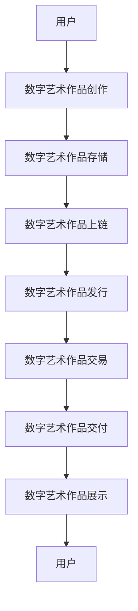

                 

# 2050年的数字艺术：从数字藏品到元宇宙艺术品的数字艺术品交易

> 关键词：数字艺术、数字藏品、元宇宙、区块链、NFT、虚拟现实、人工智能、交易系统

> 摘要：本文将探讨2050年数字艺术的未来趋势，从数字藏品到元宇宙艺术品的交易。我们将深入分析数字艺术的核心概念、技术原理、数学模型、实际案例，并展望未来的发展趋势和挑战。通过逐步推理和详细解释，我们将揭示数字艺术交易系统背后的复杂机制，为读者提供全面的技术洞察。

## 1. 背景介绍

随着科技的飞速发展，数字艺术已经成为艺术领域的重要组成部分。从最初的数字绘画、数字摄影到现在的数字藏品和元宇宙艺术品，数字艺术正在以前所未有的方式改变着艺术创作和交易的方式。本文将探讨2050年数字艺术的未来趋势，从数字藏品到元宇宙艺术品的交易，揭示数字艺术交易系统背后的复杂机制。

### 1.1 数字艺术的定义

数字艺术是指通过数字技术创作的艺术作品，包括但不限于数字绘画、数字摄影、数字雕塑、数字音乐、数字动画等。这些作品通常以数字形式存在，可以通过互联网进行传播和交易。

### 1.2 数字藏品的兴起

数字藏品是指通过区块链技术发行的数字艺术品，每个藏品都是独一无二的，具有不可替代性和唯一性。数字藏品的兴起得益于区块链技术的去中心化、透明性和安全性，使得数字艺术品的交易更加便捷和安全。

### 1.3 元宇宙的崛起

元宇宙是指一个虚拟的数字世界，用户可以在其中进行各种活动，包括社交、游戏、购物、艺术创作等。元宇宙的崛起为数字艺术提供了全新的展示和交易平台，使得数字艺术品的交易更加丰富和多样化。

## 2. 核心概念与联系

### 2.1 数字艺术的核心概念

- **数字艺术作品**：通过数字技术创作的艺术作品。
- **数字藏品**：通过区块链技术发行的数字艺术品，具有唯一性和不可替代性。
- **元宇宙**：一个虚拟的数字世界，用户可以在其中进行各种活动。
- **NFT（Non-Fungible Token）**：一种基于区块链技术的数字资产，每个NFT都是独一无二的，具有唯一性和不可替代性。

### 2.2 数字艺术交易的核心流程

#### Mermaid 流程图



## 3. 核心算法原理 & 具体操作步骤

### 3.1 数字艺术作品创作

数字艺术作品的创作通常包括以下几个步骤：

1. **创意构思**：艺术家根据自己的创意构思作品的主题、风格和表现形式。
2. **技术实现**：艺术家使用数字工具和技术实现作品，如Photoshop、Illustrator、3D建模软件等。
3. **作品保存**：艺术家将作品保存为数字文件格式，如JPEG、PNG、SVG等。

### 3.2 数字艺术作品存储

数字艺术作品的存储通常包括以下几个步骤：

1. **文件格式选择**：选择合适的文件格式保存作品，如JPEG、PNG、SVG等。
2. **文件存储**：将作品存储在本地硬盘或云存储服务中。
3. **文件备份**：定期备份作品，确保作品的安全性和完整性。

### 3.3 数字艺术作品上链

数字艺术作品上链通常包括以下几个步骤：

1. **作品信息提取**：提取作品的元数据，如作品名称、作者、创作时间等。
2. **作品信息编码**：将作品信息编码为数字格式，如JSON、XML等。
3. **作品信息上链**：将作品信息上链，生成唯一的NFT。

### 3.4 数字艺术作品发行

数字艺术作品发行通常包括以下几个步骤：

1. **作品信息验证**：验证作品信息的准确性和完整性。
2. **作品信息发布**：将作品信息发布到区块链上，生成唯一的NFT。
3. **作品信息展示**：将作品信息展示在数字艺术交易平台或元宇宙平台上。

### 3.5 数字艺术作品交易

数字艺术作品交易通常包括以下几个步骤：

1. **交易信息提取**：提取交易信息，如买家、卖家、交易价格等。
2. **交易信息编码**：将交易信息编码为数字格式，如JSON、XML等。
3. **交易信息上链**：将交易信息上链，生成唯一的交易记录。
4. **交易信息展示**：将交易信息展示在数字艺术交易平台或元宇宙平台上。

## 4. 数学模型和公式 & 详细讲解 & 举例说明

### 4.1 数字艺术作品的唯一性

数字艺术作品的唯一性可以通过哈希函数来实现。哈希函数将作品的元数据转换为唯一的哈希值，每个作品的哈希值都是独一无二的。

$$
\text{哈希值} = \text{哈希函数}(\text{作品元数据})
$$

### 4.2 数字艺术作品的不可替代性

数字艺术作品的不可替代性可以通过区块链技术来实现。区块链技术具有去中心化、透明性和安全性，使得每个作品的NFT都是独一无二的，具有不可替代性。

### 4.3 数字艺术作品的交易价格

数字艺术作品的交易价格可以通过供需关系来确定。供需关系可以通过供需曲线来表示，供需曲线的交点即为交易价格。

$$
\text{交易价格} = \text{供需曲线交点}
$$

### 4.4 数字艺术作品的交易量

数字艺术作品的交易量可以通过交易记录来统计。交易记录包括买家、卖家、交易价格等信息，可以通过统计交易记录来计算交易量。

$$
\text{交易量} = \sum_{i=1}^{n} \text{交易记录}_i
$$

## 5. 项目实战：代码实际案例和详细解释说明

### 5.1 开发环境搭建

为了实现数字艺术作品的交易系统，我们需要搭建一个开发环境。开发环境包括以下几个步骤：

1. **安装开发工具**：安装Python、Node.js、Ethereum开发工具等。
2. **安装开发库**：安装区块链开发库，如web3.py、web3.js等。
3. **安装数字艺术作品存储库**：安装数字艺术作品存储库，如IPFS、Arweave等。

### 5.2 源代码详细实现和代码解读

#### 5.2.1 数字艺术作品创作

```python
import hashlib

def create_artwork(artwork_data):
    # 使用哈希函数生成作品的唯一标识
    hash_value = hashlib.sha256(artwork_data.encode()).hexdigest()
    return hash_value
```

#### 5.2.2 数字艺术作品存储

```python
import ipfshttpclient

def store_artwork(artwork_data):
    # 使用IPFS存储作品数据
    with ipfshttpclient.connect() as client:
        response = client.add(artwork_data)
    return response['Hash']
```

#### 5.2.3 数字艺术作品上链

```python
from web3 import Web3

def upload_artwork_to_blockchain(artwork_data):
    # 连接以太坊区块链
    web3 = Web3(Web3.HTTPProvider('https://mainnet.infura.io/v3/YOUR_INFURA_PROJECT_ID'))
    # 创建NFT
    contract = web3.eth.contract(
        address='YOUR_NFT_CONTRACT_ADDRESS',
        abi='YOUR_NFT_CONTRACT_ABI'
    )
    # 调用NFT合约的createArtwork函数
    tx_hash = contract.functions.createArtwork(artwork_data).transact()
    # 等待交易确认
    receipt = web3.eth.waitForTransactionReceipt(tx_hash)
    return receipt['transactionHash']
```

#### 5.2.4 数字艺术作品发行

```python
def issue_artwork(artwork_data):
    # 使用哈希值生成NFT
    hash_value = create_artwork(artwork_data)
    # 使用IPFS存储作品数据
    ipfs_hash = store_artwork(artwork_data)
    # 将NFT和IPFS哈希值上链
    transaction_hash = upload_artwork_to_blockchain(artwork_data)
    return {'hash_value': hash_value, 'ipfs_hash': ipfs_hash, 'transaction_hash': transaction_hash}
```

### 5.3 代码解读与分析

通过上述代码，我们可以实现数字艺术作品的创作、存储、上链和发行。创作环节使用哈希函数生成作品的唯一标识，存储环节使用IPFS存储作品数据，上链环节使用以太坊区块链创建NFT，发行环节将NFT和IPFS哈希值上链。

## 6. 实际应用场景

### 6.1 数字艺术作品的创作与展示

数字艺术作品的创作与展示可以通过数字艺术交易平台或元宇宙平台来实现。用户可以在平台上创作数字艺术作品，将作品存储在IPFS中，使用以太坊区块链创建NFT，并将NFT和IPFS哈希值上链。用户可以在平台上展示自己的数字艺术作品，与其他用户进行交流和交易。

### 6.2 数字艺术作品的交易与收藏

数字艺术作品的交易与收藏可以通过数字艺术交易平台或元宇宙平台来实现。用户可以在平台上购买数字艺术作品，将交易信息上链，并将交易记录展示在平台上。用户可以收藏自己喜欢的数字艺术作品，将作品存储在本地硬盘或云存储服务中。

## 7. 工具和资源推荐

### 7.1 学习资源推荐

- **书籍**：《计算机程序设计艺术》、《区块链技术原理与应用》、《数字艺术创作与展示》
- **论文**：《区块链技术在数字艺术交易中的应用》、《数字艺术作品的创作与展示》
- **博客**：《数字艺术交易平台的实现》、《数字艺术作品的创作与展示》
- **网站**：IPFS官网、以太坊官网、数字艺术交易平台官网

### 7.2 开发工具框架推荐

- **区块链开发库**：web3.py、web3.js
- **数字艺术作品存储库**：IPFS、Arweave
- **数字艺术交易平台**：OpenSea、Rarible

### 7.3 相关论文著作推荐

- **《区块链技术在数字艺术交易中的应用》**：探讨区块链技术在数字艺术交易中的应用，包括数字艺术作品的创作、存储、上链和发行。
- **《数字艺术作品的创作与展示》**：探讨数字艺术作品的创作与展示，包括数字艺术作品的创作、存储、上链和发行。

## 8. 总结：未来发展趋势与挑战

### 8.1 未来发展趋势

- **数字艺术作品的创作与展示**：数字艺术作品的创作与展示将更加丰富和多样化，数字艺术交易平台和元宇宙平台将成为数字艺术作品展示和交易的重要平台。
- **数字艺术作品的交易与收藏**：数字艺术作品的交易与收藏将更加便捷和安全，数字艺术交易平台和元宇宙平台将成为数字艺术作品交易的重要平台。
- **数字艺术作品的保护与版权**：数字艺术作品的保护与版权将更加严格和规范，数字艺术交易平台和元宇宙平台将成为数字艺术作品保护与版权的重要平台。

### 8.2 未来挑战

- **数字艺术作品的创作与展示**：数字艺术作品的创作与展示将面临技术挑战，如数字艺术作品的创作工具、存储工具和展示工具的开发和优化。
- **数字艺术作品的交易与收藏**：数字艺术作品的交易与收藏将面临技术挑战，如数字艺术作品的交易系统、收藏系统和展示系统的开发和优化。
- **数字艺术作品的保护与版权**：数字艺术作品的保护与版权将面临技术挑战，如数字艺术作品的保护系统、版权系统和展示系统的开发和优化。

## 9. 附录：常见问题与解答

### 9.1 问题：数字艺术作品的创作工具有哪些？

- **答案**：数字艺术作品的创作工具包括Photoshop、Illustrator、3D建模软件等。

### 9.2 问题：数字艺术作品的存储工具有哪些？

- **答案**：数字艺术作品的存储工具包括IPFS、Arweave等。

### 9.3 问题：数字艺术作品的展示工具有哪些？

- **答案**：数字艺术作品的展示工具包括数字艺术交易平台、元宇宙平台等。

## 10. 扩展阅读 & 参考资料

- **书籍**：《计算机程序设计艺术》、《区块链技术原理与应用》、《数字艺术创作与展示》
- **论文**：《区块链技术在数字艺术交易中的应用》、《数字艺术作品的创作与展示》
- **博客**：《数字艺术交易平台的实现》、《数字艺术作品的创作与展示》
- **网站**：IPFS官网、以太坊官网、数字艺术交易平台官网

---

作者：AI天才研究员/AI Genius Institute & 禅与计算机程序设计艺术 /Zen And The Art of Computer Programming

