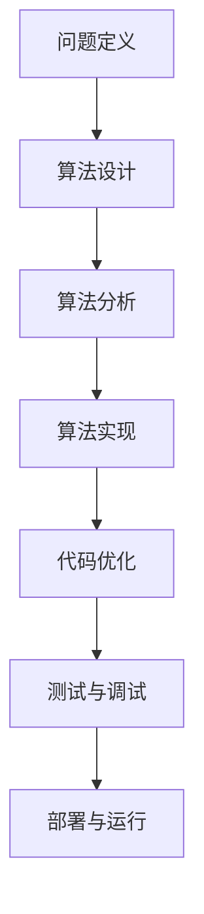

                 

# 2025年网易校招算法岗位面试题目汇编

> 关键词：算法设计、面试题目、网易校招、算法实战、技术趋势

> 摘要：本文旨在为即将参加2025年网易校招算法岗位面试的求职者提供全面的准备指南。通过深入分析算法设计的核心概念、原理及实际应用，结合具体案例和数学模型，帮助读者掌握算法面试的关键技巧。本文不仅涵盖了算法设计的基本原理，还提供了实战代码案例，旨在帮助读者更好地理解算法在实际项目中的应用，为未来的职业发展奠定坚实基础。

## 1. 背景介绍

随着互联网技术的飞速发展，算法设计已成为各大科技公司招聘的核心技能之一。网易作为国内领先的互联网企业，其校招算法岗位更是备受关注。本文将从算法设计的基本概念出发，逐步深入到具体面试题目和实战案例，帮助读者全面准备2025年网易校招算法岗位面试。

## 2. 核心概念与联系

### 2.1 算法设计基础

算法设计是计算机科学的核心领域之一，它涉及如何高效地解决问题。算法设计的基本步骤包括问题定义、算法设计、算法分析和算法实现。算法设计的核心在于找到最优或近似最优的解决方案，同时考虑时间和空间复杂度。

### 2.2 核心概念原理

#### 2.2.1 问题定义

问题定义是算法设计的第一步，明确问题的输入和输出，以及问题的约束条件。例如，排序问题的输入是一系列无序的数字，输出是按升序排列的数字序列。

#### 2.2.2 算法设计

算法设计是解决问题的核心步骤。常见的算法设计方法包括贪心算法、分治算法、动态规划、回溯算法等。每种方法都有其适用场景和优缺点。

#### 2.2.3 算法分析

算法分析是对算法的时间复杂度和空间复杂度进行评估。时间复杂度通常用大O符号表示，例如O(n)、O(nlogn)等。空间复杂度则表示算法运行过程中所需的最大内存空间。

#### 2.2.4 算法实现

算法实现是将设计好的算法转化为可执行的代码。这一步骤需要考虑编程语言的选择、数据结构的使用以及代码的优化。

### 2.3 核心概念原理的Mermaid流程图



## 3. 核心算法原理 & 具体操作步骤

### 3.1 贪心算法

#### 3.1.1 贪心算法原理

贪心算法是一种在每一步选择中都采取当前状态下最优策略的算法。贪心算法通常用于解决优化问题，如最小生成树、活动选择问题等。

#### 3.1.2 具体操作步骤

1. **定义问题**：明确问题的输入和输出。
2. **选择贪心策略**：确定每一步的最优选择。
3. **逐步构建解**：根据贪心策略逐步构建最终解。
4. **验证解的正确性**：验证最终解是否满足问题的要求。

### 3.2 分治算法

#### 3.2.1 分治算法原理

分治算法将问题分解为若干个规模较小的子问题，递归地解决这些子问题，然后将子问题的解合并为原问题的解。分治算法适用于可以分解为独立子问题的问题。

#### 3.2.2 具体操作步骤

1. **分解**：将问题分解为若干个规模较小的子问题。
2. **解决子问题**：递归地解决这些子问题。
3. **合并**：将子问题的解合并为原问题的解。
4. **验证解的正确性**：验证最终解是否满足问题的要求。

### 3.3 动态规划

#### 3.3.1 动态规划原理

动态规划是一种通过将问题分解为子问题并存储子问题的解来解决复杂问题的方法。动态规划适用于具有重叠子问题和最优子结构性质的问题。

#### 3.3.2 具体操作步骤

1. **定义状态**：定义问题的状态。
2. **状态转移方程**：定义状态之间的转移关系。
3. **初始化**：初始化状态的初始值。
4. **计算状态值**：根据状态转移方程计算状态值。
5. **回溯求解**：根据状态值回溯求解最终解。
6. **验证解的正确性**：验证最终解是否满足问题的要求。

## 4. 数学模型和公式 & 详细讲解 & 举例说明

### 4.1 贪心算法的数学模型

#### 4.1.1 贪心算法的数学模型

贪心算法的数学模型通常表示为：

$$
\text{贪心策略} = \arg\max_{x \in X} \text{局部最优解}
$$

其中，$X$ 表示问题的可行解集合，$\text{局部最优解}$ 表示当前状态下最优的选择。

#### 4.1.2 举例说明

例如，在活动选择问题中，假设我们有若干个活动，每个活动有一个开始时间和结束时间。我们需要选择尽可能多的不相交活动。贪心策略是每次选择结束时间最早的活动。

### 4.2 分治算法的数学模型

#### 4.2.1 分治算法的数学模型

分治算法的数学模型通常表示为：

$$
\text{分治算法} = \text{分解} + \text{解决子问题} + \text{合并}
$$

其中，$\text{分解}$ 表示将问题分解为子问题，$\text{解决子问题}$ 表示递归地解决这些子问题，$\text{合并}$ 表示将子问题的解合并为原问题的解。

#### 4.2.2 举例说明

例如，在归并排序中，将数组分解为两个子数组，分别对子数组进行排序，然后合并两个有序子数组。

### 4.3 动态规划的数学模型

#### 4.3.1 动态规划的数学模型

动态规划的数学模型通常表示为：

$$
\text{状态转移方程} = \text{当前状态} = \text{前一状态} + \text{当前决策}
$$

#### 4.3.2 举例说明

例如，在背包问题中，定义状态 $dp[i][j]$ 表示前 $i$ 个物品在容量为 $j$ 的背包中的最大价值。状态转移方程为：

$$
dp[i][j] = \max(dp[i-1][j], dp[i-1][j-w_i] + v_i)
$$

其中，$w_i$ 和 $v_i$ 分别表示第 $i$ 个物品的重量和价值。

## 5. 项目实战：代码实际案例和详细解释说明

### 5.1 开发环境搭建

#### 5.1.1 环境准备

1. **安装Python**：确保安装了Python 3.8及以上版本。
2. **安装开发工具**：安装Visual Studio Code或PyCharm等开发工具。
3. **安装依赖库**：安装必要的Python库，如NumPy、Pandas等。

### 5.2 源代码详细实现和代码解读

#### 5.2.1 贪心算法实现

```python
def activity_selection(activities):
    activities.sort(key=lambda x: x[1])  # 按结束时间排序
    selected = [activities[0]]  # 选择第一个活动
    for i in range(1, len(activities)):
        if activities[i][0] >= selected[-1][1]:
            selected.append(activities[i])
    return selected

activities = [(1, 3), (2, 4), (3, 5), (4, 6), (5, 7), (6, 8)]
print(activity_selection(activities))
```

#### 5.2.2 分治算法实现

```python
def merge_sort(arr):
    if len(arr) <= 1:
        return arr
    mid = len(arr) // 2
    left = merge_sort(arr[:mid])
    right = merge_sort(arr[mid:])
    return merge(left, right)

def merge(left, right):
    result = []
    i = j = 0
    while i < len(left) and j < len(right):
        if left[i] < right[j]:
            result.append(left[i])
            i += 1
        else:
            result.append(right[j])
            j += 1
    result.extend(left[i:])
    result.extend(right[j:])
    return result

arr = [38, 27, 43, 3, 9, 82, 10]
print(merge_sort(arr))
```

#### 5.2.3 动态规划实现

```python
def knapsack(weights, values, capacity):
    n = len(weights)
    dp = [[0] * (capacity + 1) for _ in range(n + 1)]
    for i in range(1, n + 1):
        for w in range(1, capacity + 1):
            if weights[i - 1] <= w:
                dp[i][w] = max(dp[i - 1][w], dp[i - 1][w - weights[i - 1]] + values[i - 1])
            else:
                dp[i][w] = dp[i - 1][w]
    return dp[n][capacity]

weights = [10, 20, 30]
values = [60, 100, 120]
capacity = 50
print(knapsack(weights, values, capacity))
```

### 5.3 代码解读与分析

#### 5.3.1 贪心算法解读

贪心算法通过每次选择结束时间最早的活动，确保了当前选择的活动与其他已选择的活动不相交。这种方法在活动选择问题中非常有效，但并不适用于所有问题。

#### 5.3.2 分治算法解读

分治算法通过递归地将问题分解为子问题，解决了子问题后合并结果。这种方法适用于可以分解为独立子问题的问题，如排序和查找。

#### 5.3.3 动态规划解读

动态规划通过存储子问题的解来避免重复计算，从而提高了算法的效率。这种方法适用于具有重叠子问题和最优子结构性质的问题，如背包问题。

## 6. 实际应用场景

### 6.1 贪心算法的应用

贪心算法广泛应用于资源分配、调度、网络优化等领域。例如，在网络路由中，通过选择最短路径来优化数据传输。

### 6.2 分治算法的应用

分治算法常用于排序、查找、图形处理等领域。例如，在图形处理中，通过递归地将图形分解为小块来优化渲染。

### 6.3 动态规划的应用

动态规划广泛应用于优化问题、路径规划、序列比对等领域。例如，在生物信息学中，通过动态规划来比对DNA序列。

## 7. 工具和资源推荐

### 7.1 学习资源推荐

- **书籍**：《算法导论》、《算法图解》
- **论文**：《贪心算法在活动选择问题中的应用》、《分治算法在排序问题中的应用》
- **博客**：《算法设计与分析》、《算法实战案例解析》
- **网站**：LeetCode、HackerRank

### 7.2 开发工具框架推荐

- **开发工具**：Visual Studio Code、PyCharm
- **框架**：NumPy、Pandas

### 7.3 相关论文著作推荐

- **论文**：《贪心算法在活动选择问题中的应用》、《分治算法在排序问题中的应用》
- **著作**：《算法导论》、《算法图解》

## 8. 总结：未来发展趋势与挑战

### 8.1 未来发展趋势

随着大数据和人工智能的发展，算法设计将更加注重高效性和可扩展性。未来的发展趋势包括：

- **高效算法**：开发更高效的算法以处理大规模数据。
- **可扩展算法**：设计可扩展的算法以适应不断增长的数据量。
- **机器学习算法**：结合机器学习技术，提高算法的智能化水平。

### 8.2 挑战

- **复杂性**：随着问题规模的增大，算法设计的复杂性也会增加。
- **优化**：如何在保证算法正确性的同时，进一步优化算法的性能。
- **可解释性**：如何提高算法的可解释性，以便更好地理解和应用。

## 9. 附录：常见问题与解答

### 9.1 常见问题

- **问题1**：如何选择合适的算法？
  - **解答**：根据问题的特点选择合适的算法。例如，贪心算法适用于可以局部最优解的问题，分治算法适用于可以分解为独立子问题的问题，动态规划适用于具有重叠子问题和最优子结构性质的问题。
- **问题2**：如何优化算法的性能？
  - **解答**：通过减少时间复杂度和空间复杂度来优化算法的性能。例如，使用更高效的排序算法、减少不必要的计算等。

### 9.2 解答

- **解答1**：根据问题的特点选择合适的算法。
- **解答2**：通过减少时间复杂度和空间复杂度来优化算法的性能。

## 10. 扩展阅读 & 参考资料

- **书籍**：《算法导论》、《算法图解》
- **论文**：《贪心算法在活动选择问题中的应用》、《分治算法在排序问题中的应用》
- **博客**：《算法设计与分析》、《算法实战案例解析》
- **网站**：LeetCode、HackerRank

---

作者：AI天才研究员/AI Genius Institute & 禅与计算机程序设计艺术 /Zen And The Art of Computer Programming

