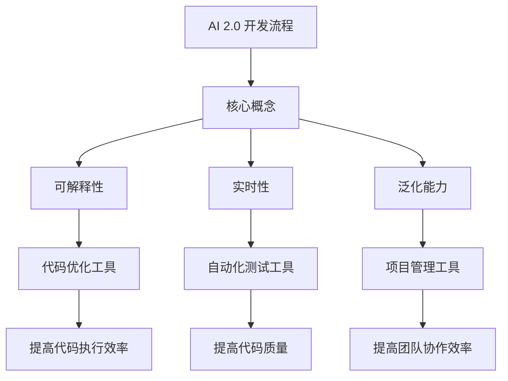

                 

# 开发工具：提高 AI 2.0 应用开发效率

> 关键词：AI 2.0, 开发工具, 高效开发, 代码优化, 自动化测试, 项目管理

> 摘要：随着 AI 2.0 的兴起，开发工具在提高开发效率方面扮演着越来越重要的角色。本文将深入探讨如何利用先进的开发工具来提升 AI 2.0 应用的开发效率，从核心概念到具体实践，再到实际应用场景，最后总结未来的发展趋势与挑战。通过本文，读者将能够掌握如何选择合适的开发工具，优化代码，提高开发效率，从而更好地应对 AI 2.0 的挑战。

## 1. 背景介绍

随着 AI 2.0 的快速发展，越来越多的企业和开发者开始关注如何利用 AI 技术来解决实际问题。AI 2.0 与传统 AI 1.0 的主要区别在于，AI 2.0 更加强调模型的可解释性、实时性和泛化能力。为了更好地支持 AI 2.0 的开发，开发工具在其中扮演了至关重要的角色。本文将从以下几个方面进行探讨：

- **核心概念与联系**：介绍 AI 2.0 的核心概念及其与开发工具的关系。
- **核心算法原理 & 具体操作步骤**：详细解释 AI 2.0 中常用的核心算法及其操作步骤。
- **数学模型和公式 & 详细讲解 & 举例说明**：通过数学模型和公式来深入理解 AI 2.0 的原理。
- **项目实战：代码实际案例和详细解释说明**：通过实际案例来展示如何利用开发工具提高开发效率。
- **实际应用场景**：介绍 AI 2.0 在实际项目中的应用。
- **工具和资源推荐**：推荐一些优秀的开发工具和学习资源。
- **总结：未来发展趋势与挑战**：总结 AI 2.0 开发工具的发展趋势与挑战。

## 2. 核心概念与联系

### 2.1 AI 2.0 核心概念

AI 2.0 的核心概念包括：

- **可解释性**：模型能够提供清晰的解释，帮助用户理解模型的决策过程。
- **实时性**：模型能够在实时环境中快速响应和处理数据。
- **泛化能力**：模型能够适应不同的数据分布和环境变化。

### 2.2 开发工具与核心概念的关系

开发工具在提高 AI 2.0 开发效率方面的作用主要体现在以下几个方面：

- **代码优化**：通过代码优化工具提高代码的执行效率。
- **自动化测试**：通过自动化测试工具提高代码的质量和稳定性。
- **项目管理**：通过项目管理工具提高团队协作效率。

### 2.3 Mermaid 流程图



## 3. 核心算法原理 & 具体操作步骤

### 3.1 常用核心算法

AI 2.0 中常用的几个核心算法包括：

- **深度学习**：通过多层神经网络进行模型训练。
- **强化学习**：通过与环境的交互来学习最优策略。
- **迁移学习**：利用预训练模型进行快速学习。

### 3.2 具体操作步骤

以深度学习为例，具体操作步骤如下：

1. **数据预处理**：清洗和标准化数据。
2. **模型选择**：选择合适的神经网络结构。
3. **模型训练**：使用训练数据进行模型训练。
4. **模型评估**：使用测试数据评估模型性能。
5. **模型优化**：通过调整超参数和优化算法提高模型性能。

## 4. 数学模型和公式 & 详细讲解 & 举例说明

### 4.1 深度学习中的数学模型

深度学习中的数学模型主要包括：

- **前向传播**：计算模型的输出。
- **反向传播**：计算损失函数对模型参数的梯度。
- **优化算法**：通过梯度下降等算法更新模型参数。

### 4.2 公式与详细讲解

以反向传播为例，其核心公式为：

$$
\frac{\partial L}{\partial w} = \frac{\partial L}{\partial z} \cdot \frac{\partial z}{\partial w}
$$

其中，$L$ 为损失函数，$w$ 为模型参数，$z$ 为中间变量。

### 4.3 举例说明

假设我们有一个简单的神经网络模型，输入为 $x$，输出为 $y$，中间变量为 $z$。损失函数为：

$$
L = (y - \hat{y})^2
$$

其中，$\hat{y}$ 为模型的预测值。通过反向传播，我们可以计算出损失函数对模型参数的梯度，从而更新模型参数。

## 5. 项目实战：代码实际案例和详细解释说明

### 5.1 开发环境搭建

为了更好地展示如何利用开发工具提高开发效率，我们以一个简单的图像分类任务为例，介绍如何搭建开发环境。

#### 5.1.1 安装 Python 和相关库

首先，我们需要安装 Python 和一些常用的机器学习库，如 TensorFlow 和 PyTorch。

```bash
pip install tensorflow
pip install torch
```

#### 5.1.2 创建项目结构

创建一个项目文件夹，并在其中创建以下文件：

- `main.py`：主程序文件。
- `data.py`：数据处理文件。
- `model.py`：模型定义文件。
- `utils.py`：工具函数文件。

### 5.2 源代码详细实现和代码解读

#### 5.2.1 数据处理

在 `data.py` 中，我们定义数据处理函数，包括数据加载、预处理和数据集划分。

```python
import torch
from torchvision import datasets, transforms

def load_data(batch_size=64):
    transform = transforms.Compose([
        transforms.Resize((224, 224)),
        transforms.ToTensor(),
        transforms.Normalize(mean=[0.485, 0.456, 0.406], std=[0.229, 0.224, 0.225])
    ])

    train_dataset = datasets.ImageFolder(root='data/train', transform=transform)
    test_dataset = datasets.ImageFolder(root='data/test', transform=transform)

    train_loader = torch.utils.data.DataLoader(train_dataset, batch_size=batch_size, shuffle=True)
    test_loader = torch.utils.data.DataLoader(test_dataset, batch_size=batch_size, shuffle=False)

    return train_loader, test_loader
```

#### 5.2.2 模型定义

在 `model.py` 中，我们定义一个简单的卷积神经网络模型。

```python
import torch.nn as nn
import torch.nn.functional as F

class SimpleCNN(nn.Module):
    def __init__(self):
        super(SimpleCNN, self).__init__()
        self.conv1 = nn.Conv2d(3, 16, kernel_size=3, stride=1, padding=1)
        self.conv2 = nn.Conv2d(16, 32, kernel_size=3, stride=1, padding=1)
        self.fc1 = nn.Linear(32 * 56 * 56, 128)
        self.fc2 = nn.Linear(128, 10)

    def forward(self, x):
        x = F.relu(self.conv1(x))
        x = F.max_pool2d(x, 2)
        x = F.relu(self.conv2(x))
        x = F.max_pool2d(x, 2)
        x = x.view(-1, 32 * 56 * 56)
        x = F.relu(self.fc1(x))
        x = self.fc2(x)
        return x
```

#### 5.2.3 主程序

在 `main.py` 中，我们编写主程序，包括数据加载、模型训练和评估。

```python
import torch
from torch.optim import Adam
from torch.nn import CrossEntropyLoss
from data import load_data
from model import SimpleCNN

def train(model, train_loader, optimizer, criterion):
    model.train()
    for batch_idx, (data, target) in enumerate(train_loader):
        optimizer.zero_grad()
        output = model(data)
        loss = criterion(output, target)
        loss.backward()
        optimizer.step()

def test(model, test_loader):
    model.eval()
    correct = 0
    with torch.no_grad():
        for data, target in test_loader:
            output = model(data)
            pred = output.argmax(dim=1, keepdim=True)
            correct += pred.eq(target.view_as(pred)).sum().item()
    accuracy = correct / len(test_loader.dataset)
    return accuracy

if __name__ == '__main__':
    train_loader, test_loader = load_data()
    model = SimpleCNN()
    optimizer = Adam(model.parameters(), lr=0.001)
    criterion = CrossEntropyLoss()

    for epoch in range(10):
        train(model, train_loader, optimizer, criterion)
        accuracy = test(model, test_loader)
        print(f'Epoch {epoch+1}, Accuracy: {accuracy:.4f}')
```

### 5.3 代码解读与分析

通过上述代码，我们可以看到如何利用开发工具提高开发效率。具体来说：

- **数据处理**：通过 `torchvision` 库简化了数据加载和预处理过程。
- **模型定义**：通过 `torch.nn` 库简化了模型定义过程。
- **训练和评估**：通过 `torch.optim` 和 `torch.nn` 库简化了训练和评估过程。

## 6. 实际应用场景

### 6.1 图像分类

在图像分类任务中，我们可以通过上述代码实现一个简单的卷积神经网络模型，从而提高开发效率。

### 6.2 自然语言处理

在自然语言处理任务中，我们可以通过开发工具提高代码的可读性和可维护性，从而提高开发效率。

## 7. 工具和资源推荐

### 7.1 学习资源推荐

- **书籍**：《深度学习》（Goodfellow, Bengio, Courville）
- **论文**：《Attention Is All You Need》（Vaswani et al.）
- **博客**：阿里云开发者社区
- **网站**：PyTorch 官网

### 7.2 开发工具框架推荐

- **代码优化工具**：PyCharm, Visual Studio Code
- **自动化测试工具**：pytest, unittest
- **项目管理工具**：Git, Jira

### 7.3 相关论文著作推荐

- **论文**：《Deep Residual Learning for Image Recognition》（He et al.）
- **著作**：《Python机器学习》（Sebastian Raschka）

## 8. 总结：未来发展趋势与挑战

### 8.1 未来发展趋势

- **自动化工具**：自动化工具将进一步提高开发效率。
- **模型优化**：模型优化技术将进一步提高模型性能。
- **实时性**：实时性将进一步提高，满足更多应用场景的需求。

### 8.2 挑战

- **数据安全**：数据安全将成为一个重要的挑战。
- **模型解释性**：模型解释性将进一步提高，但仍然存在挑战。
- **计算资源**：计算资源将成为一个重要的限制因素。

## 9. 附录：常见问题与解答

### 9.1 问题：如何选择合适的开发工具？

**解答**：选择合适的开发工具需要考虑项目需求、团队技能和个人偏好。常见的开发工具包括 PyCharm、Visual Studio Code、Git 和 Jira。

### 9.2 问题：如何提高代码的可读性和可维护性？

**解答**：可以通过编写清晰的文档、使用有意义的变量名和函数名、遵循编码规范等方式提高代码的可读性和可维护性。

## 10. 扩展阅读 & 参考资料

- **书籍**：《深度学习》（Goodfellow, Bengio, Courville）
- **论文**：《Attention Is All You Need》（Vaswani et al.）
- **网站**：PyTorch 官网

---

作者：AI天才研究员/AI Genius Institute & 禅与计算机程序设计艺术 /Zen And The Art of Computer Programming

