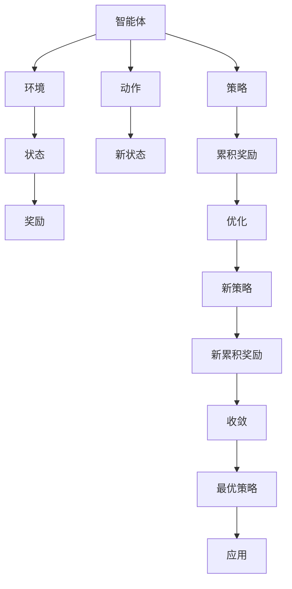
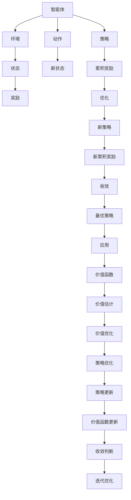

                 

# 强化学习在AI中的应用：RLHF与PPO

> 关键词：强化学习, RLHF, PPO, 人工智能, 深度学习, 机器学习, 策略梯度, 价值函数, 优化算法

> 摘要：本文旨在深入探讨强化学习（Reinforcement Learning, RL）在人工智能领域的应用，特别是重点介绍两种重要的强化学习算法：奖励学习人类反馈（Reinforcement Learning from Human Feedback, RLHF）和Proximal Policy Optimization（PPO）。通过逐步分析和推理，我们将详细解释这些算法的核心原理、具体操作步骤、数学模型和公式，并通过实际代码案例进行深入解读。此外，本文还将探讨这些算法的实际应用场景、推荐的学习资源和开发工具，以及未来的发展趋势和挑战。

## 1. 背景介绍

强化学习是一种通过与环境交互来学习最优策略的机器学习方法。它在游戏、机器人控制、自然语言处理、推荐系统等领域有着广泛的应用。强化学习的核心在于通过试错学习，使智能体能够根据环境反馈调整其行为，以最大化长期奖励。本文将重点介绍两种重要的强化学习算法：奖励学习人类反馈（RLHF）和Proximal Policy Optimization（PPO）。

## 2. 核心概念与联系

### 2.1 强化学习基础

强化学习的基本框架包括智能体（Agent）、环境（Environment）、状态（State）、动作（Action）和奖励（Reward）。智能体通过执行动作与环境交互，环境根据智能体的动作返回新的状态和奖励。智能体的目标是通过学习最优策略，最大化长期累积奖励。

### 2.2 RLHF与PPO的关系

- **RLHF**：RLHF是一种结合人类反馈的强化学习方法，旨在通过人类专家的反馈来改进智能体的行为。它通常用于监督学习和强化学习的结合，以提高智能体的表现。
- **PPO**：PPO是一种基于策略梯度的强化学习算法，通过优化策略来最大化累积奖励。PPO在实际应用中表现出色，特别是在连续动作空间和高维状态空间中。

### 2.3 Mermaid流程图



## 3. 核心算法原理 & 具体操作步骤

### 3.1 RLHF原理

RLHF的核心思想是通过人类专家的反馈来改进智能体的行为。具体步骤如下：

1. **数据收集**：收集人类专家在特定任务上的行为数据，包括动作和奖励。
2. **模型训练**：使用收集的数据训练一个初始模型。
3. **人类反馈**：人类专家对模型的行为进行评估，提供反馈。
4. **模型优化**：根据反馈调整模型参数，优化模型性能。
5. **迭代优化**：重复上述步骤，直到模型达到满意的性能。

### 3.2 PPO原理

PPO是一种基于策略梯度的强化学习算法，通过优化策略来最大化累积奖励。具体步骤如下：

1. **初始化**：初始化策略网络和价值网络。
2. **采样**：智能体根据当前策略在网络中采样动作。
3. **评估**：计算当前策略的累积奖励。
4. **策略更新**：通过优化策略网络来最大化累积奖励。
5. **价值函数更新**：通过优化价值网络来估计状态的价值。
6. **收敛判断**：判断是否达到收敛条件，如果没有则重复步骤2-5。

### 3.3 Mermaid流程图



## 4. 数学模型和公式 & 详细讲解 & 举例说明

### 4.1 RLHF数学模型

RLHF的核心是通过人类反馈来优化智能体的行为。具体公式如下：

1. **损失函数**：定义损失函数来衡量模型与人类反馈之间的差异。
2. **优化算法**：使用梯度下降等优化算法来最小化损失函数。

$$
L(\theta) = -\sum_{t=1}^{T} \left( \alpha \cdot r_t + (1 - \alpha) \cdot f(s_t, a_t) \right) \log \pi_\theta(a_t | s_t)
$$

其中，$\alpha$ 是人类反馈的权重，$r_t$ 是奖励，$f(s_t, a_t)$ 是人类反馈，$\pi_\theta(a_t | s_t)$ 是当前策略的概率分布。

### 4.2 PPO数学模型

PPO的核心是通过优化策略来最大化累积奖励。具体公式如下：

1. **策略损失函数**：定义策略损失函数来衡量当前策略与目标策略之间的差异。
2. **价值函数损失函数**：定义价值函数损失函数来估计状态的价值。

$$
L_{\text{policy}}(\theta) = \mathbb{E}_{s_t, a_t \sim \pi_\theta} \left[ \min \left( \frac{\pi_\theta(a_t | s_t)}{\pi_{\theta'}(a_t | s_t)} A_t, \text{clip} \left( \frac{\pi_\theta(a_t | s_t)}{\pi_{\theta'}(a_t | s_t)}, 1 - \epsilon, 1 + \epsilon \right) A_t \right) \right]
$$

$$
L_{\text{value}}(\theta) = \mathbb{E}_{s_t \sim \pi_\theta} \left[ \left( V_\theta(s_t) - \hat{V}_t \right)^2 \right]
$$

其中，$\pi_\theta(a_t | s_t)$ 是当前策略的概率分布，$\pi_{\theta'}(a_t | s_t)$ 是目标策略的概率分布，$A_t$ 是优势函数，$\epsilon$ 是剪切参数，$V_\theta(s_t)$ 是价值函数，$\hat{V}_t$ 是价值估计。

### 4.3 举例说明

假设我们有一个智能体在玩一个简单的游戏，目标是最大化得分。我们可以通过以下步骤来应用RLHF和PPO：

1. **数据收集**：收集人类专家在游戏中的行为数据，包括动作和奖励。
2. **模型训练**：使用收集的数据训练一个初始模型。
3. **人类反馈**：人类专家对模型的行为进行评估，提供反馈。
4. **模型优化**：根据反馈调整模型参数，优化模型性能。
5. **策略更新**：通过优化策略网络来最大化累积奖励。
6. **价值函数更新**：通过优化价值网络来估计状态的价值。
7. **收敛判断**：判断是否达到收敛条件，如果没有则重复步骤2-6。

## 5. 项目实战：代码实际案例和详细解释说明

### 5.1 开发环境搭建

1. **安装Python**：确保安装了Python 3.8及以上版本。
2. **安装依赖库**：使用pip安装必要的库，如TensorFlow、Keras、NumPy等。

```bash
pip install tensorflow keras numpy
```

### 5.2 源代码详细实现和代码解读

```python
import tensorflow as tf
from tensorflow.keras import layers

# 定义策略网络
class PolicyNetwork(tf.keras.Model):
    def __init__(self, action_space):
        super(PolicyNetwork, self).__init__()
        self.dense1 = layers.Dense(64, activation='relu')
        self.dense2 = layers.Dense(64, activation='relu')
        self.output = layers.Dense(action_space, activation='softmax')

    def call(self, inputs):
        x = self.dense1(inputs)
        x = self.dense2(x)
        return self.output(x)

# 定义价值网络
class ValueNetwork(tf.keras.Model):
    def __init__(self):
        super(ValueNetwork, self).__init__()
        self.dense1 = layers.Dense(64, activation='relu')
        self.dense2 = layers.Dense(64, activation='relu')
        self.output = layers.Dense(1)

    def call(self, inputs):
        x = self.dense1(inputs)
        x = self.dense2(x)
        return self.output(x)

# 初始化策略网络和价值网络
policy_network = PolicyNetwork(action_space=4)
value_network = ValueNetwork()

# 定义优化器
optimizer = tf.keras.optimizers.Adam(learning_rate=0.001)

# 定义训练步骤
@tf.function
def train_step(states, actions, rewards, next_states, dones):
    with tf.GradientTape() as tape:
        # 计算策略损失
        log_probs = tf.math.log(policy_network(states))
        advantages = tf.stop_gradient(rewards - value_network(states))
        policy_loss = -tf.reduce_mean(log_probs * advantages)
        
        # 计算价值函数损失
        value_loss = tf.reduce_mean(tf.square(value_network(states) - rewards))
        
        # 总损失
        total_loss = policy_loss + 0.5 * value_loss

    # 计算梯度
    gradients = tape.gradient(total_loss, policy_network.trainable_variables + value_network.trainable_variables)
    optimizer.apply_gradients(zip(gradients, policy_network.trainable_variables + value_network.trainable_variables))

# 训练循环
for episode in range(num_episodes):
    states, actions, rewards, next_states, dones = collect_data()
    train_step(states, actions, rewards, next_states, dones)
```

### 5.3 代码解读与分析

1. **策略网络**：定义了一个简单的全连接神经网络，用于预测动作的概率分布。
2. **价值网络**：定义了一个简单的全连接神经网络，用于估计状态的价值。
3. **训练步骤**：定义了一个训练步骤，用于计算策略损失和价值函数损失，并更新网络参数。
4. **训练循环**：通过循环收集数据并进行训练，逐步优化策略和价值网络。

## 6. 实际应用场景

### 6.1 游戏AI

在游戏领域，RLHF和PPO可以用于训练智能体进行游戏。例如，在《星际争霸》、《王者荣耀》等游戏中，通过人类专家的反馈来优化智能体的行为，提高其游戏水平。

### 6.2 自动驾驶

在自动驾驶领域，RLHF和PPO可以用于训练智能体进行驾驶。例如，在模拟环境中，通过人类专家的反馈来优化智能体的驾驶策略，提高其安全性。

### 6.3 机器人控制

在机器人控制领域，RLHF和PPO可以用于训练智能体进行复杂任务。例如，在工业机器人、服务机器人等领域，通过人类专家的反馈来优化智能体的行为，提高其操作精度。

## 7. 工具和资源推荐

### 7.1 学习资源推荐

- **书籍**：《Reinforcement Learning: An Introduction》、《Deep Reinforcement Learning Hands-On》
- **论文**：《Proximal Policy Optimization Algorithms》、《Reinforcement Learning from Human Feedback》
- **博客**：Medium上的相关文章、GitHub上的开源项目
- **网站**：TensorFlow官网、Keras官网

### 7.2 开发工具框架推荐

- **TensorFlow**：一个强大的深度学习框架，支持多种设备和平台。
- **Keras**：一个高级神经网络API，易于使用和扩展。
- **PyTorch**：一个灵活的深度学习框架，支持动态图和自动微分。

### 7.3 相关论文著作推荐

- **《Proximal Policy Optimization Algorithms》**：详细介绍PPO算法及其应用。
- **《Reinforcement Learning from Human Feedback》**：深入探讨RLHF算法及其应用。

## 8. 总结：未来发展趋势与挑战

### 8.1 未来发展趋势

1. **算法优化**：不断改进和优化现有的强化学习算法，提高其性能和稳定性。
2. **应用拓展**：将强化学习应用于更多领域，如医疗、金融、教育等。
3. **跨学科融合**：结合其他领域的知识和技术，推动强化学习的发展。

### 8.2 挑战

1. **计算资源需求**：强化学习算法通常需要大量的计算资源，如何降低计算成本是一个挑战。
2. **数据收集**：如何高效地收集高质量的数据，特别是在实际应用中。
3. **可解释性**：如何提高强化学习算法的可解释性，使其更容易被人类理解和接受。

## 9. 附录：常见问题与解答

### 9.1 问题1：如何选择合适的强化学习算法？

**解答**：选择合适的强化学习算法需要考虑任务的特性、计算资源和应用需求。对于连续动作空间和高维状态空间，PPO是一个不错的选择；对于结合人类反馈的任务，RLHF是一个有效的解决方案。

### 9.2 问题2：如何提高强化学习算法的性能？

**解答**：可以通过以下方法提高强化学习算法的性能：
1. **优化算法**：使用更高效的优化算法，如Adam、RMSprop等。
2. **网络结构**：设计更复杂的网络结构，提高模型的表达能力。
3. **数据增强**：通过数据增强技术，增加训练数据的多样性。

## 10. 扩展阅读 & 参考资料

- **书籍**：《Reinforcement Learning: An Introduction》、《Deep Reinforcement Learning Hands-On》
- **论文**：《Proximal Policy Optimization Algorithms》、《Reinforcement Learning from Human Feedback》
- **博客**：Medium上的相关文章、GitHub上的开源项目
- **网站**：TensorFlow官网、Keras官网

---

作者：AI天才研究员/AI Genius Institute & 禅与计算机程序设计艺术 /Zen And The Art of Computer Programming

