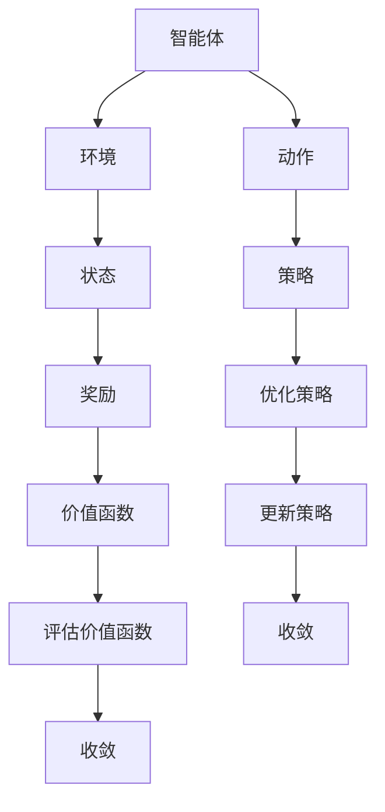

                 

# 强化学习在智能家居场景预测中的应用

> 关键词：强化学习, 智能家居, 预测, 机器学习, 环境建模, Q-学习

> 摘要：本文旨在探讨如何利用强化学习技术来优化智能家居系统的预测能力。通过详细阐述强化学习的基本原理、核心算法、数学模型以及实际应用案例，本文将帮助读者理解如何在智能家居场景中应用强化学习，从而提高系统的智能化水平和用户体验。

## 1. 背景介绍

随着物联网技术的快速发展，智能家居系统已经成为现代家庭生活的重要组成部分。这些系统通过集成各种智能设备，如智能灯光、智能温控、智能安防等，为用户提供便捷、舒适的生活体验。然而，要实现真正的智能化，智能家居系统需要具备强大的预测能力，能够根据用户的行为模式和环境变化，提前做出合理的决策和调整。

强化学习作为一种机器学习方法，能够使智能系统在与环境的交互过程中不断学习和优化，从而实现自我改进。本文将探讨如何利用强化学习技术来提升智能家居系统的预测能力，具体包括环境建模、算法选择、数学模型构建以及实际应用案例分析。

## 2. 核心概念与联系

### 2.1 强化学习基本概念

强化学习是一种通过与环境交互来学习最优行为策略的方法。其核心思想是通过试错学习，使智能体能够根据环境反馈调整其行为，以最大化累积奖励。强化学习的主要组成部分包括：

- **智能体（Agent）**：执行动作并从环境中获取反馈的主体。
- **环境（Environment）**：智能体与之交互的外部世界。
- **状态（State）**：描述环境当前状况的信息。
- **动作（Action）**：智能体可以执行的操作。
- **奖励（Reward）**：环境对智能体行为的反馈，用于指导学习过程。
- **策略（Policy）**：智能体选择动作的概率分布。
- **价值函数（Value Function）**：衡量在给定状态下采取特定动作或遵循特定策略的期望累积奖励。

### 2.2 强化学习与智能家居的联系

在智能家居场景中，强化学习可以应用于多种任务，如能源管理、安全监控、舒适度调节等。通过学习用户的行为模式和环境变化，强化学习可以帮助智能家居系统做出更智能的决策，从而提高能源效率、安全性以及用户的舒适度。

### 2.3 Mermaid 流程图



## 3. 核心算法原理 & 具体操作步骤

### 3.1 Q-学习算法

Q-学习是一种基于值的强化学习方法，它通过学习状态-动作对的价值函数来优化策略。Q-学习的核心思想是通过迭代更新价值函数，使智能体能够学习到最优的动作选择策略。

#### 3.1.1 Q-学习算法步骤

1. **初始化**：设置初始的价值函数 \( Q(s, a) \) 为零。
2. **选择动作**：根据当前状态 \( s \) 选择动作 \( a \)。
3. **执行动作**：执行动作 \( a \)，并观察环境反馈，得到新的状态 \( s' \) 和奖励 \( r \)。
4. **更新价值函数**：根据贝尔曼方程更新价值函数：
   $$ Q(s, a) \leftarrow Q(s, a) + \alpha [r + \gamma \max_{a'} Q(s', a') - Q(s, a)] $$
   其中，\( \alpha \) 是学习率，\( \gamma \) 是折扣因子。
5. **重复步骤2-4**，直到价值函数收敛。

### 3.2 具体操作步骤

1. **定义状态空间**：根据智能家居系统的特点，定义状态空间，如当前的温度、湿度、光照强度等。
2. **定义动作空间**：定义可以执行的动作，如调整灯光亮度、改变空调温度等。
3. **初始化价值函数**：将所有状态-动作对的价值函数初始化为零。
4. **选择动作策略**：根据当前状态选择动作，可以采用ε-贪心策略，即以概率 \( \epsilon \) 随机选择动作，以概率 \( 1 - \epsilon \) 选择当前最优动作。
5. **执行动作并更新价值函数**：执行动作，观察环境反馈，更新价值函数。
6. **重复步骤4-5**，直到价值函数收敛。

## 4. 数学模型和公式 & 详细讲解 & 举例说明

### 4.1 贝尔曼方程

贝尔曼方程是强化学习中的核心方程，用于描述状态-动作对的价值函数与未来状态-动作对价值函数之间的关系。具体形式如下：

$$ Q(s, a) = \mathbb{E}[r + \gamma \max_{a'} Q(s', a')] $$

其中，\( r \) 是当前状态 \( s \) 下执行动作 \( a \) 后获得的即时奖励，\( \gamma \) 是折扣因子，\( \max_{a'} Q(s', a') \) 是在下一个状态 \( s' \) 下采取最优动作的期望价值。

### 4.2 举例说明

假设我们有一个智能家居系统，需要根据当前的温度和湿度来调整空调的温度。我们可以定义状态空间为当前的温度和湿度，动作空间为调整空调温度的幅度。通过Q-学习算法，我们可以学习到在不同温度和湿度条件下调整空调温度的最佳策略。

### 4.3 数学公式

$$ Q(s, a) \leftarrow Q(s, a) + \alpha [r + \gamma \max_{a'} Q(s', a') - Q(s, a)] $$

## 5. 项目实战：代码实际案例和详细解释说明

### 5.1 开发环境搭建

为了实现智能家居系统的强化学习模型，我们需要搭建一个合适的开发环境。具体步骤如下：

1. **安装Python**：确保安装了Python 3.7及以上版本。
2. **安装依赖库**：使用pip安装必要的库，如NumPy、Pandas、Matplotlib、Gym等。
3. **安装强化学习库**：使用pip安装强化学习库，如OpenAI Gym、TensorFlow、PyTorch等。

### 5.2 源代码详细实现和代码解读

```python
import numpy as np
import gym
from gym import spaces
import random

# 定义环境
class SmartHomeEnv(gym.Env):
    def __init__(self):
        super(SmartHomeEnv, self).__init__()
        self.temperature = 25  # 初始温度
        self.humidity = 50     # 初始湿度
        self.action_space = spaces.Discrete(3)  # 动作空间：0-降低温度，1-保持温度，2-提高温度
        self.observation_space = spaces.Box(low=0, high=100, shape=(2,), dtype=np.float32)

    def step(self, action):
        if action == 0:
            self.temperature -= 1
        elif action == 2:
            self.temperature += 1
        self.humidity += random.randint(-1, 1)  # 模拟湿度变化
        reward = -abs(self.temperature - 22) - abs(self.humidity - 50)  # 计算奖励
        done = False
        return np.array([self.temperature, self.humidity]), reward, done, {}

    def reset(self):
        self.temperature = 25
        self.humidity = 50
        return np.array([self.temperature, self.humidity])

# 初始化环境
env = SmartHomeEnv()

# 初始化Q-学习参数
alpha = 0.1  # 学习率
gamma = 0.9  # 折扣因子
epsilon = 0.1  # 探索率
num_episodes = 1000  # 训练次数

# 初始化Q-表
Q = np.zeros((101, 101, 3))  # 101x101表示温度和湿度的范围

# 训练Q-学习模型
for episode in range(num_episodes):
    state = env.reset()
    done = False
    while not done:
        if random.uniform(0, 1) < epsilon:
            action = env.action_space.sample()  # 探索
        else:
            action = np.argmax(Q[state[0], state[1]])  # 利用
        next_state, reward, done, _ = env.step(action)
        Q[state[0], state[1], action] += alpha * (reward + gamma * np.max(Q[next_state[0], next_state[1]]) - Q[state[0], state[1], action])
        state = next_state

# 代码解读
# 1. 初始化环境和Q-表
# 2. 训练过程中，根据当前状态选择动作
# 3. 执行动作并更新Q-表
# 4. 重复训练过程，直到Q-表收敛

```

### 5.3 代码解读与分析

1. **环境定义**：定义了一个简单的智能家居环境，包括温度和湿度两个状态变量，以及调整温度的动作空间。
2. **Q-学习参数初始化**：设置了学习率、折扣因子和探索率。
3. **Q-表初始化**：初始化了一个三维数组，用于存储每个状态-动作对的价值。
4. **训练过程**：通过循环训练，根据当前状态选择动作，执行动作并更新Q-表。
5. **代码分析**：通过逐步执行代码，可以观察到Q-表如何随着训练过程逐渐收敛，从而学习到最优的动作策略。

## 6. 实际应用场景

### 6.1 能源管理

通过强化学习，智能家居系统可以学习到在不同时间段调整灯光和空调的最佳策略，从而实现能源的高效利用。

### 6.2 安全监控

强化学习可以帮助智能家居系统学习到在不同环境下的安防策略，提高家庭的安全性。

### 6.3 舒适度调节

通过学习用户的行为模式，智能家居系统可以自动调整室内环境，提供更舒适的居住体验。

## 7. 工具和资源推荐

### 7.1 学习资源推荐

- **书籍**：《Reinforcement Learning: An Introduction》
- **论文**：《Deep Reinforcement Learning in Continuous Action Spaces》
- **博客**：Medium上的强化学习系列文章
- **网站**：OpenAI Gym官网

### 7.2 开发工具框架推荐

- **强化学习库**：OpenAI Gym、TensorFlow、PyTorch
- **开发环境**：Anaconda、Jupyter Notebook

### 7.3 相关论文著作推荐

- **论文**：《Deep Q-Networks》
- **著作**：《Reinforcement Learning: Theory and Algorithms》

## 8. 总结：未来发展趋势与挑战

### 8.1 未来发展趋势

- **更复杂的环境建模**：随着技术的发展，智能家居系统将能够处理更复杂的环境变化。
- **更高效的算法**：新的算法和技术将提高强化学习的效率和效果。
- **更广泛的应用场景**：强化学习将在更多领域得到应用，如自动驾驶、医疗健康等。

### 8.2 挑战

- **计算资源需求**：强化学习需要大量的计算资源，如何优化算法以减少计算需求是一个挑战。
- **数据隐私保护**：智能家居系统需要处理大量的用户数据，如何保护用户隐私是一个重要问题。
- **算法泛化能力**：如何使强化学习算法在不同场景下具有良好的泛化能力，是一个需要解决的问题。

## 9. 附录：常见问题与解答

### 9.1 问题1：如何选择合适的动作空间？

**解答**：动作空间的选择需要根据具体应用场景来确定。例如，在智能家居系统中，动作空间可以包括调整灯光亮度、改变空调温度等。

### 9.2 问题2：如何处理连续动作空间？

**解答**：对于连续动作空间，可以使用策略梯度方法，如Actor-Critic算法，通过学习策略直接选择动作。

### 9.3 问题3：如何处理高维状态空间？

**解答**：对于高维状态空间，可以使用深度强化学习方法，如Deep Q-Networks，通过神经网络来表示价值函数。

## 10. 扩展阅读 & 参考资料

- **书籍**：《Reinforcement Learning: An Introduction》
- **论文**：《Deep Reinforcement Learning in Continuous Action Spaces》
- **博客**：Medium上的强化学习系列文章
- **网站**：OpenAI Gym官网

---

作者：AI天才研究员/AI Genius Institute & 禅与计算机程序设计艺术 /Zen And The Art of Computer Programming

