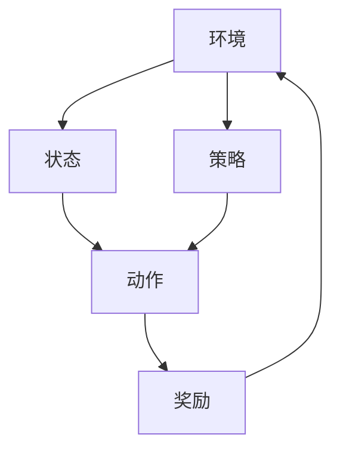

                 

# 强化学习：在航空航天中的应用

> 关键词：强化学习, 航空航天, 无人机, 自动驾驶, 优化决策, 模型预测控制, 深度学习

> 摘要：本文旨在探讨强化学习在航空航天领域的应用，特别是无人机和自动驾驶飞机的优化决策。通过深入分析强化学习的核心概念、算法原理、数学模型以及实际应用案例，本文将展示如何利用强化学习技术提升航空航天系统的性能和效率。我们将从背景介绍开始，逐步解析强化学习的基本原理，通过具体的数学模型和公式进行详细讲解，并结合实际代码案例进行深入分析。最后，我们将探讨强化学习在航空航天领域的实际应用场景，并提供相关学习资源和开发工具推荐。

## 1. 背景介绍

### 1.1 航空航天领域的挑战
航空航天领域面临着诸多挑战，包括但不限于：
- **复杂环境适应性**：无人机和自动驾驶飞机需要在复杂多变的环境中执行任务，如恶劣天气、地形变化等。
- **高效决策**：在实时环境中，系统需要快速做出最优决策，以应对突发情况。
- **资源优化**：如何在有限的资源条件下实现最佳性能，是航空航天系统设计的关键问题。

### 1.2 强化学习的优势
强化学习作为一种机器学习方法，特别适用于解决上述挑战。其核心在于通过与环境的交互来学习最优策略，从而实现目标最大化。强化学习的优势包括：
- **自适应性**：能够适应复杂多变的环境。
- **实时决策**：能够在实时环境中快速做出决策。
- **资源优化**：通过学习最优策略，实现资源的有效利用。

## 2. 核心概念与联系

### 2.1 强化学习的基本概念
强化学习是一种通过与环境交互来学习最优策略的机器学习方法。其核心概念包括：
- **环境（Environment）**：系统所处的外部环境。
- **状态（State）**：描述环境当前状态的信息。
- **动作（Action）**：系统可以采取的操作。
- **奖励（Reward）**：系统执行动作后获得的反馈。
- **策略（Policy）**：决定在给定状态下采取何种动作的规则。

### 2.2 强化学习的流程图


## 3. 核心算法原理 & 具体操作步骤

### 3.1 Q-Learning算法
Q-Learning是一种基于值函数的强化学习算法，其核心思想是通过学习状态-动作对的Q值来优化策略。具体步骤如下：
1. **初始化**：初始化Q值表，通常为0。
2. **选择动作**：根据当前状态选择动作，可以采用ε-贪心策略。
3. **执行动作**：执行选定的动作，获得新的状态和奖励。
4. **更新Q值**：根据新的状态和奖励更新Q值表。
5. **重复**：重复上述步骤，直到达到终止条件。

### 3.2 具体操作步骤
1. **初始化**：设初始Q值表为$Q(s, a)$，其中$s$为状态，$a$为动作。
2. **选择动作**：根据当前状态$s$，选择动作$a$，采用ε-贪心策略：
   $$ a = \arg\max_{a'} Q(s, a') $$
   其中，ε为探索率，用于控制探索和利用的平衡。
3. **执行动作**：执行动作$a$，获得新的状态$s'$和奖励$r$。
4. **更新Q值**：根据新的状态$s'$和奖励$r$更新Q值表：
   $$ Q(s, a) \leftarrow Q(s, a) + \alpha [r + \gamma \max_{a'} Q(s', a') - Q(s, a)] $$
   其中，$\alpha$为学习率，$\gamma$为折扣因子。

## 4. 数学模型和公式 & 详细讲解 & 举例说明

### 4.1 Q-Learning的数学模型
Q-Learning的数学模型可以表示为：
$$ Q(s, a) \leftarrow Q(s, a) + \alpha [r + \gamma \max_{a'} Q(s', a') - Q(s, a)] $$
其中：
- $Q(s, a)$：状态-动作对的Q值。
- $r$：执行动作$a$后获得的奖励。
- $s'$：执行动作$a$后的新状态。
- $\alpha$：学习率，控制更新幅度。
- $\gamma$：折扣因子，控制未来奖励的重要性。

### 4.2 举例说明
假设无人机在执行任务时需要在两个目标点之间切换。初始状态为$s_0$，动作包括向左飞行（$a_1$）和向右飞行（$a_2$）。假设无人机在状态$s_0$时选择向左飞行，获得奖励$r_1$，进入新状态$s_1$。根据Q-Learning算法更新Q值：
$$ Q(s_0, a_1) \leftarrow Q(s_0, a_1) + \alpha [r_1 + \gamma \max_{a'} Q(s_1, a')] $$
假设在状态$s_1$时，无人机选择向右飞行，获得奖励$r_2$，进入新状态$s_2$。根据Q-Learning算法更新Q值：
$$ Q(s_1, a_2) \leftarrow Q(s_1, a_2) + \alpha [r_2 + \gamma \max_{a'} Q(s_2, a')] $$

## 5. 项目实战：代码实际案例和详细解释说明

### 5.1 开发环境搭建
为了实现Q-Learning算法，我们需要搭建一个Python开发环境。安装必要的库，如NumPy和Matplotlib。

```bash
pip install numpy matplotlib
```

### 5.2 源代码详细实现和代码解读
```python
import numpy as np

# 初始化Q值表
Q = np.zeros((2, 2))

# 学习率和折扣因子
alpha = 0.1
gamma = 0.9

# 状态-动作对的奖励
rewards = np.array([[0, 1], [1, 0]])

# 选择动作
def choose_action(state):
    if np.random.uniform(0, 1) < epsilon:
        return np.random.choice([0, 1])
    else:
        return np.argmax(Q[state, :])

# 更新Q值
def update_q_value(state, action, reward, next_state):
    Q[state, action] += alpha * (reward + gamma * np.max(Q[next_state, :]) - Q[state, action])

# 主循环
epsilon = 0.1
for episode in range(1000):
    state = 0
    while state != 1:
        action = choose_action(state)
        reward = rewards[state, action]
        next_state = 1 if action == 1 else 0
        update_q_value(state, action, reward, next_state)
        state = next_state
```

### 5.3 代码解读与分析
- **初始化Q值表**：使用NumPy创建一个2x2的Q值表，初始值为0。
- **学习率和折扣因子**：设置学习率$\alpha$和折扣因子$\gamma$。
- **状态-动作对的奖励**：定义一个2x2的奖励矩阵。
- **选择动作**：根据ε-贪心策略选择动作。
- **更新Q值**：根据Q-Learning算法更新Q值。
- **主循环**：模拟无人机在两个目标点之间切换的过程，更新Q值表。

## 6. 实际应用场景

### 6.1 无人机路径规划
无人机在执行任务时需要在多个目标点之间切换。通过强化学习，无人机可以学习最优路径规划策略，提高任务执行效率。

### 6.2 自动驾驶飞机的优化决策
自动驾驶飞机在飞行过程中需要实时做出决策，如调整飞行高度、速度等。通过强化学习，飞机可以学习最优决策策略，提高飞行性能。

## 7. 工具和资源推荐

### 7.1 学习资源推荐
- **书籍**：《Reinforcement Learning: An Introduction》
- **论文**：《Deep Reinforcement Learning in Continuous Action Spaces》
- **博客**：Medium上的强化学习系列文章
- **网站**：Coursera上的强化学习课程

### 7.2 开发工具框架推荐
- **TensorFlow**：用于深度强化学习的框架。
- **PyTorch**：用于深度学习的框架，也支持强化学习。

### 7.3 相关论文著作推荐
- **论文**：《Deep Q-Networks》
- **著作**：《Reinforcement Learning: Theory and Algorithms》

## 8. 总结：未来发展趋势与挑战

### 8.1 未来发展趋势
- **深度强化学习**：结合深度学习和强化学习，提高决策能力。
- **多智能体系统**：多个智能体协同工作，提高系统整体性能。
- **实时优化**：在实时环境中快速做出最优决策。

### 8.2 挑战
- **计算资源**：强化学习算法对计算资源要求较高。
- **数据需求**：需要大量数据进行训练。
- **理论研究**：强化学习理论研究仍需深入。

## 9. 附录：常见问题与解答

### 9.1 问题：如何选择合适的奖励函数？
**解答**：奖励函数的设计需要根据具体应用场景来确定。通常需要考虑任务目标和环境特性，确保奖励能够引导系统向目标靠近。

### 9.2 问题：如何处理探索与利用的平衡？
**解答**：ε-贪心策略是一种常见的方法，通过调整ε值来控制探索和利用的平衡。通常在初期选择较大的ε值，随着训练的进行逐渐减小ε值。

## 10. 扩展阅读 & 参考资料

- **书籍**：《Reinforcement Learning: An Introduction》
- **论文**：《Deep Reinforcement Learning in Continuous Action Spaces》
- **博客**：Medium上的强化学习系列文章
- **网站**：Coursera上的强化学习课程

---

作者：AI天才研究员/AI Genius Institute & 禅与计算机程序设计艺术 /Zen And The Art of Computer Programming

