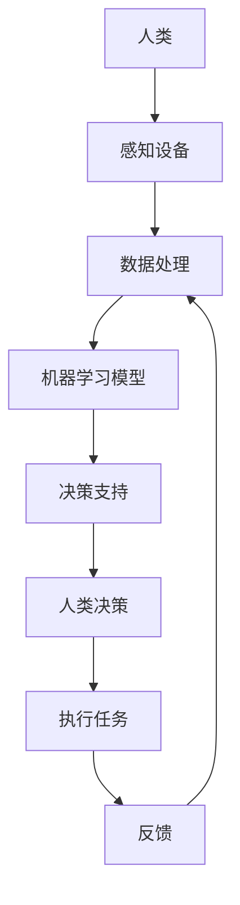

                 

# 技能提升：适应人类计算时代的新需求

> 关键词：人类计算、技能提升、适应性、技术趋势、未来挑战

> 摘要：随着人类计算时代的到来，技术领域正经历着前所未有的变革。本文旨在探讨如何提升个人技能，以适应这一新时代的需求。我们将从背景介绍、核心概念与联系、核心算法原理、数学模型与公式、项目实战、实际应用场景、工具和资源推荐、总结与未来趋势等多个方面进行深入分析，帮助读者更好地理解并应对这一变革。

## 1. 背景介绍

随着信息技术的飞速发展，人类计算时代已经悄然来临。在这个时代，计算不再局限于机器内部，而是深入到人类生活的方方面面。从智能家居到自动驾驶，从智能医疗到虚拟现实，计算技术正在以前所未有的方式改变着我们的生活和工作方式。为了更好地适应这一时代，我们需要不断提升自己的技能，以应对不断变化的技术挑战。

## 2. 核心概念与联系

### 2.1 人类计算的概念

人类计算是指将人类的认知能力与计算技术相结合，以实现更高效、更智能的信息处理和决策过程。这一概念强调了人机协同的重要性，旨在通过技术手段增强人类的能力，而不是替代人类。

### 2.2 人机协同的原理

人机协同的核心在于通过技术手段增强人类的认知能力，具体包括但不限于以下几点：

- **感知增强**：通过传感器和数据分析技术，增强人类对环境的感知能力。
- **决策支持**：利用机器学习和数据分析，为人类提供决策支持。
- **任务自动化**：通过自动化技术，减轻人类在重复性任务上的负担。

### 2.3 人机协同的架构

为了更好地理解人机协同的原理，我们可以通过以下Mermaid流程图来展示其基本架构：



## 3. 核心算法原理 & 具体操作步骤

### 3.1 感知设备的工作原理

感知设备是人机协同系统中的重要组成部分，其主要功能是收集环境信息。感知设备可以分为多种类型，包括但不限于视觉传感器、听觉传感器、触觉传感器等。以视觉传感器为例，其工作原理如下：

1. **图像采集**：通过摄像头等设备采集图像数据。
2. **图像预处理**：对采集到的图像进行预处理，如去噪、增强等。
3. **特征提取**：从预处理后的图像中提取关键特征。
4. **数据传输**：将提取到的特征数据传输到数据处理模块。

### 3.2 数据处理与机器学习模型

数据处理模块的主要任务是对感知设备采集到的数据进行处理，提取有用的信息。机器学习模型则是基于这些信息进行学习和预测。具体步骤如下：

1. **数据清洗**：去除无效或错误的数据。
2. **特征选择**：选择对模型训练有用的特征。
3. **模型训练**：使用选定的特征训练机器学习模型。
4. **模型评估**：评估模型的性能，调整参数以优化模型。

## 4. 数学模型和公式 & 详细讲解 & 举例说明

### 4.1 机器学习模型的数学基础

机器学习模型的核心在于其数学基础。以线性回归模型为例，其基本公式如下：

$$
y = \beta_0 + \beta_1 x_1 + \beta_2 x_2 + \cdots + \beta_n x_n + \epsilon
$$

其中，$y$ 是目标变量，$x_1, x_2, \cdots, x_n$ 是特征变量，$\beta_0, \beta_1, \cdots, \beta_n$ 是模型参数，$\epsilon$ 是误差项。

### 4.2 机器学习模型的训练过程

机器学习模型的训练过程主要包括以下几个步骤：

1. **初始化参数**：随机初始化模型参数。
2. **前向传播**：将输入数据通过模型计算得到预测值。
3. **计算损失**：计算预测值与真实值之间的差异，得到损失函数。
4. **反向传播**：根据损失函数计算梯度，更新模型参数。
5. **迭代优化**：重复前向传播和反向传播，直到模型收敛。

### 4.3 举例说明

以一个简单的线性回归模型为例，假设我们有一个数据集，包含两个特征变量 $x_1$ 和 $x_2$，以及一个目标变量 $y$。我们希望通过训练一个线性回归模型来预测 $y$。

1. **初始化参数**：假设初始参数为 $\beta_0 = 0, \beta_1 = 0, \beta_2 = 0$。
2. **前向传播**：计算预测值 $\hat{y} = \beta_0 + \beta_1 x_1 + \beta_2 x_2$。
3. **计算损失**：使用均方误差作为损失函数，计算损失值。
4. **反向传播**：根据损失函数计算梯度，更新模型参数。
5. **迭代优化**：重复上述步骤，直到模型收敛。

## 5. 项目实战：代码实际案例和详细解释说明

### 5.1 开发环境搭建

为了进行项目实战，我们需要搭建一个合适的开发环境。具体步骤如下：

1. **安装Python**：确保系统中安装了Python 3.8及以上版本。
2. **安装依赖库**：使用pip安装必要的库，如numpy、pandas、scikit-learn等。
3. **配置开发环境**：选择合适的开发工具，如Jupyter Notebook或PyCharm。

### 5.2 源代码详细实现和代码解读

以下是一个简单的线性回归模型实现代码示例：

```python
import numpy as np
from sklearn.model_selection import train_test_split
from sklearn.linear_model import LinearRegression
from sklearn.metrics import mean_squared_error

# 生成示例数据
np.random.seed(0)
X = np.random.rand(100, 2)
y = 2 * X[:, 0] + 3 * X[:, 1] + np.random.randn(100)

# 划分训练集和测试集
X_train, X_test, y_train, y_test = train_test_split(X, y, test_size=0.2, random_state=42)

# 创建线性回归模型
model = LinearRegression()

# 训练模型
model.fit(X_train, y_train)

# 预测
y_pred = model.predict(X_test)

# 计算均方误差
mse = mean_squared_error(y_test, y_pred)
print(f"均方误差: {mse}")
```

### 5.3 代码解读与分析

1. **数据生成**：使用numpy生成示例数据，其中包含两个特征变量 $x_1$ 和 $x_2$，以及一个目标变量 $y$。
2. **数据划分**：使用train_test_split函数将数据划分为训练集和测试集。
3. **模型创建**：创建一个线性回归模型。
4. **模型训练**：使用训练集数据训练模型。
5. **模型预测**：使用测试集数据进行预测。
6. **性能评估**：计算预测结果与真实值之间的均方误差。

## 6. 实际应用场景

### 6.1 智能家居

在智能家居领域，人机协同技术可以实现更加智能化的家居控制。例如，通过感知设备收集环境信息，结合机器学习模型进行分析，实现自动调节室内温度、湿度等功能。

### 6.2 自动驾驶

在自动驾驶领域，人机协同技术可以提高车辆的安全性和效率。通过感知设备收集道路信息，结合机器学习模型进行决策支持，实现自动驾驶车辆的智能导航和避障。

### 6.3 智能医疗

在智能医疗领域，人机协同技术可以提高医疗服务的质量和效率。通过感知设备收集患者信息，结合机器学习模型进行诊断支持，实现更加精准的医疗决策。

## 7. 工具和资源推荐

### 7.1 学习资源推荐

- **书籍**：《机器学习》（周志华著）、《深度学习》（Ian Goodfellow等著）
- **论文**：《A Survey of Human-Robot Interaction》（HRI）
- **博客**：Medium上的机器学习和人工智能相关博客
- **网站**：Kaggle、GitHub上的开源项目

### 7.2 开发工具框架推荐

- **开发工具**：Jupyter Notebook、PyCharm
- **框架**：TensorFlow、PyTorch

### 7.3 相关论文著作推荐

- **论文**：《Human-Robot Interaction: A Survey》（HRI）
- **著作**：《The Master Algorithm》（Pedro Domingos）

## 8. 总结：未来发展趋势与挑战

随着人类计算时代的到来，人机协同技术将在更多领域发挥重要作用。未来的发展趋势包括但不限于以下几点：

- **技术融合**：人机协同技术将与更多领域进行深度融合，实现更加智能化的应用。
- **数据驱动**：数据将成为人机协同技术的核心驱动力，数据的质量和数量将直接影响技术的效果。
- **伦理与安全**：随着技术的发展，伦理和安全问题将越来越受到重视，需要制定相应的规范和标准。

## 9. 附录：常见问题与解答

### 9.1 问题1：如何选择合适的感知设备？

**解答**：选择感知设备时，需要考虑设备的精度、成本、适用场景等因素。例如，对于视觉感知任务，可以选择高分辨率的摄像头；对于听觉感知任务，可以选择高灵敏度的麦克风。

### 9.2 问题2：如何评估机器学习模型的性能？

**解答**：评估机器学习模型的性能通常使用各种指标，如准确率、召回率、F1分数等。具体选择哪种指标取决于任务的具体需求。

## 10. 扩展阅读 & 参考资料

- **书籍**：《机器学习》（周志华著）、《深度学习》（Ian Goodfellow等著）
- **论文**：《A Survey of Human-Robot Interaction》（HRI）
- **网站**：Kaggle、GitHub上的开源项目

---

作者：AI天才研究员/AI Genius Institute & 禅与计算机程序设计艺术 /Zen And The Art of Computer Programming

