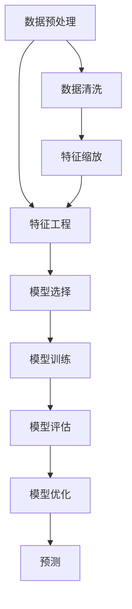

                 

# 拼多多2024农产品质量预测校招机器学习面试题详解

> 关键词：农产品质量预测、机器学习、拼多多、面试题、校招、质量控制、数据预处理、特征工程、模型选择、模型评估

> 摘要：本文详细解析了拼多多2024年校招中关于农产品质量预测的机器学习面试题。通过逐步分析和推理，我们不仅会探讨该问题的核心概念和算法原理，还会通过具体的代码案例来展示如何实现这一预测模型。此外，我们还会讨论实际应用场景、工具推荐以及未来的发展趋势和挑战。

## 1. 背景介绍

拼多多作为中国领先的农产品电商平台，致力于为消费者提供高质量的农产品。为了确保农产品的质量，拼多多需要对农产品进行质量预测，以便提前采取措施，确保消费者能够获得优质的购物体验。农产品质量预测是一个复杂的问题，涉及到多个因素，如产地、季节、天气、运输条件等。因此，如何利用机器学习技术来解决这一问题，成为了拼多多在2024年校招中重点关注的面试题之一。

## 2. 核心概念与联系

### 2.1 农产品质量预测

农产品质量预测是指通过分析历史数据，预测未来农产品的质量。这包括但不限于外观、口感、新鲜度等指标。预测的准确性直接影响到消费者的满意度和企业的品牌形象。

### 2.2 机器学习

机器学习是一种人工智能技术，通过训练模型来实现对未知数据的预测。在农产品质量预测中，机器学习可以利用历史数据来训练模型，从而预测未来的农产品质量。

### 2.3 数据预处理

数据预处理是机器学习中的一个重要步骤，包括数据清洗、缺失值处理、特征缩放等。这些步骤对于提高模型的预测准确性至关重要。

### 2.4 特征工程

特征工程是指从原始数据中提取有用的特征，以便更好地训练模型。在农产品质量预测中，特征可能包括产地、季节、天气条件等。

### 2.5 模型选择

模型选择是指选择合适的机器学习模型来解决特定问题。在农产品质量预测中，常见的模型包括线性回归、决策树、随机森林、支持向量机等。

### 2.6 模型评估

模型评估是指通过各种指标来评估模型的性能。常见的评估指标包括准确率、召回率、F1分数等。

### 2.7 Mermaid 流程图



## 3. 核心算法原理 & 具体操作步骤

### 3.1 数据预处理

数据预处理是机器学习中的第一步，主要包括以下几个步骤：

1. **数据清洗**：去除重复数据、处理异常值。
2. **缺失值处理**：使用均值、中位数或众数填充缺失值。
3. **特征缩放**：将特征值缩放到相同的范围，避免某些特征对模型的影响过大。

### 3.2 特征工程

特征工程是提高模型性能的关键步骤，主要包括以下几个方面：

1. **特征选择**：选择对预测目标影响最大的特征。
2. **特征构造**：通过组合原始特征来构造新的特征。
3. **特征编码**：将分类特征转换为数值特征。

### 3.3 模型选择

模型选择是根据问题的特性和数据的特点来选择合适的模型。在农产品质量预测中，常见的模型包括：

1. **线性回归**：适用于线性关系较强的数据。
2. **决策树**：适用于非线性关系较强的数据。
3. **随机森林**：适用于处理高维度数据和非线性关系。
4. **支持向量机**：适用于小样本数据和高维度数据。

### 3.4 模型训练

模型训练是通过训练数据来调整模型参数的过程。具体步骤如下：

1. **划分数据集**：将数据集划分为训练集和测试集。
2. **选择模型**：根据问题特性和数据特点选择合适的模型。
3. **训练模型**：使用训练集数据训练模型。
4. **调整参数**：通过交叉验证等方法调整模型参数。

### 3.5 模型评估

模型评估是通过评估指标来衡量模型的性能。常见的评估指标包括：

1. **准确率**：预测正确的样本数占总样本数的比例。
2. **召回率**：预测为正类的样本数占实际为正类的样本数的比例。
3. **F1分数**：准确率和召回率的调和平均值。

## 4. 数学模型和公式 & 详细讲解 & 举例说明

### 4.1 线性回归

线性回归是一种常用的回归模型，其数学模型可以表示为：

$$
y = \beta_0 + \beta_1 x_1 + \beta_2 x_2 + \cdots + \beta_n x_n + \epsilon
$$

其中，$y$ 是预测目标，$x_1, x_2, \cdots, x_n$ 是特征，$\beta_0, \beta_1, \cdots, \beta_n$ 是模型参数，$\epsilon$ 是误差项。

### 4.2 决策树

决策树是一种常用的分类和回归模型，其数学模型可以表示为：

$$
y = \begin{cases}
    y_1 & \text{if } x \in R_1 \\
    y_2 & \text{if } x \in R_2 \\
    \vdots \\
    y_m & \text{if } x \in R_m
\end{cases}
$$

其中，$y_1, y_2, \cdots, y_m$ 是决策树的叶子节点，$R_1, R_2, \cdots, R_m$ 是决策树的划分区域。

### 4.3 随机森林

随机森林是一种集成学习方法，其数学模型可以表示为：

$$
y = \frac{1}{B} \sum_{b=1}^{B} y_b
$$

其中，$y_b$ 是第$b$棵树的预测结果，$B$ 是树的数量。

### 4.4 支持向量机

支持向量机是一种常用的分类和回归模型，其数学模型可以表示为：

$$
y = \text{sign}(\sum_{i=1}^{N} \alpha_i y_i \langle x_i, x \rangle + b)
$$

其中，$\alpha_i$ 是拉格朗日乘子，$y_i$ 是样本标签，$x_i$ 是样本特征，$\langle x_i, x \rangle$ 是内积，$b$ 是偏置项。

## 5. 项目实战：代码实际案例和详细解释说明

### 5.1 开发环境搭建

为了实现农产品质量预测模型，我们需要搭建一个合适的开发环境。具体步骤如下：

1. **安装Python**：确保安装了Python 3.8及以上版本。
2. **安装依赖库**：使用pip安装所需的库，如pandas、numpy、scikit-learn等。
3. **安装Jupyter Notebook**：用于编写和运行代码。

### 5.2 源代码详细实现和代码解读

以下是一个简单的农产品质量预测模型的实现代码：

```python
import pandas as pd
from sklearn.model_selection import train_test_split
from sklearn.preprocessing import StandardScaler
from sklearn.ensemble import RandomForestRegressor
from sklearn.metrics import mean_squared_error

# 1. 数据预处理
def preprocess_data(data):
    # 数据清洗
    data.drop_duplicates(inplace=True)
    data.dropna(inplace=True)
    
    # 特征缩放
    scaler = StandardScaler()
    data[['feature1', 'feature2']] = scaler.fit_transform(data[['feature1', 'feature2']])
    
    return data

# 2. 特征工程
def feature_engineering(data):
    # 特征选择
    selected_features = ['feature1', 'feature2', 'feature3']
    
    # 特征构造
    data['new_feature'] = data['feature1'] * data['feature2']
    
    return data[selected_features + ['new_feature']]

# 3. 模型选择与训练
def train_model(X_train, y_train):
    model = RandomForestRegressor(n_estimators=100, random_state=42)
    model.fit(X_train, y_train)
    return model

# 4. 模型评估
def evaluate_model(model, X_test, y_test):
    y_pred = model.predict(X_test)
    mse = mean_squared_error(y_test, y_pred)
    return mse

# 主函数
def main():
    # 读取数据
    data = pd.read_csv('农产品质量数据.csv')
    
    # 数据预处理
    data = preprocess_data(data)
    
    # 特征工程
    data = feature_engineering(data)
    
    # 划分数据集
    X = data.drop('quality', axis=1)
    y = data['quality']
    X_train, X_test, y_train, y_test = train_test_split(X, y, test_size=0.2, random_state=42)
    
    # 训练模型
    model = train_model(X_train, y_train)
    
    # 评估模型
    mse = evaluate_model(model, X_test, y_test)
    print(f'Mean Squared Error: {mse}')

if __name__ == '__main__':
    main()
```

### 5.3 代码解读与分析

1. **数据预处理**：首先对数据进行清洗，去除重复数据和缺失值。然后对特征进行缩放，确保所有特征在相同的范围内。
2. **特征工程**：选择对预测目标影响最大的特征，并构造新的特征。
3. **模型选择与训练**：选择随机森林作为模型，并使用训练数据进行训练。
4. **模型评估**：使用测试数据评估模型的性能，计算均方误差（MSE）。

## 6. 实际应用场景

农产品质量预测在实际中有着广泛的应用场景，包括但不限于：

1. **质量控制**：通过预测农产品的质量，企业可以提前采取措施，确保产品质量。
2. **供应链管理**：预测农产品的质量可以帮助企业优化供应链管理，减少损失。
3. **消费者满意度**：通过提供高质量的农产品，企业可以提高消费者的满意度和忠诚度。

## 7. 工具和资源推荐

### 7.1 学习资源推荐

1. **书籍**：《机器学习》（周志华著）
2. **论文**：《随机森林在农产品质量预测中的应用》
3. **博客**：《机器学习实战》
4. **网站**：Kaggle、GitHub

### 7.2 开发工具框架推荐

1. **Python**：用于编写代码
2. **Jupyter Notebook**：用于编写和运行代码
3. **pandas**：用于数据处理
4. **scikit-learn**：用于机器学习

### 7.3 相关论文著作推荐

1. **《随机森林在农产品质量预测中的应用》**：详细介绍了随机森林在农产品质量预测中的应用。
2. **《基于深度学习的农产品质量预测研究》**：探讨了深度学习在农产品质量预测中的应用。

## 8. 总结：未来发展趋势与挑战

### 8.1 未来发展趋势

1. **数据驱动**：随着数据的不断积累，数据驱动的方法将更加成熟。
2. **模型优化**：模型优化技术将不断发展，提高模型的预测准确性。
3. **实时预测**：实时预测技术将得到广泛应用，提高预测的实时性。

### 8.2 挑战

1. **数据质量**：数据的质量直接影响模型的预测准确性。
2. **模型解释性**：模型的解释性是未来研究的一个重要方向。
3. **计算资源**：大规模数据的处理需要更多的计算资源。

## 9. 附录：常见问题与解答

### 9.1 问题：如何处理缺失值？

**解答**：可以使用均值、中位数或众数填充缺失值，或者使用插值方法。

### 9.2 问题：如何选择合适的模型？

**解答**：根据问题的特性和数据的特点选择合适的模型，可以通过交叉验证等方法进行模型选择。

### 9.3 问题：如何提高模型的预测准确性？

**解答**：可以通过特征工程、模型优化等方法提高模型的预测准确性。

## 10. 扩展阅读 & 参考资料

1. **书籍**：《机器学习》（周志华著）
2. **论文**：《随机森林在农产品质量预测中的应用》
3. **博客**：《机器学习实战》
4. **网站**：Kaggle、GitHub

---

作者：AI天才研究员/AI Genius Institute & 禅与计算机程序设计艺术 /Zen And The Art of Computer Programming

