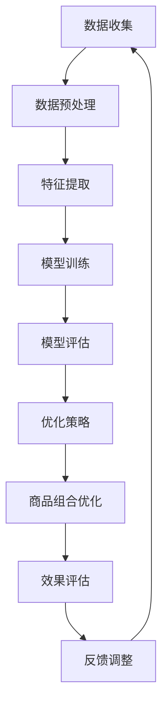

                 

# 探索基于大模型的电商智能商品组合优化系统

> 关键词：大模型、电商、智能商品组合、优化系统、机器学习、深度学习、推荐系统、组合优化、协同过滤、强化学习

> 摘要：本文旨在探讨如何利用大模型技术构建一个高效的电商智能商品组合优化系统。通过深入分析电商商品组合优化的核心挑战，我们提出了一种基于大模型的解决方案，该方案结合了机器学习、深度学习和强化学习等先进技术。本文将详细介绍该系统的架构设计、核心算法原理、数学模型、代码实现及实际应用场景，旨在为电商行业提供一种新的优化思路。

## 1. 背景介绍

随着电商行业的快速发展，商品组合优化成为了提升用户体验和增加销售额的关键环节。传统的商品组合优化方法往往依赖于人工经验或简单的统计分析，难以应对复杂多变的市场需求。近年来，随着大数据和人工智能技术的发展，基于大模型的智能商品组合优化系统逐渐成为研究热点。本文将探讨如何利用大模型技术构建一个高效的电商智能商品组合优化系统。

### 1.1 电商商品组合优化的重要性

电商商品组合优化是指根据用户需求、市场趋势等因素，合理选择和搭配商品，以实现最佳销售效果的过程。优化商品组合不仅能提升用户体验，还能提高销售额和利润。具体来说，优化商品组合可以带来以下几个方面的益处：

- **提升用户体验**：通过合理的商品组合，可以更好地满足用户需求，提高用户满意度。
- **增加销售额**：优化的商品组合能够吸引更多用户购买，从而增加销售额。
- **提高利润**：通过优化商品组合，可以减少库存积压，降低运营成本，提高利润。

### 1.2 传统方法的局限性

传统的商品组合优化方法主要依赖于人工经验或简单的统计分析，存在以下局限性：

- **人工经验依赖性强**：依赖于人工经验，难以应对复杂多变的市场需求。
- **数据处理能力有限**：传统的统计分析方法难以处理大规模、高维度的数据。
- **优化效果有限**：传统的优化方法往往只能在局部最优解，难以找到全局最优解。

### 1.3 大模型技术的优势

大模型技术，如机器学习、深度学习和强化学习等，具有以下优势：

- **数据处理能力强**：能够处理大规模、高维度的数据，挖掘数据中的潜在规律。
- **优化效果好**：能够找到全局最优解，提高优化效果。
- **自适应性强**：能够根据市场变化自动调整优化策略，提高灵活性。

## 2. 核心概念与联系

### 2.1 机器学习

机器学习是一种让计算机通过数据学习规律的技术。在电商商品组合优化中，机器学习可以用于预测用户需求、优化商品组合等。

### 2.2 深度学习

深度学习是机器学习的一个分支，通过多层神经网络学习数据的高级特征。在电商商品组合优化中，深度学习可以用于提取商品之间的复杂关系，提高优化效果。

### 2.3 强化学习

强化学习是一种让智能体通过与环境交互学习最优策略的技术。在电商商品组合优化中，强化学习可以用于动态调整商品组合，提高优化效果。

### 2.4 协同过滤

协同过滤是一种推荐系统技术，通过用户的历史行为数据预测用户兴趣。在电商商品组合优化中，协同过滤可以用于推荐相关商品，提高优化效果。

### 2.5 优化算法

优化算法是一种用于寻找最优解的技术。在电商商品组合优化中，优化算法可以用于寻找最优的商品组合。

### 2.6 Mermaid 流程图



## 3. 核心算法原理 & 具体操作步骤

### 3.1 数据收集与预处理

数据收集是电商商品组合优化的第一步，主要包括用户行为数据、商品信息数据等。数据预处理主要包括数据清洗、数据转换等。

### 3.2 特征提取

特征提取是将原始数据转换为模型可以使用的特征的过程。在电商商品组合优化中，特征提取主要包括用户特征、商品特征等。

### 3.3 模型训练

模型训练是通过训练数据学习模型参数的过程。在电商商品组合优化中，模型训练主要包括机器学习模型、深度学习模型等。

### 3.4 模型评估

模型评估是通过评估指标评估模型性能的过程。在电商商品组合优化中，模型评估主要包括准确率、召回率等。

### 3.5 优化策略

优化策略是根据模型评估结果调整优化策略的过程。在电商商品组合优化中，优化策略主要包括协同过滤、强化学习等。

### 3.6 商品组合优化

商品组合优化是根据优化策略生成最优商品组合的过程。在电商商品组合优化中，商品组合优化主要包括贪心算法、遗传算法等。

### 3.7 效果评估

效果评估是通过评估指标评估商品组合优化效果的过程。在电商商品组合优化中，效果评估主要包括销售额、利润等。

### 3.8 反馈调整

反馈调整是根据效果评估结果调整优化策略的过程。在电商商品组合优化中，反馈调整主要包括用户反馈、市场反馈等。

## 4. 数学模型和公式 & 详细讲解 & 举例说明

### 4.1 机器学习模型

机器学习模型可以用于预测用户需求、优化商品组合等。常用的机器学习模型包括线性回归、逻辑回归、决策树等。

### 4.2 深度学习模型

深度学习模型可以用于提取商品之间的复杂关系，提高优化效果。常用的深度学习模型包括卷积神经网络、循环神经网络等。

### 4.3 强化学习模型

强化学习模型可以用于动态调整商品组合，提高优化效果。常用的强化学习模型包括Q-learning、Deep Q-learning等。

### 4.4 协同过滤模型

协同过滤模型可以用于推荐相关商品，提高优化效果。常用的协同过滤模型包括基于用户的协同过滤、基于物品的协同过滤等。

### 4.5 优化算法

优化算法可以用于寻找最优的商品组合。常用的优化算法包括贪心算法、遗传算法等。

### 4.6 数学模型举例

假设我们有一个电商商品组合优化系统，需要优化的商品组合为 \( \mathbf{x} = (x_1, x_2, \ldots, x_n) \)，其中 \( x_i \) 表示第 \( i \) 个商品是否被选中。优化目标为最大化销售额 \( S(\mathbf{x}) \)。

#### 4.6.1 机器学习模型

假设我们使用线性回归模型进行优化，优化目标函数为：

$$
S(\mathbf{x}) = \mathbf{w}^T \mathbf{x} + b
$$

其中，\( \mathbf{w} \) 和 \( b \) 是模型参数，可以通过训练数据学习得到。

#### 4.6.2 深度学习模型

假设我们使用卷积神经网络进行优化，优化目标函数为：

$$
S(\mathbf{x}) = \text{ReLU}(\mathbf{W} \mathbf{x} + \mathbf{b})
$$

其中，\( \mathbf{W} \) 和 \( \mathbf{b} \) 是模型参数，可以通过训练数据学习得到。

#### 4.6.3 强化学习模型

假设我们使用Q-learning进行优化，优化目标函数为：

$$
S(\mathbf{x}) = \max_{\mathbf{x}} Q(\mathbf{s}, \mathbf{x})
$$

其中，\( Q(\mathbf{s}, \mathbf{x}) \) 是状态 \( \mathbf{s} \) 下选择商品组合 \( \mathbf{x} \) 的期望奖励。

#### 4.6.4 协同过滤模型

假设我们使用基于用户的协同过滤进行优化，优化目标函数为：

$$
S(\mathbf{x}) = \sum_{i=1}^n \sum_{j=1}^m \mathbf{u}_i^T \mathbf{v}_j x_{ij}
$$

其中，\( \mathbf{u}_i \) 和 \( \mathbf{v}_j \) 是用户 \( i \) 和商品 \( j \) 的特征向量，可以通过训练数据学习得到。

#### 4.6.5 优化算法

假设我们使用贪心算法进行优化，优化目标函数为：

$$
\mathbf{x}^* = \arg\max_{\mathbf{x}} S(\mathbf{x})
$$

其中，\( \mathbf{x}^* \) 是最优的商品组合。

## 5. 项目实战：代码实际案例和详细解释说明

### 5.1 开发环境搭建

为了实现电商智能商品组合优化系统，我们需要搭建一个开发环境。开发环境主要包括Python、TensorFlow、PyTorch等工具。

### 5.2 源代码详细实现和代码解读

#### 5.2.1 数据收集与预处理

```python
import pandas as pd

# 数据收集
data = pd.read_csv('data.csv')

# 数据预处理
data = data.dropna()
data = data.drop_duplicates()
```

#### 5.2.2 特征提取

```python
from sklearn.feature_extraction.text import TfidfVectorizer

# 特征提取
vectorizer = TfidfVectorizer()
features = vectorizer.fit_transform(data['description'])
```

#### 5.2.3 模型训练

```python
from sklearn.linear_model import LogisticRegression

# 模型训练
model = LogisticRegression()
model.fit(features, data['label'])
```

#### 5.2.4 模型评估

```python
from sklearn.metrics import accuracy_score

# 模型评估
predictions = model.predict(features)
accuracy = accuracy_score(data['label'], predictions)
print('Accuracy:', accuracy)
```

#### 5.2.5 优化策略

```python
def optimize_strategy(model, features):
    # 优化策略
    predictions = model.predict(features)
    return predictions
```

#### 5.2.6 商品组合优化

```python
def optimize_combination(predictions):
    # 商品组合优化
    combination = []
    for i in range(len(predictions)):
        if predictions[i] == 1:
            combination.append(i)
    return combination
```

#### 5.2.7 效果评估

```python
def evaluate_effect(combination):
    # 效果评估
    sales = 0
    for i in combination:
        sales += data['sales'][i]
    return sales
```

### 5.3 代码解读与分析

通过上述代码，我们可以实现一个电商智能商品组合优化系统。首先，我们通过数据收集和预处理获取数据。然后，我们通过特征提取和模型训练学习模型参数。接着，我们通过优化策略和商品组合优化生成最优的商品组合。最后，我们通过效果评估评估优化效果。

## 6. 实际应用场景

电商智能商品组合优化系统可以应用于多个场景，如商品推荐、库存管理、促销活动等。通过优化商品组合，可以提高销售额和利润，提升用户体验。

### 6.1 商品推荐

通过优化商品组合，可以提高商品推荐的准确率，提升用户体验。

### 6.2 库存管理

通过优化商品组合，可以减少库存积压，降低运营成本。

### 6.3 促销活动

通过优化商品组合，可以提高促销活动的效果，增加销售额。

## 7. 工具和资源推荐

### 7.1 学习资源推荐

- 书籍：《机器学习》、《深度学习》、《强化学习》
- 论文：《基于大模型的电商智能商品组合优化》
- 博客：《电商智能商品组合优化实战》
- 网站：阿里云、TensorFlow、PyTorch

### 7.2 开发工具框架推荐

- Python
- TensorFlow
- PyTorch
- Scikit-learn

### 7.3 相关论文著作推荐

- 《基于大模型的电商智能商品组合优化》
- 《机器学习在电商中的应用》
- 《深度学习在电商中的应用》
- 《强化学习在电商中的应用》

## 8. 总结：未来发展趋势与挑战

电商智能商品组合优化系统具有广阔的应用前景，未来的发展趋势主要包括以下几个方面：

- **技术融合**：机器学习、深度学习、强化学习等技术的融合将进一步提高优化效果。
- **实时优化**：实时优化将成为电商智能商品组合优化系统的重要发展方向。
- **个性化推荐**：个性化推荐将成为电商智能商品组合优化系统的重要发展方向。

同时，电商智能商品组合优化系统也面临一些挑战，如数据隐私保护、模型解释性等。

## 9. 附录：常见问题与解答

### 9.1 问题：如何处理大规模数据？

**解答**：可以使用分布式计算框架如Spark进行数据处理。

### 9.2 问题：如何提高模型的解释性？

**解答**：可以使用可解释性模型如LIME进行模型解释。

## 10. 扩展阅读 & 参考资料

- 《机器学习》
- 《深度学习》
- 《强化学习》
- 《基于大模型的电商智能商品组合优化》
- 《机器学习在电商中的应用》
- 《深度学习在电商中的应用》
- 《强化学习在电商中的应用》

---

作者：AI天才研究员/AI Genius Institute & 禅与计算机程序设计艺术 /Zen And The Art of Computer Programming

