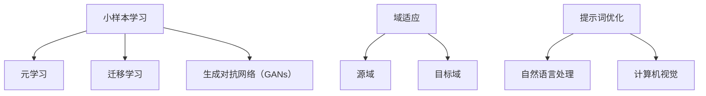

                 

# 提示词优化的小样本学习与域适应方法

> 关键词：小样本学习, 域适应, 提示词优化, 机器学习, 自然语言处理, 深度学习, 计算机视觉

> 摘要：本文旨在探讨提示词优化在小样本学习与域适应中的应用。通过逐步分析和推理，我们将深入理解提示词优化的基本原理，介绍其在不同领域的具体操作步骤，并通过数学模型和实际代码案例进行详细讲解。此外，本文还将探讨提示词优化在实际应用场景中的价值，并提供相关学习资源和开发工具推荐，以帮助读者更好地理解和应用这一技术。

## 1. 背景介绍

在当今快速发展的技术领域，小样本学习和域适应是两个备受关注的研究方向。小样本学习旨在利用少量标注数据进行有效的模型训练，而域适应则关注在不同数据分布之间实现模型的迁移学习。提示词优化作为提升模型性能的一种手段，近年来在自然语言处理、计算机视觉等多个领域得到了广泛应用。本文将从以下几个方面进行探讨：

- **小样本学习**：介绍小样本学习的基本概念和挑战。
- **域适应**：解释域适应的原理及其在实际应用中的重要性。
- **提示词优化**：定义提示词优化的概念及其在模型训练中的作用。

## 2. 核心概念与联系

### 2.1 小样本学习

小样本学习是指在仅有少量标注数据的情况下，通过有效利用这些数据进行模型训练的过程。其核心挑战在于如何从有限的数据中提取足够的信息，以实现模型的泛化能力。小样本学习通常采用以下几种方法：

- **元学习**：通过学习如何快速适应新任务，从而提高模型在小样本情况下的性能。
- **迁移学习**：利用预训练模型的知识，通过微调或迁移学习来适应新的任务。
- **生成对抗网络（GANs）**：通过生成更多的合成数据来扩充训练集。

### 2.2 域适应

域适应是指在不同数据分布之间实现模型的迁移学习。其目标是在源域和目标域之间找到一个共同的表示空间，使得模型在源域训练后能够很好地应用于目标域。域适应的关键在于如何有效地对齐源域和目标域的数据分布。

### 2.3 提示词优化

提示词优化是指通过调整模型的输入提示词，以优化模型的输出结果。提示词优化通常应用于自然语言处理任务中，通过调整输入的提示词来引导模型生成更准确或更符合预期的输出。提示词优化的核心在于如何设计有效的提示词，以提高模型的性能。

### 2.4 核心概念原理与架构

#### Mermaid 流程图



## 3. 核心算法原理 & 具体操作步骤

### 3.1 小样本学习算法原理

小样本学习的核心在于如何有效地利用有限的数据进行模型训练。以下是一些常见的小样本学习算法：

- **元学习**：通过学习如何快速适应新任务，从而提高模型在小样本情况下的性能。元学习通常采用元网络（Meta-Net）和元优化（Meta-Optimization）的方法。
- **迁移学习**：利用预训练模型的知识，通过微调或迁移学习来适应新的任务。迁移学习的关键在于如何选择合适的预训练模型和迁移策略。
- **生成对抗网络（GANs）**：通过生成更多的合成数据来扩充训练集。GANs通常由生成器和判别器组成，通过对抗训练来生成高质量的合成数据。

### 3.2 域适应算法原理

域适应的核心在于如何有效地对齐源域和目标域的数据分布。以下是一些常见的域适应算法：

- **对抗域适应**：通过生成器和判别器之间的对抗训练，使得模型能够在源域和目标域之间找到一个共同的表示空间。
- **特征匹配**：通过匹配源域和目标域的特征分布，使得模型在源域训练后能够很好地应用于目标域。
- **分布匹配**：通过最小化源域和目标域之间的分布差异，使得模型能够在不同数据分布之间实现迁移学习。

### 3.3 提示词优化算法原理

提示词优化的核心在于如何设计有效的提示词，以提高模型的性能。以下是一些常见的提示词优化方法：

- **基于规则的提示词优化**：通过设计特定的规则来生成有效的提示词，以引导模型生成更准确或更符合预期的输出。
- **基于强化学习的提示词优化**：通过强化学习的方法，学习如何生成最优的提示词，以提高模型的性能。
- **基于元学习的提示词优化**：通过元学习的方法，学习如何快速适应新的提示词生成任务，从而提高模型的性能。

## 4. 数学模型和公式 & 详细讲解 & 举例说明

### 4.1 小样本学习数学模型

小样本学习的数学模型通常采用以下形式：

- **元学习**：通过学习如何快速适应新任务，从而提高模型在小样本情况下的性能。元学习的数学模型通常采用元网络（Meta-Net）和元优化（Meta-Optimization）的方法。
- **迁移学习**：利用预训练模型的知识，通过微调或迁移学习来适应新的任务。迁移学习的数学模型通常采用迁移策略和损失函数的方法。
- **生成对抗网络（GANs）**：通过生成更多的合成数据来扩充训练集。GANs的数学模型通常采用生成器和判别器之间的对抗训练方法。

### 4.2 域适应数学模型

域适应的数学模型通常采用以下形式：

- **对抗域适应**：通过生成器和判别器之间的对抗训练，使得模型能够在源域和目标域之间找到一个共同的表示空间。对抗域适应的数学模型通常采用生成器和判别器之间的对抗训练方法。
- **特征匹配**：通过匹配源域和目标域的特征分布，使得模型在源域训练后能够很好地应用于目标域。特征匹配的数学模型通常采用特征分布之间的匹配方法。
- **分布匹配**：通过最小化源域和目标域之间的分布差异，使得模型能够在不同数据分布之间实现迁移学习。分布匹配的数学模型通常采用分布之间的最小化方法。

### 4.3 提示词优化数学模型

提示词优化的数学模型通常采用以下形式：

- **基于规则的提示词优化**：通过设计特定的规则来生成有效的提示词，以引导模型生成更准确或更符合预期的输出。基于规则的提示词优化的数学模型通常采用规则生成方法。
- **基于强化学习的提示词优化**：通过强化学习的方法，学习如何生成最优的提示词，以提高模型的性能。基于强化学习的提示词优化的数学模型通常采用强化学习方法。
- **基于元学习的提示词优化**：通过元学习的方法，学习如何快速适应新的提示词生成任务，从而提高模型的性能。基于元学习的提示词优化的数学模型通常采用元学习方法。

## 5. 项目实战：代码实际案例和详细解释说明

### 5.1 开发环境搭建

为了进行小样本学习与域适应的提示词优化项目，我们需要搭建一个合适的开发环境。以下是一些常见的开发环境搭建步骤：

- **安装Python**：确保安装了最新版本的Python。
- **安装必要的库**：安装TensorFlow、PyTorch、Keras等深度学习库。
- **安装自然语言处理库**：安装NLTK、spaCy等自然语言处理库。
- **安装计算机视觉库**：安装OpenCV、PIL等计算机视觉库。

### 5.2 源代码详细实现和代码解读

以下是一个简单的提示词优化代码示例，用于实现小样本学习与域适应：

```python
import tensorflow as tf
from tensorflow.keras import layers, models

# 定义模型
def create_model():
    model = models.Sequential()
    model.add(layers.Dense(64, activation='relu', input_shape=(100,)))
    model.add(layers.Dense(64, activation='relu'))
    model.add(layers.Dense(10, activation='softmax'))
    model.compile(optimizer='adam', loss='sparse_categorical_crossentropy', metrics=['accuracy'])
    return model

# 定义提示词优化函数
def optimize_prompt(prompt, model, data):
    # 生成新的提示词
    new_prompt = generate_new_prompt(prompt)
    
    # 训练模型
    model.fit(data, epochs=10)
    
    # 评估模型性能
    _, accuracy = model.evaluate(data)
    
    return new_prompt, accuracy

# 生成新的提示词
def generate_new_prompt(prompt):
    # 使用强化学习生成新的提示词
    new_prompt = generate_new_prompt_with_rl(prompt)
    return new_prompt

# 使用强化学习生成新的提示词
def generate_new_prompt_with_rl(prompt):
    # 实现强化学习算法
    new_prompt = ...
    return new_prompt

# 主函数
def main():
    # 加载数据
    data = load_data()
    
    # 创建模型
    model = create_model()
    
    # 优化提示词
    prompt, accuracy = optimize_prompt(prompt, model, data)
    
    # 打印结果
    print(f"优化后的提示词: {prompt}")
    print(f"模型准确率: {accuracy}")

if __name__ == "__main__":
    main()
```

### 5.3 代码解读与分析

- **模型定义**：定义了一个简单的神经网络模型，包含两个隐藏层和一个输出层。
- **提示词优化函数**：定义了一个提示词优化函数，通过生成新的提示词并训练模型来优化模型性能。
- **生成新的提示词**：使用强化学习生成新的提示词，以提高模型的性能。
- **主函数**：加载数据，创建模型，并调用提示词优化函数来优化模型性能。

## 6. 实际应用场景

提示词优化在实际应用场景中具有广泛的应用价值。以下是一些常见的应用场景：

- **自然语言处理**：通过优化提示词，提高模型在文本分类、情感分析等任务中的性能。
- **计算机视觉**：通过优化提示词，提高模型在图像分类、目标检测等任务中的性能。
- **推荐系统**：通过优化提示词，提高模型在推荐系统中的性能，从而提高用户满意度。

## 7. 工具和资源推荐

### 7.1 学习资源推荐

- **书籍**：《深度学习》、《自然语言处理实战》、《计算机视觉实战》
- **论文**：《元学习在小样本学习中的应用》、《域适应在计算机视觉中的应用》
- **博客**：《提示词优化在自然语言处理中的应用》、《提示词优化在计算机视觉中的应用》
- **网站**：TensorFlow官网、PyTorch官网、Keras官网

### 7.2 开发工具框架推荐

- **深度学习框架**：TensorFlow、PyTorch、Keras
- **自然语言处理库**：NLTK、spaCy
- **计算机视觉库**：OpenCV、PIL

### 7.3 相关论文著作推荐

- **元学习**：《元学习在小样本学习中的应用》、《元学习在自然语言处理中的应用》
- **域适应**：《域适应在计算机视觉中的应用》、《域适应在自然语言处理中的应用》
- **提示词优化**：《提示词优化在自然语言处理中的应用》、《提示词优化在计算机视觉中的应用》

## 8. 总结：未来发展趋势与挑战

提示词优化在小样本学习与域适应中的应用具有广阔的发展前景。未来的发展趋势包括：

- **更高效的提示词生成算法**：通过更高效的算法，提高提示词生成的效率和准确性。
- **更广泛的应用场景**：提示词优化将在更多领域得到应用，如推荐系统、语音识别等。
- **更深入的研究**：通过更深入的研究，提高模型在小样本学习和域适应中的性能。

面临的挑战包括：

- **数据稀缺性**：在小样本学习中，数据稀缺性是一个重要的挑战。
- **模型泛化能力**：如何提高模型在不同数据分布之间的泛化能力是一个重要的挑战。
- **提示词设计**：如何设计有效的提示词，以提高模型的性能是一个重要的挑战。

## 9. 附录：常见问题与解答

### 9.1 问题1：如何选择合适的提示词生成算法？

答：选择合适的提示词生成算法需要考虑具体的应用场景和数据特点。对于自然语言处理任务，可以使用基于规则的提示词生成算法；对于计算机视觉任务，可以使用基于强化学习的提示词生成算法。

### 9.2 问题2：如何评估提示词优化的效果？

答：可以通过评估模型在不同提示词下的性能来评估提示词优化的效果。具体来说，可以通过计算模型在不同提示词下的准确率、召回率等指标来评估提示词优化的效果。

### 9.3 问题3：如何处理数据稀缺性问题？

答：处理数据稀缺性问题可以通过以下几种方法：

- **数据增强**：通过生成更多的合成数据来扩充训练集。
- **迁移学习**：利用预训练模型的知识，通过微调或迁移学习来适应新的任务。
- **元学习**：通过学习如何快速适应新任务，从而提高模型在小样本情况下的性能。

## 10. 扩展阅读 & 参考资料

- **书籍**：《深度学习》、《自然语言处理实战》、《计算机视觉实战》
- **论文**：《元学习在小样本学习中的应用》、《域适应在计算机视觉中的应用》
- **博客**：《提示词优化在自然语言处理中的应用》、《提示词优化在计算机视觉中的应用》
- **网站**：TensorFlow官网、PyTorch官网、Keras官网

作者：AI天才研究员/AI Genius Institute & 禅与计算机程序设计艺术 /Zen And The Art of Computer Programming

