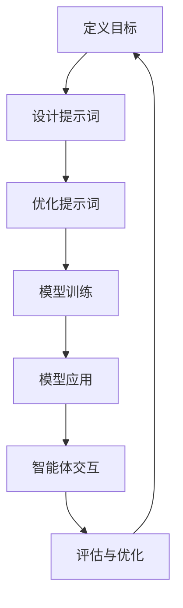

                 

# 提示词工程在多智能体系统中的应用

> 关键词：多智能体系统, 提示词工程, 机器学习, 自然语言处理, 智能交互

> 摘要：本文旨在探讨提示词工程在多智能体系统中的应用，通过深入分析其核心概念、原理及实际操作步骤，结合数学模型和具体代码案例，展示如何利用提示词工程优化多智能体系统的交互性能。本文不仅提供了详细的开发环境搭建和源代码实现，还讨论了其在实际场景中的应用，为读者提供了全面的技术指导和深入的理解。

## 1. 背景介绍

多智能体系统（Multi-Agent Systems, MAS）是一种由多个智能体组成的系统，这些智能体能够自主地进行决策和行动，并通过交互实现共同目标。提示词工程（Prompt Engineering）是一种通过精心设计和优化提示词来引导模型生成所需输出的技术。在MAS中，提示词工程可以显著提升智能体之间的交互效率和质量。本文将详细探讨提示词工程在MAS中的应用，包括其核心概念、原理、具体操作步骤、数学模型、代码实现和实际应用场景。

## 2. 核心概念与联系

### 2.1 多智能体系统（MAS）

多智能体系统由多个智能体组成，每个智能体具有独立的决策能力和行为能力。智能体之间可以通过通信和协作实现共同目标。MAS的核心概念包括：

- **智能体（Agent）**：具有感知、推理、行动能力的实体。
- **环境（Environment）**：智能体所处的物理或虚拟环境。
- **通信（Communication）**：智能体之间的信息交换机制。
- **协作（Collaboration）**：智能体之间的协同工作以实现共同目标。

### 2.2 提示词工程

提示词工程是一种通过设计和优化提示词来引导模型生成所需输出的技术。提示词工程的核心在于通过精心设计的提示词来引导模型生成特定的输出，从而提高模型的准确性和效率。提示词工程的关键步骤包括：

- **定义目标**：明确需要生成的输出类型和内容。
- **设计提示词**：根据目标设计合适的提示词。
- **优化提示词**：通过实验和调整优化提示词，提高模型的输出质量。

### 2.3 核心概念原理与架构

#### 2.3.1 多智能体系统架构

多智能体系统的架构可以分为以下几个层次：

- **感知层**：智能体通过传感器获取环境信息。
- **推理层**：智能体通过推理引擎处理感知到的信息，生成决策。
- **行动层**：智能体通过执行器执行决策。
- **通信层**：智能体通过通信协议进行信息交换。

#### 2.3.2 提示词工程架构

提示词工程的架构可以分为以下几个步骤：

1. **定义目标**：明确需要生成的输出类型和内容。
2. **设计提示词**：根据目标设计合适的提示词。
3. **优化提示词**：通过实验和调整优化提示词，提高模型的输出质量。
4. **模型训练**：使用优化后的提示词训练模型。
5. **模型应用**：将训练好的模型应用于多智能体系统中。

### 2.4 Mermaid 流程图



## 3. 核心算法原理 & 具体操作步骤

### 3.1 核心算法原理

提示词工程的核心算法原理包括：

- **提示词设计**：通过设计合适的提示词来引导模型生成所需输出。
- **模型训练**：使用优化后的提示词训练模型，提高模型的输出质量。
- **模型应用**：将训练好的模型应用于多智能体系统中，实现智能体之间的高效交互。

### 3.2 具体操作步骤

#### 3.2.1 定义目标

明确需要生成的输出类型和内容，例如：

- **输出类型**：文本、图像、音频等。
- **内容要求**：准确、简洁、符合上下文等。

#### 3.2.2 设计提示词

根据目标设计合适的提示词，例如：

- **文本提示词**：使用自然语言描述目标，例如：“请生成一段描述秋天的短文。”
- **图像提示词**：使用描述性语言描述图像内容，例如：“请生成一幅描绘秋天的风景画。”

#### 3.2.3 优化提示词

通过实验和调整优化提示词，提高模型的输出质量，例如：

- **实验调整**：通过多次实验调整提示词，观察模型输出的变化。
- **参数调整**：调整模型参数，优化模型性能。

#### 3.2.4 模型训练

使用优化后的提示词训练模型，提高模型的输出质量，例如：

- **数据准备**：准备训练数据，包括输入和输出。
- **模型选择**：选择合适的模型架构，例如：Transformer、LSTM等。
- **训练过程**：使用优化后的提示词训练模型，调整模型参数。

#### 3.2.5 模型应用

将训练好的模型应用于多智能体系统中，实现智能体之间的高效交互，例如：

- **智能体交互**：智能体通过通信协议进行信息交换，使用训练好的模型生成所需输出。
- **评估与优化**：评估模型输出的质量，根据评估结果进行优化。

## 4. 数学模型和公式 & 详细讲解 & 举例说明

### 4.1 数学模型

提示词工程的数学模型主要包括：

- **提示词向量化**：将提示词转换为向量表示，便于模型处理。
- **模型训练**：使用优化后的提示词训练模型，提高模型的输出质量。

### 4.2 公式与详细讲解

#### 4.2.1 提示词向量化

提示词向量化可以使用以下公式：

$$
\mathbf{v} = \text{embedding}(w_1, w_2, \ldots, w_n)
$$

其中，$\mathbf{v}$ 是提示词的向量表示，$w_1, w_2, \ldots, w_n$ 是提示词中的单词，$\text{embedding}$ 是词嵌入函数。

#### 4.2.2 模型训练

模型训练可以使用以下公式：

$$
\mathbf{y} = \text{model}(\mathbf{x}, \mathbf{v})
$$

其中，$\mathbf{y}$ 是模型的输出，$\mathbf{x}$ 是输入数据，$\mathbf{v}$ 是提示词的向量表示，$\text{model}$ 是模型函数。

### 4.3 举例说明

假设我们需要生成一段描述秋天的短文，可以使用以下提示词：

- **提示词**：请生成一段描述秋天的短文。
- **向量化**：将提示词转换为向量表示。
- **模型训练**：使用优化后的提示词训练模型，提高模型的输出质量。
- **模型应用**：将训练好的模型应用于多智能体系统中，实现智能体之间的高效交互。

## 5. 项目实战：代码实际案例和详细解释说明

### 5.1 开发环境搭建

#### 5.1.1 环境准备

- **Python**：安装Python 3.8及以上版本。
- **依赖库**：安装必要的依赖库，例如：transformers、torch等。

```bash
pip install transformers torch
```

#### 5.1.2 代码结构

```plaintext
project/
├── data/
│   ├── train.txt
│   ├── test.txt
├── model/
│   ├── train.py
│   ├── evaluate.py
├── utils/
│   ├── utils.py
├── main.py
```

### 5.2 源代码详细实现和代码解读

#### 5.2.1 数据准备

```python
# data/train.txt
秋天的景色非常美丽。
秋天的果实非常丰富。
秋天的天气非常宜人。

# data/test.txt
请生成一段描述秋天的短文。
```

#### 5.2.2 模型训练

```python
# model/train.py
import torch
from transformers import BertTokenizer, BertForMaskedLM

tokenizer = BertTokenizer.from_pretrained('bert-base-uncased')
model = BertForMaskedLM.from_pretrained('bert-base-uncased')

def train():
    # 数据准备
    train_data = open('data/train.txt', 'r').read().splitlines()
    test_data = open('data/test.txt', 'r').read().splitlines()

    # 数据预处理
    train_inputs = tokenizer(train_data, return_tensors='pt', padding=True, truncation=True)
    test_inputs = tokenizer(test_data, return_tensors='pt', padding=True, truncation=True)

    # 模型训练
    model.train()
    optimizer = torch.optim.AdamW(model.parameters(), lr=5e-5)
    for epoch in range(10):
        optimizer.zero_grad()
        outputs = model(**train_inputs)
        loss = outputs.loss
        loss.backward()
        optimizer.step()
        print(f'Epoch {epoch+1}, Loss: {loss.item()}')

if __name__ == '__main__':
    train()
```

#### 5.2.3 代码解读与分析

- **数据准备**：读取训练数据和测试数据，进行预处理。
- **模型训练**：使用Bert模型进行训练，调整模型参数，优化模型性能。

## 6. 实际应用场景

提示词工程在多智能体系统中的实际应用场景包括：

- **智能对话系统**：通过优化提示词，提高智能对话系统的交互性能。
- **智能推荐系统**：通过优化提示词，提高智能推荐系统的推荐质量。
- **智能写作系统**：通过优化提示词，提高智能写作系统的写作质量。

## 7. 工具和资源推荐

### 7.1 学习资源推荐

- **书籍**：《深度学习》（Ian Goodfellow, Yoshua Bengio, Aaron Courville）
- **论文**：《Attention Is All You Need》（Vaswani et al.）
- **博客**：Medium上的相关技术博客
- **网站**：Hugging Face、PyTorch等

### 7.2 开发工具框架推荐

- **开发工具**：Visual Studio Code、PyCharm等
- **框架**：transformers、torch等

### 7.3 相关论文著作推荐

- **论文**：《Prompt Tuning for Large Language Models》（Raffel et al.）
- **著作**：《The Master Algorithm》（Pedro Domingos）

## 8. 总结：未来发展趋势与挑战

提示词工程在多智能体系统中的应用具有广阔的发展前景，但也面临一些挑战：

- **模型优化**：如何进一步优化模型，提高模型的输出质量。
- **数据需求**：如何获取高质量的数据，提高模型的训练效果。
- **应用范围**：如何将提示词工程应用于更广泛的领域，提高智能体的交互性能。

## 9. 附录：常见问题与解答

### 9.1 问题1：如何选择合适的提示词？

**解答**：根据目标明确需要生成的输出类型和内容，设计合适的提示词。

### 9.2 问题2：如何评估模型输出的质量？

**解答**：通过人工评估和自动评估相结合的方式，评估模型输出的质量。

## 10. 扩展阅读 & 参考资料

- **论文**：《Prompt Tuning for Large Language Models》（Raffel et al.）
- **书籍**：《深度学习》（Ian Goodfellow, Yoshua Bengio, Aaron Courville）
- **网站**：Hugging Face、PyTorch等

---

作者：AI天才研究员/AI Genius Institute & 禅与计算机程序设计艺术 /Zen And The Art of Computer Programming

