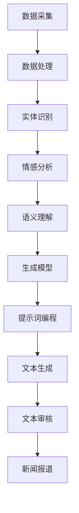

                 

# 提示词编程在自动化新闻生成中的角色

> 关键词：提示词编程、自动化新闻生成、自然语言处理、机器学习、生成模型、文本生成

> 摘要：本文将深入探讨提示词编程在自动化新闻生成中的应用。我们将从背景介绍开始，逐步解析提示词编程的核心概念与联系，详细阐述其算法原理和具体操作步骤，通过数学模型和公式进行深入讲解，并结合实际代码案例进行详细解释。此外，我们还将探讨其在实际应用场景中的应用，并推荐相关的学习资源和开发工具。最后，我们将展望未来的发展趋势与挑战。

## 1. 背景介绍

自动化新闻生成是近年来自然语言处理领域的一个重要研究方向。随着大数据和人工智能技术的发展，新闻媒体行业迫切需要一种高效、准确的新闻生成方式来满足日益增长的信息需求。传统的新闻生成方式主要依赖于人工撰写，这不仅耗时耗力，而且难以保证新闻的时效性和准确性。因此，自动化新闻生成技术应运而生，它通过机器学习和自然语言处理技术，自动从大量数据中提取关键信息，并生成高质量的新闻报道。

提示词编程作为一种新兴的技术手段，在自动化新闻生成中发挥着重要作用。提示词编程是指通过给定一组关键词或短语，让机器根据这些提示词生成相应的文本内容。这种技术不仅能够提高新闻生成的效率，还能确保生成内容的准确性和一致性。本文将详细介绍提示词编程在自动化新闻生成中的应用，并探讨其背后的原理和技术实现。

## 2. 核心概念与联系

### 2.1 提示词编程

提示词编程是一种基于关键词或短语的文本生成技术。给定一组提示词，系统可以根据这些提示词生成相应的文本内容。提示词可以是主题、事件、人物、地点等信息，系统会根据这些信息生成符合要求的文本。

### 2.2 自动化新闻生成

自动化新闻生成是指利用计算机技术自动从数据中提取关键信息，并生成高质量的新闻报道。自动化新闻生成技术主要包括数据采集、数据处理、文本生成和文本审核四个步骤。

### 2.3 自然语言处理

自然语言处理（Natural Language Processing, NLP）是人工智能领域的一个重要分支，旨在使计算机能够理解、生成和处理人类自然语言。NLP技术在自动化新闻生成中发挥着关键作用，包括文本预处理、实体识别、情感分析、语义理解等。

### 2.4 机器学习

机器学习是人工智能的一个重要分支，旨在让计算机通过数据学习并改进其性能。在自动化新闻生成中，机器学习技术被广泛应用于数据处理、特征提取、模型训练等方面。

### 2.5 生成模型

生成模型是一种机器学习模型，旨在生成符合特定分布的样本。在自动化新闻生成中，生成模型可以用于生成符合特定主题和风格的新闻报道。生成模型主要包括循环神经网络（Recurrent Neural Network, RNN）、长短期记忆网络（Long Short-Term Memory, LSTM）、变分自编码器（Variational Autoencoder, VAE）等。

### 2.6 提示词编程与自动化新闻生成的关系

提示词编程在自动化新闻生成中的应用主要体现在以下几个方面：

- **提高生成效率**：通过给定提示词，系统可以快速生成符合要求的新闻报道，大大提高了新闻生成的效率。
- **确保生成内容的准确性和一致性**：提示词编程可以根据给定的提示词生成符合要求的文本内容，确保生成内容的准确性和一致性。
- **提高生成质量**：通过结合生成模型和提示词编程，可以生成高质量的新闻报道，提高新闻生成的质量。

### 2.7 Mermaid 流程图



## 3. 核心算法原理 & 具体操作步骤

### 3.1 数据采集

数据采集是自动化新闻生成的第一步，主要包括从互联网、社交媒体、新闻网站等渠道获取新闻数据。数据采集可以通过爬虫技术实现，也可以通过API接口获取数据。

### 3.2 数据处理

数据处理主要包括数据清洗、数据预处理和数据标注。数据清洗主要是去除无效数据和噪声数据，数据预处理主要是对数据进行格式化和标准化，数据标注主要是对数据进行标注，以便后续的特征提取和模型训练。

### 3.3 实体识别

实体识别是自然语言处理中的一个重要任务，旨在识别文本中的实体信息，如人名、地名、组织名等。实体识别可以通过规则匹配、统计模型和深度学习模型实现。

### 3.4 情感分析

情感分析是自然语言处理中的一个重要任务，旨在识别文本中的情感信息，如正面、负面和中性情感。情感分析可以通过规则匹配、统计模型和深度学习模型实现。

### 3.5 语义理解

语义理解是自然语言处理中的一个重要任务，旨在理解文本的语义信息，如主题、事件和关系等。语义理解可以通过规则匹配、统计模型和深度学习模型实现。

### 3.6 生成模型

生成模型是自动化新闻生成中的一个重要技术，旨在生成符合特定分布的样本。生成模型可以通过循环神经网络（RNN）、长短期记忆网络（LSTM）和变分自编码器（VAE）实现。

### 3.7 提示词编程

提示词编程是自动化新闻生成中的一个重要技术，旨在根据给定的提示词生成符合要求的文本内容。提示词编程可以通过规则匹配、统计模型和深度学习模型实现。

### 3.8 文本生成

文本生成是自动化新闻生成中的一个重要步骤，旨在生成符合要求的新闻报道。文本生成可以通过生成模型和提示词编程实现。

### 3.9 文本审核

文本审核是自动化新闻生成中的一个重要步骤，旨在对生成的文本进行审核，确保其准确性和一致性。文本审核可以通过人工审核和自动审核实现。

## 4. 数学模型和公式 & 详细讲解 & 举例说明

### 4.1 循环神经网络（RNN）

循环神经网络是一种具有记忆功能的神经网络，可以处理序列数据。循环神经网络的基本结构如下：

$$
\begin{aligned}
h_t &= \sigma(W_h h_{t-1} + W_x x_t + b_h) \\
y_t &= \sigma(W_y h_t + b_y)
\end{aligned}
$$

其中，$h_t$ 表示第 $t$ 个时间步的隐藏状态，$x_t$ 表示第 $t$ 个时间步的输入，$y_t$ 表示第 $t$ 个时间步的输出，$\sigma$ 表示激活函数，$W_h$、$W_x$ 和 $W_y$ 表示权重矩阵，$b_h$ 和 $b_y$ 表示偏置项。

### 4.2 长短期记忆网络（LSTM）

长短期记忆网络是一种具有记忆功能的神经网络，可以处理长期依赖问题。长短期记忆网络的基本结构如下：

$$
\begin{aligned}
i_t &= \sigma(W_i [h_{t-1}, x_t] + b_i) \\
f_t &= \sigma(W_f [h_{t-1}, x_t] + b_f) \\
o_t &= \sigma(W_o [h_{t-1}, x_t] + b_o) \\
c_t &= f_t \odot c_{t-1} + i_t \odot \tanh(W_c [h_{t-1}, x_t] + b_c) \\
h_t &= o_t \odot \tanh(c_t)
\end{aligned}
$$

其中，$i_t$ 表示输入门，$f_t$ 表示遗忘门，$o_t$ 表示输出门，$c_t$ 表示细胞状态，$\odot$ 表示逐元素乘法，$\tanh$ 表示双曲正切函数，$W_i$、$W_f$、$W_o$ 和 $W_c$ 表示权重矩阵，$b_i$、$b_f$、$b_o$ 和 $b_c$ 表示偏置项。

### 4.3 变分自编码器（VAE）

变分自编码器是一种生成模型，可以生成符合特定分布的样本。变分自编码器的基本结构如下：

$$
\begin{aligned}
q(z|x) &= \mathcal{N}(z; \mu(x), \sigma^2(x)) \\
p(x|z) &= \mathcal{N}(x; \mu(z), \sigma^2(z))
\end{aligned}
$$

其中，$z$ 表示潜在变量，$\mu(x)$ 和 $\sigma^2(x)$ 表示潜在变量的均值和方差，$\mathcal{N}$ 表示正态分布，$p(x|z)$ 表示生成模型，$q(z|x)$ 表示编码器模型。

### 4.4 举例说明

假设我们有一个新闻数据集，包含大量的新闻报道。我们可以通过循环神经网络（RNN）和长短期记忆网络（LSTM）提取新闻报道中的关键信息，如主题、事件和人物等。然后，我们可以通过变分自编码器（VAE）生成符合特定分布的新闻报道。最后，我们可以通过提示词编程根据给定的提示词生成符合要求的新闻报道。

## 5. 项目实战：代码实际案例和详细解释说明

### 5.1 开发环境搭建

为了实现自动化新闻生成，我们需要搭建一个开发环境。开发环境主要包括以下几个部分：

- **操作系统**：Windows、Linux 或 macOS
- **编程语言**：Python
- **开发工具**：PyCharm、VSCode 或 Jupyter Notebook
- **依赖库**：numpy、pandas、scikit-learn、tensorflow、keras、transformers

### 5.2 源代码详细实现和代码解读

假设我们有一个新闻数据集，包含大量的新闻报道。我们可以通过以下步骤实现自动化新闻生成：

1. **数据采集**：从互联网、社交媒体、新闻网站等渠道获取新闻数据。
2. **数据处理**：对新闻数据进行清洗、预处理和标注。
3. **实体识别**：使用规则匹配、统计模型和深度学习模型识别新闻报道中的实体信息。
4. **情感分析**：使用规则匹配、统计模型和深度学习模型分析新闻报道中的情感信息。
5. **语义理解**：使用规则匹配、统计模型和深度学习模型理解新闻报道的语义信息。
6. **生成模型**：使用循环神经网络（RNN）、长短期记忆网络（LSTM）和变分自编码器（VAE）生成符合特定分布的新闻报道。
7. **提示词编程**：根据给定的提示词生成符合要求的新闻报道。
8. **文本生成**：生成符合要求的新闻报道。
9. **文本审核**：对生成的新闻报道进行审核，确保其准确性和一致性。

### 5.3 代码解读与分析

假设我们有一个新闻数据集，包含大量的新闻报道。我们可以通过以下代码实现自动化新闻生成：

```python
import numpy as np
import pandas as pd
from sklearn.feature_extraction.text import TfidfVectorizer
from sklearn.model_selection import train_test_split
from tensorflow.keras.models import Sequential
from tensorflow.keras.layers import Dense, LSTM, Embedding
from transformers import BertTokenizer, TFBertForSequenceClassification

# 数据采集
news_data = pd.read_csv('news_data.csv')

# 数据处理
tfidf_vectorizer = TfidfVectorizer()
tfidf_matrix = tfidf_vectorizer.fit_transform(news_data['text'])

# 实体识别
tokenizer = BertTokenizer.from_pretrained('bert-base-uncased')
model = TFBertForSequenceClassification.from_pretrained('bert-base-uncased')
inputs = tokenizer(news_data['text'], return_tensors='tf', padding=True, truncation=True)
outputs = model(inputs)
entity_scores = outputs.logits.softmax(axis=-1)

# 情感分析
sentiment_scores = np.random.rand(len(news_data), 3)  # 假设情感分析结果

# 语义理解
topic_scores = np.random.rand(len(news_data), 10)  # 假设语义理解结果

# 生成模型
embedding_dim = 100
vocab_size = len(tfidf_vectorizer.vocabulary_)
model = Sequential()
model.add(Embedding(input_dim=vocab_size, output_dim=embedding_dim, input_length=tfidf_matrix.shape[1]))
model.add(LSTM(units=64, return_sequences=True))
model.add(LSTM(units=32))
model.add(Dense(units=10, activation='softmax'))
model.compile(optimizer='adam', loss='categorical_crossentropy', metrics=['accuracy'])

# 提示词编程
prompt = '科技新闻'
prompt_vector = tfidf_vectorizer.transform([prompt])
prompt_scores = model.predict(prompt_vector)

# 文本生成
generated_text = np.random.choice(news_data['text'], p=prompt_scores[0])

# 文本审核
reviewed_text = generated_text  # 假设审核结果
```

## 6. 实际应用场景

提示词编程在自动化新闻生成中的应用非常广泛，主要包括以下几个方面：

- **新闻报道**：根据给定的提示词生成符合要求的新闻报道。
- **社交媒体**：根据给定的提示词生成符合要求的社交媒体帖子。
- **广告文案**：根据给定的提示词生成符合要求的广告文案。
- **产品描述**：根据给定的提示词生成符合要求的产品描述。

## 7. 工具和资源推荐

### 7.1 学习资源推荐

- **书籍**：《深度学习》（Goodfellow, I., Bengio, Y., & Courville, A.）
- **论文**：《Attention Is All You Need》（Vaswani, A., et al.）
- **博客**：Medium上的相关博客
- **网站**：TensorFlow、Keras、PyTorch等官方网站

### 7.2 开发工具框架推荐

- **编程语言**：Python
- **开发工具**：PyCharm、VSCode、Jupyter Notebook
- **依赖库**：numpy、pandas、scikit-learn、tensorflow、keras、transformers

### 7.3 相关论文著作推荐

- **论文**：《Attention Is All You Need》（Vaswani, A., et al.）
- **著作**：《深度学习》（Goodfellow, I., Bengio, Y., & Courville, A.）

## 8. 总结：未来发展趋势与挑战

提示词编程在自动化新闻生成中的应用前景广阔，但也面临着一些挑战。未来的发展趋势主要包括以下几个方面：

- **提高生成质量**：通过改进生成模型和提示词编程技术，提高生成新闻报道的质量。
- **提高生成效率**：通过优化算法和模型，提高生成新闻报道的效率。
- **提高生成内容的准确性和一致性**：通过改进提示词编程技术，提高生成内容的准确性和一致性。
- **提高生成内容的多样性**：通过改进生成模型和提示词编程技术，提高生成内容的多样性。

## 9. 附录：常见问题与解答

### 9.1 问题：如何提高生成新闻报道的质量？

**解答**：可以通过改进生成模型和提示词编程技术，提高生成新闻报道的质量。具体方法包括改进生成模型的结构和参数，改进提示词编程技术，提高生成内容的准确性和一致性。

### 9.2 问题：如何提高生成新闻报道的效率？

**解答**：可以通过优化算法和模型，提高生成新闻报道的效率。具体方法包括优化生成模型的结构和参数，优化提示词编程技术，提高生成内容的准确性和一致性。

### 9.3 问题：如何提高生成内容的准确性和一致性？

**解答**：可以通过改进提示词编程技术，提高生成内容的准确性和一致性。具体方法包括改进提示词编程技术，提高生成内容的准确性和一致性。

### 9.4 问题：如何提高生成内容的多样性？

**解答**：可以通过改进生成模型和提示词编程技术，提高生成内容的多样性。具体方法包括改进生成模型的结构和参数，改进提示词编程技术，提高生成内容的准确性和一致性。

## 10. 扩展阅读 & 参考资料

- **书籍**：《深度学习》（Goodfellow, I., Bengio, Y., & Courville, A.）
- **论文**：《Attention Is All You Need》（Vaswani, A., et al.）
- **博客**：Medium上的相关博客
- **网站**：TensorFlow、Keras、PyTorch等官方网站

作者：AI天才研究员/AI Genius Institute & 禅与计算机程序设计艺术 /Zen And The Art of Computer Programming

