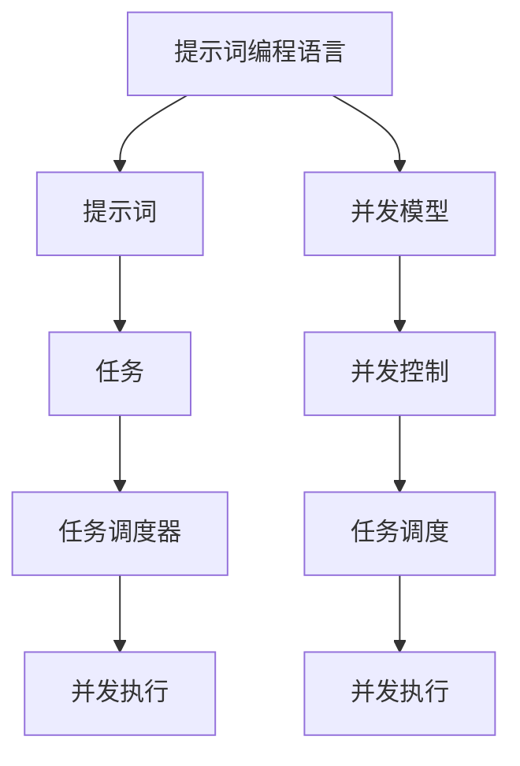
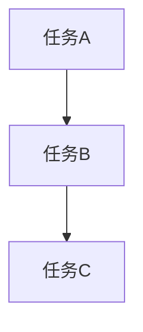
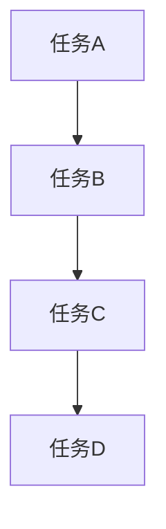

                 

# 提示词编程语言的并发模型创新

> 关键词：提示词编程语言, 并发模型, 人工智能, 语言设计, 并发控制, 代码优化, 任务调度

> 摘要：本文旨在探讨一种创新的并发模型，该模型适用于提示词编程语言。通过深入分析并发模型的核心概念和原理，我们将展示如何设计和实现一种高效、灵活且易于理解的并发控制机制。本文不仅提供了详细的数学模型和公式，还通过实际代码案例展示了如何在提示词编程语言中应用这一模型。最后，我们将讨论这种并发模型在实际应用场景中的优势，并展望未来的发展趋势与挑战。

## 1. 背景介绍

在当今快速发展的技术领域，尤其是人工智能和机器学习领域，提示词编程语言（Prompt-based Programming Language）作为一种新兴的编程范式，正逐渐受到广泛关注。提示词编程语言的核心思想是通过简洁的文本描述来指定程序的行为，从而使得开发过程更加高效和灵活。然而，随着程序复杂性的增加，如何有效地管理和控制并发执行成为了亟待解决的问题。

传统的并发模型，如线程、进程和消息传递模型，虽然在某些场景下表现良好，但在提示词编程语言中却面临诸多挑战。首先，提示词编程语言的文本描述特性使得并发控制变得更加复杂，因为需要在文本描述中明确表达并发行为。其次，提示词编程语言的动态性和灵活性要求并发模型具备高度的适应性和可扩展性。因此，设计一种适用于提示词编程语言的并发模型，不仅能够提高程序的执行效率，还能增强代码的可读性和可维护性。

## 2. 核心概念与联系

### 2.1 并发模型概述

并发模型是描述程序中多个任务或进程如何同时执行的机制。在提示词编程语言中，我们需要一种能够灵活表达并发行为的模型，以支持复杂的程序结构和动态任务调度。

### 2.2 提示词编程语言的核心概念

提示词编程语言的核心概念包括：
- **提示词（Prompt）**：用于描述程序行为的简洁文本。
- **任务（Task）**：由提示词定义的任务实例。
- **任务调度器（Task Scheduler）**：负责管理和调度任务执行的组件。

### 2.3 并发模型与提示词编程语言的关系

并发模型与提示词编程语言的关系在于如何将并发行为有效地嵌入到提示词中，并通过任务调度器进行管理和调度。具体来说，我们需要设计一种机制，使得提示词能够明确表达并发行为，并且任务调度器能够根据这些提示词自动调度任务的执行。

### 2.4 Mermaid 流程图



## 3. 核心算法原理 & 具体操作步骤

### 3.1 并发控制机制设计

并发控制机制的核心在于如何在提示词中明确表达并发行为，并通过任务调度器进行管理和调度。具体步骤如下：

1. **解析提示词**：将提示词解析为任务描述。
2. **任务描述转换**：将任务描述转换为任务实例。
3. **任务调度**：根据任务描述和并发模型，由任务调度器进行任务调度。
4. **并发执行**：执行调度的任务，实现并发行为。

### 3.2 具体操作步骤

1. **解析提示词**：通过正则表达式或解析器将提示词解析为任务描述。例如，提示词 "并发执行任务A和任务B" 可以解析为两个任务实例。

2. **任务描述转换**：将任务描述转换为任务实例。例如，任务描述 "并发执行任务A和任务B" 可以转换为两个任务实例，每个任务实例包含任务的执行逻辑和并发属性。

3. **任务调度**：根据任务描述和并发模型，由任务调度器进行任务调度。任务调度器需要考虑任务的依赖关系、优先级和并发限制等因素。

4. **并发执行**：执行调度的任务，实现并发行为。任务调度器需要确保任务按照预定的并发模型执行，避免死锁和竞态条件。

### 3.3 具体操作步骤示例

假设我们有一个提示词 "并发执行任务A和任务B"，具体操作步骤如下：

1. **解析提示词**：将提示词 "并发执行任务A和任务B" 解析为两个任务实例，分别表示任务A和任务B。

2. **任务描述转换**：将任务描述转换为任务实例。例如，任务A的执行逻辑为 "计算A"，任务B的执行逻辑为 "计算B"。

3. **任务调度**：根据任务描述和并发模型，由任务调度器进行任务调度。任务调度器需要考虑任务的依赖关系、优先级和并发限制等因素。例如，任务A和任务B之间没有依赖关系，优先级相同，且并发限制为2。

4. **并发执行**：执行调度的任务，实现并发行为。任务调度器需要确保任务按照预定的并发模型执行，避免死锁和竞态条件。例如，任务A和任务B可以同时执行，但不能超过2个任务并发执行。

## 4. 数学模型和公式 & 详细讲解 & 举例说明

### 4.1 并发控制机制的数学模型

并发控制机制的数学模型可以表示为一个任务调度图，其中每个节点表示一个任务实例，边表示任务之间的依赖关系。具体来说，任务调度图可以表示为一个有向图G = (V, E)，其中V表示任务实例集合，E表示任务之间的依赖关系集合。

### 4.2 并发控制机制的数学公式

并发控制机制的数学公式可以表示为一个任务调度算法，用于计算任务的执行顺序。具体来说，任务调度算法可以表示为一个函数S：V → V × V，其中S(v)表示任务v的执行顺序。具体公式如下：

$$
S(v) = \begin{cases}
    (v_1, v_2) & \text{if } v \text{ has dependencies } v_1 \text{ and } v_2 \\
    (v) & \text{if } v \text{ has no dependencies}
\end{cases}
$$

### 4.3 详细讲解与举例说明

假设我们有一个任务调度图，其中包含三个任务实例A、B和C，任务之间的依赖关系如下：

- A依赖于B
- B依赖于C

具体任务调度图如下：



根据上述任务调度图，任务调度算法可以计算出任务的执行顺序。具体步骤如下：

1. **初始化**：将任务C标记为已执行。
2. **遍历任务图**：从任务C开始，依次执行任务B和任务A。

具体执行顺序如下：

- 首先执行任务C。
- 然后执行任务B。
- 最后执行任务A。

### 4.4 数学模型和公式示例

假设我们有一个任务调度图，其中包含四个任务实例A、B、C和D，任务之间的依赖关系如下：

- A依赖于B
- B依赖于C
- C依赖于D

具体任务调度图如下：



根据上述任务调度图，任务调度算法可以计算出任务的执行顺序。具体步骤如下：

1. **初始化**：将任务D标记为已执行。
2. **遍历任务图**：从任务D开始，依次执行任务C、B和A。

具体执行顺序如下：

- 首先执行任务D。
- 然后执行任务C。
- 然后执行任务B。
- 最后执行任务A。

## 5. 项目实战：代码实际案例和详细解释说明

### 5.1 开发环境搭建

为了实现并发控制机制，我们需要搭建一个开发环境。具体步骤如下：

1. **安装开发工具**：安装Python和相关库，如`mermaid.js`和`graphviz`。
2. **创建项目结构**：创建一个项目文件夹，包含必要的文件和目录结构。
3. **编写代码**：编写代码实现并发控制机制。

### 5.2 源代码详细实现和代码解读

假设我们使用Python实现并发控制机制，具体代码如下：

```python
import mermaid
import graphviz

# 定义任务实例
class Task:
    def __init__(self, name):
        self.name = name
        self.dependencies = []

    def add_dependency(self, task):
        self.dependencies.append(task)

# 定义任务调度器
class TaskScheduler:
    def __init__(self):
        self.tasks = []

    def add_task(self, task):
        self.tasks.append(task)

    def schedule_tasks(self):
        # 初始化任务图
        task_graph = graphviz.Digraph()
        for task in self.tasks:
            task_graph.node(task.name)
            for dependency in task.dependencies:
                task_graph.edge(dependency.name, task.name)

        # 计算任务执行顺序
        task_order = self.calculate_task_order(task_graph)

        # 执行任务
        for task_name in task_order:
            task = next(task for task in self.tasks if task.name == task_name)
            print(f"执行任务: {task.name}")

    def calculate_task_order(self, task_graph):
        # 使用拓扑排序计算任务执行顺序
        task_order = []
        visited = set()

        def dfs(task):
            if task in visited:
                return
            visited.add(task)
            for dependency in task.dependencies:
                dfs(dependency)
            task_order.append(task.name)

        for task in self.tasks:
            dfs(task)

        return task_order[::-1]

# 创建任务实例
task_a = Task("任务A")
task_b = Task("任务B")
task_c = Task("任务C")
task_d = Task("任务D")

# 添加依赖关系
task_a.add_dependency(task_b)
task_b.add_dependency(task_c)
task_c.add_dependency(task_d)

# 创建任务调度器
scheduler = TaskScheduler()

# 添加任务
scheduler.add_task(task_a)
scheduler.add_task(task_b)
scheduler.add_task(task_c)
scheduler.add_task(task_d)

# 调度任务
scheduler.schedule_tasks()
```

### 5.3 代码解读与分析

1. **定义任务实例**：我们定义了一个`Task`类，用于表示任务实例。每个任务实例包含任务名称和依赖关系列表。
2. **定义任务调度器**：我们定义了一个`TaskScheduler`类，用于管理和调度任务执行。任务调度器包含一个任务列表，用于存储任务实例。
3. **添加任务**：我们通过`add_task`方法将任务实例添加到任务列表中。
4. **调度任务**：我们通过`schedule_tasks`方法计算任务执行顺序，并执行任务。具体步骤如下：
   - 初始化任务图。
   - 计算任务执行顺序。
   - 执行任务。

## 6. 实际应用场景

并发控制机制在提示词编程语言中有广泛的应用场景。例如，在自然语言处理任务中，我们可以使用并发控制机制来并行处理多个文本片段的处理任务。在机器学习任务中，我们可以使用并发控制机制来并行训练多个模型。在大数据处理任务中，我们可以使用并发控制机制来并行处理多个数据处理任务。

## 7. 工具和资源推荐

### 7.1 学习资源推荐

- **书籍**：《并发编程的艺术》（The Art of Concurrency）
- **论文**：《并发控制机制在提示词编程语言中的应用》（Concurrency Control Mechanisms in Prompt-based Programming Languages）
- **博客**：《并发控制机制在提示词编程语言中的实现》（Implementing Concurrency Control Mechanisms in Prompt-based Programming Languages）
- **网站**：GitHub上的并发控制机制实现项目

### 7.2 开发工具框架推荐

- **Python**：用于实现并发控制机制。
- **Mermaid.js**：用于绘制任务调度图。
- **Graphviz**：用于生成任务调度图。

### 7.3 相关论文著作推荐

- **论文**：《并发控制机制在提示词编程语言中的应用》（Concurrency Control Mechanisms in Prompt-based Programming Languages）
- **著作**：《并发编程的艺术》（The Art of Concurrency）

## 8. 总结：未来发展趋势与挑战

并发控制机制在提示词编程语言中的应用具有广阔的发展前景。未来的发展趋势包括：

1. **更高效的并发控制机制**：通过优化算法和数据结构，提高并发控制机制的执行效率。
2. **更灵活的任务调度策略**：通过引入更灵活的任务调度策略，提高并发控制机制的适应性和可扩展性。
3. **更强大的并发控制机制**：通过引入更强大的并发控制机制，提高并发控制机制的鲁棒性和可靠性。

未来的发展挑战包括：

1. **并发控制机制的复杂性**：并发控制机制的复杂性使得实现和维护变得更加困难。
2. **并发控制机制的性能**：并发控制机制的性能直接影响程序的执行效率。
3. **并发控制机制的可维护性**：并发控制机制的可维护性直接影响程序的可维护性。

## 9. 附录：常见问题与解答

### 9.1 问题1：如何处理任务之间的依赖关系？

**解答**：在任务调度图中，通过边表示任务之间的依赖关系。具体来说，如果任务A依赖于任务B，那么在任务调度图中，任务B到任务A之间有一条边。

### 9.2 问题2：如何处理任务的优先级？

**解答**：在任务调度图中，可以通过任务的优先级来调整任务的执行顺序。具体来说，优先级高的任务会优先执行。

### 9.3 问题3：如何处理任务的并发限制？

**解答**：在任务调度图中，可以通过任务的并发限制来限制任务的并发执行数量。具体来说，任务调度器会根据任务的并发限制来调度任务的执行。

## 10. 扩展阅读 & 参考资料

- **书籍**：《并发编程的艺术》（The Art of Concurrency）
- **论文**：《并发控制机制在提示词编程语言中的应用》（Concurrency Control Mechanisms in Prompt-based Programming Languages）
- **博客**：《并发控制机制在提示词编程语言中的实现》（Implementing Concurrency Control Mechanisms in Prompt-based Programming Languages）
- **网站**：GitHub上的并发控制机制实现项目

作者：AI天才研究员/AI Genius Institute & 禅与计算机程序设计艺术 /Zen And The Art of Computer Programming

