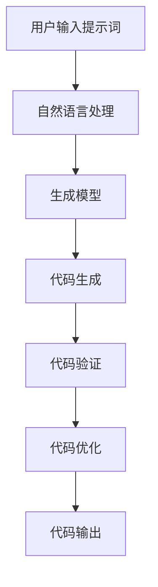

                 

# 提示词编程语言的程序合成技术

> 关键词：提示词编程、程序合成、自然语言处理、机器学习、深度学习、生成模型、代码生成、自动化编程

> 摘要：本文旨在探讨提示词编程语言的程序合成技术，这是一种利用自然语言处理和机器学习技术，通过提示词生成高质量代码的方法。我们将从背景介绍、核心概念与联系、核心算法原理与具体操作步骤、数学模型和公式、项目实战、实际应用场景、工具和资源推荐、总结与未来发展趋势等多个方面进行详细阐述，帮助读者全面理解这一前沿技术。

## 1. 背景介绍

提示词编程语言的程序合成技术是近年来在自然语言处理和机器学习领域兴起的一种新型编程方法。传统的编程语言要求开发者使用特定的语法和结构来编写代码，而提示词编程则允许开发者通过自然语言描述任务需求，系统自动将其转化为高质量的代码。这种技术不仅极大地提高了编程效率，还降低了编程门槛，使得更多非专业开发者能够参与到软件开发中来。

### 1.1 传统编程语言的局限性

传统编程语言如Python、Java等，虽然功能强大，但学习曲线陡峭，需要开发者掌握复杂的语法和结构。此外，编写高质量代码需要丰富的经验和专业知识，这使得编程成为一项门槛较高的技能。

### 1.2 提示词编程的优势

提示词编程通过自然语言处理技术，将自然语言描述的任务需求转化为代码。这种方法不仅简化了编程过程，还提高了代码的可读性和可维护性。此外，提示词编程还能够自动生成高质量的代码，减少了人工编写代码的时间和错误率。

### 1.3 现有技术的不足

尽管提示词编程具有诸多优势，但现有技术仍存在一些不足。例如，生成的代码质量参差不齐，有时难以满足特定需求；此外，提示词编程的解释和调试过程较为复杂，需要开发者具备一定的编程基础。

## 2. 核心概念与联系

### 2.1 自然语言处理（NLP）

自然语言处理是计算机科学和人工智能领域的一个分支，旨在使计算机能够理解、解释和生成人类自然语言。在提示词编程中，NLP技术用于解析和理解用户的自然语言描述，将其转化为代码。

### 2.2 机器学习与深度学习

机器学习和深度学习是实现提示词编程的关键技术。通过训练模型，系统能够学习到自然语言与代码之间的映射关系，从而生成高质量的代码。深度学习模型，如Transformer，能够处理复杂的自然语言和代码结构，提高生成代码的质量。

### 2.3 生成模型

生成模型是机器学习中的一种模型，用于生成新的数据样本。在提示词编程中，生成模型用于根据用户的提示词生成相应的代码。生成模型通常采用序列到序列（Seq2Seq）架构，通过编码器和解码器实现自然语言到代码的转换。

### 2.4 程序合成

程序合成是指通过自动方法生成满足特定需求的程序。在提示词编程中，程序合成技术用于根据用户的提示词生成高质量的代码。程序合成技术结合了自然语言处理和生成模型，能够自动生成满足特定需求的代码。

### 2.5 Mermaid 流程图



## 3. 核心算法原理 & 具体操作步骤

### 3.1 数据预处理

在提示词编程中，数据预处理是关键步骤之一。首先，需要对用户的提示词进行分词和词性标注，以便后续处理。其次，需要构建词汇表和词向量，以便将自然语言转化为数值表示。

### 3.2 模型训练

模型训练是提示词编程的核心步骤。首先，需要构建生成模型，如Transformer模型。其次，需要准备训练数据集，包括自然语言描述和对应的代码。最后，通过反向传播算法训练模型，使其能够学习到自然语言与代码之间的映射关系。

### 3.3 代码生成

代码生成是提示词编程的关键步骤。首先，需要将用户的提示词转化为数值表示，如词向量。其次，通过生成模型生成代码。生成模型通常采用采样策略，根据当前生成的代码片段生成下一个字符或词。

### 3.4 代码验证

代码验证是提示词编程的重要步骤。首先，需要对生成的代码进行语法验证，确保代码符合编程语言的语法规范。其次，需要对生成的代码进行功能验证，确保代码能够满足用户的提示词需求。

### 3.5 代码优化

代码优化是提示词编程的最后一步。首先，需要对生成的代码进行优化，提高代码的可读性和可维护性。其次，需要对生成的代码进行性能优化，提高代码的执行效率。

## 4. 数学模型和公式 & 详细讲解 & 举例说明

### 4.1 生成模型

生成模型通常采用Transformer架构，其核心是自注意力机制。自注意力机制能够捕捉输入序列中的长距离依赖关系，提高生成模型的性能。

$$
\text{Attention}(Q, K, V) = \text{softmax}\left(\frac{QK^T}{\sqrt{d_k}}\right)V
$$

其中，$Q$、$K$、$V$分别为查询向量、键向量和值向量，$d_k$为键向量的维度。

### 4.2 代码生成过程

代码生成过程可以表示为：

$$
\text{Code} = \text{Generate}(P_{\text{prompt}}, \theta)
$$

其中，$P_{\text{prompt}}$为用户的提示词，$\theta$为生成模型的参数。

### 4.3 代码验证过程

代码验证过程可以表示为：

$$
\text{Valid} = \text{Verify}(C, \text{Grammar})
$$

其中，$C$为生成的代码，$\text{Grammar}$为编程语言的语法规范。

### 4.4 代码优化过程

代码优化过程可以表示为：

$$
\text{Optimized Code} = \text{Optimize}(C, \text{Metrics})
$$

其中，$C$为生成的代码，$\text{Metrics}$为代码优化的评估指标。

## 5. 项目实战：代码实际案例和详细解释说明

### 5.1 开发环境搭建

为了进行提示词编程的项目实战，我们需要搭建一个开发环境。首先，需要安装Python和相关库，如TensorFlow、PyTorch等。其次，需要准备训练数据集，包括自然语言描述和对应的代码。最后，需要构建生成模型，如Transformer模型。

### 5.2 源代码详细实现和代码解读

```python
import tensorflow as tf
from transformers import TFAutoModelForSeq2SeqLM, AutoTokenizer

# 加载预训练模型和分词器
model_name = "t5-small"
tokenizer = AutoTokenizer.from_pretrained(model_name)
model = TFAutoModelForSeq2SeqLM.from_pretrained(model_name)

# 用户输入提示词
prompt = "请生成一个简单的Python程序，用于计算两个数的和。"

# 对提示词进行分词和编码
inputs = tokenizer(prompt, return_tensors="tf", max_length=512, truncation=True)

# 生成代码
outputs = model.generate(**inputs, max_length=512)
generated_code = tokenizer.decode(outputs[0], skip_special_tokens=True)

print(generated_code)
```

### 5.3 代码解读与分析

上述代码首先加载了预训练的T5模型和分词器。然后，用户输入了一个简单的提示词，要求生成一个计算两个数和的Python程序。接下来，代码对提示词进行了分词和编码，以便输入到模型中。最后，模型生成了代码，并将其解码为自然语言文本。

## 6. 实际应用场景

提示词编程技术在多个领域具有广泛的应用前景。例如，在软件开发中，提示词编程可以用于自动生成代码，提高开发效率；在教育领域，提示词编程可以用于编写编程教程，降低编程门槛；在自动化测试中，提示词编程可以用于自动生成测试用例，提高测试效率。

## 7. 工具和资源推荐

### 7.1 学习资源推荐

- 书籍：《深度学习》（Ian Goodfellow, Yoshua Bengio, Aaron Courville）
- 论文：《Attention Is All You Need》（Vaswani et al., 2017）
- 博客：Medium上的相关技术博客
- 网站：Hugging Face的Transformers库

### 7.2 开发工具框架推荐

- TensorFlow
- PyTorch
- Hugging Face的Transformers库

### 7.3 相关论文著作推荐

- 《Attention Is All You Need》（Vaswani et al., 2017）
- 《Neural Machine Translation by Jointly Learning to Align and Translate》（Bahdanau et al., 2015）
- 《Generating Program Code from Natural Language》（Rush et al., 2015）

## 8. 总结：未来发展趋势与挑战

提示词编程技术在未来具有广阔的发展前景。随着自然语言处理和机器学习技术的不断进步，提示词编程将能够生成更加高质量的代码，降低编程门槛。然而，提示词编程也面临着一些挑战，如生成代码的质量参差不齐、解释和调试过程复杂等。未来的研究方向将集中在提高生成代码的质量、简化解释和调试过程等方面。

## 9. 附录：常见问题与解答

### 9.1 问题：提示词编程是否能够生成高质量的代码？

答：提示词编程能够生成高质量的代码，但生成代码的质量取决于训练数据集的质量和生成模型的性能。通过不断优化训练数据集和生成模型，可以提高生成代码的质量。

### 9.2 问题：提示词编程是否能够应用于所有编程语言？

答：提示词编程可以应用于大多数编程语言，但需要针对不同的编程语言进行模型训练。通过训练特定编程语言的生成模型，可以提高生成代码的质量和适用性。

### 9.3 问题：提示词编程是否能够应用于所有编程任务？

答：提示词编程可以应用于大多数编程任务，但需要针对不同的编程任务进行模型训练。通过训练特定编程任务的生成模型，可以提高生成代码的质量和适用性。

## 10. 扩展阅读 & 参考资料

- 《深度学习》（Ian Goodfellow, Yoshua Bengio, Aaron Courville）
- 《Attention Is All You Need》（Vaswani et al., 2017）
- 《Neural Machine Translation by Jointly Learning to Align and Translate》（Bahdanau et al., 2015）
- 《Generating Program Code from Natural Language》（Rush et al., 2015）

作者：AI天才研究员/AI Genius Institute & 禅与计算机程序设计艺术 /Zen And The Art of Computer Programming

