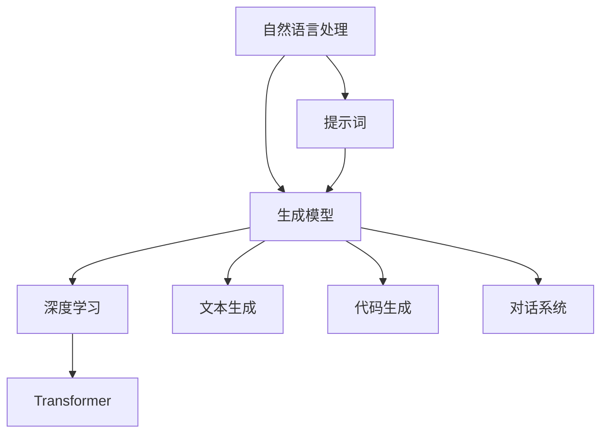

                 

# 提示词驱动的AI应用开发

> 关键词：提示词驱动、自然语言处理、生成模型、深度学习、Transformer、代码生成、文本生成

> 摘要：本文将深入探讨提示词驱动的AI应用开发，从核心概念到具体实现，再到实际应用场景，通过详细的步骤和案例分析，帮助读者理解如何利用提示词驱动的方法构建高效、灵活的AI应用。我们将介绍提示词驱动的基本原理，核心算法，数学模型，以及如何在实际项目中应用这些技术。通过本文，读者将能够掌握提示词驱动的AI应用开发的关键技术，并了解其未来的发展趋势和挑战。

## 1. 背景介绍

提示词驱动的AI应用开发是一种利用自然语言提示来生成或修改内容的技术。这种技术广泛应用于文本生成、代码生成、对话系统等领域。随着深度学习技术的发展，特别是Transformer模型的出现，提示词驱动的AI应用开发变得更加高效和灵活。本文将详细介绍提示词驱动的基本原理、核心算法、数学模型，并通过实际案例展示其应用。

## 2. 核心概念与联系

### 2.1 提示词驱动的基本原理

提示词驱动的基本原理是通过自然语言提示来引导AI生成或修改内容。这种技术的核心在于如何将自然语言提示转化为模型可以理解的输入，并通过模型生成相应的输出。提示词驱动的应用场景包括但不限于文本生成、代码生成、对话系统等。

### 2.2 核心概念与架构

提示词驱动的AI应用开发涉及多个核心概念和技术，包括自然语言处理（NLP）、生成模型、深度学习、Transformer等。下面通过Mermaid流程图展示这些概念之间的联系：



### 2.3 深入理解提示词驱动

提示词驱动的关键在于如何将自然语言提示转化为模型可以理解的输入。这通常通过以下步骤实现：

1. **自然语言处理（NLP）**：将自然语言提示转化为结构化的表示形式，如词向量、句子向量等。
2. **生成模型**：利用生成模型（如Transformer）生成或修改内容。
3. **深度学习**：通过深度学习技术优化生成模型的性能。
4. **Transformer**：利用Transformer模型实现高效的并行计算和自注意力机制。

## 3. 核心算法原理 & 具体操作步骤

### 3.1 自然语言处理（NLP）

自然语言处理是提示词驱动的核心步骤之一。通过NLP技术，将自然语言提示转化为模型可以理解的输入。具体操作步骤如下：

1. **文本预处理**：包括分词、词干提取、去除停用词等。
2. **词向量表示**：将文本转化为词向量表示，常用的方法有Word2Vec、GloVe等。
3. **句子向量表示**：将句子转化为句子向量表示，常用的方法有平均词向量、CBOW等。

### 3.2 生成模型

生成模型是提示词驱动的核心技术之一。通过生成模型，可以生成或修改内容。具体操作步骤如下：

1. **模型训练**：利用大量数据训练生成模型，如Transformer模型。
2. **模型推理**：利用训练好的模型进行推理，生成或修改内容。
3. **优化模型**：通过优化模型参数，提高生成内容的质量。

### 3.3 深度学习

深度学习是提示词驱动的核心技术之一。通过深度学习技术，可以优化生成模型的性能。具体操作步骤如下：

1. **模型架构设计**：设计适合生成任务的模型架构，如Transformer模型。
2. **模型训练**：利用大量数据训练模型，优化模型参数。
3. **模型评估**：通过评估指标评估模型性能，如BLEU、ROUGE等。

### 3.4 Transformer

Transformer是提示词驱动的核心技术之一。通过Transformer模型，可以实现高效的并行计算和自注意力机制。具体操作步骤如下：

1. **自注意力机制**：通过自注意力机制实现高效的并行计算。
2. **多头注意力机制**：通过多头注意力机制提高模型的表达能力。
3. **位置编码**：通过位置编码实现对序列位置的建模。

## 4. 数学模型和公式 & 详细讲解 & 举例说明

### 4.1 自然语言处理（NLP）

自然语言处理涉及多个数学模型和公式。以下是一些常用的数学模型和公式：

1. **词向量表示**：常用的词向量表示方法有Word2Vec和GloVe。Word2Vec的数学模型如下：

    $$ \mathbf{v}_w = \mathbf{U} \mathbf{u}_w $$

    其中，$\mathbf{v}_w$是词向量，$\mathbf{u}_w$是词的隐含向量，$\mathbf{U}$是权重矩阵。

2. **句子向量表示**：常用的句子向量表示方法有平均词向量和CBOW。平均词向量的数学模型如下：

    $$ \mathbf{v}_s = \frac{1}{N} \sum_{i=1}^{N} \mathbf{v}_{w_i} $$

    其中，$\mathbf{v}_s$是句子向量，$\mathbf{v}_{w_i}$是第$i$个词的向量，$N$是句子长度。

### 4.2 生成模型

生成模型涉及多个数学模型和公式。以下是一些常用的数学模型和公式：

1. **Transformer模型**：Transformer模型的数学模型如下：

    $$ \mathbf{z}_i = \text{MultiHead}( \text{LayerNorm}( \mathbf{z}_{i-1} ) ) $$

    其中，$\mathbf{z}_i$是第$i$个位置的输出，$\text{MultiHead}$是多头注意力机制，$\text{LayerNorm}$是层归一化。

2. **优化模型**：常用的优化方法有Adam和SGD。Adam的数学模型如下：

    $$ \mathbf{m}_t = \beta_1 \mathbf{m}_{t-1} + (1 - \beta_1) \nabla \mathbf{L} $$

    $$ \mathbf{v}_t = \beta_2 \mathbf{v}_{t-1} + (1 - \beta_2) \nabla \mathbf{L} $$

    $$ \hat{\mathbf{m}}_t = \frac{\mathbf{m}_t}{1 - \beta_1^t} $$

    $$ \hat{\mathbf{v}}_t = \frac{\mathbf{v}_t}{1 - \beta_2^t} $$

    $$ \mathbf{w}_t = \mathbf{w}_{t-1} - \alpha \frac{\hat{\mathbf{m}}_t}{\sqrt{\hat{\mathbf{v}}_t} + \epsilon} $$

    其中，$\mathbf{m}_t$是第$t$次迭代的动量，$\mathbf{v}_t$是第$t$次迭代的动量平方，$\hat{\mathbf{m}}_t$是动量的无偏估计，$\hat{\mathbf{v}}_t$是动量平方的无偏估计，$\alpha$是学习率，$\epsilon$是平滑项。

### 4.3 深度学习

深度学习涉及多个数学模型和公式。以下是一些常用的数学模型和公式：

1. **模型架构设计**：常用的模型架构设计方法有卷积神经网络（CNN）和循环神经网络（RNN）。卷积神经网络的数学模型如下：

    $$ \mathbf{z} = \sigma( \mathbf{W} \mathbf{x} + \mathbf{b} ) $$

    其中，$\mathbf{z}$是输出，$\mathbf{W}$是权重矩阵，$\mathbf{x}$是输入，$\mathbf{b}$是偏置项，$\sigma$是激活函数。

2. **模型训练**：常用的模型训练方法有反向传播和梯度下降。反向传播的数学模型如下：

    $$ \frac{\partial \mathbf{L}}{\partial \mathbf{w}} = \frac{\partial \mathbf{L}}{\partial \mathbf{z}} \cdot \frac{\partial \mathbf{z}}{\partial \mathbf{w}} $$

    其中，$\mathbf{L}$是损失函数，$\mathbf{w}$是权重，$\mathbf{z}$是输出。

3. **模型评估**：常用的模型评估方法有准确率、精确率、召回率和F1分数。准确率的数学模型如下：

    $$ \text{Accuracy} = \frac{\text{TP} + \text{TN}}{\text{TP} + \text{TN} + \text{FP} + \text{FN}} $$

    其中，$\text{TP}$是真正例，$\text{TN}$是真负例，$\text{FP}$是假正例，$\text{FN}$是假负例。

### 4.4 Transformer

Transformer涉及多个数学模型和公式。以下是一些常用的数学模型和公式：

1. **自注意力机制**：自注意力机制的数学模型如下：

    $$ \mathbf{Q} = \mathbf{W}_Q \mathbf{X} $$

    $$ \mathbf{K} = \mathbf{W}_K \mathbf{X} $$

    $$ \mathbf{V} = \mathbf{W}_V \mathbf{X} $$

    $$ \mathbf{Z} = \text{softmax} \left( \frac{\mathbf{Q} \mathbf{K}^T}{\sqrt{d_k}} \right) \mathbf{V} $$

    其中，$\mathbf{Q}$是查询向量，$\mathbf{K}$是键向量，$\mathbf{V}$是值向量，$\mathbf{X}$是输入，$\mathbf{W}_Q$、$\mathbf{W}_K$、$\mathbf{W}_V$是权重矩阵，$\mathbf{Z}$是输出，$d_k$是键向量的维度。

2. **多头注意力机制**：多头注意力机制的数学模型如下：

    $$ \mathbf{Z} = \text{Concat} \left( \text{head}_1, \text{head}_2, \ldots, \text{head}_h \right) \mathbf{W}_O $$

    其中，$\text{head}_i$是第$i$个头的输出，$\mathbf{W}_O$是权重矩阵，$\text{Concat}$是拼接操作。

3. **位置编码**：位置编码的数学模型如下：

    $$ \mathbf{P} = \text{positional\_encoding}(i) $$

    其中，$\mathbf{P}$是位置编码，$i$是位置索引。

## 5. 项目实战：代码实际案例和详细解释说明

### 5.1 开发环境搭建

为了实现提示词驱动的AI应用开发，我们需要搭建一个合适的开发环境。具体步骤如下：

1. **安装Python**：确保安装了Python 3.7及以上版本。
2. **安装依赖库**：安装必要的依赖库，如TensorFlow、PyTorch、transformers等。
3. **安装开发工具**：安装IDE或代码编辑器，如VSCode、PyCharm等。

### 5.2 源代码详细实现和代码解读

以下是一个简单的提示词驱动的文本生成模型的实现代码：

```python
import torch
from transformers import AutoTokenizer, AutoModelForCausalLM

# 加载预训练模型和分词器
tokenizer = AutoTokenizer.from_pretrained("distilgpt2")
model = AutoModelForCausalLM.from_pretrained("distilgpt2")

# 定义提示词
prompt = "今天天气"

# 将提示词转化为输入
input_ids = tokenizer.encode(prompt, return_tensors="pt")

# 生成文本
output = model.generate(input_ids, max_length=50, num_return_sequences=1)

# 解码生成的文本
generated_text = tokenizer.decode(output[0], skip_special_tokens=True)

print(generated_text)
```

### 5.3 代码解读与分析

1. **加载预训练模型和分词器**：使用`AutoTokenizer`和`AutoModelForCausalLM`加载预训练的GPT-2模型和分词器。
2. **定义提示词**：定义一个简单的提示词，如“今天天气”。
3. **将提示词转化为输入**：使用分词器将提示词转化为输入，输入格式为`pt`。
4. **生成文本**：使用模型生成文本，设置最大长度为50，生成一个序列。
5. **解码生成的文本**：使用分词器解码生成的文本，去除特殊标记。

## 6. 实际应用场景

提示词驱动的AI应用开发在多个领域都有广泛的应用。以下是一些实际应用场景：

1. **文本生成**：通过提示词生成高质量的文本，如新闻报道、文章摘要等。
2. **代码生成**：通过提示词生成代码，提高编程效率。
3. **对话系统**：通过提示词生成对话，实现自然语言对话系统。
4. **内容创作**：通过提示词生成创意内容，如诗歌、故事等。

## 7. 工具和资源推荐

### 7.1 学习资源推荐

1. **书籍**：《深度学习》（Ian Goodfellow, Yoshua Bengio, Aaron Courville）
2. **论文**：《Attention Is All You Need》（Vaswani et al., 2017）
3. **博客**：阿里云开发者社区（https://developer.aliyun.com/）
4. **网站**：Hugging Face（https://huggingface.co/）

### 7.2 开发工具框架推荐

1. **IDE**：PyCharm、VSCode
2. **框架**：TensorFlow、PyTorch、transformers

### 7.3 相关论文著作推荐

1. **论文**：《Attention Is All You Need》（Vaswani et al., 2017）
2. **著作**：《深度学习》（Ian Goodfellow, Yoshua Bengio, Aaron Courville）

## 8. 总结：未来发展趋势与挑战

提示词驱动的AI应用开发在未来将有以下几个发展趋势和挑战：

1. **性能优化**：通过优化模型架构和训练方法，提高生成内容的质量和效率。
2. **应用场景拓展**：将提示词驱动的应用扩展到更多领域，如医疗、金融等。
3. **安全性与隐私保护**：确保生成内容的安全性和隐私保护，避免滥用和泄露。
4. **伦理与法律问题**：解决提示词驱动应用的伦理和法律问题，确保其合规性。

## 9. 附录：常见问题与解答

### 9.1 问题1：如何选择合适的预训练模型？

**解答**：选择预训练模型时，可以根据任务需求和数据集大小进行选择。对于文本生成任务，可以选择GPT-2、BERT等模型。

### 9.2 问题2：如何优化生成模型的性能？

**解答**：可以通过优化模型架构、调整超参数、使用混合精度训练等方法优化生成模型的性能。

### 9.3 问题3：如何处理生成内容的安全性和隐私保护？

**解答**：可以通过数据脱敏、内容审查等方法处理生成内容的安全性和隐私保护问题。

## 10. 扩展阅读 & 参考资料

1. **书籍**：《深度学习》（Ian Goodfellow, Yoshua Bengio, Aaron Courville）
2. **论文**：《Attention Is All You Need》（Vaswani et al., 2017）
3. **网站**：Hugging Face（https://huggingface.co/）

---

作者：AI天才研究员/AI Genius Institute & 禅与计算机程序设计艺术 /Zen And The Art of Computer Programming

