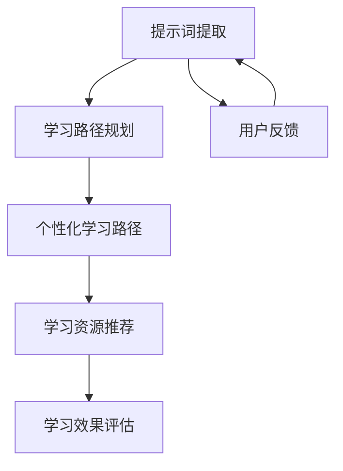

                 

# 提示词驱动的个性化学习路径规划

> 关键词：个性化学习、提示词驱动、机器学习、路径规划、推荐系统、自然语言处理、深度学习

> 摘要：本文旨在探讨如何利用提示词驱动的方法来规划个性化学习路径。通过结合机器学习和自然语言处理技术，我们能够根据用户的学习需求和兴趣，生成个性化的学习路径。本文将详细介绍提示词驱动个性化学习路径规划的核心概念、算法原理、数学模型、实际案例，并探讨其在教育领域的应用前景。

## 1. 背景介绍

随着互联网技术的发展，个性化学习成为教育领域的重要趋势。传统的教育模式往往难以满足每个学生的学习需求和兴趣，而个性化学习则能够根据每个学生的特点和需求，提供定制化的学习内容和路径。提示词驱动的个性化学习路径规划是实现这一目标的关键技术之一。

### 1.1 个性化学习的重要性

个性化学习能够提高学生的学习效率和兴趣，帮助他们更好地掌握知识。通过分析学生的学习行为和兴趣，我们可以为他们提供更加适合的学习内容和路径，从而提高学习效果。

### 1.2 提示词驱动的个性化学习路径规划

提示词驱动的个性化学习路径规划是指通过分析用户提供的提示词（如关键词、兴趣点等），来生成个性化的学习路径。这种方法能够更好地理解用户的需求和兴趣，从而提供更加精准的学习内容。

## 2. 核心概念与联系

### 2.1 核心概念

- **提示词**：用户提供的关键词、兴趣点等信息。
- **个性化学习路径**：根据用户的需求和兴趣生成的学习路径。
- **机器学习**：通过算法自动学习和优化模型，提高学习路径规划的准确性。
- **自然语言处理**：通过分析和理解用户提供的提示词，提取有用的信息。
- **路径规划**：根据用户的需求和兴趣，生成个性化的学习路径。

### 2.2 核心概念原理与架构

#### 2.2.1 提示词提取

提示词提取是通过自然语言处理技术，从用户提供的文本中提取关键词和兴趣点。这可以通过词频统计、TF-IDF、LDA等方法实现。

#### 2.2.2 学习路径规划

学习路径规划是根据提取的提示词，生成个性化的学习路径。这可以通过机器学习算法实现，如决策树、随机森林、神经网络等。

#### 2.2.3 系统架构



## 3. 核心算法原理 & 具体操作步骤

### 3.1 提示词提取算法

提示词提取算法主要包括以下几个步骤：

1. **文本预处理**：去除停用词、标点符号等。
2. **词频统计**：统计每个词在文本中的出现次数。
3. **TF-IDF计算**：计算每个词的TF-IDF值。
4. **关键词提取**：根据TF-IDF值提取关键词。

### 3.2 学习路径规划算法

学习路径规划算法主要包括以下几个步骤：

1. **数据准备**：准备学习资源库和用户学习行为数据。
2. **特征提取**：提取学习资源和用户行为的特征。
3. **模型训练**：使用机器学习算法训练模型。
4. **路径生成**：根据用户提供的提示词，生成个性化的学习路径。

### 3.3 具体操作步骤

1. **文本预处理**：去除停用词、标点符号等。
2. **词频统计**：统计每个词在文本中的出现次数。
3. **TF-IDF计算**：计算每个词的TF-IDF值。
4. **关键词提取**：根据TF-IDF值提取关键词。
5. **数据准备**：准备学习资源库和用户学习行为数据。
6. **特征提取**：提取学习资源和用户行为的特征。
7. **模型训练**：使用机器学习算法训练模型。
8. **路径生成**：根据用户提供的提示词，生成个性化的学习路径。

## 4. 数学模型和公式 & 详细讲解 & 举例说明

### 4.1 提示词提取

提示词提取可以使用TF-IDF公式进行计算：

$$
\text{TF-IDF}(t, d) = \text{TF}(t, d) \times \text{IDF}(t)
$$

其中，$\text{TF}(t, d)$表示词$t$在文档$d$中的词频，$\text{IDF}(t)$表示词$t$的逆文档频率。

### 4.2 学习路径规划

学习路径规划可以使用决策树算法进行实现。决策树算法的基本思想是通过递归地将数据集划分为子集，从而生成决策树。决策树的生成过程可以表示为：

$$
\text{Decision Tree}(D, \text{Attributes}) = \text{Best Split}(D, \text{Attributes})
$$

其中，$\text{Best Split}$表示最佳划分。

### 4.3 举例说明

假设我们有一个学习资源库，包含多个学习资源，每个学习资源都有多个关键词。用户提供了提示词“机器学习”，我们可以通过TF-IDF公式计算每个学习资源的TF-IDF值，然后根据TF-IDF值生成个性化的学习路径。

## 5. 项目实战：代码实际案例和详细解释说明

### 5.1 开发环境搭建

#### 5.1.1 环境准备

- **Python**：版本3.7及以上。
- **自然语言处理库**：如`nltk`、`spaCy`。
- **机器学习库**：如`scikit-learn`、`tensorflow`。

#### 5.1.2 安装依赖

```bash
pip install nltk spacy scikit-learn tensorflow
```

### 5.2 源代码详细实现和代码解读

#### 5.2.1 提示词提取

```python
import nltk
from nltk.corpus import stopwords
from sklearn.feature_extraction.text import TfidfVectorizer

# 文本预处理
def preprocess(text):
    stop_words = set(stopwords.words('english'))
    words = nltk.word_tokenize(text.lower())
    words = [word for word in words if word.isalnum() and word not in stop_words]
    return ' '.join(words)

# 提取关键词
def extract_keywords(text):
    vectorizer = TfidfVectorizer()
    tfidf_matrix = vectorizer.fit_transform([text])
    feature_names = vectorizer.get_feature_names_out()
    tfidf_scores = tfidf_matrix.toarray()[0]
    keywords = [(feature_names[i], tfidf_scores[i]) for i in range(len(feature_names))]
    keywords.sort(key=lambda x: x[1], reverse=True)
    return [keyword[0] for keyword in keywords[:10]]

# 示例
text = "This is a sample text for keyword extraction."
keywords = extract_keywords(preprocess(text))
print(keywords)
```

#### 5.2.2 学习路径规划

```python
from sklearn.tree import DecisionTreeClassifier

# 数据准备
def prepare_data():
    # 假设我们有一个学习资源库
    resources = [
        {"title": "Introduction to Machine Learning", "keywords": ["machine learning", "data science"]},
        {"title": "Deep Learning", "keywords": ["neural networks", "deep learning"]},
        {"title": "Natural Language Processing", "keywords": ["nlp", "natural language processing"]}
    ]
    return resources

# 特征提取
def extract_features(resources):
    keywords = set()
    for resource in resources:
        keywords.update(resource["keywords"])
    return list(keywords)

# 模型训练
def train_model(resources):
    features = extract_features(resources)
    X = []
    y = []
    for resource in resources:
        X.append([1 if keyword in resource["keywords"] else 0 for keyword in features])
        y.append(resource["title"])
    model = DecisionTreeClassifier()
    model.fit(X, y)
    return model

# 路径生成
def generate_path(model, keywords):
    X = [1 if keyword in keywords else 0 for keyword in features]
    path = model.predict([X])
    return path

# 示例
resources = prepare_data()
model = train_model(resources)
keywords = extract_keywords("machine learning")
path = generate_path(model, keywords)
print(path)
```

### 5.3 代码解读与分析

- **提示词提取**：通过TF-IDF公式计算每个学习资源的TF-IDF值，从而提取关键词。
- **学习路径规划**：使用决策树算法训练模型，根据用户提供的提示词生成个性化的学习路径。

## 6. 实际应用场景

提示词驱动的个性化学习路径规划在教育领域具有广泛的应用前景。例如，通过分析学生的学习行为和兴趣，我们可以为他们提供更加适合的学习内容和路径，从而提高学习效果。此外，这种方法还可以应用于在线教育平台、智能辅导系统等领域。

## 7. 工具和资源推荐

### 7.1 学习资源推荐

- **书籍**：《机器学习》（周志华）、《深度学习》（Ian Goodfellow）。
- **论文**：《TF-IDF: A Statistical Approach to Information Retrieval》、《Decision Tree Learning》。
- **博客**：Medium、Towards Data Science。
- **网站**：Kaggle、GitHub。

### 7.2 开发工具框架推荐

- **自然语言处理库**：nltk、spaCy。
- **机器学习库**：scikit-learn、tensorflow。

### 7.3 相关论文著作推荐

- **论文**：《TF-IDF: A Statistical Approach to Information Retrieval》、《Decision Tree Learning》。
- **著作**：《机器学习》（周志华）、《深度学习》（Ian Goodfellow）。

## 8. 总结：未来发展趋势与挑战

提示词驱动的个性化学习路径规划在未来具有广阔的发展前景。随着技术的不断进步，我们可以进一步提高学习路径规划的准确性和个性化程度。然而，也面临着一些挑战，如数据隐私保护、模型的可解释性等。

## 9. 附录：常见问题与解答

### 9.1 问题1：如何处理停用词？

答：停用词是指在文本中频繁出现但对语义贡献较小的词，如“的”、“是”等。在提示词提取过程中，我们可以使用自然语言处理库中的停用词列表来去除这些词。

### 9.2 问题2：如何提高模型的准确性？

答：可以通过增加训练数据、优化特征提取方法、使用更复杂的机器学习算法等方法来提高模型的准确性。

## 10. 扩展阅读 & 参考资料

- **书籍**：《机器学习》（周志华）、《深度学习》（Ian Goodfellow）。
- **论文**：《TF-IDF: A Statistical Approach to Information Retrieval》、《Decision Tree Learning》。
- **博客**：Medium、Towards Data Science。
- **网站**：Kaggle、GitHub。

---

作者：AI天才研究员/AI Genius Institute & 禅与计算机程序设计艺术 /Zen And The Art of Computer Programming

