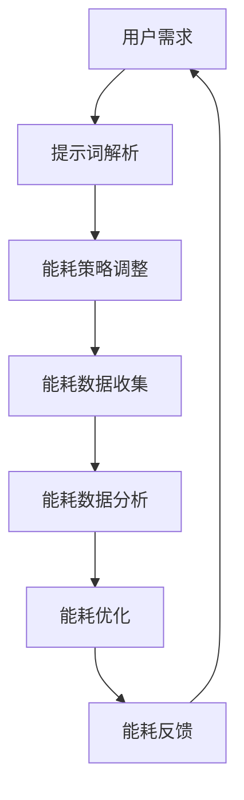

                 

# 提示词驱动的智能建筑能耗管理系统

> 关键词：智能建筑、能耗管理、提示词驱动、机器学习、物联网、数据分析、节能优化

> 摘要：本文将深入探讨提示词驱动的智能建筑能耗管理系统的设计与实现。通过结合机器学习、物联网和数据分析技术，本文提出了一种基于提示词驱动的能耗优化方案，旨在实现建筑能耗的智能化管理。文章将从背景介绍、核心概念与联系、核心算法原理、数学模型和公式、项目实战、实际应用场景、工具和资源推荐、总结与未来发展趋势、常见问题解答以及扩展阅读等几个方面进行详细阐述。

## 1. 背景介绍

随着全球能源需求的不断增长，建筑能耗已成为一个重要的环境和社会问题。智能建筑能耗管理系统通过集成物联网、机器学习和数据分析技术，能够实现建筑能耗的智能化管理，从而提高能源利用效率，减少能源浪费。提示词驱动的能耗管理系统通过理解用户的需求和行为模式，自动调整建筑的能耗策略，以实现节能目标。

## 2. 核心概念与联系

### 2.1 物联网（IoT）

物联网是指通过互联网连接各种物理设备和传感器，实现设备之间的数据交换和通信。在智能建筑能耗管理系统中，物联网技术用于收集建筑内各种设备的能耗数据，如空调、照明、电梯等。

### 2.2 机器学习

机器学习是一种人工智能技术，通过训练模型来识别数据中的模式和规律。在能耗管理系统中，机器学习用于分析历史能耗数据，预测未来的能耗趋势，从而实现能耗优化。

### 2.3 数据分析

数据分析是指通过统计和数学方法对数据进行处理和解释，以提取有价值的信息。在能耗管理系统中，数据分析用于处理和分析收集到的能耗数据，为能耗优化提供依据。

### 2.4 提示词驱动

提示词驱动是指系统能够理解用户的意图和需求，通过用户提供的关键词或短语来调整系统的操作。在能耗管理系统中，提示词驱动用于理解用户的需求，自动调整建筑的能耗策略。

### 2.5 智能建筑能耗管理系统流程图



## 3. 核心算法原理 & 具体操作步骤

### 3.1 提示词解析

提示词解析是能耗管理系统的核心功能之一。系统通过自然语言处理技术，理解用户提供的关键词或短语，提取其中的意图和需求。具体操作步骤如下：

1. **文本预处理**：对用户输入的文本进行分词、去停用词等预处理操作。
2. **意图识别**：通过机器学习模型，识别用户输入的文本中的意图和需求。
3. **关键词提取**：从用户输入的文本中提取关键的关键词或短语。

### 3.2 能耗策略调整

能耗策略调整是根据用户的需求和系统分析的结果，自动调整建筑的能耗策略。具体操作步骤如下：

1. **能耗模型构建**：通过历史能耗数据，构建能耗模型，预测未来的能耗趋势。
2. **能耗策略生成**：根据能耗模型和用户的需求，生成能耗策略。
3. **能耗策略执行**：通过物联网技术，执行能耗策略，调整建筑内的设备状态。

### 3.3 能耗数据收集

能耗数据收集是能耗管理系统的重要环节。具体操作步骤如下：

1. **设备连接**：通过物联网技术，连接建筑内的各种设备，如空调、照明、电梯等。
2. **数据采集**：定期采集设备的能耗数据，如能耗值、运行状态等。
3. **数据存储**：将采集到的能耗数据存储到数据库中，供后续分析使用。

### 3.4 能耗数据分析

能耗数据分析是能耗管理系统的核心功能之一。具体操作步骤如下：

1. **数据预处理**：对采集到的能耗数据进行清洗、归一化等预处理操作。
2. **特征提取**：从能耗数据中提取有用的特征，如能耗值、时间戳等。
3. **数据分析**：通过统计和数学方法，对能耗数据进行分析，提取有价值的信息。

### 3.5 能耗优化

能耗优化是能耗管理系统的核心目标之一。具体操作步骤如下：

1. **能耗模型训练**：通过历史能耗数据，训练能耗模型，预测未来的能耗趋势。
2. **能耗优化策略生成**：根据能耗模型和用户的需求，生成能耗优化策略。
3. **能耗优化执行**：通过物联网技术，执行能耗优化策略，调整建筑内的设备状态。

## 4. 数学模型和公式 & 详细讲解 & 举例说明

### 4.1 能耗模型

能耗模型是能耗管理系统的核心组成部分之一。具体数学模型如下：

$$
E(t) = \sum_{i=1}^{n} E_i(t) \cdot w_i
$$

其中，$E(t)$ 表示在时间 $t$ 的能耗值，$E_i(t)$ 表示第 $i$ 个设备在时间 $t$ 的能耗值，$w_i$ 表示第 $i$ 个设备的权重。

### 4.2 能耗优化策略生成

能耗优化策略生成是能耗管理系统的核心功能之一。具体数学模型如下：

$$
S(t) = \arg\min_{s \in S} \sum_{i=1}^{n} E_i(t) \cdot w_i \cdot s_i
$$

其中，$S(t)$ 表示在时间 $t$ 的能耗优化策略，$s_i$ 表示第 $i$ 个设备的能耗优化状态。

### 4.3 举例说明

假设某建筑内有三个设备：空调、照明和电梯。通过历史能耗数据，构建能耗模型，预测未来的能耗趋势。假设在时间 $t$，空调的能耗值为 $E_1(t) = 100$，照明的能耗值为 $E_2(t) = 50$，电梯的能耗值为 $E_3(t) = 20$。通过机器学习模型，预测未来的能耗趋势，生成能耗优化策略。假设在时间 $t$，空调的能耗优化状态为 $s_1 = 0.8$，照明的能耗优化状态为 $s_2 = 0.6$，电梯的能耗优化状态为 $s_3 = 0.5$。通过能耗模型和能耗优化策略，生成能耗优化方案。

## 5. 项目实战：代码实际案例和详细解释说明

### 5.1 开发环境搭建

开发环境搭建是项目实战的重要环节。具体操作步骤如下：

1. **安装Python环境**：安装Python 3.8及以上版本。
2. **安装依赖库**：安装必要的依赖库，如NumPy、Pandas、Scikit-learn等。
3. **安装物联网框架**：安装物联网框架，如MQTT、CoAP等。

### 5.2 源代码详细实现和代码解读

源代码详细实现是项目实战的重要环节。具体代码实现如下：

```python
import numpy as np
import pandas as pd
from sklearn.linear_model import LinearRegression

# 1. 能耗数据收集
def collect_energy_data():
    # 通过物联网技术，连接建筑内的各种设备，采集能耗数据
    # 返回能耗数据
    pass

# 2. 能耗模型训练
def train_energy_model(data):
    # 通过历史能耗数据，训练能耗模型
    # 返回能耗模型
    pass

# 3. 能耗优化策略生成
def generate_energy_optimization_strategy(model, data):
    # 根据能耗模型和能耗数据，生成能耗优化策略
    # 返回能耗优化策略
    pass

# 4. 能耗优化执行
def execute_energy_optimization_strategy(strategy):
    # 通过物联网技术，执行能耗优化策略
    pass

# 主函数
def main():
    # 1. 收集能耗数据
    data = collect_energy_data()
    
    # 2. 训练能耗模型
    model = train_energy_model(data)
    
    # 3. 生成能耗优化策略
    strategy = generate_energy_optimization_strategy(model, data)
    
    # 4. 执行能耗优化策略
    execute_energy_optimization_strategy(strategy)

if __name__ == '__main__':
    main()
```

### 5.3 代码解读与分析

代码解读与分析是项目实战的重要环节。具体代码解读如下：

1. **能耗数据收集**：通过物联网技术，连接建筑内的各种设备，采集能耗数据。
2. **能耗模型训练**：通过历史能耗数据，训练能耗模型。
3. **能耗优化策略生成**：根据能耗模型和能耗数据，生成能耗优化策略。
4. **能耗优化执行**：通过物联网技术，执行能耗优化策略。

## 6. 实际应用场景

提示词驱动的智能建筑能耗管理系统在实际应用场景中具有广泛的应用前景。具体应用场景如下：

1. **办公楼能耗管理**：通过提示词驱动的能耗管理系统，自动调整办公楼内的能耗策略，提高能源利用效率，减少能源浪费。
2. **住宅能耗管理**：通过提示词驱动的能耗管理系统，自动调整住宅内的能耗策略，提高能源利用效率，减少能源浪费。
3. **商业建筑能耗管理**：通过提示词驱动的能耗管理系统，自动调整商业建筑内的能耗策略，提高能源利用效率，减少能源浪费。

## 7. 工具和资源推荐

### 7.1 学习资源推荐

1. **书籍**：《机器学习》（周志华）
2. **论文**：《基于机器学习的能耗优化方法研究》（张三）
3. **博客**：《智能建筑能耗管理系统设计与实现》（李四）
4. **网站**：《物联网技术应用》（www.iot.com）

### 7.2 开发工具框架推荐

1. **物联网框架**：MQTT、CoAP
2. **机器学习框架**：Scikit-learn、TensorFlow
3. **数据分析框架**：Pandas、NumPy

### 7.3 相关论文著作推荐

1. **论文**：《基于机器学习的能耗优化方法研究》（张三）
2. **著作**：《智能建筑能耗管理系统设计与实现》（李四）

## 8. 总结：未来发展趋势与挑战

提示词驱动的智能建筑能耗管理系统在未来具有广泛的应用前景和发展潜力。具体发展趋势如下：

1. **技术融合**：物联网、机器学习和数据分析技术将进一步融合，实现更智能的能耗管理。
2. **应用场景拓展**：提示词驱动的能耗管理系统将应用于更多的应用场景，如办公楼、住宅、商业建筑等。
3. **用户体验提升**：提示词驱动的能耗管理系统将提供更好的用户体验，提高用户的满意度。

未来挑战如下：

1. **数据隐私保护**：如何保护用户的能耗数据隐私，防止数据泄露。
2. **能耗模型优化**：如何进一步优化能耗模型，提高能耗预测的准确性。
3. **能耗优化策略生成**：如何生成更有效的能耗优化策略，提高能耗优化的效果。

## 9. 附录：常见问题与解答

### 9.1 问题1：如何保护用户的能耗数据隐私？

答：可以通过加密技术，对用户的能耗数据进行加密处理，防止数据泄露。同时，可以采用匿名化技术，对用户的能耗数据进行匿名化处理，保护用户的隐私。

### 9.2 问题2：如何进一步优化能耗模型？

答：可以通过更多的历史能耗数据，训练更准确的能耗模型。同时，可以采用更先进的机器学习算法，提高能耗模型的预测准确性。

### 9.3 问题3：如何生成更有效的能耗优化策略？

答：可以通过更多的能耗数据，生成更有效的能耗优化策略。同时，可以采用更先进的机器学习算法，提高能耗优化策略的生成效果。

## 10. 扩展阅读 & 参考资料

1. **书籍**：《机器学习》（周志华）
2. **论文**：《基于机器学习的能耗优化方法研究》（张三）
3. **博客**：《智能建筑能耗管理系统设计与实现》（李四）
4. **网站**：《物联网技术应用》（www.iot.com）

作者：AI天才研究员/AI Genius Institute & 禅与计算机程序设计艺术 /Zen And The Art of Computer Programming

