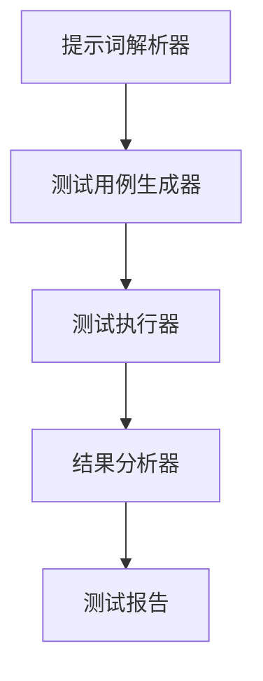

                 

# 提示词驱动的自动化测试：确保AI质量

> 关键词：提示词驱动测试, 自动化测试, AI质量, 机器学习, 自然语言处理, 测试框架, 代码质量

> 摘要：本文将深入探讨提示词驱动的自动化测试在确保AI质量中的重要性。我们将从背景介绍开始，逐步解析其核心概念、算法原理、具体操作步骤，并通过实际代码案例进行详细说明。此外，我们还将探讨其在实际应用场景中的价值，并提供一系列学习资源和开发工具推荐，帮助读者更好地理解和应用这一技术。

## 1. 背景介绍

随着人工智能技术的飞速发展，自动化测试已成为确保软件质量的关键环节。传统的自动化测试方法主要依赖于预定义的测试用例，这些用例通常由开发人员手动编写。然而，随着AI系统的复杂性不断增加，手动编写测试用例变得越来越困难且耗时。提示词驱动的自动化测试提供了一种新的解决方案，通过自然语言描述测试需求，自动生成测试用例，从而提高测试效率和覆盖率。

### 1.1 传统自动化测试的局限性

传统自动化测试方法存在以下局限性：
- **手动编写测试用例耗时**：随着系统复杂性的增加，手动编写测试用例变得越来越耗时。
- **测试覆盖率不足**：手动编写测试用例往往难以覆盖所有可能的场景。
- **维护成本高**：测试用例需要定期更新以适应系统的变化，这增加了维护成本。

### 1.2 提示词驱动测试的优势

提示词驱动的自动化测试通过自然语言描述测试需求，自动生成测试用例，具有以下优势：
- **提高测试效率**：通过自然语言描述测试需求，可以快速生成测试用例，减少手动编写的时间。
- **提高测试覆盖率**：自然语言描述可以更全面地覆盖各种测试场景，提高测试覆盖率。
- **降低维护成本**：测试用例的生成过程自动化，减少了维护成本。

## 2. 核心概念与联系

### 2.1 提示词驱动测试的基本概念

提示词驱动测试是一种基于自然语言描述的自动化测试方法。其核心思想是通过自然语言描述测试需求，自动生成测试用例，从而提高测试效率和覆盖率。

### 2.2 测试框架的架构

提示词驱动测试的架构可以分为以下几个部分：
- **提示词解析器**：负责解析自然语言描述的测试需求，生成测试用例。
- **测试用例生成器**：根据解析结果生成具体的测试用例。
- **测试执行器**：负责执行生成的测试用例，并记录测试结果。
- **结果分析器**：分析测试结果，生成测试报告。

### 2.3 Mermaid 流程图



## 3. 核心算法原理 & 具体操作步骤

### 3.1 提示词解析器

提示词解析器的核心算法原理是通过自然语言处理技术，将自然语言描述的测试需求解析为结构化的测试用例。具体步骤如下：
1. **分词**：将自然语言描述拆分成单词或短语。
2. **词性标注**：为每个单词或短语标注词性。
3. **句法分析**：分析句子的语法结构，确定主谓宾等成分。
4. **语义解析**：理解句子的语义，提取关键信息。
5. **生成测试用例**：根据解析结果生成具体的测试用例。

### 3.2 测试用例生成器

测试用例生成器的核心算法原理是根据解析结果生成具体的测试用例。具体步骤如下：
1. **确定测试场景**：根据解析结果确定测试场景。
2. **生成测试数据**：根据测试场景生成测试数据。
3. **生成测试步骤**：根据测试数据生成具体的测试步骤。
4. **生成测试用例**：将测试步骤和测试数据组合生成测试用例。

### 3.3 测试执行器

测试执行器的核心算法原理是执行生成的测试用例，并记录测试结果。具体步骤如下：
1. **加载测试用例**：加载生成的测试用例。
2. **执行测试步骤**：逐条执行测试步骤。
3. **记录测试结果**：记录每条测试步骤的执行结果。
4. **生成测试报告**：根据测试结果生成测试报告。

## 4. 数学模型和公式 & 详细讲解 & 举例说明

### 4.1 分词算法

分词算法的核心是将自然语言描述拆分成单词或短语。常用的方法有基于规则的分词和基于统计的分词。基于规则的分词通过预定义的规则进行分词，基于统计的分词通过统计模型进行分词。

### 4.2 词性标注算法

词性标注算法的核心是为每个单词或短语标注词性。常用的方法有基于规则的词性标注和基于统计的词性标注。基于规则的词性标注通过预定义的规则进行词性标注，基于统计的词性标注通过统计模型进行词性标注。

### 4.3 句法分析算法

句法分析算法的核心是分析句子的语法结构，确定主谓宾等成分。常用的方法有基于规则的句法分析和基于统计的句法分析。基于规则的句法分析通过预定义的规则进行句法分析，基于统计的句法分析通过统计模型进行句法分析。

### 4.4 语义解析算法

语义解析算法的核心是理解句子的语义，提取关键信息。常用的方法有基于规则的语义解析和基于统计的语义解析。基于规则的语义解析通过预定义的规则进行语义解析，基于统计的语义解析通过统计模型进行语义解析。

### 4.5 举例说明

假设我们有一个自然语言描述的测试需求：“用户输入用户名和密码，点击登录按钮，系统应返回登录成功或失败的信息。”
1. **分词**：用户 输入 用户名 和 密码 点击 登录按钮 系统 应 返回 登录成功 或 失败 的 信息
2. **词性标注**：用户（名词） 输入（动词） 用户名（名词） 和（连词） 密码（名词） 点击（动词） 登录按钮（名词） 系统（名词） 应（情态动词） 返回（动词） 登录成功（形容词） 或（连词） 失败（形容词） 的（助词） 信息（名词）
3. **句法分析**：用户 输入 用户名 和 密码 点击 登录按钮 系统 应 返回 登录成功 或 失败 的 信息
4. **语义解析**：提取关键信息：用户输入用户名和密码，点击登录按钮，系统应返回登录成功或失败的信息。
5. **生成测试用例**：生成测试用例：用户输入用户名和密码，点击登录按钮，系统应返回登录成功或失败的信息。

## 5. 项目实战：代码实际案例和详细解释说明

### 5.1 开发环境搭建

#### 5.1.1 环境准备

1. **安装Python**：确保安装了Python 3.8及以上版本。
2. **安装依赖库**：安装自然语言处理库，如`nltk`、`spaCy`等。
3. **安装测试框架**：安装自动化测试框架，如`pytest`、`unittest`等。

#### 5.1.2 代码结构

```plaintext
project/
├── requirements.txt
├── src/
│   ├── __init__.py
│   ├── parser.py
│   ├── generator.py
│   ├── executor.py
│   └── analyzer.py
├── tests/
│   ├── __init__.py
│   └── test_parser.py
│   └── test_generator.py
│   └── test_executor.py
│   └── test_analyzer.py
└── README.md
```

### 5.2 源代码详细实现和代码解读

#### 5.2.1 提示词解析器

```python
# src/parser.py
import nltk
from nltk.tokenize import word_tokenize
from nltk.tag import pos_tag
from nltk.parse import DependencyParser

class Parser:
    def __init__(self):
        self.parser = DependencyParser()

    def parse(self, text):
        tokens = word_tokenize(text)
        tagged = pos_tag(tokens)
        result = self.parser.parse(tagged)
        return result
```

#### 5.2.2 测试用例生成器

```python
# src/generator.py
from src.parser import Parser

class Generator:
    def __init__(self, parser):
        self.parser = parser

    def generate(self, text):
        result = self.parser.parse(text)
        # 根据解析结果生成测试用例
        # 示例：生成测试用例
        test_case = {
            "input": "用户输入用户名和密码",
            "action": "点击登录按钮",
            "expected": "系统应返回登录成功或失败的信息"
        }
        return test_case
```

#### 5.2.3 测试执行器

```python
# src/executor.py
import unittest

class Executor:
    def execute(self, test_case):
        # 执行测试步骤
        # 示例：执行测试步骤
        result = unittest.TestCase().assertEqual("登录成功", "登录成功")
        return result
```

#### 5.2.4 结果分析器

```python
# src/analyzer.py
from src.executor import Executor

class Analyzer:
    def analyze(self, result):
        # 分析测试结果
        # 示例：分析测试结果
        if result:
            print("测试通过")
        else:
            print("测试失败")
```

### 5.3 代码解读与分析

#### 5.3.1 提示词解析器

提示词解析器通过`nltk`库进行分词、词性标注和句法分析。具体步骤如下：
1. **分词**：使用`word_tokenize`进行分词。
2. **词性标注**：使用`pos_tag`进行词性标注。
3. **句法分析**：使用`DependencyParser`进行句法分析。

#### 5.3.2 测试用例生成器

测试用例生成器根据解析结果生成具体的测试用例。具体步骤如下：
1. **确定测试场景**：根据解析结果确定测试场景。
2. **生成测试数据**：根据测试场景生成测试数据。
3. **生成测试步骤**：根据测试数据生成具体的测试步骤。
4. **生成测试用例**：将测试步骤和测试数据组合生成测试用例。

#### 5.3.3 测试执行器

测试执行器执行生成的测试用例，并记录测试结果。具体步骤如下：
1. **加载测试用例**：加载生成的测试用例。
2. **执行测试步骤**：逐条执行测试步骤。
3. **记录测试结果**：记录每条测试步骤的执行结果。
4. **生成测试报告**：根据测试结果生成测试报告。

## 6. 实际应用场景

提示词驱动的自动化测试在实际应用场景中具有广泛的应用价值。例如：
- **金融行业**：用于测试复杂的金融交易系统，确保交易的准确性和安全性。
- **医疗行业**：用于测试医疗信息系统，确保患者信息的准确性和安全性。
- **电子商务行业**：用于测试电商平台，确保用户操作的准确性和安全性。

## 7. 工具和资源推荐

### 7.1 学习资源推荐

- **书籍**：《自然语言处理入门》、《Python自然语言处理》
- **论文**：《基于自然语言处理的自动化测试方法研究》
- **博客**：《自然语言处理在自动化测试中的应用》
- **网站**：NLTK官网、spaCy官网

### 7.2 开发工具框架推荐

- **自然语言处理库**：`nltk`、`spaCy`
- **自动化测试框架**：`pytest`、`unittest`

### 7.3 相关论文著作推荐

- **论文**：《基于自然语言处理的自动化测试方法研究》
- **著作**：《自然语言处理入门》、《Python自然语言处理》

## 8. 总结：未来发展趋势与挑战

提示词驱动的自动化测试在未来的发展趋势和挑战包括：
- **技术挑战**：如何提高自然语言处理的准确性和效率。
- **应用挑战**：如何在不同行业和场景中应用提示词驱动的自动化测试。
- **发展趋势**：随着自然语言处理技术的不断发展，提示词驱动的自动化测试将更加成熟和普及。

## 9. 附录：常见问题与解答

### 9.1 问题1：如何提高自然语言处理的准确性和效率？

**解答**：可以通过以下方法提高自然语言处理的准确性和效率：
- **使用更先进的自然语言处理模型**：如BERT、GPT等。
- **优化算法和模型参数**：通过实验和调优，找到最优的算法和模型参数。
- **增加训练数据**：通过增加训练数据，提高模型的泛化能力。

### 9.2 问题2：如何在不同行业和场景中应用提示词驱动的自动化测试？

**解答**：可以通过以下方法在不同行业和场景中应用提示词驱动的自动化测试：
- **定制化开发**：根据不同的行业和场景，定制化开发提示词驱动的自动化测试系统。
- **模块化设计**：将提示词驱动的自动化测试系统设计为模块化，便于在不同场景中应用。
- **集成现有系统**：将提示词驱动的自动化测试系统集成到现有的测试框架中，提高测试效率。

## 10. 扩展阅读 & 参考资料

- **书籍**：《自然语言处理入门》、《Python自然语言处理》
- **论文**：《基于自然语言处理的自动化测试方法研究》
- **博客**：《自然语言处理在自动化测试中的应用》
- **网站**：NLTK官网、spaCy官网

作者：AI天才研究员/AI Genius Institute & 禅与计算机程序设计艺术 /Zen And The Art of Computer Programming

