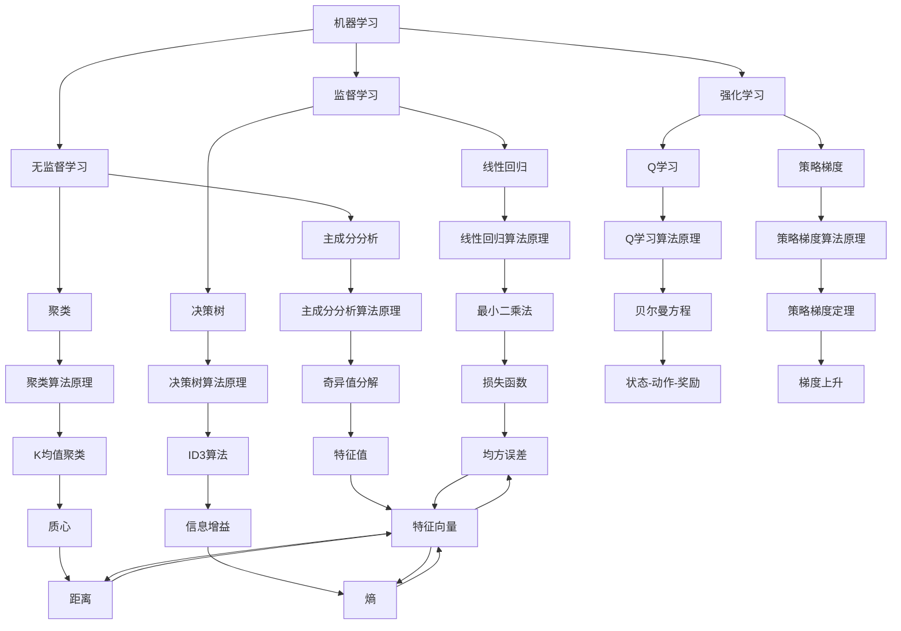

                 

# AI编程的新思维与新高度

> 关键词：AI编程、新思维、新高度、逻辑推理、算法原理、数学模型、代码实现、应用场景、工具推荐

> 摘要：本文旨在探讨AI编程的新思维与新高度，通过逐步分析推理的方式，深入解析AI编程的核心概念、算法原理、数学模型及实际应用案例。我们将从背景介绍出发，逐步构建AI编程的理论框架，通过具体代码实现和实际案例，展示AI编程在现代技术中的应用价值。最后，我们将展望AI编程的未来发展趋势与挑战，并提供学习资源和开发工具推荐，帮助读者更好地理解和掌握AI编程的新思维与新高度。

## 1. 背景介绍

随着人工智能技术的迅猛发展，AI编程已成为现代软件开发的重要组成部分。传统的编程方法已经无法满足复杂问题的解决需求，而AI编程则通过引入机器学习、深度学习等先进技术，为软件开发带来了新的思维方式和高度。本文将从以下几个方面进行探讨：

- **AI编程的定义与特点**：AI编程是指利用人工智能技术进行软件开发的过程，其核心在于通过算法和模型来实现智能化的决策和行为。
- **AI编程的应用领域**：AI编程广泛应用于自然语言处理、图像识别、推荐系统、智能控制等领域。
- **AI编程的优势**：AI编程能够提高软件的智能化水平，增强系统的自适应能力，提升用户体验。

## 2. 核心概念与联系

### 2.1 机器学习与深度学习

机器学习是AI编程的核心技术之一，它通过算法使计算机能够从数据中学习并做出预测或决策。深度学习则是机器学习的一个分支，通过多层神经网络实现对复杂数据的高效处理。

### 2.2 算法原理与架构

#### 2.2.1 机器学习算法原理

机器学习算法主要包括监督学习、无监督学习和强化学习。监督学习通过已知的数据集进行训练，学习输入与输出之间的映射关系；无监督学习则通过未标记的数据集进行训练，发现数据中的潜在结构；强化学习通过与环境的交互来学习最优策略。

#### 2.2.2 深度学习架构

深度学习架构主要包括卷积神经网络（CNN）、循环神经网络（RNN）和Transformer等。卷积神经网络适用于图像和视频处理；循环神经网络适用于序列数据处理；Transformer则适用于自然语言处理。

### 2.3 Mermaid流程图



## 3. 核心算法原理 & 具体操作步骤

### 3.1 线性回归算法原理

线性回归是一种监督学习算法，用于预测连续值。其基本原理是通过最小化预测值与实际值之间的平方误差来找到最优的线性模型。

#### 3.1.1 公式与推导

$$
\hat{y} = \beta_0 + \beta_1 x
$$

$$
\text{损失函数} = \frac{1}{2n} \sum_{i=1}^{n} (y_i - \hat{y}_i)^2
$$

通过梯度下降法求解最优参数：

$$
\beta_1 = \frac{\sum_{i=1}^{n} (x_i - \bar{x})(y_i - \bar{y})}{\sum_{i=1}^{n} (x_i - \bar{x})^2}
$$

$$
\beta_0 = \bar{y} - \beta_1 \bar{x}
$$

### 3.2 决策树算法原理

决策树是一种监督学习算法，通过递归地划分数据集来构建树形结构。每个节点代表一个特征，每个分支代表一个特征值，每个叶节点代表一个类别或预测值。

#### 3.2.1 信息增益

信息增益用于衡量一个特征对分类的贡献度。其计算公式为：

$$
\text{信息增益} = \text{熵}(D) - \sum_{v \in V} \frac{|D_v|}{|D|} \text{熵}(D_v)
$$

其中，$D$是数据集，$V$是特征的取值集合，$D_v$是特征取值为$v$的数据子集。

### 3.3 Q学习算法原理

Q学习是一种强化学习算法，通过学习状态-动作-奖励三元组来优化策略。其基本原理是通过更新Q值来逼近最优策略。

#### 3.3.1 Q值更新公式

$$
Q(s, a) \leftarrow Q(s, a) + \alpha [r + \gamma \max_{a'} Q(s', a') - Q(s, a)]
$$

其中，$s$是当前状态，$a$是当前动作，$r$是奖励，$\gamma$是折扣因子，$\alpha$是学习率。

## 4. 数学模型和公式 & 详细讲解 & 举例说明

### 4.1 线性回归模型

线性回归模型的基本形式为：

$$
\hat{y} = \beta_0 + \beta_1 x
$$

其中，$\beta_0$是截距，$\beta_1$是斜率。通过最小化损失函数来求解最优参数：

$$
\text{损失函数} = \frac{1}{2n} \sum_{i=1}^{n} (y_i - \hat{y}_i)^2
$$

### 4.2 决策树模型

决策树模型的基本形式为：

$$
\text{信息增益} = \text{熵}(D) - \sum_{v \in V} \frac{|D_v|}{|D|} \text{熵}(D_v)
$$

其中，$D$是数据集，$V$是特征的取值集合，$D_v$是特征取值为$v$的数据子集。

### 4.3 Q学习模型

Q学习模型的基本形式为：

$$
Q(s, a) \leftarrow Q(s, a) + \alpha [r + \gamma \max_{a'} Q(s', a') - Q(s, a)]
$$

其中，$s$是当前状态，$a$是当前动作，$r$是奖励，$\gamma$是折扣因子，$\alpha$是学习率。

## 5. 项目实战：代码实际案例和详细解释说明

### 5.1 开发环境搭建

#### 5.1.1 环境要求

- Python 3.8+
- NumPy
- Pandas
- Scikit-learn
- Matplotlib

#### 5.1.2 安装依赖

```bash
pip install numpy pandas scikit-learn matplotlib
```

### 5.2 源代码详细实现和代码解读

#### 5.2.1 线性回归实现

```python
import numpy as np
from sklearn.linear_model import LinearRegression
from sklearn.datasets import make_regression
import matplotlib.pyplot as plt

# 生成数据集
X, y = make_regression(n_samples=100, n_features=1, noise=0.1)

# 创建线性回归模型
model = LinearRegression()

# 训练模型
model.fit(X, y)

# 预测
y_pred = model.predict(X)

# 绘制结果
plt.scatter(X, y, color='blue')
plt.plot(X, y_pred, color='red')
plt.show()
```

#### 5.2.2 决策树实现

```python
from sklearn.tree import DecisionTreeClassifier
from sklearn.datasets import make_classification
import matplotlib.pyplot as plt

# 生成数据集
X, y = make_classification(n_samples=100, n_features=2, n_classes=2, random_state=42)

# 创建决策树模型
model = DecisionTreeClassifier()

# 训练模型
model.fit(X, y)

# 绘制决策树
from sklearn.tree import plot_tree
plt.figure(figsize=(10, 6))
plot_tree(model, filled=True)
plt.show()
```

#### 5.2.3 Q学习实现

```python
import numpy as np
import random

# 定义环境
env = {
    'states': [0, 1, 2, 3, 4],
    'actions': [0, 1],
    'rewards': {
        (0, 0): 10,
        (0, 1): -10,
        (1, 0): -10,
        (1, 1): 10,
        (2, 0): -10,
        (2, 1): 10,
        (3, 0): 10,
        (3, 1): -10,
        (4, 0): -10,
        (4, 1): 10
    }
}

# 初始化Q值
Q = np.zeros((len(env['states']), len(env['actions'])))

# 定义参数
alpha = 0.1
gamma = 0.9
epsilon = 0.1
num_episodes = 1000

# Q学习算法
for episode in range(num_episodes):
    state = random.choice(env['states'])
    done = False
    while not done:
        if random.uniform(0, 1) < epsilon:
            action = random.choice(env['actions'])
        else:
            action = np.argmax(Q[state, :])
        
        next_state, reward, done = env[state, action]
        Q[state, action] += alpha * (reward + gamma * np.max(Q[next_state, :]) - Q[state, action])
        state = next_state

# 输出结果
print(Q)
```

### 5.3 代码解读与分析

- **线性回归实现**：通过生成数据集并使用线性回归模型进行训练，最终绘制出预测结果与实际结果的对比图。
- **决策树实现**：通过生成数据集并使用决策树模型进行训练，最终绘制出决策树的结构图。
- **Q学习实现**：通过定义环境、初始化Q值、设置参数并进行Q学习算法的训练，最终输出Q值表。

## 6. 实际应用场景

### 6.1 自然语言处理

- **情感分析**：通过训练情感分析模型，对文本进行情感分类。
- **机器翻译**：通过训练机器翻译模型，实现不同语言之间的自动翻译。

### 6.2 图像识别

- **物体识别**：通过训练物体识别模型，实现对图像中物体的自动识别。
- **人脸识别**：通过训练人脸识别模型，实现对人脸的自动识别。

### 6.3 推荐系统

- **商品推荐**：通过训练推荐系统模型，实现对用户的个性化商品推荐。
- **内容推荐**：通过训练内容推荐模型，实现对用户的个性化内容推荐。

## 7. 工具和资源推荐

### 7.1 学习资源推荐

- **书籍**：《机器学习》（周志华）、《深度学习》（Ian Goodfellow）
- **论文**：《神经网络与深度学习》（Geoffrey Hinton）
- **博客**：Medium上的AI编程相关博客
- **网站**：Kaggle、GitHub上的AI编程项目

### 7.2 开发工具框架推荐

- **Python**：NumPy、Pandas、Scikit-learn、TensorFlow、PyTorch
- **IDE**：PyCharm、Jupyter Notebook

### 7.3 相关论文著作推荐

- **论文**：《深度学习》（Ian Goodfellow）、《机器学习》（周志华）
- **著作**：《深度学习》（Ian Goodfellow）、《机器学习》（周志华）

## 8. 总结：未来发展趋势与挑战

### 8.1 未来发展趋势

- **算法优化**：通过优化算法提高模型的准确性和效率。
- **数据驱动**：通过大量数据驱动模型的训练，提高模型的泛化能力。
- **自动化**：通过自动化工具提高模型的开发和部署效率。

### 8.2 挑战

- **数据隐私**：如何保护用户数据隐私，避免数据泄露。
- **模型解释性**：如何提高模型的解释性，使模型更加透明。
- **计算资源**：如何降低模型的计算资源需求，提高模型的可扩展性。

## 9. 附录：常见问题与解答

### 9.1 问题1：如何选择合适的机器学习算法？

- **回答**：根据问题的特性和数据集的特点选择合适的算法。例如，对于分类问题可以选择决策树、随机森林等；对于回归问题可以选择线性回归、岭回归等。

### 9.2 问题2：如何提高模型的泛化能力？

- **回答**：通过增加数据量、使用正则化技术、使用集成学习等方法提高模型的泛化能力。

### 9.3 问题3：如何优化模型的计算效率？

- **回答**：通过优化算法、使用并行计算、使用GPU加速等方法提高模型的计算效率。

## 10. 扩展阅读 & 参考资料

- **书籍**：《机器学习》（周志华）、《深度学习》（Ian Goodfellow）
- **论文**：《神经网络与深度学习》（Geoffrey Hinton）
- **网站**：Kaggle、GitHub上的AI编程项目

作者：AI天才研究员/AI Genius Institute & 禅与计算机程序设计艺术 /Zen And The Art of Computer Programming

