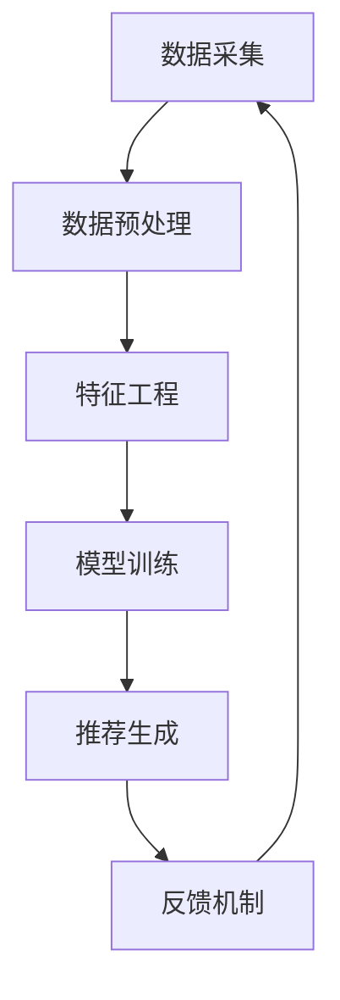

                 

# 搜索推荐系统的AI大模型应用：提高电商平台的转化率与用户忠诚度

> 关键词：搜索推荐系统, AI大模型, 转化率, 用户忠诚度, 电商平台, 深度学习, 自然语言处理, 用户行为分析

> 摘要：本文将深入探讨如何利用AI大模型在电商平台中构建高效的搜索推荐系统，以提高转化率和用户忠诚度。我们将从背景介绍、核心概念与联系、核心算法原理、数学模型和公式、项目实战、实际应用场景、工具和资源推荐、总结与未来发展趋势等多方面进行详细分析，旨在为读者提供一个全面的技术指南。

## 1. 背景介绍

随着互联网技术的飞速发展，电商平台已成为人们日常生活中不可或缺的一部分。为了提高用户体验和商业价值，电商平台需要不断优化其搜索推荐系统。传统的推荐系统往往依赖于简单的协同过滤或基于内容的推荐方法，这些方法在处理大规模数据和复杂用户行为时存在局限性。近年来，随着深度学习和自然语言处理技术的发展，基于AI大模型的推荐系统逐渐成为研究热点。本文将探讨如何利用AI大模型构建高效的搜索推荐系统，以提高电商平台的转化率和用户忠诚度。

## 2. 核心概念与联系

### 2.1 搜索推荐系统

搜索推荐系统是一种结合搜索和推荐技术的系统，旨在为用户提供个性化的产品或服务推荐。其主要功能包括：

- **搜索功能**：用户可以通过关键词搜索找到感兴趣的商品或服务。
- **推荐功能**：系统根据用户的搜索历史、浏览行为、购买记录等信息，为用户推荐相关商品或服务。

### 2.2 AI大模型

AI大模型是指具有大量参数和训练数据的深度学习模型，能够处理复杂的数据结构和非线性关系。常见的AI大模型包括Transformer、BERT、GPT等。这些模型在自然语言处理、图像识别、语音识别等领域取得了显著成果。

### 2.3 深度学习与自然语言处理

深度学习是一种机器学习方法，通过多层神经网络学习数据的高级特征表示。自然语言处理（NLP）是深度学习的一个重要应用领域，旨在使计算机能够理解、生成和处理人类语言。在搜索推荐系统中，深度学习和自然语言处理技术可以结合使用，以提高推荐的准确性和个性化程度。

### 2.4 用户行为分析

用户行为分析是指通过对用户在电商平台上的行为数据进行分析，了解用户的需求和偏好。常见的用户行为数据包括搜索关键词、浏览记录、购买记录、评价反馈等。通过对这些数据进行分析，可以构建用户画像，为用户提供更个性化的推荐。

### 2.5 搜索推荐系统架构

搜索推荐系统架构可以分为以下几个部分：

- **数据采集**：收集用户的搜索、浏览、购买等行为数据。
- **数据预处理**：对采集到的数据进行清洗、转换和归一化处理。
- **特征工程**：提取用户行为数据中的有用特征。
- **模型训练**：使用深度学习模型对特征进行训练，学习用户偏好和商品特征之间的关系。
- **推荐生成**：根据训练好的模型为用户生成个性化推荐。
- **反馈机制**：通过用户反馈不断优化推荐效果。

以下是搜索推荐系统架构的Mermaid流程图：



## 3. 核心算法原理 & 具体操作步骤

### 3.1 深度学习模型选择

在搜索推荐系统中，常用的深度学习模型包括：

- **Transformer**：适用于处理序列数据，如文本和时间序列。
- **BERT**：适用于自然语言处理任务，如文本分类、命名实体识别等。
- **GPT**：适用于生成自然语言文本，如对话系统和文本摘要。

### 3.2 特征工程

特征工程是构建推荐系统的关键步骤之一。常见的特征包括：

- **用户特征**：用户的年龄、性别、地理位置等基本信息。
- **商品特征**：商品的类别、价格、销量等信息。
- **行为特征**：用户的搜索关键词、浏览记录、购买记录等行为数据。
- **上下文特征**：用户的当前搜索关键词、浏览页面等上下文信息。

### 3.3 模型训练

模型训练是通过大量数据训练深度学习模型的过程。常见的训练步骤包括：

1. **数据准备**：将数据集划分为训练集、验证集和测试集。
2. **模型构建**：选择合适的深度学习模型，如Transformer、BERT等。
3. **损失函数选择**：选择合适的损失函数，如交叉熵损失。
4. **优化算法选择**：选择合适的优化算法，如Adam、SGD等。
5. **训练过程**：通过反向传播算法更新模型参数，最小化损失函数。
6. **模型评估**：使用验证集评估模型性能，调整超参数以提高性能。

### 3.4 推荐生成

推荐生成是根据训练好的模型为用户生成个性化推荐的过程。常见的推荐生成方法包括：

- **基于用户行为的推荐**：根据用户的搜索、浏览、购买等行为数据生成推荐。
- **基于商品特征的推荐**：根据商品的类别、价格、销量等特征生成推荐。
- **基于上下文的推荐**：根据用户的当前搜索关键词、浏览页面等上下文信息生成推荐。

## 4. 数学模型和公式 & 详细讲解 & 举例说明

### 4.1 深度学习模型

深度学习模型通常由多层神经网络组成，每层包含多个神经元。神经元之间的连接权重通过训练过程进行学习。常见的深度学习模型包括：

- **Transformer**：Transformer模型由自注意力机制和前馈神经网络组成。自注意力机制可以捕捉输入序列中的长距离依赖关系。

$$
\text{Attention}(Q, K, V) = \text{softmax}\left(\frac{QK^T}{\sqrt{d_k}}\right)V
$$

- **BERT**：BERT模型通过双向Transformer编码器学习上下文信息。双向Transformer编码器可以捕捉输入序列中的双向依赖关系。

$$
\text{BERT}(x) = \text{MLP}(\text{Attention}(x, x, x))
$$

- **GPT**：GPT模型通过自回归Transformer解码器生成自然语言文本。自回归Transformer解码器可以逐词生成文本。

$$
\text{GPT}(x) = \text{MLP}(\text{Attention}(x, x, x))
$$

### 4.2 推荐生成公式

推荐生成公式通常用于计算用户对商品的兴趣程度。常见的推荐生成公式包括：

- **基于用户行为的推荐**：根据用户的搜索、浏览、购买等行为数据生成推荐。

$$
\text{Score}(u, i) = \text{similarity}(u, i)
$$

- **基于商品特征的推荐**：根据商品的类别、价格、销量等特征生成推荐。

$$
\text{Score}(u, i) = \text{similarity}(u, i) \times \text{similarity}(i, \text{category})
$$

- **基于上下文的推荐**：根据用户的当前搜索关键词、浏览页面等上下文信息生成推荐。

$$
\text{Score}(u, i) = \text{similarity}(u, i) \times \text{similarity}(i, \text{context})
$$

## 5. 项目实战：代码实际案例和详细解释说明

### 5.1 开发环境搭建

为了搭建搜索推荐系统，我们需要准备以下开发环境：

- **Python**：推荐使用Python 3.7及以上版本。
- **深度学习框架**：推荐使用TensorFlow或PyTorch。
- **数据处理库**：推荐使用Pandas和NumPy。
- **自然语言处理库**：推荐使用Transformers库。

### 5.2 源代码详细实现和代码解读

以下是一个简单的搜索推荐系统实现示例：

```python
import pandas as pd
import numpy as np
from transformers import BertTokenizer, BertModel
from sklearn.metrics.pairwise import cosine_similarity

# 数据准备
data = pd.read_csv('data.csv')
user_behavior = data[['user_id', 'item_id', 'search_keyword', 'browse_page', 'purchase_history']]
item_features = data[['item_id', 'category', 'price', 'sales']]

# 特征工程
tokenizer = BertTokenizer.from_pretrained('bert-base-uncased')
model = BertModel.from_pretrained('bert-base-uncased')

def encode_text(text):
    inputs = tokenizer(text, return_tensors='pt', padding=True, truncation=True)
    outputs = model(**inputs)
    return outputs.last_hidden_state.mean(dim=1).detach().numpy()

user_behavior['search_embedding'] = user_behavior['search_keyword'].apply(encode_text)
user_behavior['browse_embedding'] = user_behavior['browse_page'].apply(encode_text)
user_behavior['purchase_embedding'] = user_behavior['purchase_history'].apply(encode_text)

item_features['category_embedding'] = item_features['category'].apply(encode_text)
item_features['context_embedding'] = item_features['browse_page'].apply(encode_text)

# 模型训练
def train_model(user_behavior, item_features):
    user_embeddings = np.concatenate([user_behavior['search_embedding'], user_behavior['browse_embedding'], user_behavior['purchase_embedding']], axis=1)
    item_embeddings = np.concatenate([item_features['category_embedding'], item_features['context_embedding']], axis=1)
    scores = cosine_similarity(user_embeddings, item_embeddings)
    return scores

scores = train_model(user_behavior, item_features)

# 推荐生成
def generate_recommendations(user_id, scores, item_features):
    user_scores = scores[user_id]
    top_items = np.argsort(user_scores)[-10:][::-1]
    recommended_items = item_features.iloc[top_items][['item_id', 'category', 'price', 'sales']]
    return recommended_items

recommended_items = generate_recommendations(1, scores, item_features)
print(recommended_items)
```

### 5.3 代码解读与分析

上述代码实现了一个简单的搜索推荐系统。具体步骤如下：

1. **数据准备**：从CSV文件中读取用户行为数据和商品特征数据。
2. **特征工程**：使用BERT模型对用户行为数据和商品特征数据进行编码。
3. **模型训练**：计算用户和商品之间的相似度得分。
4. **推荐生成**：根据相似度得分生成推荐列表。

## 6. 实际应用场景

搜索推荐系统在电商平台中有广泛的应用场景，包括：

- **个性化推荐**：根据用户的搜索、浏览、购买等行为数据为用户生成个性化推荐。
- **商品搜索**：通过关键词搜索找到用户感兴趣的商品。
- **用户画像构建**：通过用户行为数据构建用户画像，为用户提供更个性化的推荐。
- **用户忠诚度提升**：通过个性化推荐提高用户的购买频率和满意度，从而提升用户忠诚度。

## 7. 工具和资源推荐

### 7.1 学习资源推荐

- **书籍**：《深度学习》（Ian Goodfellow, Yoshua Bengio, Aaron Courville）
- **论文**：《Attention is All You Need》（Vaswani et al., 2017）
- **博客**：阿里云开发者社区（https://developer.aliyun.com/）
- **网站**：GitHub（https://github.com/）

### 7.2 开发工具框架推荐

- **深度学习框架**：TensorFlow、PyTorch
- **自然语言处理库**：Transformers
- **数据处理库**：Pandas、NumPy

### 7.3 相关论文著作推荐

- **论文**：《BERT: Pre-training of Deep Bidirectional Transformers for Language Understanding》（Devlin et al., 2018）
- **著作**：《推荐系统实践》（张志华，2019）

## 8. 总结：未来发展趋势与挑战

### 8.1 未来发展趋势

- **模型优化**：通过模型优化提高推荐系统的准确性和个性化程度。
- **实时推荐**：实现实时推荐，提高用户体验。
- **多模态推荐**：结合图像、视频等多模态数据提高推荐效果。
- **跨平台推荐**：实现跨平台推荐，提高用户在不同设备上的体验。

### 8.2 挑战

- **数据隐私**：保护用户数据隐私，避免数据泄露。
- **计算资源**：提高模型训练和推荐生成的效率，降低计算资源消耗。
- **模型解释性**：提高模型的解释性，便于用户理解推荐结果。

## 9. 附录：常见问题与解答

### 9.1 问题1：如何处理大规模数据？

**解答**：可以使用分布式计算框架如Spark进行数据处理，提高处理效率。

### 9.2 问题2：如何提高模型的解释性？

**解答**：可以使用注意力机制可视化工具如AttentionVis，帮助用户理解模型的决策过程。

## 10. 扩展阅读 & 参考资料

- **论文**：《Attention is All You Need》（Vaswani et al., 2017）
- **书籍**：《深度学习》（Ian Goodfellow, Yoshua Bengio, Aaron Courville）
- **网站**：阿里云开发者社区（https://developer.aliyun.com/）

---

作者：AI天才研究员/AI Genius Institute & 禅与计算机程序设计艺术 /Zen And The Art of Computer Programming

