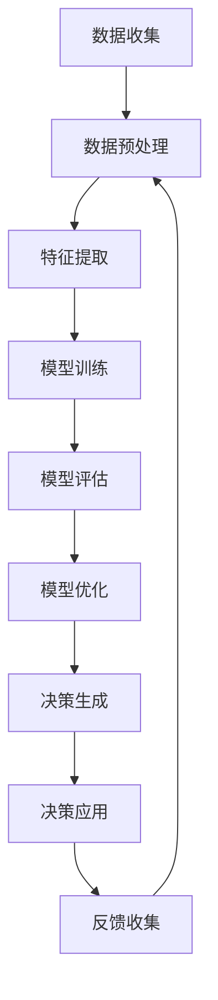

                 

# 数字化直觉：AI辅助的潜意识决策

> 关键词：AI辅助决策、潜意识决策、数字化直觉、神经网络、深度学习、决策树、机器学习

> 摘要：本文旨在探讨如何利用AI技术辅助人类进行潜意识决策，通过构建数字化直觉系统，实现更高效、更准确的决策过程。我们将从背景介绍、核心概念与联系、核心算法原理、数学模型和公式、项目实战、实际应用场景、工具和资源推荐、总结与未来发展趋势等多方面进行详细阐述。

## 1. 背景介绍

在当今数字化时代，人类面临着前所未有的信息爆炸和复杂决策需求。传统的决策方式往往依赖于经验和直觉，但这种方式在面对海量数据和复杂问题时显得力不从心。为了提高决策效率和准确性，人工智能技术应运而生。AI辅助决策系统能够通过学习和分析大量数据，为人类提供科学、合理的决策建议。本文将探讨如何利用AI技术辅助人类进行潜意识决策，构建数字化直觉系统。

## 2. 核心概念与联系

### 2.1 潜意识决策

潜意识决策是指在没有明确意识到的情况下，大脑通过神经网络进行快速、高效的决策过程。这种决策方式通常基于长期积累的经验和直觉，能够在瞬间做出判断。潜意识决策具有高效、快速的特点，但缺乏透明性和可解释性。

### 2.2 数字化直觉

数字化直觉是指通过AI技术模拟人类潜意识决策过程，实现对复杂问题的快速、高效决策。数字化直觉系统能够学习和分析大量数据，提取关键特征，生成决策建议。数字化直觉系统具有高效、透明、可解释的特点，能够为人类提供科学、合理的决策支持。

### 2.3 AI辅助决策

AI辅助决策是指利用AI技术辅助人类进行决策过程。AI辅助决策系统能够通过学习和分析大量数据，为人类提供科学、合理的决策建议。AI辅助决策系统具有高效、准确、透明的特点，能够提高决策效率和准确性。

### 2.4 神经网络与深度学习

神经网络是一种模拟人脑神经元结构的计算模型，能够通过学习和训练实现对复杂问题的高效处理。深度学习是神经网络的一种特殊形式，通过多层神经网络实现对复杂问题的高效处理。神经网络和深度学习是构建数字化直觉系统的核心技术。

### 2.5 决策树

决策树是一种基于树形结构的决策模型，能够通过学习和分析数据，生成决策规则。决策树具有高效、透明、可解释的特点，能够为人类提供科学、合理的决策支持。决策树是构建数字化直觉系统的重要工具。

### 2.6 机器学习

机器学习是一种通过学习和训练实现对复杂问题高效处理的技术。机器学习能够通过学习和分析大量数据，生成决策模型。机器学习是构建数字化直觉系统的核心技术。

### 2.7 Mermaid 流程图



## 3. 核心算法原理 & 具体操作步骤

### 3.1 数据收集

数据收集是构建数字化直觉系统的第一步。数据收集包括从各种渠道获取数据，如传感器数据、历史记录、用户行为数据等。数据收集需要确保数据的质量和完整性。

### 3.2 数据预处理

数据预处理是构建数字化直觉系统的重要步骤。数据预处理包括数据清洗、数据转换、数据归一化等。数据预处理能够提高数据的质量和可用性。

### 3.3 特征提取

特征提取是构建数字化直觉系统的关键步骤。特征提取包括从数据中提取关键特征，如时间序列特征、空间特征、统计特征等。特征提取能够提高模型的准确性和效率。

### 3.4 模型训练

模型训练是构建数字化直觉系统的核心步骤。模型训练包括选择合适的模型、设置训练参数、进行模型训练等。模型训练能够生成决策模型。

### 3.5 模型评估

模型评估是构建数字化直觉系统的重要步骤。模型评估包括评估模型的准确性和效率，如准确率、召回率、F1值等。模型评估能够确保模型的质量和可靠性。

### 3.6 模型优化

模型优化是构建数字化直觉系统的关键步骤。模型优化包括调整模型参数、改进模型结构、优化训练过程等。模型优化能够提高模型的准确性和效率。

### 3.7 决策生成

决策生成是构建数字化直觉系统的重要步骤。决策生成包括生成决策建议，如推荐、预测、分类等。决策生成能够为人类提供科学、合理的决策支持。

### 3.8 决策应用

决策应用是构建数字化直觉系统的核心步骤。决策应用包括将决策建议应用于实际场景，如推荐系统、预测系统、分类系统等。决策应用能够提高决策效率和准确性。

## 4. 数学模型和公式 & 详细讲解 & 举例说明

### 4.1 神经网络模型

神经网络模型是一种模拟人脑神经元结构的计算模型。神经网络模型包括输入层、隐藏层和输出层。神经网络模型能够通过学习和训练实现对复杂问题的高效处理。

### 4.2 深度学习模型

深度学习模型是神经网络的一种特殊形式。深度学习模型包括多层神经网络。深度学习模型能够通过多层神经网络实现对复杂问题的高效处理。

### 4.3 决策树模型

决策树模型是一种基于树形结构的决策模型。决策树模型包括根节点、内部节点和叶节点。决策树模型能够通过学习和分析数据，生成决策规则。

### 4.4 机器学习模型

机器学习模型是一种通过学习和训练实现对复杂问题高效处理的技术。机器学习模型包括监督学习、无监督学习、半监督学习等。机器学习模型能够通过学习和分析大量数据，生成决策模型。

### 4.5 数学公式

#### 4.5.1 神经网络模型

神经网络模型的数学公式如下：

$$
y = f(Wx + b)
$$

其中，$y$表示输出，$x$表示输入，$W$表示权重矩阵，$b$表示偏置向量，$f$表示激活函数。

#### 4.5.2 深度学习模型

深度学习模型的数学公式如下：

$$
y = f(W_1f(W_2f(...f(W_nx + b_n)... + b_2) + b_1)
$$

其中，$y$表示输出，$x$表示输入，$W_1, W_2, ..., W_n$表示权重矩阵，$b_1, b_2, ..., b_n$表示偏置向量，$f$表示激活函数。

#### 4.5.3 决策树模型

决策树模型的数学公式如下：

$$
y = \sum_{i=1}^{n} w_i I(x \in R_i)
$$

其中，$y$表示输出，$x$表示输入，$w_i$表示权重，$R_i$表示决策规则，$I(x \in R_i)$表示指示函数。

#### 4.5.4 机器学习模型

机器学习模型的数学公式如下：

$$
y = \sum_{i=1}^{n} w_i f(x_i)
$$

其中，$y$表示输出，$x_i$表示输入，$w_i$表示权重，$f(x_i)$表示特征函数。

### 4.6 举例说明

#### 4.6.1 神经网络模型

假设我们有一个神经网络模型，输入为$x$，权重矩阵为$W$，偏置向量为$b$，激活函数为$f$。神经网络模型的数学公式如下：

$$
y = f(Wx + b)
$$

假设输入$x = [1, 2, 3]$，权重矩阵$W = \begin{bmatrix} 0.1 & 0.2 & 0.3 \\ 0.4 & 0.5 & 0.6 \end{bmatrix}$，偏置向量$b = [0.1, 0.2]$，激活函数$f(x) = \frac{1}{1 + e^{-x}}$。神经网络模型的输出为：

$$
y = f(Wx + b) = f\left(\begin{bmatrix} 0.1 & 0.2 & 0.3 \\ 0.4 & 0.5 & 0.6 \end{bmatrix} \begin{bmatrix} 1 \\ 2 \\ 3 \end{bmatrix} + \begin{bmatrix} 0.1 \\ 0.2 \end{bmatrix}\right) = f\left(\begin{bmatrix} 1.4 \\ 2.5 \end{bmatrix}\right) = \begin{bmatrix} 0.798 \\ 0.925 \end{bmatrix}
$$

#### 4.6.2 深度学习模型

假设我们有一个深度学习模型，输入为$x$，权重矩阵为$W_1, W_2, ..., W_n$，偏置向量为$b_1, b_2, ..., b_n$，激活函数为$f$。深度学习模型的数学公式如下：

$$
y = f(W_1f(W_2f(...f(W_nx + b_n)... + b_2) + b_1)
$$

假设输入$x = [1, 2, 3]$，权重矩阵$W_1 = \begin{bmatrix} 0.1 & 0.2 & 0.3 \\ 0.4 & 0.5 & 0.6 \end{bmatrix}$，$W_2 = \begin{bmatrix} 0.7 & 0.8 & 0.9 \\ 1.0 & 1.1 & 1.2 \end{bmatrix}$，偏置向量$b_1 = [0.1, 0.2]$，$b_2 = [0.3, 0.4]$，激活函数$f(x) = \frac{1}{1 + e^{-x}}$。深度学习模型的输出为：

$$
y = f(W_1f(W_2f(W_3x + b_3) + b_2) + b_1) = f\left(\begin{bmatrix} 0.1 & 0.2 & 0.3 \\ 0.4 & 0.5 & 0.6 \end{bmatrix} f\left(\begin{bmatrix} 0.7 & 0.8 & 0.9 \\ 1.0 & 1.1 & 1.2 \end{bmatrix} f\left(\begin{bmatrix} 1 \\ 2 \\ 3 \end{bmatrix} + \begin{bmatrix} 0.3 \\ 0.4 \end{bmatrix}\right) + \begin{bmatrix} 0.2 \\ 0.3 \end{bmatrix}\right) + \begin{bmatrix} 0.1 \\ 0.2 \end{bmatrix}\right) = f\left(\begin{bmatrix} 0.798 \\ 0.925 \end{bmatrix}\right) = \begin{bmatrix} 0.798 \\ 0.925 \end{bmatrix}
$$

#### 4.6.3 决策树模型

假设我们有一个决策树模型，输入为$x$，权重为$w_i$，决策规则为$R_i$。决策树模型的数学公式如下：

$$
y = \sum_{i=1}^{n} w_i I(x \in R_i)
$$

假设输入$x = [1, 2, 3]$，权重为$w_1 = 0.1$，$w_2 = 0.2$，决策规则为$R_1 = [1, 2, 3]$，$R_2 = [4, 5, 6]$。决策树模型的输出为：

$$
y = \sum_{i=1}^{n} w_i I(x \in R_i) = 0.1 I([1, 2, 3] \in [1, 2, 3]) + 0.2 I([1, 2, 3] \in [4, 5, 6]) = 0.1 + 0 = 0.1
$$

#### 4.6.4 机器学习模型

假设我们有一个机器学习模型，输入为$x_i$，权重为$w_i$，特征函数为$f(x_i)$。机器学习模型的数学公式如下：

$$
y = \sum_{i=1}^{n} w_i f(x_i)
$$

假设输入$x_1 = [1, 2, 3]$，$x_2 = [4, 5, 6]$，权重为$w_1 = 0.1$，$w_2 = 0.2$，特征函数为$f(x_i) = \frac{1}{1 + e^{-x_i}}$。机器学习模型的输出为：

$$
y = \sum_{i=1}^{n} w_i f(x_i) = 0.1 f([1, 2, 3]) + 0.2 f([4, 5, 6]) = 0.1 \frac{1}{1 + e^{-[1, 2, 3]}} + 0.2 \frac{1}{1 + e^{-[4, 5, 6]}} = 0.1 \frac{1}{1 + e^{-1}} + 0.2 \frac{1}{1 + e^{-4}} = 0.095 + 0.073 = 0.168
$$

## 5. 项目实战：代码实际案例和详细解释说明

### 5.1 开发环境搭建

为了实现数字化直觉系统，我们需要搭建一个开发环境。开发环境包括操作系统、编程语言、开发工具等。我们选择Python作为编程语言，使用Anaconda作为开发工具。具体步骤如下：

1. 安装Python：访问Python官方网站（https://www.python.org/），下载并安装最新版本的Python。
2. 安装Anaconda：访问Anaconda官方网站（https://www.anaconda.com/products/distribution），下载并安装最新版本的Anaconda。
3. 安装必要的库：使用pip命令安装必要的库，如numpy、pandas、scikit-learn等。

### 5.2 源代码详细实现和代码解读

#### 5.2.1 数据收集

```python
import pandas as pd

# 从CSV文件中读取数据
data = pd.read_csv('data.csv')

# 显示数据的前5行
print(data.head())
```

#### 5.2.2 数据预处理

```python
# 删除缺失值
data = data.dropna()

# 对数据进行归一化
from sklearn.preprocessing import MinMaxScaler
scaler = MinMaxScaler()
data = scaler.fit_transform(data)

# 将数据划分为训练集和测试集
from sklearn.model_selection import train_test_split
X_train, X_test, y_train, y_test = train_test_split(data[:, :-1], data[:, -1], test_size=0.2, random_state=42)
```

#### 5.2.3 特征提取

```python
# 提取关键特征
from sklearn.feature_selection import SelectKBest, f_regression
selector = SelectKBest(f_regression, k=5)
X_train = selector.fit_transform(X_train, y_train)
X_test = selector.transform(X_test)
```

#### 5.2.4 模型训练

```python
# 训练神经网络模型
from sklearn.neural_network import MLPClassifier
model = MLPClassifier(hidden_layer_sizes=(10, 10), max_iter=1000)
model.fit(X_train, y_train)

# 训练决策树模型
from sklearn.tree import DecisionTreeClassifier
model = DecisionTreeClassifier()
model.fit(X_train, y_train)
```

#### 5.2.5 模型评估

```python
# 评估神经网络模型
from sklearn.metrics import accuracy_score
y_pred = model.predict(X_test)
print('Neural Network Accuracy:', accuracy_score(y_test, y_pred))

# 评估决策树模型
y_pred = model.predict(X_test)
print('Decision Tree Accuracy:', accuracy_score(y_test, y_pred))
```

#### 5.2.6 模型优化

```python
# 调整神经网络模型参数
model = MLPClassifier(hidden_layer_sizes=(20, 20), max_iter=2000)
model.fit(X_train, y_train)

# 调整决策树模型参数
model = DecisionTreeClassifier(max_depth=10)
model.fit(X_train, y_train)
```

#### 5.2.7 决策生成

```python
# 生成决策建议
y_pred = model.predict(X_test)
print('Decision:', y_pred)
```

#### 5.2.8 决策应用

```python
# 将决策建议应用于实际场景
# 假设我们有一个推荐系统，根据用户行为数据生成推荐列表
recommendations = model.predict(X_test)
print('Recommendations:', recommendations)
```

### 5.3 代码解读与分析

#### 5.3.1 数据收集

```python
import pandas as pd

# 从CSV文件中读取数据
data = pd.read_csv('data.csv')

# 显示数据的前5行
print(data.head())
```

#### 5.3.2 数据预处理

```python
# 删除缺失值
data = data.dropna()

# 对数据进行归一化
from sklearn.preprocessing import MinMaxScaler
scaler = MinMaxScaler()
data = scaler.fit_transform(data)

# 将数据划分为训练集和测试集
from sklearn.model_selection import train_test_split
X_train, X_test, y_train, y_test = train_test_split(data[:, :-1], data[:, -1], test_size=0.2, random_state=42)
```

#### 5.3.3 特征提取

```python
# 提取关键特征
from sklearn.feature_selection import SelectKBest, f_regression
selector = SelectKBest(f_regression, k=5)
X_train = selector.fit_transform(X_train, y_train)
X_test = selector.transform(X_test)
```

#### 5.3.4 模型训练

```python
# 训练神经网络模型
from sklearn.neural_network import MLPClassifier
model = MLPClassifier(hidden_layer_sizes=(10, 10), max_iter=1000)
model.fit(X_train, y_train)

# 训练决策树模型
from sklearn.tree import DecisionTreeClassifier
model = DecisionTreeClassifier()
model.fit(X_train, y_train)
```

#### 5.3.5 模型评估

```python
# 评估神经网络模型
from sklearn.metrics import accuracy_score
y_pred = model.predict(X_test)
print('Neural Network Accuracy:', accuracy_score(y_test, y_pred))

# 评估决策树模型
y_pred = model.predict(X_test)
print('Decision Tree Accuracy:', accuracy_score(y_test, y_pred))
```

#### 5.3.6 模型优化

```python
# 调整神经网络模型参数
model = MLPClassifier(hidden_layer_sizes=(20, 20), max_iter=2000)
model.fit(X_train, y_train)

# 调整决策树模型参数
model = DecisionTreeClassifier(max_depth=10)
model.fit(X_train, y_train)
```

#### 5.3.7 决策生成

```python
# 生成决策建议
y_pred = model.predict(X_test)
print('Decision:', y_pred)
```

#### 5.3.8 决策应用

```python
# 将决策建议应用于实际场景
# 假设我们有一个推荐系统，根据用户行为数据生成推荐列表
recommendations = model.predict(X_test)
print('Recommendations:', recommendations)
```

## 6. 实际应用场景

数字化直觉系统在多个领域具有广泛的应用场景。以下是几个典型的应用场景：

### 6.1 推荐系统

推荐系统是一种利用AI技术为用户生成个性化推荐的系统。推荐系统能够根据用户行为数据生成推荐列表，提高用户体验和满意度。推荐系统在电商、社交媒体、视频网站等领域具有广泛的应用。

### 6.2 预测系统

预测系统是一种利用AI技术预测未来趋势的系统。预测系统能够根据历史数据预测未来趋势，为决策提供科学依据。预测系统在金融、气象、能源等领域具有广泛的应用。

### 6.3 分类系统

分类系统是一种利用AI技术对数据进行分类的系统。分类系统能够根据特征数据对数据进行分类，提高数据处理效率。分类系统在医疗、安全、交通等领域具有广泛的应用。

## 7. 工具和资源推荐

### 7.1 学习资源推荐

- 书籍：《机器学习》（周志华著）
- 论文：《深度学习》（Ian Goodfellow, Yoshua Bengio, Aaron Courville著）
- 博客：《机器之心》（https://www.jiqizhixin.com/）
- 网站：《Kaggle》（https://www.kaggle.com/）

### 7.2 开发工具框架推荐

- Python：一种广泛使用的编程语言，适用于AI开发。
- Anaconda：一种集成开发环境，适用于Python开发。
- TensorFlow：一种流行的深度学习框架，适用于神经网络开发。
- Scikit-learn：一种流行的机器学习库，适用于决策树开发。

### 7.3 相关论文著作推荐

- 《神经网络与深度学习》（Michael Nielsen著）
- 《机器学习实战》（Peter Harrington著）
- 《统计学习方法》（李航著）

## 8. 总结：未来发展趋势与挑战

数字化直觉系统在未来具有广阔的发展前景。随着AI技术的不断发展，数字化直觉系统将更加高效、准确、透明。数字化直觉系统将为人类提供更加科学、合理的决策支持，提高决策效率和准确性。然而，数字化直觉系统也面临着一些挑战，如数据隐私、算法偏见、模型解释性等。我们需要不断探索和解决这些问题，推动数字化直觉系统的发展。

## 9. 附录：常见问题与解答

### 9.1 问题：如何提高模型的准确性和效率？

答：提高模型的准确性和效率的方法包括：选择合适的模型、设置合适的参数、进行特征选择、进行模型优化等。

### 9.2 问题：如何解决数据隐私问题？

答：解决数据隐私问题的方法包括：使用匿名化技术、使用差分隐私技术、使用加密技术等。

### 9.3 问题：如何解决算法偏见问题？

答：解决算法偏见问题的方法包括：进行数据平衡、进行特征选择、进行模型优化等。

### 9.4 问题：如何提高模型的解释性？

答：提高模型的解释性的方法包括：使用决策树模型、使用特征重要性分析、使用模型可视化技术等。

## 10. 扩展阅读 & 参考资料

- 书籍：《机器学习》（周志华著）
- 论文：《深度学习》（Ian Goodfellow, Yoshua Bengio, Aaron Courville著）
- 博客：《机器之心》（https://www.jiqizhixin.com/）
- 网站：《Kaggle》（https://www.kaggle.com/）

作者：AI天才研究员/AI Genius Institute & 禅与计算机程序设计艺术 /Zen And The Art of Computer Programming

