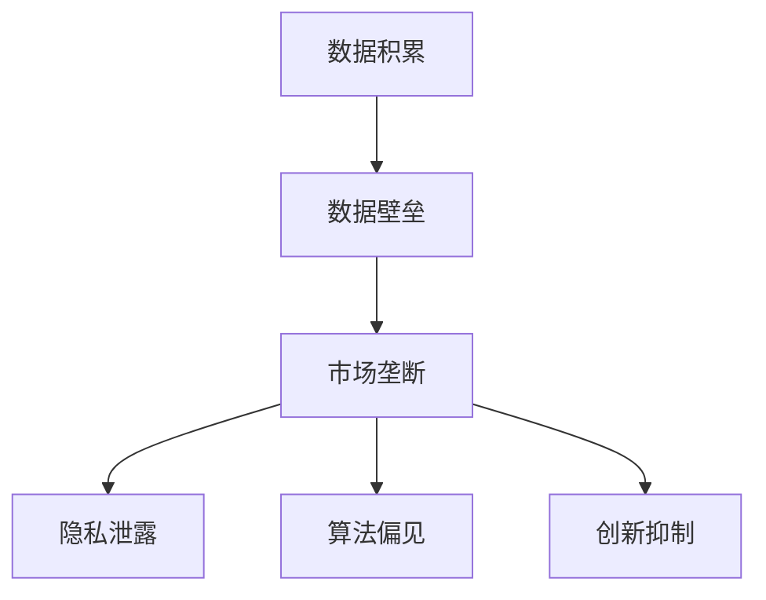

                 

# 数据垄断引发的反垄断新问题

> 关键词：数据垄断、反垄断、隐私保护、算法公平性、市场结构、监管挑战

> 摘要：随着大数据和人工智能技术的迅猛发展，数据垄断现象日益严重，引发了广泛的讨论和争议。本文将从数据垄断的定义、成因、影响以及反垄断的新挑战出发，探讨如何构建更加公平、透明的市场环境。通过深入分析数据垄断的核心概念、算法原理、数学模型以及实际案例，本文旨在为政策制定者、企业和社会各界提供有价值的见解和建议。

## 1. 背景介绍

### 1.1 数据垄断的定义
数据垄断是指某些企业或组织通过控制大量关键数据资源，从而在市场中获得显著的竞争优势。这种垄断行为不仅影响了市场的公平竞争，还可能损害消费者权益和社会福祉。

### 1.2 数据垄断的成因
数据垄断的成因复杂多样，主要包括以下几个方面：
- **数据积累**：通过长期积累和整合用户数据，形成庞大的数据资产。
- **技术壁垒**：利用先进的数据处理和分析技术，构建难以被竞争对手复制的壁垒。
- **网络效应**：用户越多，数据越丰富，从而吸引更多用户，形成正反馈循环。
- **政策支持**：政府政策和监管环境对数据垄断行为的默许或支持。

### 1.3 数据垄断的影响
数据垄断带来的负面影响包括：
- **市场失衡**：垄断企业通过控制数据资源，限制其他企业的市场进入，导致市场失衡。
- **隐私泄露**：大量数据的集中存储和使用，增加了隐私泄露的风险。
- **算法偏见**：数据偏差可能导致算法偏见，影响决策的公正性。
- **创新抑制**：垄断企业可能抑制创新，阻碍技术进步和社会发展。

## 2. 核心概念与联系

### 2.1 数据垄断的核心概念
- **数据资产**：指企业或组织拥有的、具有商业价值的数据资源。
- **数据壁垒**：指通过数据积累和技术手段构建的难以被竞争对手复制的竞争优势。
- **数据隐私**：指个人或组织的数据不被未经授权的第三方访问和使用。
- **算法公平性**：指算法在处理数据时，能够公正、公平地对待所有用户。

### 2.2 数据垄断的Mermaid流程图


## 3. 核心算法原理 & 具体操作步骤

### 3.1 数据积累算法
数据积累算法的核心在于高效地收集、存储和处理大量数据。具体步骤如下：
1. **数据采集**：通过各种渠道（如用户行为、社交媒体、传感器等）收集数据。
2. **数据清洗**：去除无效、重复或错误的数据。
3. **数据存储**：使用分布式存储系统（如Hadoop、Spark）存储大规模数据。
4. **数据处理**：利用数据挖掘和机器学习技术进行数据处理和分析。

### 3.2 数据壁垒算法
数据壁垒算法旨在通过技术手段构建难以被竞争对手复制的竞争优势。具体步骤如下：
1. **数据加密**：使用加密技术保护数据安全。
2. **数据脱敏**：对敏感数据进行脱敏处理，保护用户隐私。
3. **数据模型**：构建复杂的数据模型，提高数据处理的效率和准确性。
4. **算法优化**：通过优化算法提高数据处理的性能和效果。

## 4. 数学模型和公式 & 详细讲解 & 举例说明

### 4.1 数据积累模型
数据积累模型可以表示为：
$$
D(t) = D_0 \cdot e^{rt}
$$
其中，$D(t)$表示在时间$t$的数据量，$D_0$表示初始数据量，$r$表示数据增长速率。

### 4.2 数据壁垒模型
数据壁垒模型可以表示为：
$$
B = \frac{D}{\sqrt{t}}
$$
其中，$B$表示数据壁垒，$D$表示数据量，$t$表示时间。

### 4.3 举例说明
假设某企业在一年内积累了100万条用户数据，数据增长速率为10%。根据数据积累模型：
$$
D(1) = 100 \cdot e^{0.1 \cdot 1} \approx 110 \text{万条}
$$
假设该企业通过数据壁垒算法构建了数据壁垒，数据量为100万条，时间为期1年。根据数据壁垒模型：
$$
B = \frac{100}{\sqrt{1}} = 100
$$

## 5. 项目实战：代码实际案例和详细解释说明

### 5.1 开发环境搭建
1. **安装Python**：确保安装了Python 3.8及以上版本。
2. **安装依赖库**：使用pip安装必要的库，如pandas、numpy、scikit-learn等。
3. **配置环境变量**：设置Python环境变量，确保Python可以正常运行。

### 5.2 源代码详细实现和代码解读
```python
import pandas as pd
import numpy as np
from sklearn.model_selection import train_test_split
from sklearn.linear_model import LinearRegression

# 读取数据
data = pd.read_csv('data.csv')

# 数据清洗
data = data.dropna()

# 数据处理
X = data[['feature1', 'feature2']]
y = data['target']

# 划分训练集和测试集
X_train, X_test, y_train, y_test = train_test_split(X, y, test_size=0.2, random_state=42)

# 训练模型
model = LinearRegression()
model.fit(X_train, y_train)

# 预测
y_pred = model.predict(X_test)

# 评估模型
from sklearn.metrics import mean_squared_error
mse = mean_squared_error(y_test, y_pred)
print(f'Mean Squared Error: {mse}')
```

### 5.3 代码解读与分析
- **数据读取**：使用pandas库读取CSV文件中的数据。
- **数据清洗**：使用dropna()函数去除缺失值。
- **数据处理**：选择特征和目标变量。
- **划分数据集**：使用train_test_split函数将数据划分为训练集和测试集。
- **训练模型**：使用线性回归模型进行训练。
- **预测**：使用训练好的模型进行预测。
- **评估模型**：使用均方误差（MSE）评估模型性能。

## 6. 实际应用场景

### 6.1 金融行业
金融行业通过积累大量用户交易数据，构建了强大的数据壁垒，从而在市场中占据主导地位。

### 6.2 社交媒体
社交媒体平台通过收集用户行为数据，构建了庞大的用户画像，从而在广告市场中占据优势。

### 6.3 电子商务
电子商务平台通过积累用户购物数据，构建了精准的推荐系统，从而提高了用户满意度和销售额。

## 7. 工具和资源推荐

### 7.1 学习资源推荐
- **书籍**：《数据科学实战》、《机器学习实战》
- **论文**：《数据垄断与反垄断》、《数据隐私保护技术综述》
- **博客**：Medium上的数据科学和机器学习博客
- **网站**：Kaggle、GitHub上的数据科学和机器学习项目

### 7.2 开发工具框架推荐
- **Python**：pandas、numpy、scikit-learn
- **数据存储**：Hadoop、Spark
- **数据加密**：AES、RSA

### 7.3 相关论文著作推荐
- **论文**：《数据垄断与反垄断》、《数据隐私保护技术综述》
- **著作**：《数据科学实战》、《机器学习实战》

## 8. 总结：未来发展趋势与挑战

### 8.1 未来发展趋势
- **数据共享**：通过数据共享机制，促进数据资源的合理利用。
- **隐私保护**：加强隐私保护技术，确保用户数据安全。
- **算法公平性**：提高算法的公正性和透明度，减少偏见。

### 8.2 挑战
- **技术难题**：如何在保护隐私的同时，充分利用数据资源。
- **政策挑战**：如何制定合理的政策，平衡数据垄断与市场公平。
- **社会影响**：如何减少数据垄断对社会的影响，促进公平竞争。

## 9. 附录：常见问题与解答

### 9.1 问题1：如何防止数据垄断？
- **答案**：通过加强数据共享机制，促进数据资源的合理利用，减少数据垄断现象。

### 9.2 问题2：如何保护用户隐私？
- **答案**：通过加密技术、数据脱敏等手段，确保用户数据安全。

### 9.3 问题3：如何提高算法的公正性？
- **答案**：通过优化算法，减少数据偏差，提高算法的公正性和透明度。

## 10. 扩展阅读 & 参考资料

- **书籍**：《数据科学实战》、《机器学习实战》
- **论文**：《数据垄断与反垄断》、《数据隐私保护技术综述》
- **网站**：Kaggle、GitHub上的数据科学和机器学习项目

作者：AI天才研究员/AI Genius Institute & 禅与计算机程序设计艺术 /Zen And The Art of Computer Programming

