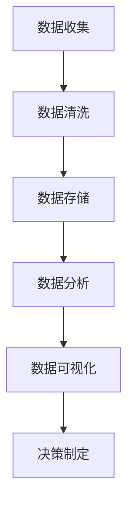

                 

# 数据素养：理解并使用数据，从数据中产生见解

> 关键词：数据素养、数据分析、数据驱动、数据可视化、数据挖掘

> 摘要：在当今数据驱动的世界中，数据素养已成为一项至关重要的技能。本文旨在深入探讨数据素养的核心概念、原理及其实际应用。我们将从数据的基本概念出发，逐步解析数据处理、分析和可视化的方法，通过具体的代码案例展示如何从数据中提取有价值的信息。此外，本文还将探讨数据素养在不同行业中的应用，并提供学习资源和工具推荐，帮助读者全面提升数据素养。

## 1. 背景介绍

在过去的几十年里，数据量呈指数级增长，从社交媒体到物联网设备，从电子商务到医疗健康，数据无处不在。随着大数据技术的发展，如何有效地理解和利用这些数据成为了各行各业关注的焦点。数据素养（Data Literacy）是指个人能够理解数据、分析数据、从数据中提取有价值的信息，并利用这些信息做出决策的能力。数据素养不仅是一项技术技能，更是一种思维方式，它能够帮助我们更好地理解世界，做出更明智的决策。

### 1.1 数据的重要性

数据是现代社会的宝贵资源。它不仅能够帮助企业优化运营、提高效率，还能为科学研究提供坚实的基础。例如，通过分析社交媒体上的用户行为数据，企业可以更精准地进行市场定位和产品推广；通过分析医疗健康数据，研究人员可以发现疾病的早期预警信号，从而提高诊断和治疗的准确性。

### 1.2 数据素养的意义

数据素养对于个人和组织来说都具有重要意义。对于个人而言，具备数据素养可以帮助我们更好地理解周围的世界，做出更明智的决策。对于组织而言，具备数据素养的员工能够帮助企业更好地利用数据资源，提高决策的准确性和效率。因此，培养数据素养已成为企业和个人提升竞争力的重要途径。

## 2. 核心概念与联系

### 2.1 数据的基本概念

数据是信息的载体，它可以是数字、文字、图像、音频等多种形式。数据可以分为结构化数据和非结构化数据。结构化数据是指可以被组织成表格形式的数据，如数据库中的记录；非结构化数据则是指无法被组织成表格形式的数据，如文本、图片、音频等。

### 2.2 数据处理流程

数据处理流程包括数据收集、数据清洗、数据存储、数据分析和数据可视化五个步骤。这些步骤相互关联，共同构成了数据处理的完整流程。

#### 数据处理流程图



### 2.3 数据分析方法

数据分析方法主要包括描述性分析、诊断性分析、预测性分析和规范性分析。描述性分析用于描述数据的特征；诊断性分析用于找出数据中的异常和模式；预测性分析用于预测未来趋势；规范性分析用于提出改进措施。

## 3. 核心算法原理 & 具体操作步骤

### 3.1 数据清洗

数据清洗是数据处理流程中的重要步骤，其目的是去除数据中的噪声和错误，提高数据质量。常见的数据清洗方法包括缺失值处理、异常值处理和重复值处理。

#### 缺失值处理

缺失值处理的方法包括删除含有缺失值的记录、用均值或中位数填充缺失值、用模型预测缺失值等。

#### 异常值处理

异常值处理的方法包括删除异常值、用均值或中位数替换异常值、用模型预测异常值等。

#### 重复值处理

重复值处理的方法包括删除重复记录、合并重复记录等。

### 3.2 数据分析

数据分析是数据处理流程中的核心步骤，其目的是从数据中提取有价值的信息。常见的数据分析方法包括统计分析、机器学习和数据挖掘。

#### 统计分析

统计分析是数据分析的基础，其目的是描述数据的特征。常见的统计分析方法包括描述性统计、假设检验、方差分析等。

#### 机器学习

机器学习是数据分析的重要工具，其目的是从数据中学习规律并进行预测。常见的机器学习方法包括监督学习、无监督学习和强化学习。

#### 数据挖掘

数据挖掘是数据分析的高级形式，其目的是从大量数据中发现隐藏的模式和规律。常见的数据挖掘方法包括关联规则挖掘、聚类分析、分类分析等。

### 3.3 数据可视化

数据可视化是数据分析的最终目标，其目的是将数据以直观的形式展示出来，帮助人们更好地理解和分析数据。常见的数据可视化方法包括条形图、折线图、散点图、热力图等。

## 4. 数学模型和公式 & 详细讲解 & 举例说明

### 4.1 描述性统计

描述性统计是统计分析的基础，其目的是描述数据的特征。常见的描述性统计方法包括均值、中位数、众数、方差、标准差等。

#### 均值

均值是描述数据集中趋势的统计量，其计算公式为：

$$
\bar{x} = \frac{1}{n} \sum_{i=1}^{n} x_i
$$

其中，$\bar{x}$ 表示均值，$x_i$ 表示第 $i$ 个数据点，$n$ 表示数据点的数量。

#### 方差

方差是描述数据离散程度的统计量，其计算公式为：

$$
s^2 = \frac{1}{n-1} \sum_{i=1}^{n} (x_i - \bar{x})^2
$$

其中，$s^2$ 表示方差，$\bar{x}$ 表示均值，$x_i$ 表示第 $i$ 个数据点，$n$ 表示数据点的数量。

### 4.2 机器学习

机器学习是数据分析的重要工具，其目的是从数据中学习规律并进行预测。常见的机器学习方法包括监督学习、无监督学习和强化学习。

#### 监督学习

监督学习是一种有标签的数据学习方法，其目的是从已知标签的数据中学习规律并进行预测。常见的监督学习方法包括线性回归、逻辑回归、支持向量机等。

#### 无监督学习

无监督学习是一种无标签的数据学习方法，其目的是从无标签的数据中发现隐藏的模式和规律。常见的无监督学习方法包括聚类分析、主成分分析等。

#### 强化学习

强化学习是一种通过与环境交互学习的方法，其目的是通过试错学习最优策略。常见的强化学习方法包括Q学习、深度强化学习等。

### 4.3 数据挖掘

数据挖掘是数据分析的高级形式，其目的是从大量数据中发现隐藏的模式和规律。常见的数据挖掘方法包括关联规则挖掘、聚类分析、分类分析等。

#### 关联规则挖掘

关联规则挖掘是一种发现数据中频繁项集的方法，其目的是找出数据中的关联关系。常见的关联规则挖掘方法包括Apriori算法、FP-growth算法等。

#### 聚类分析

聚类分析是一种将数据分成多个类的方法，其目的是发现数据中的聚类结构。常见的聚类分析方法包括K-means算法、层次聚类算法等。

#### 分类分析

分类分析是一种将数据分成多个类的方法，其目的是预测数据的类别。常见的分类分析方法包括决策树、随机森林、支持向量机等。

## 5. 项目实战：代码实际案例和详细解释说明

### 5.1 开发环境搭建

为了进行数据处理和分析，我们需要搭建一个合适的开发环境。这里我们使用Python语言和Jupyter Notebook作为开发工具。

#### 安装Python

首先，我们需要安装Python。Python是一种广泛使用的编程语言，适用于数据处理和分析。我们可以通过访问Python官方网站（https://www.python.org/downloads/）下载并安装Python。

#### 安装Jupyter Notebook

接下来，我们需要安装Jupyter Notebook。Jupyter Notebook是一种交互式的编程环境，适用于数据处理和分析。我们可以通过以下命令安装Jupyter Notebook：

```bash
pip install notebook
```

### 5.2 源代码详细实现和代码解读

我们将使用Python语言和Jupyter Notebook进行数据处理和分析。以下是一个简单的数据处理和分析案例，我们将从一个CSV文件中读取数据，进行数据清洗和分析，最后将结果可视化。

#### 读取数据

首先，我们需要从一个CSV文件中读取数据。我们可以通过以下代码读取数据：

```python
import pandas as pd

# 读取CSV文件
data = pd.read_csv('data.csv')

# 显示数据的前5行
print(data.head())
```

#### 数据清洗

接下来，我们需要对数据进行清洗。我们可以通过以下代码删除含有缺失值的记录：

```python
# 删除含有缺失值的记录
data = data.dropna()

# 显示清洗后的数据的前5行
print(data.head())
```

#### 数据分析

接下来，我们需要对数据进行分析。我们可以通过以下代码计算数据的均值和方差：

```python
# 计算数据的均值
mean = data['column_name'].mean()

# 计算数据的方差
variance = data['column_name'].var()

# 显示均值和方差
print('Mean:', mean)
print('Variance:', variance)
```

#### 数据可视化

最后，我们需要将数据可视化。我们可以通过以下代码绘制数据的条形图：

```python
import matplotlib.pyplot as plt

# 绘制数据的条形图
plt.bar(data['column_name'], data['column_value'])
plt.xlabel('Column Name')
plt.ylabel('Column Value')
plt.title('Bar Chart')
plt.show()
```

### 5.3 代码解读与分析

通过上述代码，我们可以看到数据处理和分析的基本流程。首先，我们从一个CSV文件中读取数据；然后，我们对数据进行清洗，删除含有缺失值的记录；接着，我们对数据进行分析，计算数据的均值和方差；最后，我们将数据可视化，绘制数据的条形图。

## 6. 实际应用场景

数据素养在各个行业中都有广泛的应用。以下是一些实际应用场景：

### 6.1 电子商务

在电子商务领域，数据素养可以帮助企业更好地理解用户行为，优化产品推荐，提高销售额。例如，通过分析用户购买历史和浏览行为，企业可以发现用户的兴趣和偏好，从而进行个性化推荐。

### 6.2 医疗健康

在医疗健康领域，数据素养可以帮助研究人员发现疾病的早期预警信号，提高诊断和治疗的准确性。例如，通过分析患者的医疗记录和基因数据，研究人员可以发现疾病的早期预警信号，从而进行早期诊断和治疗。

### 6.3 金融行业

在金融行业，数据素养可以帮助金融机构更好地理解市场趋势，优化投资策略，提高收益。例如，通过分析市场数据和经济指标，金融机构可以发现市场的趋势和规律，从而进行有效的投资决策。

## 7. 工具和资源推荐

### 7.1 学习资源推荐

#### 书籍

-《Python数据科学手册》（Python Data Science Handbook）
-《数据科学实战》（Data Science from Scratch）

#### 博客

-DataCamp（https://www.datacamp.com/）
-Kaggle Blog（https://blog.kaggle.com/）

#### 网站

-DataCamp（https://www.datacamp.com/）
-Kaggle（https://www.kaggle.com/）

### 7.2 开发工具框架推荐

- Jupyter Notebook（https://jupyter.org/）
- Pandas（https://pandas.pydata.org/）
- Matplotlib（https://matplotlib.org/）

### 7.3 相关论文著作推荐

-《数据科学与机器学习》（Data Science and Machine Learning）
-《数据挖掘：概念与技术》（Data Mining: Concepts and Techniques）

## 8. 总结：未来发展趋势与挑战

数据素养在未来的发展趋势和挑战主要体现在以下几个方面：

### 8.1 数据素养的重要性

随着数据量的不断增长，数据素养的重要性将越来越突出。具备数据素养的个人和组织将能够在数据驱动的世界中更好地理解和利用数据，从而提高决策的准确性和效率。

### 8.2 数据素养的挑战

数据素养的挑战主要体现在以下几个方面：

- 数据质量：数据质量是数据处理和分析的基础，如何提高数据质量是数据素养的重要挑战。
- 数据安全：数据安全是数据处理和分析的重要保障，如何保护数据的安全是数据素养的重要挑战。
- 数据伦理：数据伦理是数据处理和分析的重要原则，如何遵守数据伦理是数据素养的重要挑战。

## 9. 附录：常见问题与解答

### 9.1 问题：如何提高数据质量？

提高数据质量的方法包括：

- 数据清洗：删除含有缺失值的记录，处理异常值和重复值。
- 数据标准化：将数据转换为统一的格式和单位。
- 数据验证：通过校验数据的一致性和准确性来提高数据质量。

### 9.2 问题：如何保护数据安全？

保护数据安全的方法包括：

- 数据加密：使用加密技术保护数据的安全。
- 数据备份：定期备份数据，防止数据丢失。
- 数据访问控制：限制数据的访问权限，防止数据泄露。

### 9.3 问题：如何遵守数据伦理？

遵守数据伦理的方法包括：

- 数据隐私：尊重个人隐私，不泄露个人数据。
- 数据透明：公开数据的来源和使用方式，提高数据的透明度。
- 数据公正：确保数据的公正性和客观性，避免数据偏见。

## 10. 扩展阅读 & 参考资料

### 10.1 扩展阅读

-《数据科学与机器学习》（Data Science and Machine Learning）
-《数据挖掘：概念与技术》（Data Mining: Concepts and Techniques）

### 10.2 参考资料

-《Python数据科学手册》（Python Data Science Handbook）
-《数据科学实战》（Data Science from Scratch）

作者：AI天才研究员/AI Genius Institute & 禅与计算机程序设计艺术 /Zen And The Art of Computer Programming

