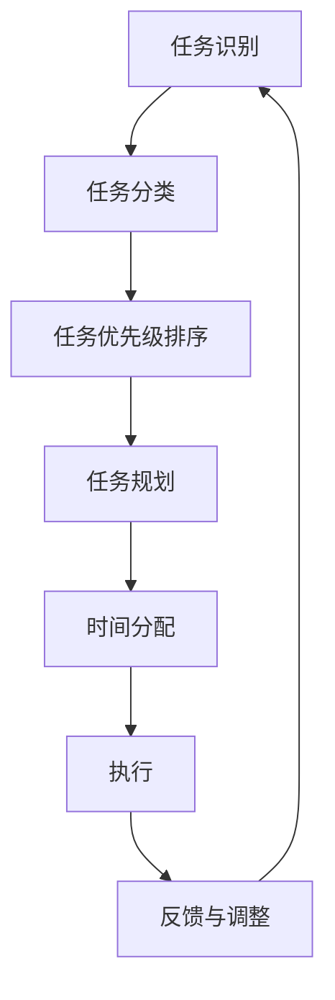

                 

# 时间管理：高效利用时间

> 关键词：时间管理, 效率, 优先级, 任务规划, 自动化, 习惯培养

> 摘要：时间管理是提高个人和团队效率的关键。本文将从时间管理的核心概念出发，探讨如何通过科学的方法和工具来优化时间利用，提高工作效率。我们将详细分析时间管理的原理，提供具体的操作步骤和数学模型，通过实际案例展示如何在项目中应用时间管理技术。最后，我们将讨论时间管理的未来发展趋势和面临的挑战。

## 1. 背景介绍

时间管理是个人和团队提高效率的关键技能。在快节奏的现代生活中，有效管理时间不仅能帮助我们更好地完成任务，还能提高生活质量。时间管理不仅仅是安排日程，更是一种科学的方法论，通过合理规划和优化时间利用，实现个人和团队的高效运作。

### 1.1 时间管理的重要性

时间管理的重要性体现在多个方面：

- **提高效率**：通过合理规划时间，可以确保任务按时完成，提高工作效率。
- **减少压力**：有效的时间管理可以避免因任务堆积而产生的压力。
- **提升生活质量**：合理安排时间，可以留出更多时间用于休息和娱乐，提高生活质量。
- **增强竞争力**：在职场中，高效的时间管理能力是提升个人竞争力的重要因素。

### 1.2 时间管理的挑战

时间管理面临的挑战主要包括：

- **任务繁多**：现代工作和生活中，任务繁多，如何合理分配时间成为一大挑战。
- **干扰因素**：社交媒体、电子邮件等干扰因素会分散注意力，影响工作效率。
- **拖延症**：很多人存在拖延症，难以及时完成任务。
- **缺乏规划**：缺乏有效的规划和目标设定，导致时间浪费。

## 2. 核心概念与联系

### 2.1 时间管理的核心概念

时间管理的核心概念包括：

- **优先级**：确定任务的优先级，确保重要且紧急的任务优先完成。
- **任务规划**：合理规划任务，确保任务按时完成。
- **时间分配**：合理分配时间，确保每个任务都有足够的时间。
- **习惯培养**：通过培养良好的时间管理习惯，提高时间利用效率。

### 2.2 时间管理的流程图



## 3. 核心算法原理 & 具体操作步骤

### 3.1 任务识别与分类

任务识别与分类是时间管理的第一步。通过识别任务，我们可以更好地了解任务的性质和重要性。

- **任务识别**：识别当前需要完成的任务。
- **任务分类**：将任务分为紧急且重要、紧急但不重要、不紧急但重要、不紧急且不重要四类。

### 3.2 任务优先级排序

任务优先级排序是时间管理的关键步骤。通过确定任务的优先级，我们可以确保重要且紧急的任务优先完成。

- **优先级排序**：根据任务的重要性和紧急性进行排序。
- **四象限法则**：将任务分为四个象限，分别为紧急且重要、紧急但不重要、不紧急但重要、不紧急且不重要。

### 3.3 任务规划

任务规划是时间管理的核心步骤。通过合理规划任务，我们可以确保任务按时完成。

- **任务分解**：将大任务分解为小任务，便于管理和执行。
- **时间分配**：为每个任务分配合理的时间。
- **时间块安排**：将时间块分配给不同的任务，确保任务按时完成。

### 3.4 时间分配

时间分配是时间管理的关键步骤。通过合理分配时间，我们可以确保每个任务都有足够的时间。

- **时间分配**：根据任务的重要性和紧急性分配时间。
- **时间块安排**：将时间块分配给不同的任务，确保任务按时完成。

## 4. 数学模型和公式 & 详细讲解 & 举例说明

### 4.1 任务优先级排序模型

任务优先级排序模型可以使用四象限法则进行描述。四象限法则将任务分为四个象限，分别为紧急且重要、紧急但不重要、不紧急但重要、不紧急且不重要。

- **紧急且重要**：需要立即完成的任务。
- **紧急但不重要**：需要立即完成但不重要的任务。
- **不紧急但重要**：需要长期规划和执行的任务。
- **不紧急且不重要**：可以忽略的任务。

### 4.2 任务规划模型

任务规划模型可以使用时间管理矩阵进行描述。时间管理矩阵将任务分为四个象限，分别为紧急且重要、紧急但不重要、不紧急但重要、不紧急且不重要。

- **紧急且重要**：需要立即完成的任务。
- **紧急但不重要**：需要立即完成但不重要的任务。
- **不紧急但重要**：需要长期规划和执行的任务。
- **不紧急且不重要**：可以忽略的任务。

### 4.3 举例说明

假设我们有以下任务：

- **紧急且重要**：准备明天的会议。
- **紧急但不重要**：回复非紧急的邮件。
- **不紧急但重要**：学习新的技能。
- **不紧急且不重要**：浏览社交媒体。

根据四象限法则，我们可以将任务分为四个象限：

- **紧急且重要**：准备明天的会议。
- **紧急但不重要**：回复非紧急的邮件。
- **不紧急但重要**：学习新的技能。
- **不紧急且不重要**：浏览社交媒体。

## 5. 项目实战：代码实际案例和详细解释说明

### 5.1 开发环境搭建

为了实现时间管理，我们需要搭建一个开发环境。开发环境包括以下几个部分：

- **操作系统**：Windows、macOS、Linux等。
- **编程语言**：Python、Java、JavaScript等。
- **开发工具**：Visual Studio Code、PyCharm、IntelliJ IDEA等。

### 5.2 源代码详细实现和代码解读

我们将使用Python语言实现时间管理工具。以下是源代码实现：

```python
import datetime
import time

class Task:
    def __init__(self, name, priority, deadline):
        self.name = name
        self.priority = priority
        self.deadline = deadline

    def __str__(self):
        return f"{self.name} (优先级: {self.priority}, 截止日期: {self.deadline})"

class TimeManager:
    def __init__(self):
        self.tasks = []

    def add_task(self, task):
        self.tasks.append(task)

    def sort_tasks(self):
        self.tasks.sort(key=lambda x: x.priority, reverse=True)

    def display_tasks(self):
        for task in self.tasks:
            print(task)

    def execute_tasks(self):
        for task in self.tasks:
            if datetime.datetime.now() < task.deadline:
                print(f"执行任务: {task.name}")
                time.sleep(1)  # 模拟任务执行时间
            else:
                print(f"任务过期: {task.name}")

# 示例代码
if __name__ == "__main__":
    time_manager = TimeManager()
    time_manager.add_task(Task("准备明天的会议", 4, datetime.datetime.now() + datetime.timedelta(days=1)))
    time_manager.add_task(Task("回复非紧急的邮件", 2, datetime.datetime.now() + datetime.timedelta(hours=1)))
    time_manager.add_task(Task("学习新的技能", 3, datetime.datetime.now() + datetime.timedelta(weeks=1)))
    time_manager.add_task(Task("浏览社交媒体", 1, datetime.datetime.now() + datetime.timedelta(days=30)))

    time_manager.sort_tasks()
    time_manager.display_tasks()
    time_manager.execute_tasks()
```

### 5.3 代码解读与分析

代码实现了一个简单的任务管理工具。以下是代码解读和分析：

- **Task类**：定义了一个任务类，包含任务名称、优先级和截止日期。
- **TimeManager类**：定义了一个时间管理类，包含任务列表、添加任务、排序任务、显示任务和执行任务的方法。
- **add_task方法**：将任务添加到任务列表中。
- **sort_tasks方法**：根据任务的优先级对任务进行排序。
- **display_tasks方法**：显示任务列表。
- **execute_tasks方法**：执行任务，模拟任务执行时间。

## 6. 实际应用场景

时间管理在实际应用场景中具有广泛的应用。以下是几个实际应用场景：

- **个人生活**：通过合理规划时间，可以更好地安排个人生活，提高生活质量。
- **职场工作**：通过合理规划时间，可以提高工作效率，提升个人竞争力。
- **团队协作**：通过合理规划时间，可以提高团队协作效率，确保项目按时完成。

## 7. 工具和资源推荐

### 7.1 学习资源推荐

- **书籍**：《时间管理的艺术》、《高效能人士的七个习惯》
- **论文**：《时间管理的科学方法》、《时间管理的实践与应用》
- **博客**：《时间管理的技巧与方法》、《时间管理的实战经验》
- **网站**：时间管理论坛、时间管理社区

### 7.2 开发工具框架推荐

- **开发工具**：Visual Studio Code、PyCharm、IntelliJ IDEA
- **框架**：Django、Flask、Spring

### 7.3 相关论文著作推荐

- **论文**：《时间管理的科学方法》、《时间管理的实践与应用》
- **著作**：《时间管理的艺术》、《高效能人士的七个习惯》

## 8. 总结：未来发展趋势与挑战

### 8.1 未来发展趋势

时间管理在未来将有以下几个发展趋势：

- **智能化**：通过人工智能技术，实现更智能的时间管理。
- **个性化**：根据个人需求和习惯，提供个性化的时间管理方案。
- **集成化**：将时间管理与工作、生活等其他方面进行集成，实现全方位的时间管理。

### 8.2 面临的挑战

时间管理在未来将面临以下几个挑战：

- **技术挑战**：如何实现更智能的时间管理，提高时间管理的效率。
- **用户习惯**：如何培养用户的时间管理习惯，提高时间管理的效果。
- **数据安全**：如何保护用户的时间管理数据，确保数据的安全。

## 9. 附录：常见问题与解答

### 9.1 问题1：如何克服拖延症？

**解答**：克服拖延症的方法包括：

- **设定明确的目标**：设定明确的目标，确保任务有明确的方向。
- **分解任务**：将大任务分解为小任务，便于管理和执行。
- **设定时间限制**：为每个任务设定时间限制，提高任务的紧迫感。
- **奖励机制**：设定奖励机制，激励自己完成任务。

### 9.2 问题2：如何培养良好的时间管理习惯？

**解答**：培养良好的时间管理习惯的方法包括：

- **制定计划**：每天制定计划，确保任务按时完成。
- **定期回顾**：定期回顾计划，调整计划以适应实际情况。
- **保持专注**：保持专注，避免分心。
- **培养自律**：培养自律，确保任务按时完成。

## 10. 扩展阅读 & 参考资料

- **书籍**：《时间管理的艺术》、《高效能人士的七个习惯》
- **论文**：《时间管理的科学方法》、《时间管理的实践与应用》
- **博客**：《时间管理的技巧与方法》、《时间管理的实战经验》
- **网站**：时间管理论坛、时间管理社区

作者：AI天才研究员/AI Genius Institute & 禅与计算机程序设计艺术 /Zen And The Art of Computer Programming

