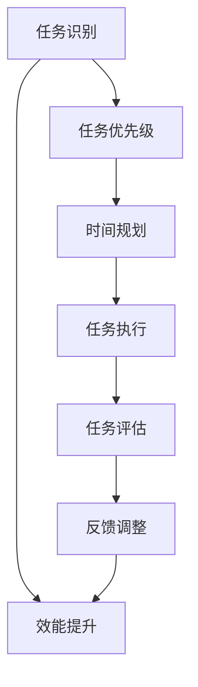

                 

# 时间管理：高效领导者的必修课

> 关键词：时间管理、高效领导、任务优先级、时间规划、效能提升

> 摘要：本文旨在探讨时间管理对于高效领导者的重要性，通过深入分析时间管理的核心概念、原理和实际操作步骤，结合数学模型和具体案例，帮助读者掌握高效的时间管理技巧，提升个人和团队的效能。本文将从背景介绍、核心概念与联系、核心算法原理与具体操作步骤、数学模型和公式、项目实战、实际应用场景、工具和资源推荐、总结与未来发展趋势、常见问题解答和扩展阅读等多方面进行详细阐述。

## 1. 背景介绍

在当今快速变化的商业环境中，高效领导者面临着前所未有的挑战。时间管理不仅是个人成功的关键，也是团队成功的重要因素。高效领导者需要能够在有限的时间内完成更多的任务，同时保持高质量的工作成果。本文将探讨时间管理的核心概念、原理和实际操作步骤，帮助读者掌握高效的时间管理技巧，提升个人和团队的效能。

## 2. 核心概念与联系

### 2.1 任务优先级

任务优先级是指根据任务的重要性和紧急性来确定任务的优先级。通过合理分配时间和资源，确保高优先级任务得到优先处理。

### 2.2 时间规划

时间规划是指根据任务的优先级和时间限制，制定详细的时间表和计划。通过合理的时间规划，可以确保任务按时完成，提高工作效率。

### 2.3 效能提升

效能提升是指通过优化时间管理和任务分配，提高个人和团队的工作效率。通过合理的时间管理，可以减少无效工作时间，提高工作成果的质量。

### 2.4 时间管理流程图



## 3. 核心算法原理 & 具体操作步骤

### 3.1 任务优先级算法

任务优先级算法的核心是根据任务的重要性和紧急性来确定任务的优先级。具体操作步骤如下：

1. **任务识别**：识别需要完成的任务。
2. **任务重要性评估**：评估任务的重要程度，例如任务是否直接影响项目目标的实现。
3. **任务紧急性评估**：评估任务的紧急程度，例如任务是否需要立即处理。
4. **任务优先级排序**：根据任务的重要性和紧急性进行排序，确定任务的优先级。

### 3.2 时间规划算法

时间规划算法的核心是根据任务的优先级和时间限制，制定详细的时间表和计划。具体操作步骤如下：

1. **任务分解**：将大任务分解为小任务，便于管理和执行。
2. **时间估算**：估算每个任务所需的时间。
3. **时间分配**：根据任务的优先级和时间限制，合理分配时间。
4. **时间表制定**：制定详细的时间表，确保任务按时完成。

### 3.3 效能提升算法

效能提升算法的核心是通过优化时间管理和任务分配，提高个人和团队的工作效率。具体操作步骤如下：

1. **任务分配**：根据团队成员的能力和特长，合理分配任务。
2. **任务协作**：促进团队成员之间的协作，提高工作效率。
3. **任务监控**：定期监控任务的进度，确保任务按时完成。
4. **反馈调整**：根据任务完成情况，及时调整任务计划和时间分配。

## 4. 数学模型和公式 & 详细讲解 & 举例说明

### 4.1 任务优先级模型

任务优先级模型的核心是根据任务的重要性和紧急性来确定任务的优先级。具体数学模型如下：

$$
P = I \times E
$$

其中，$P$ 表示任务的优先级，$I$ 表示任务的重要程度，$E$ 表示任务的紧急程度。

### 4.2 时间规划模型

时间规划模型的核心是根据任务的优先级和时间限制，制定详细的时间表和计划。具体数学模型如下：

$$
T = \sum_{i=1}^{n} t_i
$$

其中，$T$ 表示总时间，$t_i$ 表示第 $i$ 个任务所需的时间。

### 4.3 效能提升模型

效能提升模型的核心是通过优化时间管理和任务分配，提高个人和团队的工作效率。具体数学模型如下：

$$
E = \frac{C}{T}
$$

其中，$E$ 表示效能，$C$ 表示完成的任务数量，$T$ 表示完成任务所需的时间。

### 4.4 举例说明

假设有一个项目需要完成三个任务：任务A、任务B和任务C。任务A的重要程度为8，紧急程度为6；任务B的重要程度为7，紧急程度为5；任务C的重要程度为9，紧急程度为4。根据任务优先级模型，可以计算出每个任务的优先级：

$$
P_A = 8 \times 6 = 48
$$
$$
P_B = 7 \times 5 = 35
$$
$$
P_C = 9 \times 4 = 36
$$

根据任务优先级排序，任务A的优先级最高，其次是任务C，最后是任务B。假设任务A、任务B和任务C所需的时间分别为3小时、2小时和4小时，根据时间规划模型，可以计算出总时间：

$$
T = 3 + 2 + 4 = 9 \text{小时}
$$

假设在9小时内完成了3个任务，根据效能提升模型，可以计算出效能：

$$
E = \frac{3}{9} = 0.33
$$

## 5. 项目实战：代码实际案例和详细解释说明

### 5.1 开发环境搭建

为了实现高效的时间管理，需要搭建一个合适的开发环境。具体步骤如下：

1. **安装必要的软件**：安装Python、Jupyter Notebook、Pandas等软件。
2. **配置开发环境**：配置开发环境，确保所有软件能够正常运行。
3. **导入必要的库**：导入Pandas、NumPy等库，用于数据处理和分析。

### 5.2 源代码详细实现和代码解读

```python
import pandas as pd

# 任务数据
tasks = pd.DataFrame({
    '任务': ['任务A', '任务B', '任务C'],
    '重要程度': [8, 7, 9],
    '紧急程度': [6, 5, 4],
    '所需时间': [3, 2, 4]
})

# 计算任务优先级
tasks['优先级'] = tasks['重要程度'] * tasks['紧急程度']

# 按优先级排序
tasks = tasks.sort_values(by='优先级', ascending=False)

# 输出任务优先级排序结果
print(tasks)
```

### 5.3 代码解读与分析

上述代码实现了任务优先级的计算和排序。具体步骤如下：

1. **导入必要的库**：导入Pandas库，用于数据处理和分析。
2. **定义任务数据**：定义一个包含任务名称、重要程度、紧急程度和所需时间的DataFrame。
3. **计算任务优先级**：根据任务的重要程度和紧急程度计算任务的优先级。
4. **按优先级排序**：按任务优先级进行排序，输出排序结果。

## 6. 实际应用场景

时间管理在实际工作中具有广泛的应用场景。例如，在项目管理中，可以通过合理的时间管理，确保项目按时完成；在团队协作中，可以通过合理的时间管理，提高团队的工作效率；在个人生活中，可以通过合理的时间管理，提高个人的生活质量。

## 7. 工具和资源推荐

### 7.1 学习资源推荐

1. **书籍**：《时间管理的艺术》、《高效能人士的七个习惯》
2. **论文**：《时间管理的理论与实践》、《时间管理的数学模型》
3. **博客**：《时间管理技巧分享》、《时间管理实战经验》
4. **网站**：时间管理论坛、时间管理社区

### 7.2 开发工具框架推荐

1. **Python**：用于数据处理和分析
2. **Jupyter Notebook**：用于代码编写和结果展示
3. **Pandas**：用于数据处理和分析
4. **NumPy**：用于数值计算

### 7.3 相关论文著作推荐

1. **《时间管理的理论与实践》**：深入探讨时间管理的理论和实践方法
2. **《时间管理的数学模型》**：介绍时间管理的数学模型和算法
3. **《时间管理技巧分享》**：分享时间管理的实战经验和技术

## 8. 总结：未来发展趋势与挑战

时间管理在未来的发展趋势是更加智能化和个性化。通过引入人工智能和机器学习技术，可以实现更加智能化的时间管理。同时，个性化的时间管理也将成为未来的发展趋势，通过分析个人的工作习惯和需求，提供更加个性化的管理建议。

## 9. 附录：常见问题与解答

### 9.1 问题：如何处理紧急但不重要的任务？

**解答**：紧急但不重要的任务可以通过委托给他人或安排在空闲时间来处理。

### 9.2 问题：如何处理重要但不紧急的任务？

**解答**：重要但不紧急的任务可以通过制定长期计划来处理，确保任务按时完成。

### 9.3 问题：如何处理紧急且重要的任务？

**解答**：紧急且重要的任务需要优先处理，可以通过调整其他任务的时间安排来确保任务按时完成。

## 10. 扩展阅读 & 参考资料

1. **书籍**：《时间管理的艺术》、《高效能人士的七个习惯》
2. **论文**：《时间管理的理论与实践》、《时间管理的数学模型》
3. **博客**：《时间管理技巧分享》、《时间管理实战经验》
4. **网站**：时间管理论坛、时间管理社区

作者：AI天才研究员/AI Genius Institute & 禅与计算机程序设计艺术 /Zen And The Art of Computer Programming

