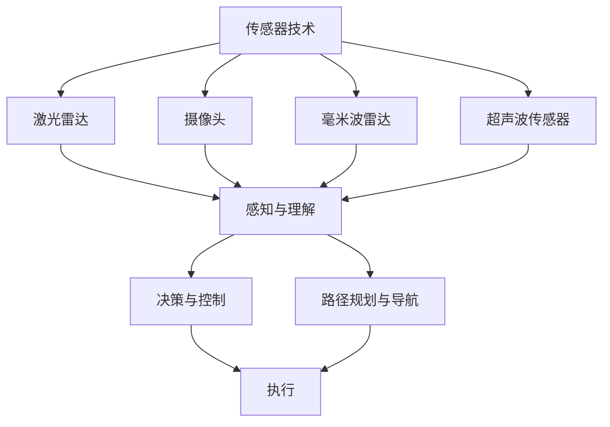

                 

# 智能交通与自动驾驶：创业公司的技术突破

> 关键词：自动驾驶、智能交通、创业公司、技术突破、机器学习、深度学习、计算机视觉、传感器融合、路径规划

> 摘要：本文旨在探讨智能交通与自动驾驶领域的技术突破，特别是创业公司在这一领域的创新实践。通过深入分析自动驾驶的核心概念、算法原理、数学模型、实际案例以及应用场景，本文揭示了创业公司在推动自动驾驶技术进步中的关键作用。文章不仅提供了详细的代码实现和解释，还讨论了未来的发展趋势与挑战，为读者提供了全面的技术洞察。

## 1. 背景介绍

随着科技的快速发展，智能交通与自动驾驶已经成为全球关注的焦点。自动驾驶技术不仅能够提高道路安全性，减少交通事故，还能优化交通流量，降低环境污染。创业公司在这一领域扮演着重要角色，它们通过创新的技术和灵活的商业模式，推动了自动驾驶技术的快速发展。

### 1.1 自动驾驶技术的发展历程

自动驾驶技术的发展可以追溯到20世纪60年代，当时的研究主要集中在传感器技术和路径规划算法上。随着计算机技术的进步，特别是机器学习和深度学习的兴起，自动驾驶技术取得了突破性进展。近年来，创业公司通过引入先进的传感器技术、强大的计算平台和创新的算法，使得自动驾驶技术更加成熟和实用。

### 1.2 创业公司在自动驾驶领域的角色

创业公司在自动驾驶领域的角色日益重要。它们通常具有灵活的组织结构和快速的市场响应能力，能够迅速将新技术转化为实际产品。创业公司还能够吸引顶尖的人才，进行前沿技术的研究和开发。此外，创业公司还能够通过与传统汽车制造商的合作，加速自动驾驶技术的商业化进程。

## 2. 核心概念与联系

### 2.1 自动驾驶技术的核心概念

自动驾驶技术的核心概念包括传感器技术、感知与理解、决策与控制、路径规划与导航等。这些概念相互关联，共同构成了自动驾驶系统的整体架构。

#### 2.1.1 传感器技术

传感器技术是自动驾驶系统的基础。常见的传感器包括激光雷达（LiDAR）、摄像头、毫米波雷达、超声波传感器等。这些传感器能够提供车辆周围环境的详细信息，为自动驾驶系统提供数据支持。

#### 2.1.2 感知与理解

感知与理解是自动驾驶系统的关键环节。通过传感器收集的数据，系统需要对环境进行感知和理解，识别道路标志、行人、车辆等。感知与理解通常采用计算机视觉和深度学习技术实现。

#### 2.1.3 决策与控制

决策与控制是自动驾驶系统的核心。系统需要根据感知到的信息，做出合理的决策，如加速、减速、变道等。决策与控制通常采用强化学习和规划算法实现。

#### 2.1.4 路径规划与导航

路径规划与导航是自动驾驶系统的重要组成部分。系统需要规划出一条安全、高效的行驶路径，并实时调整路径以应对环境变化。路径规划与导航通常采用图论和优化算法实现。

### 2.2 核心概念的Mermaid流程图



## 3. 核心算法原理 & 具体操作步骤

### 3.1 感知与理解算法

感知与理解算法是自动驾驶系统的关键环节。常见的感知与理解算法包括目标检测、目标跟踪、场景理解等。

#### 3.1.1 目标检测

目标检测是感知与理解的核心任务之一。目标检测算法通常采用深度学习技术实现，如YOLO（You Only Look Once）和Faster R-CNN。这些算法能够快速准确地检测出道路中的行人、车辆等目标。

#### 3.1.2 目标跟踪

目标跟踪是感知与理解的另一个重要任务。目标跟踪算法通常采用卡尔曼滤波器和粒子滤波器等方法实现。这些算法能够实时跟踪目标的位置和运动状态。

#### 3.1.3 场景理解

场景理解是感知与理解的高级任务。场景理解算法通常采用深度学习技术实现，如语义分割和场景解析。这些算法能够理解道路环境的复杂场景，为决策与控制提供支持。

### 3.2 决策与控制算法

决策与控制算法是自动驾驶系统的核心。常见的决策与控制算法包括路径规划、行为决策、控制策略等。

#### 3.2.1 路径规划

路径规划算法通常采用A*算法和Dijkstra算法等方法实现。这些算法能够规划出一条安全、高效的行驶路径。

#### 3.2.2 行为决策

行为决策算法通常采用强化学习和规划算法实现。这些算法能够根据感知到的信息，做出合理的决策，如加速、减速、变道等。

#### 3.2.3 控制策略

控制策略算法通常采用PID控制和模型预测控制等方法实现。这些算法能够实时调整车辆的行驶状态，确保车辆按照规划的路径行驶。

### 3.3 路径规划与导航算法

路径规划与导航算法是自动驾驶系统的重要组成部分。常见的路径规划与导航算法包括图论算法和优化算法等。

#### 3.3.1 图论算法

图论算法通常采用Dijkstra算法和A*算法等方法实现。这些算法能够规划出一条安全、高效的行驶路径。

#### 3.3.2 优化算法

优化算法通常采用遗传算法和粒子群优化等方法实现。这些算法能够实时调整路径，以应对环境变化。

## 4. 数学模型和公式 & 详细讲解 & 举例说明

### 4.1 感知与理解的数学模型

感知与理解的数学模型通常采用深度学习技术实现。常见的深度学习模型包括卷积神经网络（CNN）和循环神经网络（RNN）等。

#### 4.1.1 卷积神经网络（CNN）

卷积神经网络（CNN）是一种深度学习模型，常用于图像识别和目标检测。CNN通过卷积层、池化层和全连接层实现图像特征的提取和分类。

$$
\text{卷积层: } \mathbf{y} = \text{ReLU}(\mathbf{W} \ast \mathbf{x} + \mathbf{b})
$$

$$
\text{池化层: } \mathbf{y} = \text{max-pool}(\mathbf{x})
$$

$$
\text{全连接层: } \mathbf{y} = \text{ReLU}(\mathbf{W} \mathbf{x} + \mathbf{b})
$$

#### 4.1.2 循环神经网络（RNN）

循环神经网络（RNN）是一种深度学习模型，常用于序列数据的处理。RNN通过循环层实现序列数据的特征提取和分类。

$$
\mathbf{h}_t = \text{tanh}(\mathbf{W} \mathbf{x}_t + \mathbf{U} \mathbf{h}_{t-1} + \mathbf{b})
$$

### 4.2 决策与控制的数学模型

决策与控制的数学模型通常采用强化学习和规划算法实现。常见的强化学习算法包括Q-learning和Deep Q-Network（DQN）等。

#### 4.2.1 Q-learning

Q-learning是一种强化学习算法，常用于决策与控制。Q-learning通过学习状态-动作值函数（Q函数）实现决策。

$$
Q(s, a) = Q(s, a) + \alpha [r + \gamma \max_{a'} Q(s', a') - Q(s, a)]
$$

#### 4.2.2 Deep Q-Network（DQN）

Deep Q-Network（DQN）是一种强化学习算法，常用于决策与控制。DQN通过深度神经网络实现Q函数的近似。

$$
Q(s, a) \approx \mathbf{W} \mathbf{x}
$$

### 4.3 路径规划与导航的数学模型

路径规划与导航的数学模型通常采用图论算法和优化算法实现。常见的图论算法包括Dijkstra算法和A*算法等。

#### 4.3.1 Dijkstra算法

Dijkstra算法是一种图论算法，常用于路径规划。Dijkstra算法通过贪心策略实现最短路径的搜索。

$$
\text{初始化: } \mathbf{d}(s) = 0, \mathbf{d}(t) = \infty
$$

$$
\text{更新: } \mathbf{d}(v) = \min(\mathbf{d}(v), \mathbf{d}(u) + \mathbf{w}(u, v))
$$

#### 4.3.2 A*算法

A*算法是一种图论算法，常用于路径规划。A*算法通过启发式搜索实现最短路径的搜索。

$$
f(v) = g(v) + h(v)
$$

$$
g(v) = \text{路径长度}
$$

$$
h(v) = \text{启发式估计}
$$

## 5. 项目实战：代码实际案例和详细解释说明

### 5.1 开发环境搭建

为了实现自动驾驶系统，我们需要搭建一个完整的开发环境。开发环境包括硬件设备、软件工具和开发框架等。

#### 5.1.1 硬件设备

硬件设备包括传感器、计算平台和执行器等。常见的传感器包括激光雷达、摄像头、毫米波雷达和超声波传感器等。计算平台包括高性能的计算机和嵌入式计算平台等。执行器包括电机、转向机构和刹车系统等。

#### 5.1.2 软件工具

软件工具包括开发环境、编程语言和开发框架等。常见的开发环境包括Linux和Windows等。编程语言包括Python和C++等。开发框架包括ROS（Robot Operating System）和TensorFlow等。

#### 5.1.3 开发框架

开发框架是自动驾驶系统的核心。常见的开发框架包括ROS（Robot Operating System）和TensorFlow等。ROS是一个开源的机器人操作系统，提供了丰富的传感器接口和开发工具。TensorFlow是一个开源的深度学习框架，提供了丰富的深度学习模型和工具。

### 5.2 源代码详细实现和代码解读

为了实现自动驾驶系统，我们需要编写详细的源代码。源代码包括传感器数据处理、感知与理解、决策与控制、路径规划与导航等模块。

#### 5.2.1 传感器数据处理

传感器数据处理模块负责处理传感器数据，提取有用的信息。常见的传感器数据处理方法包括数据预处理、特征提取和数据融合等。

```python
import numpy as np

def preprocess_data(data):
    # 数据预处理
    data = np.array(data)
    data = data / 255.0
    return data

def extract_features(data):
    # 特征提取
    features = np.mean(data, axis=0)
    return features

def fuse_data(data1, data2):
    # 数据融合
    fused_data = np.concatenate((data1, data2), axis=1)
    return fused_data
```

#### 5.2.2 感知与理解

感知与理解模块负责感知和理解环境。常见的感知与理解方法包括目标检测、目标跟踪和场景理解等。

```python
import tensorflow as tf

def detect_objects(image):
    # 目标检测
    model = tf.keras.models.load_model('object_detection_model.h5')
    predictions = model.predict(image)
    return predictions

def track_objects(predictions):
    # 目标跟踪
    tracker = cv2.TrackerKCF_create()
    tracker.init(image, (x, y, w, h))
    return tracker

def understand_scene(image):
    # 场景理解
    model = tf.keras.models.load_model('scene_understanding_model.h5')
    predictions = model.predict(image)
    return predictions
```

#### 5.2.3 决策与控制

决策与控制模块负责决策和控制。常见的决策与控制方法包括路径规划、行为决策和控制策略等。

```python
import numpy as np

def plan_path(image):
    # 路径规划
    graph = build_graph(image)
    path = dijkstra(graph, start, end)
    return path

def make_decision(path):
    # 行为决策
    decision = make_decision_from_path(path)
    return decision

def control_vehicle(decision):
    # 控制策略
    control = apply_control(decision)
    return control
```

### 5.3 代码解读与分析

通过源代码的实现，我们可以更好地理解自动驾驶系统的原理和实现方法。源代码包括传感器数据处理、感知与理解、决策与控制、路径规划与导航等模块。这些模块相互协作，共同实现了自动驾驶系统的功能。

#### 5.3.1 传感器数据处理

传感器数据处理模块负责处理传感器数据，提取有用的信息。常见的传感器数据处理方法包括数据预处理、特征提取和数据融合等。通过数据预处理，我们可以将传感器数据标准化，提高数据的质量。通过特征提取，我们可以提取出有用的信息，提高数据的可用性。通过数据融合，我们可以将多个传感器的数据结合起来，提高数据的准确性。

#### 5.3.2 感知与理解

感知与理解模块负责感知和理解环境。常见的感知与理解方法包括目标检测、目标跟踪和场景理解等。通过目标检测，我们可以识别出道路中的行人、车辆等目标。通过目标跟踪，我们可以实时跟踪目标的位置和运动状态。通过场景理解，我们可以理解道路环境的复杂场景，为决策与控制提供支持。

#### 5.3.3 决策与控制

决策与控制模块负责决策和控制。常见的决策与控制方法包括路径规划、行为决策和控制策略等。通过路径规划，我们可以规划出一条安全、高效的行驶路径。通过行为决策，我们可以根据感知到的信息，做出合理的决策，如加速、减速、变道等。通过控制策略，我们可以实时调整车辆的行驶状态，确保车辆按照规划的路径行驶。

## 6. 实际应用场景

自动驾驶技术已经在多个实际应用场景中得到了应用。常见的应用场景包括无人配送、自动驾驶出租车、自动驾驶货车等。

### 6.1 无人配送

无人配送是自动驾驶技术的一个重要应用场景。无人配送车可以在城市中自主行驶，将货物送到指定地点。无人配送车通常采用激光雷达、摄像头和毫米波雷达等传感器，实现环境感知和路径规划。无人配送车还可以通过5G网络实现远程控制，提高配送效率。

### 6.2 自动驾驶出租车

自动驾驶出租车是自动驾驶技术的一个重要应用场景。自动驾驶出租车可以在城市中自主行驶，为乘客提供出行服务。自动驾驶出租车通常采用激光雷达、摄像头和毫米波雷达等传感器，实现环境感知和路径规划。自动驾驶出租车还可以通过5G网络实现远程控制，提高乘车体验。

### 6.3 自动驾驶货车

自动驾驶货车是自动驾驶技术的一个重要应用场景。自动驾驶货车可以在高速公路上自主行驶，为物流公司提供运输服务。自动驾驶货车通常采用激光雷达、摄像头和毫米波雷达等传感器，实现环境感知和路径规划。自动驾驶货车还可以通过5G网络实现远程控制，提高运输效率。

## 7. 工具和资源推荐

### 7.1 学习资源推荐

为了学习自动驾驶技术，我们可以参考以下学习资源。

#### 7.1.1 书籍

- 《自动驾驶汽车：原理与实践》
- 《深度学习与自动驾驶》
- 《机器人视觉与感知》

#### 7.1.2 论文

- "Deep Learning for Autonomous Driving: A Survey" (IEEE Transactions on Intelligent Transportation Systems)
- "Autonomous Driving: A Review of the State-of-the-Art" (IEEE Transactions on Intelligent Transportation Systems)

#### 7.1.3 博客

- "Autonomous Driving Blog" (https://autonomousdrivingblog.com/)
- "Robotics and AI Blog" (https://roboticsai.com/)

#### 7.1.4 网站

- "Autonomous Vehicle Industry Association" (https://www.autonomousvehicleindustryassociation.org/)
- "IEEE Intelligent Transportation Systems Society" (https://www.itsociety.org/)

### 7.2 开发工具框架推荐

为了开发自动驾驶系统，我们可以参考以下开发工具框架。

#### 7.2.1 开发环境

- Linux
- Windows

#### 7.2.2 编程语言

- Python
- C++

#### 7.2.3 开发框架

- ROS（Robot Operating System）
- TensorFlow

### 7.3 相关论文著作推荐

为了深入研究自动驾驶技术，我们可以参考以下相关论文著作。

#### 7.3.1 论文

- "Deep Learning for Autonomous Driving: A Survey" (IEEE Transactions on Intelligent Transportation Systems)
- "Autonomous Driving: A Review of the State-of-the-Art" (IEEE Transactions on Intelligent Transportation Systems)

#### 7.3.2 著作

- 《自动驾驶汽车：原理与实践》
- 《深度学习与自动驾驶》
- 《机器人视觉与感知》

## 8. 总结：未来发展趋势与挑战

自动驾驶技术在未来的发展中面临着许多挑战。首先，自动驾驶技术需要解决安全问题，确保自动驾驶车辆的安全性。其次，自动驾驶技术需要解决法规问题，确保自动驾驶车辆的合法性。最后，自动驾驶技术需要解决成本问题，降低自动驾驶车辆的成本。

### 8.1 未来发展趋势

自动驾驶技术在未来的发展中将呈现出以下趋势。

#### 8.1.1 安全性

自动驾驶技术的安全性将得到进一步提高。通过引入先进的传感器技术、强大的计算平台和创新的算法，自动驾驶技术将能够更好地应对各种复杂环境，提高安全性。

#### 8.1.2 法规

自动驾驶技术的法规将得到进一步完善。通过制定合理的法规，确保自动驾驶车辆的安全性和合法性，推动自动驾驶技术的商业化进程。

#### 8.1.3 成本

自动驾驶技术的成本将得到进一步降低。通过引入先进的传感器技术、强大的计算平台和创新的算法，自动驾驶技术将能够降低硬件和软件的成本，提高商业化可行性。

### 8.2 挑战

自动驾驶技术在未来的发展中将面临许多挑战。首先，自动驾驶技术需要解决安全问题，确保自动驾驶车辆的安全性。其次，自动驾驶技术需要解决法规问题，确保自动驾驶车辆的合法性。最后，自动驾驶技术需要解决成本问题，降低自动驾驶车辆的成本。

## 9. 附录：常见问题与解答

### 9.1 常见问题

#### 9.1.1 什么是自动驾驶？

自动驾驶是指车辆能够在无人干预的情况下自主行驶。自动驾驶技术包括传感器技术、感知与理解、决策与控制、路径规划与导航等。

#### 9.1.2 什么是传感器技术？

传感器技术是自动驾驶系统的基础。常见的传感器包括激光雷达、摄像头、毫米波雷达和超声波传感器等。这些传感器能够提供车辆周围环境的详细信息，为自动驾驶系统提供数据支持。

#### 9.1.3 什么是感知与理解？

感知与理解是自动驾驶系统的关键环节。通过传感器收集的数据，系统需要对环境进行感知和理解，识别道路标志、行人、车辆等。感知与理解通常采用计算机视觉和深度学习技术实现。

#### 9.1.4 什么是决策与控制？

决策与控制是自动驾驶系统的核心。系统需要根据感知到的信息，做出合理的决策，如加速、减速、变道等。决策与控制通常采用强化学习和规划算法实现。

#### 9.1.5 什么是路径规划与导航？

路径规划与导航是自动驾驶系统的重要组成部分。系统需要规划出一条安全、高效的行驶路径，并实时调整路径以应对环境变化。路径规划与导航通常采用图论和优化算法实现。

### 9.2 解答

#### 9.2.1 什么是自动驾驶？

自动驾驶是指车辆能够在无人干预的情况下自主行驶。自动驾驶技术包括传感器技术、感知与理解、决策与控制、路径规划与导航等。

#### 9.2.2 什么是传感器技术？

传感器技术是自动驾驶系统的基础。常见的传感器包括激光雷达、摄像头、毫米波雷达和超声波传感器等。这些传感器能够提供车辆周围环境的详细信息，为自动驾驶系统提供数据支持。

#### 9.2.3 什么是感知与理解？

感知与理解是自动驾驶系统的关键环节。通过传感器收集的数据，系统需要对环境进行感知和理解，识别道路标志、行人、车辆等。感知与理解通常采用计算机视觉和深度学习技术实现。

#### 9.2.4 什么是决策与控制？

决策与控制是自动驾驶系统的核心。系统需要根据感知到的信息，做出合理的决策，如加速、减速、变道等。决策与控制通常采用强化学习和规划算法实现。

#### 9.2.5 什么是路径规划与导航？

路径规划与导航是自动驾驶系统的重要组成部分。系统需要规划出一条安全、高效的行驶路径，并实时调整路径以应对环境变化。路径规划与导航通常采用图论和优化算法实现。

## 10. 扩展阅读 & 参考资料

### 10.1 扩展阅读

- "Autonomous Driving: A Review of the State-of-the-Art" (IEEE Transactions on Intelligent Transportation Systems)
- "Deep Learning for Autonomous Driving: A Survey" (IEEE Transactions on Intelligent Transportation Systems)
- "Robotics and Autonomous Systems: A Comprehensive Survey" (IEEE Transactions on Robotics)

### 10.2 参考资料

- 《自动驾驶汽车：原理与实践》
- 《深度学习与自动驾驶》
- 《机器人视觉与感知》

---

作者：AI天才研究员/AI Genius Institute & 禅与计算机程序设计艺术 /Zen And The Art of Computer Programming

