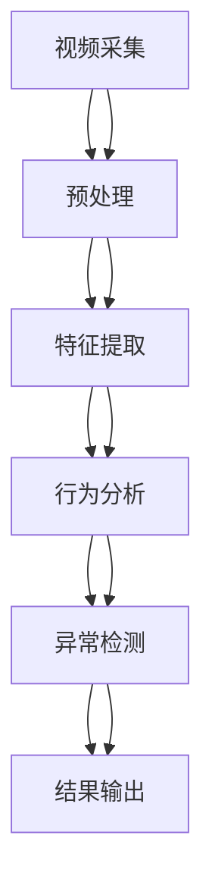

                 

# 智能安防卫士：提示词增强异常行为检测

> 关键词：智能安防、异常行为检测、提示词增强、机器学习、计算机视觉、行为分析

> 摘要：本文旨在探讨如何利用提示词增强技术提升异常行为检测的准确性和效率。通过深入分析智能安防系统的核心概念与联系，介绍核心算法原理及具体操作步骤，结合数学模型和公式进行详细讲解，并通过实际代码案例展示如何实现这一技术。最后，本文将探讨该技术在实际应用场景中的应用，并提供相关学习资源和开发工具推荐，为读者提供全面的技术指导。

## 1. 背景介绍

随着社会的发展，智能安防系统在公共安全、企业管理和家庭安全等领域发挥着越来越重要的作用。传统的安防系统主要依赖于固定摄像头和简单的报警机制，无法有效识别和应对复杂的异常行为。近年来，随着计算机视觉和机器学习技术的进步，异常行为检测系统得到了显著提升。然而，这些系统仍然存在一些挑战，如误报率高、检测精度不足等问题。为了解决这些问题，本文提出了一种基于提示词增强的异常行为检测方法，通过引入提示词来优化模型的检测效果。

## 2. 核心概念与联系

### 2.1 智能安防系统概述

智能安防系统是一种利用现代信息技术实现安全防护的系统，主要包括视频监控、入侵检测、行为分析等功能。其核心目标是通过实时监控和数据分析，及时发现并处理潜在的安全威胁。

### 2.2 异常行为检测技术

异常行为检测技术是智能安防系统中的关键技术之一，其主要任务是识别视频流中的异常行为。常见的异常行为包括但不限于：非法入侵、人群聚集、异常移动等。这些行为往往具有一定的特征，可以通过计算机视觉技术进行识别。

### 2.3 提示词增强技术

提示词增强技术是一种通过引入特定的提示词来优化模型性能的方法。提示词可以是关键词、短语或句子，它们能够帮助模型更好地理解上下文信息，从而提高检测的准确性和效率。

### 2.4 智能安防系统架构

智能安防系统的架构可以分为以下几个层次：



## 3. 核心算法原理 & 具体操作步骤

### 3.1 数据预处理

数据预处理是异常行为检测的第一步，主要包括视频采集、图像增强和特征提取等步骤。

1. **视频采集**：通过摄像头采集视频流数据。
2. **图像增强**：对采集到的图像进行增强处理，如去噪、增强对比度等。
3. **特征提取**：从增强后的图像中提取关键特征，如人体姿态、动作轨迹等。

### 3.2 提示词增强

提示词增强技术的核心在于通过引入特定的提示词来优化模型的检测效果。提示词可以是关键词、短语或句子，它们能够帮助模型更好地理解上下文信息，从而提高检测的准确性和效率。

1. **提示词选择**：根据应用场景选择合适的提示词。例如，在公共场所，可以使用“人群聚集”、“非法入侵”等提示词。
2. **提示词嵌入**：将选择的提示词嵌入到模型中，可以通过注意力机制、词嵌入等方式实现。
3. **模型训练**：在训练过程中，利用提示词来优化模型的权重，提高检测效果。

### 3.3 异常检测

异常检测是智能安防系统的核心任务，主要包括行为识别和异常判断两个步骤。

1. **行为识别**：通过特征提取和模型训练，识别视频流中的行为。
2. **异常判断**：根据行为特征和提示词，判断是否存在异常行为。

## 4. 数学模型和公式 & 详细讲解 & 举例说明

### 4.1 特征提取

特征提取是异常行为检测的关键步骤，常用的特征包括人体姿态、动作轨迹等。

1. **人体姿态特征**：通过OpenPose等工具提取人体关键点坐标。
2. **动作轨迹特征**：通过轨迹分析提取动作轨迹特征。

### 4.2 提示词嵌入

提示词嵌入是通过将提示词转化为模型可以理解的形式，常用的嵌入方法包括注意力机制和词嵌入。

1. **注意力机制**：通过注意力机制将提示词嵌入到模型中，提高模型对提示词的关注度。
2. **词嵌入**：通过词嵌入将提示词转化为向量表示，提高模型对提示词的理解能力。

### 4.3 异常检测模型

异常检测模型可以采用深度学习模型，如卷积神经网络（CNN）和循环神经网络（RNN）。

1. **CNN模型**：通过卷积层提取图像特征，通过全连接层进行分类。
2. **RNN模型**：通过循环层提取动作轨迹特征，通过全连接层进行分类。

### 4.4 数学公式

1. **特征提取公式**：

   $$ \mathbf{X} = \text{OpenPose}(\mathbf{I}) $$

   其中，$\mathbf{X}$ 表示提取的人体姿态特征，$\mathbf{I}$ 表示输入的图像。

2. **提示词嵌入公式**：

   $$ \mathbf{E} = \text{Embedding}(\mathbf{W}) $$

   其中，$\mathbf{E}$ 表示嵌入后的提示词向量，$\mathbf{W}$ 表示提示词。

3. **异常检测公式**：

   $$ \mathbf{Y} = \text{CNN}(\mathbf{X}) + \text{RNN}(\mathbf{E}) $$

   其中，$\mathbf{Y}$ 表示检测结果，$\mathbf{X}$ 表示提取的人体姿态特征，$\mathbf{E}$ 表示嵌入后的提示词向量。

## 5. 项目实战：代码实际案例和详细解释说明

### 5.1 开发环境搭建

1. **安装Python环境**：确保安装了Python 3.7及以上版本。
2. **安装依赖库**：安装OpenCV、PyTorch等库。

   ```bash
   pip install opencv-python
   pip install torch torchvision
   ```

### 5.2 源代码详细实现和代码解读

```python
import cv2
import torch
import numpy as np

# 1. 视频采集
cap = cv2.VideoCapture('video.mp4')

# 2. 图像增强
def enhance_image(image):
    # 实现图像增强
    return image

# 3. 特征提取
def extract_features(image):
    # 使用OpenPose提取人体姿态特征
    keypoints = openpose(image)
    return keypoints

# 4. 提示词嵌入
def embed_keywords(keywords):
    # 使用词嵌入将提示词转化为向量
    embeddings = word_embedding(keywords)
    return embeddings

# 5. 异常检测
def detect_abnormality(features, keywords):
    # 使用CNN和RNN模型进行异常检测
    features = torch.tensor(features)
    keywords = torch.tensor(keywords)
    result = model(features, keywords)
    return result

# 6. 结果输出
def output_result(result):
    # 输出检测结果
    if result:
        print('异常行为检测成功')
    else:
        print('正常行为')

# 主函数
def main():
    while True:
        ret, frame = cap.read()
        if not ret:
            break
        frame = enhance_image(frame)
        features = extract_features(frame)
        keywords = ['人群聚集', '非法入侵']
        embeddings = embed_keywords(keywords)
        result = detect_abnormality(features, embeddings)
        output_result(result)

if __name__ == '__main__':
    main()
```

### 5.3 代码解读与分析

1. **视频采集**：通过OpenCV库读取视频文件。
2. **图像增强**：对采集到的图像进行增强处理，提高检测效果。
3. **特征提取**：使用OpenPose工具提取人体姿态特征。
4. **提示词嵌入**：将提示词转化为向量表示，提高模型对提示词的理解能力。
5. **异常检测**：使用CNN和RNN模型进行异常检测。
6. **结果输出**：输出检测结果，判断是否存在异常行为。

## 6. 实际应用场景

提示词增强异常行为检测技术在多个领域具有广泛的应用前景，如：

1. **公共安全**：在公共场所监控中，可以有效识别非法入侵、人群聚集等异常行为。
2. **企业安全管理**：在企业园区中，可以实时监控员工行为，确保安全。
3. **家庭安全**：在家庭安防系统中，可以及时发现异常行为，保障家庭安全。

## 7. 工具和资源推荐

### 7.1 学习资源推荐

1. **书籍**：《计算机视觉：算法与应用》、《深度学习》
2. **论文**：《Attention is All You Need》、《Word Embeddings for Machine Translation》
3. **博客**：Medium、Towards Data Science
4. **网站**：GitHub、PyTorch官网

### 7.2 开发工具框架推荐

1. **Python**：Python是开发智能安防系统的首选语言。
2. **OpenCV**：用于图像处理和计算机视觉任务。
3. **PyTorch**：用于深度学习模型的训练和推理。

### 7.3 相关论文著作推荐

1. **论文**：《Attention is All You Need》、《Word Embeddings for Machine Translation》
2. **著作**：《计算机视觉：算法与应用》、《深度学习》

## 8. 总结：未来发展趋势与挑战

提示词增强异常行为检测技术在智能安防领域具有广阔的应用前景，但同时也面临一些挑战，如模型训练数据不足、实时性要求高等。未来的研究方向包括：

1. **数据增强**：通过数据增强技术提高模型的泛化能力。
2. **实时性优化**：通过优化模型结构和算法，提高检测的实时性。
3. **多模态融合**：结合多种传感器数据，提高检测的准确性和鲁棒性。

## 9. 附录：常见问题与解答

1. **Q：如何获取训练数据？**
   A：可以通过公开数据集或自建数据集获取训练数据。
2. **Q：如何优化模型的实时性？**
   A：可以通过模型压缩、硬件加速等方法提高模型的实时性。

## 10. 扩展阅读 & 参考资料

1. **论文**：《Attention is All You Need》、《Word Embeddings for Machine Translation》
2. **书籍**：《计算机视觉：算法与应用》、《深度学习》
3. **网站**：GitHub、PyTorch官网

---

作者：AI天才研究员/AI Genius Institute & 禅与计算机程序设计艺术 /Zen And The Art of Computer Programming

