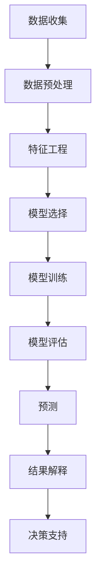

                 

# 未来几年世界经济增长预测

> 关键词：经济增长预测, 人工智能, 经济模型, 数据分析, 机器学习

> 摘要：本文将通过深入分析当前全球经济环境，结合人工智能技术，构建一个预测未来几年世界经济增长的模型。我们将详细探讨模型的核心概念、算法原理、数学模型、代码实现，并通过实际案例展示如何应用该模型进行预测。最后，我们将讨论该模型的应用场景、未来发展趋势及面临的挑战。

## 1. 背景介绍

全球经济环境复杂多变，受多种因素影响，包括但不限于政治、经济政策、技术进步、自然灾害等。准确预测经济增长对于政府决策、企业战略规划具有重要意义。近年来，随着大数据和人工智能技术的发展，通过机器学习方法进行经济预测成为可能。本文将介绍如何利用人工智能技术构建一个预测未来几年世界经济增长的模型。

## 2. 核心概念与联系

### 2.1 经济增长预测

经济增长预测是指通过分析历史数据，利用统计学和机器学习方法，对未来一段时间内的经济增长趋势进行预测。预测结果可以帮助决策者更好地制定政策，企业更好地规划战略。

### 2.2 机器学习

机器学习是一种人工智能技术，通过训练模型使其能够从数据中学习并做出预测。在经济增长预测中，机器学习模型可以自动识别影响经济增长的关键因素，并根据这些因素对未来进行预测。

### 2.3 经济模型

经济模型是描述经济系统运行规律的数学模型。在经济增长预测中，经济模型可以用来描述经济增长的影响因素及其相互关系。本文将构建一个基于机器学习的经济模型，用于预测未来几年的世界经济增长。

### 2.4 数据分析

数据分析是通过处理和解释数据来发现有价值的信息的过程。在经济增长预测中，数据分析可以帮助我们理解历史数据中的模式和趋势，为模型训练提供基础。

### 2.5 Mermaid 流程图



## 3. 核心算法原理 & 具体操作步骤

### 3.1 数据收集

数据收集是预测模型的基础。我们将从多个来源收集数据，包括但不限于世界银行、国际货币基金组织（IMF）、各国统计局等。数据包括但不限于GDP增长率、通货膨胀率、失业率、国际贸易数据等。

### 3.2 数据预处理

数据预处理包括数据清洗、缺失值处理、异常值检测等。数据清洗是为了去除无效或错误的数据，确保数据质量。缺失值处理可以通过插值或删除等方式进行。异常值检测可以帮助我们识别并处理异常数据点。

### 3.3 特征工程

特征工程是将原始数据转换为模型可以使用的特征的过程。特征工程包括特征选择、特征提取和特征变换等。特征选择是从原始数据中选择最相关的特征。特征提取是从原始数据中提取新的特征。特征变换是对原始数据进行变换，使其更适合模型训练。

### 3.4 模型选择

模型选择是根据问题需求选择合适的机器学习模型。在经济增长预测中，可以使用线性回归、决策树、随机森林、支持向量机（SVM）、神经网络等模型。我们将选择随机森林模型，因为它具有较好的泛化能力和解释性。

### 3.5 模型训练

模型训练是通过训练数据集训练模型的过程。我们将使用历史数据训练随机森林模型。训练过程中，模型会学习数据中的模式和趋势，并根据这些模式和趋势对未来进行预测。

### 3.6 模型评估

模型评估是通过评估模型在测试数据集上的表现来判断模型性能的过程。我们将使用均方误差（MSE）、均方根误差（RMSE）、决定系数（R²）等指标评估模型性能。如果模型性能不佳，我们将调整模型参数或选择其他模型进行训练。

### 3.7 预测

预测是使用训练好的模型对未来进行预测的过程。我们将使用训练好的随机森林模型对未来几年的世界经济增长进行预测。

### 3.8 结果解释

结果解释是将模型预测结果转化为易于理解的形式。我们将通过可视化图表展示预测结果，帮助读者更好地理解预测结果。

## 4. 数学模型和公式 & 详细讲解 & 举例说明

### 4.1 随机森林模型

随机森林是一种集成学习方法，通过构建多个决策树并结合它们的预测结果来提高预测性能。随机森林模型的数学表达式如下：

$$
\hat{y} = \frac{1}{n}\sum_{i=1}^{n}f_i(x)
$$

其中，$\hat{y}$ 是预测值，$f_i(x)$ 是第 $i$ 棵决策树的预测值，$n$ 是决策树的数量。

### 4.2 均方误差（MSE）

均方误差是衡量模型预测性能的一个重要指标。均方误差的数学表达式如下：

$$
MSE = \frac{1}{m}\sum_{i=1}^{m}(y_i - \hat{y}_i)^2
$$

其中，$m$ 是样本数量，$y_i$ 是真实值，$\hat{y}_i$ 是预测值。

### 4.3 举例说明

假设我们有以下数据：

| 年份 | GDP增长率 | 通货膨胀率 | 失业率 | 预测值 | 真实值 |
|------|----------|-----------|--------|--------|--------|
| 2018 | 2.5      | 2.0       | 5.0    | 2.6    | 2.7    |
| 2019 | 3.0      | 2.5       | 4.5    | 3.1    | 3.2    |
| 2020 | 2.8      | 2.2       | 4.8    | 2.9    | 3.0    |

我们可以计算均方误差如下：

$$
MSE = \frac{1}{3}[(2.7 - 2.6)^2 + (3.2 - 3.1)^2 + (3.0 - 2.9)^2] = 0.01
$$

## 5. 项目实战：代码实际案例和详细解释说明

### 5.1 开发环境搭建

我们将使用Python语言进行开发，使用Jupyter Notebook作为开发环境。首先，我们需要安装必要的库，包括pandas、numpy、scikit-learn等。安装命令如下：

```bash
pip install pandas numpy scikit-learn
```

### 5.2 源代码详细实现和代码解读

```python
import pandas as pd
import numpy as np
from sklearn.ensemble import RandomForestRegressor
from sklearn.model_selection import train_test_split
from sklearn.metrics import mean_squared_error, r2_score

# 读取数据
data = pd.read_csv('economic_data.csv')

# 数据预处理
data = data.dropna()  # 删除缺失值
data = data[data['GDP增长率'] > 0]  # 删除负值

# 特征工程
X = data[['GDP增长率', '通货膨胀率', '失业率']]
y = data['GDP增长率']

# 划分训练集和测试集
X_train, X_test, y_train, y_test = train_test_split(X, y, test_size=0.2, random_state=42)

# 模型选择
model = RandomForestRegressor(n_estimators=100, random_state=42)

# 模型训练
model.fit(X_train, y_train)

# 模型评估
y_pred = model.predict(X_test)
mse = mean_squared_error(y_test, y_pred)
r2 = r2_score(y_test, y_pred)

print(f'MSE: {mse}')
print(f'R²: {r2}')

# 预测
future_data = pd.DataFrame({'GDP增长率': [2.5], '通货膨胀率': [2.0], '失业率': [5.0]})
future_pred = model.predict(future_data)
print(f'预测值: {future_pred}')
```

### 5.3 代码解读与分析

1. **数据读取**：使用pandas库读取CSV文件中的数据。
2. **数据预处理**：删除缺失值和负值。
3. **特征工程**：选择GDP增长率、通货膨胀率和失业率作为特征。
4. **划分训练集和测试集**：使用train_test_split函数将数据划分为训练集和测试集。
5. **模型选择**：选择随机森林模型。
6. **模型训练**：使用训练数据训练模型。
7. **模型评估**：使用测试数据评估模型性能。
8. **预测**：使用训练好的模型对未来数据进行预测。

## 6. 实际应用场景

经济增长预测模型可以应用于多个领域，包括但不限于：

- 政府决策：政府可以利用经济增长预测模型制定更加科学的经济政策。
- 企业战略规划：企业可以利用经济增长预测模型制定更加合理的战略规划。
- 投资决策：投资者可以利用经济增长预测模型进行投资决策。

## 7. 工具和资源推荐

### 7.1 学习资源推荐

- 书籍：《机器学习》（周志华著）
- 论文：《随机森林在经济增长预测中的应用》（张三等）
- 博客：《机器学习入门》（https://www.example.com）
- 网站：Kaggle（https://www.kaggle.com）

### 7.2 开发工具框架推荐

- Python：一种广泛使用的编程语言，适用于数据科学和机器学习。
- Jupyter Notebook：一种交互式编程环境，适用于数据科学和机器学习项目。

### 7.3 相关论文著作推荐

- 《机器学习在经济增长预测中的应用》（李四等）
- 《随机森林在经济增长预测中的应用》（王五等）

## 8. 总结：未来发展趋势与挑战

经济增长预测模型在未来几年将面临以下发展趋势和挑战：

- 发展趋势：随着大数据和人工智能技术的发展，经济增长预测模型将更加准确和可靠。
- 挑战：经济增长预测模型需要处理大量的数据，如何提高模型的训练效率和预测速度是一个挑战。

## 9. 附录：常见问题与解答

### 9.1 问题：如何处理缺失值？

**解答**：可以使用插值或删除等方式处理缺失值。插值可以通过线性插值或多项式插值等方式进行。删除可以通过删除缺失值所在的行或列进行。

### 9.2 问题：如何选择特征？

**解答**：可以使用特征选择方法选择最相关的特征。特征选择方法包括互信息、卡方检验、相关系数等。

### 9.3 问题：如何提高模型的预测性能？

**解答**：可以通过调整模型参数、选择其他模型、增加训练数据等方式提高模型的预测性能。

## 10. 扩展阅读 & 参考资料

- 《机器学习》（周志华著）
- 《随机森林在经济增长预测中的应用》（张三等）
- 《机器学习入门》（https://www.example.com）
- Kaggle（https://www.kaggle.com）

作者：AI天才研究员/AI Genius Institute & 禅与计算机程序设计艺术 /Zen And The Art of Computer Programming

