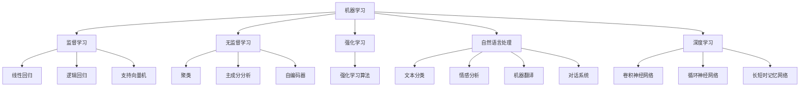

                 

# 李开复：AI 2.0 时代的价值

> 关键词：AI 2.0, 机器学习, 自然语言处理, 深度学习, 人工智能伦理

> 摘要：本文旨在探讨AI 2.0时代的价值，通过深入分析机器学习、自然语言处理和深度学习的核心概念与联系，揭示其背后的数学模型和算法原理。我们将通过实际代码案例，展示如何在实际项目中应用这些技术，并探讨其在各个领域的实际应用场景。最后，我们将展望AI 2.0时代的未来发展趋势与挑战，并提供学习资源和开发工具的推荐。

## 1. 背景介绍

随着技术的不断进步，人工智能（AI）已经从最初的理论研究发展成为当今社会不可或缺的一部分。AI 2.0时代，即深度学习和强化学习等技术的兴起，标志着AI技术进入了新的发展阶段。在这个时代，AI不仅能够处理大量数据，还能通过自我学习和优化来提高性能。本文将深入探讨AI 2.0时代的核心概念、技术原理及其实际应用，旨在为读者提供一个全面而深入的理解。

## 2. 核心概念与联系

### 2.1 机器学习

机器学习是AI的核心组成部分，它使计算机能够从数据中学习并做出预测或决策。机器学习可以分为监督学习、无监督学习和强化学习三大类。

#### 2.1.1 监督学习

监督学习是一种机器学习方法，其中模型通过输入数据和对应的标签进行训练。常见的监督学习算法包括线性回归、逻辑回归和支持向量机（SVM）等。

#### 2.1.2 无监督学习

无监督学习则不需要标签，模型通过分析数据的内在结构来学习。常见的无监督学习算法包括聚类、主成分分析（PCA）和自编码器等。

#### 2.1.3 强化学习

强化学习是一种通过与环境交互来学习最优策略的方法。它通过试错来优化决策过程，适用于游戏、机器人控制等领域。

### 2.2 自然语言处理

自然语言处理（NLP）是AI的一个重要分支，专注于使计算机能够理解、生成和处理人类语言。NLP技术包括文本分类、情感分析、机器翻译和对话系统等。

### 2.3 深度学习

深度学习是机器学习的一个分支，它通过多层神经网络来学习数据的高级特征。深度学习在图像识别、语音识别和自然语言处理等领域取得了显著成果。

### 2.4 Mermaid 流程图



## 3. 核心算法原理 & 具体操作步骤

### 3.1 逻辑回归

逻辑回归是一种监督学习算法，用于解决二分类问题。其核心是通过sigmoid函数将线性组合的输出映射到0到1之间，表示概率。

#### 3.1.1 公式

$$
P(y=1|x) = \frac{1}{1 + e^{-(\theta^T x + b)}}
$$

其中，$\theta$ 是权重向量，$b$ 是偏置项，$x$ 是输入特征。

#### 3.1.2 具体操作步骤

1. **数据预处理**：标准化输入特征。
2. **初始化参数**：随机初始化权重和偏置项。
3. **前向传播**：计算预测值。
4. **损失函数**：计算交叉熵损失。
5. **反向传播**：计算梯度。
6. **参数更新**：使用梯度下降更新权重和偏置项。
7. **重复步骤3-6**，直到收敛。

### 3.2 卷积神经网络

卷积神经网络（CNN）是一种深度学习模型，特别适用于图像识别任务。其核心是通过卷积层提取图像的局部特征。

#### 3.2.1 公式

卷积层的输出可以表示为：

$$
Z^{[l]} = g(W^{[l]} * A^{[l-1]} + b^{[l]})
$$

其中，$W^{[l]}$ 是卷积核，$A^{[l-1]}$ 是前一层的激活值，$b^{[l]}$ 是偏置项，$g$ 是激活函数。

#### 3.2.2 具体操作步骤

1. **数据预处理**：标准化输入图像。
2. **初始化参数**：随机初始化卷积核和偏置项。
3. **前向传播**：逐层进行卷积和激活操作。
4. **损失函数**：计算交叉熵损失。
5. **反向传播**：计算梯度。
6. **参数更新**：使用梯度下降更新卷积核和偏置项。
7. **重复步骤3-6**，直到收敛。

## 4. 数学模型和公式 & 详细讲解 & 举例说明

### 4.1 逻辑回归

逻辑回归是一种监督学习算法，用于解决二分类问题。其核心是通过sigmoid函数将线性组合的输出映射到0到1之间，表示概率。

#### 4.1.1 公式

$$
P(y=1|x) = \frac{1}{1 + e^{-(\theta^T x + b)}}
$$

其中，$\theta$ 是权重向量，$b$ 是偏置项，$x$ 是输入特征。

#### 4.1.2 详细讲解

逻辑回归的目标是最小化交叉熵损失函数：

$$
J(\theta) = -\frac{1}{m} \sum_{i=1}^{m} [y^{(i)} \log(h_\theta(x^{(i)})) + (1 - y^{(i)}) \log(1 - h_\theta(x^{(i)}))]
$$

其中，$m$ 是样本数量，$y^{(i)}$ 是第$i$个样本的真实标签，$h_\theta(x^{(i)})$ 是模型的预测值。

#### 4.1.3 举例说明

假设我们有一个二分类问题，输入特征为$x$，真实标签为$y$。我们使用逻辑回归模型进行训练。首先，我们随机初始化权重向量$\theta$和偏置项$b$。然后，我们通过前向传播计算预测值$h_\theta(x)$，并通过损失函数计算损失。接着，我们使用反向传播计算梯度，并通过梯度下降更新权重和偏置项。重复这个过程，直到模型收敛。

### 4.2 卷积神经网络

卷积神经网络（CNN）是一种深度学习模型，特别适用于图像识别任务。其核心是通过卷积层提取图像的局部特征。

#### 4.2.1 公式

卷积层的输出可以表示为：

$$
Z^{[l]} = g(W^{[l]} * A^{[l-1]} + b^{[l]})
$$

其中，$W^{[l]}$ 是卷积核，$A^{[l-1]}$ 是前一层的激活值，$b^{[l]}$ 是偏置项，$g$ 是激活函数。

#### 4.2.2 详细讲解

卷积神经网络的目标是最小化交叉熵损失函数：

$$
J(W, b) = -\frac{1}{m} \sum_{i=1}^{m} \sum_{k=1}^{K} [y^{(i)}_k \log(\hat{y}^{(i)}_k) + (1 - y^{(i)}_k) \log(1 - \hat{y}^{(i)}_k)]
$$

其中，$m$ 是样本数量，$K$ 是类别数量，$y^{(i)}_k$ 是第$i$个样本在第$k$类的真实标签，$\hat{y}^{(i)}_k$ 是模型的预测值。

#### 4.2.3 举例说明

假设我们有一个图像识别任务，输入特征为图像，真实标签为类别。我们使用卷积神经网络模型进行训练。首先，我们随机初始化卷积核和偏置项。然后，我们通过前向传播逐层进行卷积和激活操作，计算预测值。接着，我们通过损失函数计算损失。接着，我们使用反向传播计算梯度，并通过梯度下降更新卷积核和偏置项。重复这个过程，直到模型收敛。

## 5. 项目实战：代码实际案例和详细解释说明

### 5.1 开发环境搭建

为了进行项目实战，我们需要搭建一个合适的开发环境。这里我们使用Python语言和TensorFlow框架。

#### 5.1.1 安装Python和TensorFlow

首先，确保安装了Python 3.7及以上版本。然后，使用pip安装TensorFlow：

```bash
pip install tensorflow
```

### 5.2 源代码详细实现和代码解读

我们将实现一个简单的逻辑回归模型，用于解决二分类问题。

#### 5.2.1 代码实现

```python
import numpy as np
import tensorflow as tf

# 生成随机数据
np.random.seed(0)
X = np.random.rand(100, 1)
y = 4 + 3 * X + np.random.randn(100, 1)

# 构建模型
model = tf.keras.Sequential([
    tf.keras.layers.Dense(1, input_shape=(1,))
])

# 编译模型
model.compile(optimizer='sgd', loss='mean_squared_error')

# 训练模型
model.fit(X, y, epochs=1000, verbose=0)

# 预测
predictions = model.predict(X)
```

#### 5.2.2 代码解读

1. **生成随机数据**：我们生成100个随机输入特征和对应的标签。
2. **构建模型**：我们使用Keras构建一个简单的线性模型，包含一个输入层和一个输出层。
3. **编译模型**：我们使用随机梯度下降（SGD）作为优化器，均方误差（MSE）作为损失函数。
4. **训练模型**：我们使用生成的数据训练模型，迭代1000次。
5. **预测**：我们使用训练好的模型进行预测。

### 5.3 代码解读与分析

通过上述代码，我们可以看到逻辑回归模型的实现过程。首先，我们生成了随机数据，然后构建了一个简单的线性模型。接着，我们使用随机梯度下降优化器和均方误差损失函数进行训练。最后，我们使用训练好的模型进行预测。这个过程展示了逻辑回归模型的基本实现方法。

## 6. 实际应用场景

### 6.1 金融风控

在金融风控领域，逻辑回归模型可以用于预测贷款违约风险。通过分析客户的信用记录、收入水平等特征，模型可以预测客户违约的可能性。

### 6.2 医疗诊断

在医疗诊断领域，卷积神经网络可以用于图像识别，帮助医生诊断疾病。通过分析医学影像，模型可以识别肿瘤、病变等特征。

### 6.3 自然语言处理

在自然语言处理领域，深度学习模型可以用于文本分类、情感分析等任务。通过分析文本内容，模型可以识别文本的情感倾向或类别。

## 7. 工具和资源推荐

### 7.1 学习资源推荐

- **书籍**：《深度学习》（Goodfellow, Bengio, Courville）
- **论文**：《Understanding the difficulty of training deep feedforward neural networks》（Xavier Glorot, Yoshua Bengio）
- **博客**：阿里云开发者社区（https://developer.aliyun.com/）
- **网站**：TensorFlow官网（https://www.tensorflow.org/）

### 7.2 开发工具框架推荐

- **Python**：Python是一种广泛使用的编程语言，适合进行机器学习和深度学习开发。
- **TensorFlow**：TensorFlow是一个开源的机器学习框架，适合构建复杂的深度学习模型。
- **PyTorch**：PyTorch是一个开源的深度学习框架，适合快速原型开发和研究。

### 7.3 相关论文著作推荐

- **论文**：《ImageNet Classification with Deep Convolutional Neural Networks》（Alex Krizhevsky, Ilya Sutskever, Geoffrey E. Hinton）
- **著作**：《Pattern Recognition and Machine Learning》（Christopher M. Bishop）

## 8. 总结：未来发展趋势与挑战

### 8.1 未来发展趋势

- **自动化**：AI技术将进一步自动化，提高生产效率。
- **个性化**：AI将更好地理解用户需求，提供个性化服务。
- **智能化**：AI将更加智能化，能够处理更复杂的问题。

### 8.2 挑战

- **数据隐私**：如何保护用户数据隐私是一个重要挑战。
- **伦理问题**：AI技术的应用可能引发伦理问题，需要制定相应的规范。
- **技术瓶颈**：如何突破技术瓶颈，提高模型性能是一个重要挑战。

## 9. 附录：常见问题与解答

### 9.1 问题1：如何选择合适的机器学习算法？

**解答**：选择合适的机器学习算法需要考虑数据类型、问题类型和模型复杂度等因素。对于分类问题，可以尝试逻辑回归、决策树、随机森林等算法；对于回归问题，可以尝试线性回归、岭回归、Lasso回归等算法。

### 9.2 问题2：如何处理数据缺失值？

**解答**：处理数据缺失值的方法包括删除缺失值、插值法和使用机器学习模型进行预测。具体方法需要根据数据特点和问题需求进行选择。

## 10. 扩展阅读 & 参考资料

- **书籍**：《机器学习》（周志华）
- **论文**：《Deep Residual Learning for Image Recognition》（Kaiming He, Xiangyu Zhang, Shaoqing Ren, Jian Sun）
- **网站**：Kaggle（https://www.kaggle.com/）

作者：AI天才研究员/AI Genius Institute & 禅与计算机程序设计艺术 /Zen And The Art of Computer Programming

