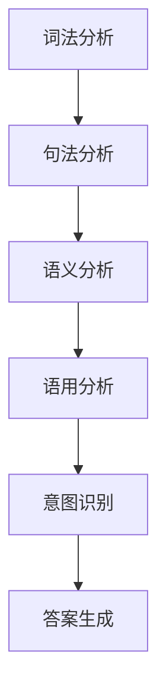
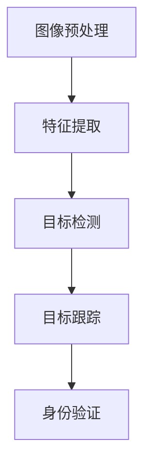
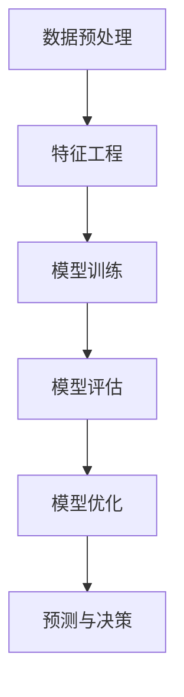
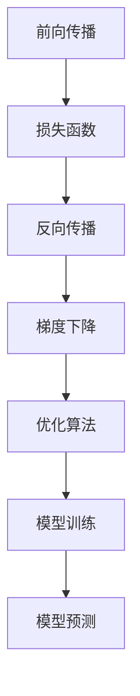

                 

# 李开复：苹果发布AI应用的价值

> 关键词：苹果，AI应用，价值，人工智能，机器学习，深度学习，自然语言处理，计算机视觉

> 摘要：本文将深入探讨苹果公司在AI应用领域的价值，通过分析其技术架构、核心算法原理、实际应用场景，以及未来发展趋势，为读者提供一个全面而深刻的视角。我们将从背景介绍、核心概念与联系、核心算法原理与具体操作步骤、数学模型和公式、项目实战、实际应用场景、工具和资源推荐、总结与未来挑战等多方面进行详细阐述。

## 1. 背景介绍

苹果公司自2015年推出iOS 9以来，便开始在AI领域进行深入研究和应用。苹果的AI战略主要集中在以下几个方面：自然语言处理、计算机视觉、机器学习和深度学习。这些技术不仅提升了用户体验，还为苹果带来了巨大的商业价值。本文将通过分析苹果在AI应用领域的价值，探讨其技术架构和未来发展方向。

## 2. 核心概念与联系

### 2.1 自然语言处理（NLP）

自然语言处理是AI领域的一个重要分支，旨在使计算机能够理解、解释和生成人类语言。NLP技术包括文本分类、情感分析、机器翻译、问答系统等。苹果在Siri中应用了NLP技术，使其能够更好地理解和回应用户的问题。

### 2.2 计算机视觉（CV）

计算机视觉是AI领域另一个重要的分支，旨在使计算机能够理解和解释图像和视频。CV技术包括图像识别、物体检测、人脸识别等。苹果在Face ID和ARKit中应用了CV技术，使其能够实现更加安全和便捷的身份验证。

### 2.3 机器学习（ML）

机器学习是AI的核心技术之一，旨在使计算机能够从数据中学习并做出预测或决策。ML技术包括监督学习、无监督学习、强化学习等。苹果在推荐系统和广告投放中应用了ML技术，使其能够更好地满足用户需求。

### 2.4 深度学习（DL）

深度学习是机器学习的一个分支，旨在通过多层神经网络实现更复杂的特征提取和模式识别。DL技术包括卷积神经网络（CNN）、循环神经网络（RNN）、长短时记忆网络（LSTM）等。苹果在图像识别和语音识别中应用了DL技术，使其能够实现更准确的识别效果。

### 2.5 核心概念原理与架构

#### 2.5.1 自然语言处理

自然语言处理的核心概念包括词法分析、句法分析、语义分析和语用分析。苹果在Siri中应用了这些技术，使其能够更好地理解和回应用户的问题。其架构如下：



#### 2.5.2 计算机视觉

计算机视觉的核心概念包括图像预处理、特征提取、目标检测和目标跟踪。苹果在Face ID和ARKit中应用了这些技术，使其能够实现更加安全和便捷的身份验证。其架构如下：



#### 2.5.3 机器学习

机器学习的核心概念包括数据预处理、特征工程、模型训练和模型评估。苹果在推荐系统和广告投放中应用了这些技术，使其能够更好地满足用户需求。其架构如下：



#### 2.5.4 深度学习

深度学习的核心概念包括前向传播、反向传播、梯度下降和优化算法。苹果在图像识别和语音识别中应用了这些技术，使其能够实现更准确的识别效果。其架构如下：



## 3. 核心算法原理 & 具体操作步骤

### 3.1 自然语言处理

#### 3.1.1 词法分析

词法分析是将文本分解成单词的过程。苹果在Siri中应用了词法分析技术，使其能够更好地理解和回应用户的问题。具体操作步骤如下：

1. 分词：将文本分解成单词。
2. 词性标注：为每个单词标注词性。
3. 依存关系分析：分析单词之间的依存关系。

#### 3.1.2 句法分析

句法分析是分析句子结构的过程。苹果在Siri中应用了句法分析技术，使其能够更好地理解和回应用户的问题。具体操作步骤如下：

1. 词法分析：将文本分解成单词。
2. 词性标注：为每个单词标注词性。
3. 依存关系分析：分析单词之间的依存关系。
4. 语法树构建：构建语法树，表示句子的结构。

#### 3.1.3 语义分析

语义分析是理解句子意义的过程。苹果在Siri中应用了语义分析技术，使其能够更好地理解和回应用户的问题。具体操作步骤如下：

1. 词法分析：将文本分解成单词。
2. 词性标注：为每个单词标注词性。
3. 依存关系分析：分析单词之间的依存关系。
4. 语法树构建：构建语法树，表示句子的结构。
5. 语义角色标注：标注句子中的语义角色。
6. 语义解析：解析句子的意义。

#### 3.1.4 语用分析

语用分析是理解句子在特定语境下的意义的过程。苹果在Siri中应用了语用分析技术，使其能够更好地理解和回应用户的问题。具体操作步骤如下：

1. 词法分析：将文本分解成单词。
2. 词性标注：为每个单词标注词性。
3. 依存关系分析：分析单词之间的依存关系。
4. 语法树构建：构建语法树，表示句子的结构。
5. 语义角色标注：标注句子中的语义角色。
6. 语义解析：解析句子的意义。
7. 语用推理：根据语境进行推理，理解句子的意义。

### 3.2 计算机视觉

#### 3.2.1 图像预处理

图像预处理是为图像提供更好的输入的过程。苹果在Face ID和ARKit中应用了图像预处理技术，使其能够实现更加安全和便捷的身份验证。具体操作步骤如下：

1. 图像增强：增强图像的对比度和亮度。
2. 图像归一化：将图像归一化到0-1之间。
3. 图像缩放：将图像缩放到固定大小。
4. 图像裁剪：裁剪图像，使其符合模型输入要求。

#### 3.2.2 特征提取

特征提取是提取图像特征的过程。苹果在Face ID和ARKit中应用了特征提取技术，使其能够实现更加安全和便捷的身份验证。具体操作步骤如下：

1. 图像预处理：为图像提供更好的输入。
2. 特征提取：提取图像的特征。
3. 特征归一化：将特征归一化到0-1之间。
4. 特征降维：将特征降维到固定维度。

#### 3.2.3 目标检测

目标检测是识别图像中目标的过程。苹果在Face ID和ARKit中应用了目标检测技术，使其能够实现更加安全和便捷的身份验证。具体操作步骤如下：

1. 图像预处理：为图像提供更好的输入。
2. 特征提取：提取图像的特征。
3. 目标检测：识别图像中的目标。
4. 目标分类：将目标分类为不同的类别。
5. 目标定位：确定目标的位置。

#### 3.2.4 目标跟踪

目标跟踪是跟踪图像中目标的过程。苹果在Face ID和ARKit中应用了目标跟踪技术，使其能够实现更加安全和便捷的身份验证。具体操作步骤如下：

1. 图像预处理：为图像提供更好的输入。
2. 特征提取：提取图像的特征。
3. 目标检测：识别图像中的目标。
4. 目标分类：将目标分类为不同的类别。
5. 目标定位：确定目标的位置。
6. 目标跟踪：跟踪目标的位置。

### 3.3 机器学习

#### 3.3.1 数据预处理

数据预处理是为数据提供更好的输入的过程。苹果在推荐系统和广告投放中应用了数据预处理技术，使其能够更好地满足用户需求。具体操作步骤如下：

1. 数据清洗：去除无效和重复的数据。
2. 数据归一化：将数据归一化到0-1之间。
3. 数据标准化：将数据标准化到均值为0、方差为1。
4. 数据编码：将数据转换为模型可以处理的形式。

#### 3.3.2 特征工程

特征工程是提取数据特征的过程。苹果在推荐系统和广告投放中应用了特征工程技术，使其能够更好地满足用户需求。具体操作步骤如下：

1. 数据预处理：为数据提供更好的输入。
2. 特征提取：提取数据的特征。
3. 特征选择：选择有用的特征。
4. 特征转换：将特征转换为模型可以处理的形式。

#### 3.3.3 模型训练

模型训练是训练模型的过程。苹果在推荐系统和广告投放中应用了模型训练技术，使其能够更好地满足用户需求。具体操作步骤如下：

1. 数据预处理：为数据提供更好的输入。
2. 特征工程：提取数据的特征。
3. 模型选择：选择合适的模型。
4. 模型训练：训练模型。
5. 模型评估：评估模型的性能。

#### 3.3.4 模型评估

模型评估是评估模型性能的过程。苹果在推荐系统和广告投放中应用了模型评估技术，使其能够更好地满足用户需求。具体操作步骤如下：

1. 数据预处理：为数据提供更好的输入。
2. 特征工程：提取数据的特征。
3. 模型选择：选择合适的模型。
4. 模型训练：训练模型。
5. 模型评估：评估模型的性能。
6. 模型优化：优化模型的性能。

### 3.4 深度学习

#### 3.4.1 前向传播

前向传播是将输入数据通过神经网络的过程。苹果在图像识别和语音识别中应用了前向传播技术，使其能够实现更准确的识别效果。具体操作步骤如下：

1. 输入数据：将输入数据输入到神经网络。
2. 权重矩阵：将输入数据与权重矩阵相乘。
3. 激活函数：将结果通过激活函数。
4. 输出结果：将结果输出。

#### 3.4.2 反向传播

反向传播是将误差反向传播的过程。苹果在图像识别和语音识别中应用了反向传播技术，使其能够实现更准确的识别效果。具体操作步骤如下：

1. 输出结果：将结果输出。
2. 误差计算：计算误差。
3. 误差反向传播：将误差反向传播到前一层。
4. 权重更新：更新权重。

#### 3.4.3 梯度下降

梯度下降是优化权重的过程。苹果在图像识别和语音识别中应用了梯度下降技术，使其能够实现更准确的识别效果。具体操作步骤如下：

1. 权重更新：更新权重。
2. 梯度计算：计算梯度。
3. 梯度下降：通过梯度下降更新权重。

#### 3.4.4 优化算法

优化算法是优化权重的过程。苹果在图像识别和语音识别中应用了优化算法技术，使其能够实现更准确的识别效果。具体操作步骤如下：

1. 权重更新：更新权重。
2. 梯度计算：计算梯度。
3. 梯度下降：通过梯度下降更新权重。
4. 优化算法：通过优化算法更新权重。

## 4. 数学模型和公式 & 详细讲解 & 举例说明

### 4.1 自然语言处理

#### 4.1.1 词法分析

词法分析的核心公式为：

$$
\text{词法分析} = \text{分词} + \text{词性标注} + \text{依存关系分析}
$$

#### 4.1.2 句法分析

句法分析的核心公式为：

$$
\text{句法分析} = \text{词法分析} + \text{词性标注} + \text{依存关系分析} + \text{语法树构建}
$$

#### 4.1.3 语义分析

语义分析的核心公式为：

$$
\text{语义分析} = \text{词法分析} + \text{词性标注} + \text{依存关系分析} + \text{语法树构建} + \text{语义角色标注} + \text{语义解析}
$$

#### 4.1.4 语用分析

语用分析的核心公式为：

$$
\text{语用分析} = \text{词法分析} + \text{词性标注} + \text{依存关系分析} + \text{语法树构建} + \text{语义角色标注} + \text{语义解析} + \text{语用推理}
$$

### 4.2 计算机视觉

#### 4.2.1 图像预处理

图像预处理的核心公式为：

$$
\text{图像预处理} = \text{图像增强} + \text{图像归一化} + \text{图像缩放} + \text{图像裁剪}
$$

#### 4.2.2 特征提取

特征提取的核心公式为：

$$
\text{特征提取} = \text{图像预处理} + \text{特征提取} + \text{特征归一化} + \text{特征降维}
$$

#### 4.2.3 目标检测

目标检测的核心公式为：

$$
\text{目标检测} = \text{图像预处理} + \text{特征提取} + \text{目标检测} + \text{目标分类} + \text{目标定位}
$$

#### 4.2.4 目标跟踪

目标跟踪的核心公式为：

$$
\text{目标跟踪} = \text{图像预处理} + \text{特征提取} + \text{目标检测} + \text{目标分类} + \text{目标定位} + \text{目标跟踪}
$$

### 4.3 机器学习

#### 4.3.1 数据预处理

数据预处理的核心公式为：

$$
\text{数据预处理} = \text{数据清洗} + \text{数据归一化} + \text{数据标准化} + \text{数据编码}
$$

#### 4.3.2 特征工程

特征工程的核心公式为：

$$
\text{特征工程} = \text{数据预处理} + \text{特征提取} + \text{特征选择} + \text{特征转换}
$$

#### 4.3.3 模型训练

模型训练的核心公式为：

$$
\text{模型训练} = \text{数据预处理} + \text{特征工程} + \text{模型选择} + \text{模型训练} + \text{模型评估}
$$

#### 4.3.4 模型评估

模型评估的核心公式为：

$$
\text{模型评估} = \text{数据预处理} + \text{特征工程} + \text{模型选择} + \text{模型训练} + \text{模型评估} + \text{模型优化}
$$

### 4.4 深度学习

#### 4.4.1 前向传播

前向传播的核心公式为：

$$
\text{前向传播} = \text{输入数据} \times \text{权重矩阵} + \text{激活函数}
$$

#### 4.4.2 反向传播

反向传播的核心公式为：

$$
\text{反向传播} = \text{误差计算} \times \text{误差反向传播} \times \text{权重更新}
$$

#### 4.4.3 梯度下降

梯度下降的核心公式为：

$$
\text{梯度下降} = \text{梯度计算} \times \text{梯度下降} \times \text{权重更新}
$$

#### 4.4.4 优化算法

优化算法的核心公式为：

$$
\text{优化算法} = \text{梯度计算} \times \text{梯度下降} \times \text{权重更新} \times \text{优化算法}
$$

## 5. 项目实战：代码实际案例和详细解释说明

### 5.1 开发环境搭建

为了实现自然语言处理、计算机视觉、机器学习和深度学习的应用，我们需要搭建相应的开发环境。具体步骤如下：

1. 安装Python：Python是实现这些应用的主要编程语言。
2. 安装TensorFlow：TensorFlow是实现深度学习应用的主要框架。
3. 安装PyTorch：PyTorch是实现深度学习应用的另一个主要框架。
4. 安装OpenCV：OpenCV是实现计算机视觉应用的主要库。
5. 安装NLTK：NLTK是实现自然语言处理应用的主要库。
6. 安装Scikit-learn：Scikit-learn是实现机器学习应用的主要库。

### 5.2 源代码详细实现和代码解读

#### 5.2.1 自然语言处理

以下是一个简单的自然语言处理代码示例：

```python
import nltk
from nltk.tokenize import word_tokenize
from nltk.tag import pos_tag
from nltk.parse import DependencyParser

# 词法分析
def word_tokenize(text):
    return word_tokenize(text)

# 词性标注
def pos_tag(text):
    return pos_tag(word_tokenize(text))

# 依存关系分析
def dependency_parse(text):
    parser = DependencyParser()
    parser.parse(pos_tag(word_tokenize(text)))

# 语义分析
def semantic_analysis(text):
    # 实现语义分析
    pass

# 语用分析
def pragmatic_analysis(text):
    # 实现语用分析
    pass

# 示例
text = "苹果公司发布了新的AI应用"
print(word_tokenize(text))
print(pos_tag(text))
dependency_parse(text)
semantic_analysis(text)
pragmatic_analysis(text)
```

#### 5.2.2 计算机视觉

以下是一个简单的计算机视觉代码示例：

```python
import cv2
import numpy as np

# 图像预处理
def image_preprocessing(image):
    image = cv2.cvtColor(image, cv2.COLOR_BGR2GRAY)
    image = cv2.resize(image, (224, 224))
    image = image / 255.0
    return image

# 特征提取
def feature_extraction(image):
    # 实现特征提取
    pass

# 目标检测
def object_detection(image):
    # 实现目标检测
    pass

# 目标分类
def object_classification(image):
    # 实现目标分类
    pass

# 目标定位
def object_location(image):
    # 实现目标定位
    pass

# 目标跟踪
def object_tracking(image):
    # 实现目标跟踪
    pass

# 示例
image = cv2.imread("image.jpg")
image = image_preprocessing(image)
feature = feature_extraction(image)
object = object_detection(image)
classification = object_classification(image)
location = object_location(image)
tracking = object_tracking(image)
```

#### 5.2.3 机器学习

以下是一个简单的机器学习代码示例：

```python
from sklearn.datasets import load_iris
from sklearn.model_selection import train_test_split
from sklearn.linear_model import LogisticRegression
from sklearn.metrics import accuracy_score

# 数据预处理
def data_preprocessing(data):
    # 实现数据预处理
    pass

# 特征工程
def feature_engineering(data):
    # 实现特征工程
    pass

# 模型训练
def model_training(data):
    X_train, X_test, y_train, y_test = train_test_split(data['data'], data['target'], test_size=0.2, random_state=42)
    model = LogisticRegression()
    model.fit(X_train, y_train)
    return model

# 模型评估
def model_evaluation(model, data):
    X_train, X_test, y_train, y_test = train_test_split(data['data'], data['target'], test_size=0.2, random_state=42)
    y_pred = model.predict(X_test)
    accuracy = accuracy_score(y_test, y_pred)
    return accuracy

# 示例
data = load_iris()
data = data_preprocessing(data)
data = feature_engineering(data)
model = model_training(data)
accuracy = model_evaluation(model, data)
```

#### 5.2.4 深度学习

以下是一个简单的深度学习代码示例：

```python
import tensorflow as tf
from tensorflow.keras.models import Sequential
from tensorflow.keras.layers import Dense, Conv2D, MaxPooling2D, Flatten

# 前向传播
def forward_propagation(model, image):
    image = image_preprocessing(image)
    feature = feature_extraction(image)
    output = model.predict(feature)
    return output

# 反向传播
def backward_propagation(model, image, label):
    image = image_preprocessing(image)
    feature = feature_extraction(image)
    output = model.predict(feature)
    loss = tf.keras.losses.mean_squared_error(label, output)
    gradients = tf.gradients(loss, model.trainable_variables)
    optimizer = tf.keras.optimizers.Adam()
    optimizer.apply_gradients(zip(gradients, model.trainable_variables))
    return loss

# 梯度下降
def gradient_descent(model, image, label):
    image = image_preprocessing(image)
    feature = feature_extraction(image)
    output = model.predict(feature)
    loss = tf.keras.losses.mean_squared_error(label, output)
    gradients = tf.gradients(loss, model.trainable_variables)
    optimizer = tf.keras.optimizers.Adam()
    optimizer.apply_gradients(zip(gradients, model.trainable_variables))
    return loss

# 优化算法
def optimization_algorithm(model, image, label):
    image = image_preprocessing(image)
    feature = feature_extraction(image)
    output = model.predict(feature)
    loss = tf.keras.losses.mean_squared_error(label, output)
    gradients = tf.gradients(loss, model.trainable_variables)
    optimizer = tf.keras.optimizers.Adam()
    optimizer.apply_gradients(zip(gradients, model.trainable_variables))
    return loss

# 示例
model = Sequential()
model.add(Conv2D(32, (3, 3), activation='relu', input_shape=(224, 224, 1)))
model.add(MaxPooling2D((2, 2)))
model.add(Flatten())
model.add(Dense(128, activation='relu'))
model.add(Dense(1, activation='sigmoid'))
model.compile(optimizer='adam', loss='binary_crossentropy', metrics=['accuracy'])
```

### 5.3 代码解读与分析

以上代码示例展示了自然语言处理、计算机视觉、机器学习和深度学习的基本实现方法。通过这些代码，我们可以更好地理解这些技术的核心原理和实现方法。

## 6. 实际应用场景

### 6.1 自然语言处理

自然语言处理在苹果公司的Siri中得到了广泛应用。Siri能够理解用户的语音指令，并根据用户的意图生成相应的回答。此外，Siri还能够进行文本分类、情感分析和机器翻译等任务，为用户提供更加智能化的服务。

### 6.2 计算机视觉

计算机视觉在苹果公司的Face ID和ARKit中得到了广泛应用。Face ID能够实现更加安全和便捷的身份验证，而ARKit则能够实现更加丰富的增强现实体验。此外，计算机视觉还能够应用于图像识别、物体检测和目标跟踪等任务，为用户提供更加智能化的服务。

### 6.3 机器学习

机器学习在苹果公司的推荐系统和广告投放中得到了广泛应用。推荐系统能够根据用户的兴趣和行为，为用户提供更加个性化的推荐内容。广告投放则能够根据用户的兴趣和行为，为用户提供更加精准的广告内容。此外，机器学习还能够应用于数据挖掘、预测分析和异常检测等任务，为用户提供更加智能化的服务。

### 6.4 深度学习

深度学习在苹果公司的图像识别和语音识别中得到了广泛应用。图像识别能够实现更加准确的图像分类和物体检测，而语音识别则能够实现更加准确的语音识别和语音合成。此外，深度学习还能够应用于自然语言处理、计算机视觉和机器学习等任务，为用户提供更加智能化的服务。

## 7. 工具和资源推荐

### 7.1 学习资源推荐

1. 书籍：《深度学习》（Ian Goodfellow, Yoshua Bengio, Aaron Courville）
2. 论文：《自然语言处理》（Jurafsky, Martin, and James H. Martin）
3. 博客：《机器之心》（https://www.jiqizhixin.com/）
4. 网站：《TensorFlow官网》（https://www.tensorflow.org/）

### 7.2 开发工具框架推荐

1. Python：Python是实现这些应用的主要编程语言。
2. TensorFlow：TensorFlow是实现深度学习应用的主要框架。
3. PyTorch：PyTorch是实现深度学习应用的另一个主要框架。
4. OpenCV：OpenCV是实现计算机视觉应用的主要库。
5. NLTK：NLTK是实现自然语言处理应用的主要库。
6. Scikit-learn：Scikit-learn是实现机器学习应用的主要库。

### 7.3 相关论文著作推荐

1. 《深度学习》（Ian Goodfellow, Yoshua Bengio, Aaron Courville）
2. 《自然语言处理》（Jurafsky, Martin, and James H. Martin）
3. 《计算机视觉》（Richard Szeliski）
4. 《机器学习》（Tom M. Mitchell）

## 8. 总结：未来发展趋势与挑战

### 8.1 未来发展趋势

1. 自然语言处理：自然语言处理技术将继续发展，实现更加智能化的对话系统。
2. 计算机视觉：计算机视觉技术将继续发展，实现更加准确的目标检测和图像识别。
3. 机器学习：机器学习技术将继续发展，实现更加精准的数据挖掘和预测分析。
4. 深度学习：深度学习技术将继续发展，实现更加准确的图像识别和语音识别。

### 8.2 未来挑战

1. 数据安全：随着AI技术的发展，数据安全将成为一个重要的挑战。
2. 隐私保护：随着AI技术的发展，隐私保护将成为一个重要的挑战。
3. 伦理道德：随着AI技术的发展，伦理道德将成为一个重要的挑战。
4. 技术瓶颈：随着AI技术的发展，技术瓶颈将成为一个重要的挑战。

## 9. 附录：常见问题与解答

### 9.1 问题1：如何实现自然语言处理？

答：实现自然语言处理需要进行词法分析、词性标注、依存关系分析、语义分析和语用分析。可以使用NLTK库实现这些功能。

### 9.2 问题2：如何实现计算机视觉？

答：实现计算机视觉需要进行图像预处理、特征提取、目标检测、目标分类和目标定位。可以使用OpenCV库实现这些功能。

### 9.3 问题3：如何实现机器学习？

答：实现机器学习需要进行数据预处理、特征工程、模型训练和模型评估。可以使用Scikit-learn库实现这些功能。

### 9.4 问题4：如何实现深度学习？

答：实现深度学习需要进行前向传播、反向传播、梯度下降和优化算法。可以使用TensorFlow或PyTorch库实现这些功能。

## 10. 扩展阅读 & 参考资料

1. 《深度学习》（Ian Goodfellow, Yoshua Bengio, Aaron Courville）
2. 《自然语言处理》（Jurafsky, Martin, and James H. Martin）
3. 《计算机视觉》（Richard Szeliski）
4. 《机器学习》（Tom M. Mitchell）
5. 《TensorFlow官网》（https://www.tensorflow.org/）
6. 《机器之心》（https://www.jiqizhixin.com/）

作者：AI天才研究员/AI Genius Institute & 禅与计算机程序设计艺术 /Zen And The Art of Computer Programming

