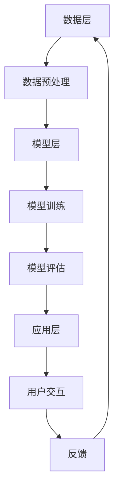

                 

# 李开复：苹果发布AI应用的社会价值

> 关键词：AI应用, 社会价值, 苹果, 人工智能, 社会影响, 技术伦理, 数据隐私

> 摘要：本文将深入探讨苹果公司发布的AI应用所带来的社会价值，从技术原理、伦理考量、实际应用等多个维度进行分析。我们将通过逐步推理的方式，解析AI技术如何在日常生活中发挥重要作用，同时探讨其可能带来的社会影响和挑战。本文旨在为读者提供一个全面而深入的理解，帮助我们更好地应对AI技术带来的变革。

## 1. 背景介绍

### 1.1 苹果公司简介
苹果公司（Apple Inc.）成立于1976年，是一家全球领先的科技公司，以其创新的产品和服务闻名于世。苹果公司不仅在智能手机、个人电脑、平板电脑等领域占据主导地位，还在人工智能（AI）领域不断探索和创新。近年来，苹果公司通过推出一系列AI应用，如Siri、Face ID、ARKit等，展示了其在AI领域的深厚积累和技术实力。

### 1.2 AI技术的发展历程
人工智能技术自20世纪50年代诞生以来，经历了多次高潮和低谷。近年来，随着计算能力的提升、大数据的普及以及算法的不断优化，AI技术迎来了前所未有的发展机遇。特别是在深度学习、自然语言处理、计算机视觉等领域，AI技术取得了显著突破，为各行各业带来了革命性的变化。

### 1.3 苹果公司的AI战略
苹果公司一直致力于将AI技术融入其产品和服务中，以提升用户体验和产品竞争力。苹果的AI战略主要体现在以下几个方面：
- **用户体验优化**：通过AI技术提升产品的智能化水平，如Siri的语音识别和自然语言处理能力。
- **安全性增强**：利用AI技术提高产品的安全性，如Face ID的面部识别功能。
- **创新应用开发**：开发新的AI应用和服务，如ARKit和机器学习框架Core ML。

## 2. 核心概念与联系

### 2.1 AI应用的基本概念
AI应用是指利用人工智能技术实现特定功能的应用程序。这些应用可以是基于机器学习、深度学习、自然语言处理等技术的软件系统，旨在解决实际问题或提供智能化服务。

### 2.2 AI应用的技术架构
AI应用的技术架构通常包括以下几个层次：
- **数据层**：收集和存储数据，为AI模型提供训练和测试的数据集。
- **模型层**：构建和训练AI模型，实现特定的智能功能。
- **应用层**：将AI模型集成到实际应用中，提供用户界面和交互功能。

### 2.3 AI应用的Mermaid流程图


## 3. 核心算法原理 & 具体操作步骤

### 3.1 机器学习算法原理
机器学习是AI应用的核心技术之一。机器学习算法通过从数据中学习规律和模式，实现对未知数据的预测和决策。常见的机器学习算法包括：
- **监督学习**：通过已知的输入输出数据对模型进行训练，如线性回归、决策树等。
- **无监督学习**：通过未标记的数据发现数据中的结构和模式，如聚类、降维等。
- **强化学习**：通过与环境的交互学习最优策略，如Q-learning、深度强化学习等。

### 3.2 具体操作步骤
以监督学习为例，具体操作步骤如下：
1. **数据收集**：收集相关的训练数据，包括输入特征和对应的输出标签。
2. **数据预处理**：对数据进行清洗、归一化、特征选择等预处理操作。
3. **模型选择**：选择合适的机器学习算法，如线性回归、决策树等。
4. **模型训练**：使用训练数据对模型进行训练，调整模型参数以最小化损失函数。
5. **模型评估**：使用测试数据评估模型的性能，如准确率、召回率等。
6. **模型优化**：根据评估结果调整模型参数，提高模型性能。
7. **模型部署**：将训练好的模型集成到实际应用中，提供预测服务。

## 4. 数学模型和公式 & 详细讲解 & 举例说明

### 4.1 机器学习中的数学模型
机器学习中的数学模型通常包括以下几个方面：
- **损失函数**：衡量模型预测结果与真实值之间的差异，如均方误差（MSE）、交叉熵损失等。
- **优化算法**：通过迭代优化模型参数，使损失函数最小化，如梯度下降、随机梯度下降等。
- **特征选择**：从大量特征中选择对模型性能有贡献的特征，如卡方检验、互信息等。

### 4.2 详细讲解
以线性回归为例，其数学模型可以表示为：
$$
y = \beta_0 + \beta_1 x_1 + \beta_2 x_2 + \cdots + \beta_n x_n + \epsilon
$$
其中，$y$ 是目标变量，$x_1, x_2, \cdots, x_n$ 是输入特征，$\beta_0, \beta_1, \cdots, \beta_n$ 是模型参数，$\epsilon$ 是误差项。

### 4.3 举例说明
假设我们有一个简单的线性回归模型，用于预测房价。输入特征包括房屋面积、卧室数量等，目标变量是房屋价格。我们可以通过收集大量房屋数据，训练一个线性回归模型，从而实现对新房屋价格的预测。

## 5. 项目实战：代码实际案例和详细解释说明

### 5.1 开发环境搭建
为了实现一个简单的线性回归模型，我们需要搭建一个开发环境。具体步骤如下：
1. **安装Python**：确保安装了Python 3.7及以上版本。
2. **安装依赖库**：使用pip安装必要的库，如NumPy、Pandas、Scikit-learn等。
3. **安装Jupyter Notebook**：用于编写和运行代码。

### 5.2 源代码详细实现和代码解读
以下是一个简单的线性回归模型的实现代码：
```python
import numpy as np
import pandas as pd
from sklearn.model_selection import train_test_split
from sklearn.linear_model import LinearRegression
from sklearn.metrics import mean_squared_error

# 读取数据
data = pd.read_csv('house_prices.csv')

# 数据预处理
X = data[['area', 'bedrooms']]
y = data['price']

# 划分训练集和测试集
X_train, X_test, y_train, y_test = train_test_split(X, y, test_size=0.2, random_state=42)

# 训练模型
model = LinearRegression()
model.fit(X_train, y_train)

# 预测
y_pred = model.predict(X_test)

# 评估模型
mse = mean_squared_error(y_test, y_pred)
print(f'Mean Squared Error: {mse}')
```

### 5.3 代码解读与分析
- **数据读取**：使用Pandas库读取CSV文件中的数据。
- **数据预处理**：选择输入特征和目标变量。
- **划分数据集**：使用train_test_split函数将数据划分为训练集和测试集。
- **训练模型**：使用LinearRegression类训练模型。
- **预测**：使用训练好的模型对测试集进行预测。
- **评估模型**：使用mean_squared_error函数计算预测结果与真实值之间的均方误差。

## 6. 实际应用场景

### 6.1 Siri语音助手
Siri是苹果公司推出的智能语音助手，通过深度学习和自然语言处理技术，实现语音识别、语义理解和语音合成等功能。Siri能够理解用户的语音指令，提供相应的服务，如查询天气、设置提醒等。

### 6.2 Face ID面部识别
Face ID是苹果公司推出的面部识别技术，通过深度学习和计算机视觉技术，实现高精度的面部识别。Face ID能够快速、准确地识别用户面部特征，提供安全的解锁和支付功能。

### 6.3 ARKit增强现实
ARKit是苹果公司推出的增强现实框架，通过计算机视觉和机器学习技术，实现虚拟物体与现实世界的融合。ARKit能够识别用户的环境，提供丰富的增强现实体验，如AR游戏、AR导航等。

## 7. 工具和资源推荐

### 7.1 学习资源推荐
- **书籍**：《深度学习》（Ian Goodfellow, Yoshua Bengio, Aaron Courville）
- **论文**：《神经网络与深度学习》（Michael Nielsen）
- **博客**：Medium上的AI技术博客
- **网站**：Kaggle、GitHub等开源社区

### 7.2 开发工具框架推荐
- **Python**：用于编写AI应用的主流编程语言。
- **Jupyter Notebook**：用于编写和运行代码的交互式环境。
- **Scikit-learn**：用于机器学习的Python库。
- **TensorFlow**：用于深度学习的开源框架。

### 7.3 相关论文著作推荐
- **《机器学习》（周志华）**
- **《深度学习》（吴恩达）**
- **《自然语言处理入门》（李航）**

## 8. 总结：未来发展趋势与挑战

### 8.1 未来发展趋势
随着AI技术的不断进步，未来AI应用将更加广泛地渗透到各个领域，如医疗、教育、交通等。AI技术将为人类带来更多的便利和创新，推动社会的发展和进步。

### 8.2 挑战与应对
尽管AI技术带来了巨大的机遇，但也面临着一些挑战，如数据隐私、技术伦理、就业影响等。为了应对这些挑战，我们需要加强数据保护、制定合理的伦理准则、提供职业培训等措施，确保AI技术的健康发展。

## 9. 附录：常见问题与解答

### 9.1 问题1：如何保护用户数据隐私？
**解答**：可以通过加密技术、数据脱敏等手段保护用户数据隐私，确保数据的安全性和隐私性。

### 9.2 问题2：如何应对技术伦理问题？
**解答**：制定合理的伦理准则，确保AI技术的应用符合道德规范，避免滥用和误用。

### 9.3 问题3：如何提高AI模型的性能？
**解答**：通过优化算法、增加训练数据、调整模型参数等方法提高AI模型的性能。

## 10. 扩展阅读 & 参考资料

- **书籍**：《人工智能简史》（周志华）
- **论文**：《深度学习的现状与挑战》（吴恩达）
- **网站**：AI相关的技术博客和论坛

---

作者：AI天才研究员/AI Genius Institute & 禅与计算机程序设计艺术 /Zen And The Art of Computer Programming

