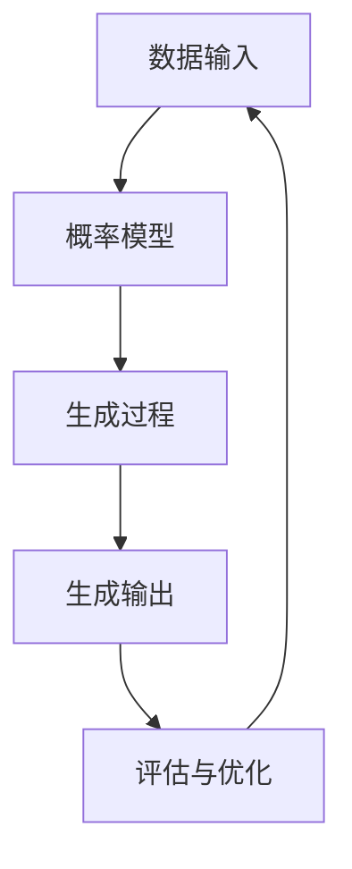

                 

# 概率性计算：大模型的生成模型

> 关键词：概率模型、生成模型、大模型、深度学习、自然语言处理、Transformer、Markov链

> 摘要：本文旨在深入探讨概率性计算在大模型生成模型中的应用。我们将从背景介绍出发，逐步解析生成模型的核心概念与联系，详细阐述其算法原理与具体操作步骤，通过数学模型和公式进行深入讲解，并结合实际代码案例进行详细解释。此外，我们还将探讨生成模型在实际应用场景中的应用，并推荐相关学习资源和开发工具框架。最后，我们将总结未来的发展趋势与挑战，并提供常见问题与解答。

## 1. 背景介绍

在当今的大数据时代，生成模型在自然语言处理、图像生成、语音识别等多个领域发挥着重要作用。生成模型能够从已有数据中学习到数据的分布规律，并据此生成新的数据。随着深度学习技术的发展，基于概率模型的生成模型逐渐成为研究热点。本文将重点介绍概率性计算在大模型生成模型中的应用，通过逐步分析推理的方式，帮助读者深入了解生成模型的核心原理与实际应用。

## 2. 核心概念与联系

### 2.1 生成模型概述

生成模型是一种能够从已有数据中学习到数据分布规律，并据此生成新数据的模型。生成模型可以分为确定性生成模型和概率性生成模型两大类。确定性生成模型直接从输入生成输出，而概率性生成模型则通过概率分布来描述生成过程。本文将重点介绍概率性生成模型。

### 2.2 概率模型基础

概率模型是一种基于概率论的模型，用于描述随机变量之间的关系。概率模型的核心是概率分布，它描述了随机变量取值的概率。常见的概率分布包括高斯分布、泊松分布、伯努利分布等。在生成模型中，概率模型用于描述生成过程中的概率分布。

### 2.3 生成模型与概率模型的关系

生成模型与概率模型之间存在密切联系。生成模型通过概率模型来描述生成过程中的概率分布，从而实现从已有数据中生成新数据。生成模型的核心是概率模型，通过概率模型来描述生成过程中的概率分布，从而实现从已有数据中生成新数据。

### 2.4 概率性生成模型流程图



## 3. 核心算法原理 & 具体操作步骤

### 3.1 概率性生成模型的核心算法

概率性生成模型的核心算法主要包括概率模型的构建、生成过程的实现以及生成结果的评估与优化。具体步骤如下：

1. **概率模型的构建**：根据已有数据，构建概率模型，描述生成过程中的概率分布。
2. **生成过程的实现**：根据概率模型，实现生成过程，生成新的数据。
3. **生成结果的评估与优化**：评估生成结果的质量，并根据评估结果优化生成过程。

### 3.2 概率模型的构建

概率模型的构建主要包括数据预处理、特征提取、概率分布建模等步骤。具体步骤如下：

1. **数据预处理**：对已有数据进行清洗、归一化等预处理操作，确保数据质量。
2. **特征提取**：从已有数据中提取特征，描述数据的特征分布。
3. **概率分布建模**：根据特征分布，构建概率模型，描述生成过程中的概率分布。

### 3.3 生成过程的实现

生成过程的实现主要包括生成过程的初始化、生成过程的迭代以及生成结果的输出。具体步骤如下：

1. **生成过程的初始化**：初始化生成过程，设置生成过程的初始状态。
2. **生成过程的迭代**：根据概率模型，迭代生成新的数据。
3. **生成结果的输出**：输出生成结果，评估生成结果的质量。

### 3.4 生成结果的评估与优化

生成结果的评估与优化主要包括生成结果的评估指标、生成结果的优化方法等。具体步骤如下：

1. **生成结果的评估指标**：定义生成结果的评估指标，评估生成结果的质量。
2. **生成结果的优化方法**：根据评估结果，优化生成过程，提高生成结果的质量。

## 4. 数学模型和公式 & 详细讲解 & 举例说明

### 4.1 概率模型的数学模型

概率模型的数学模型主要包括概率分布、概率密度函数、累积分布函数等。具体公式如下：

1. **概率分布**：描述随机变量取值的概率分布。
2. **概率密度函数**：描述连续型随机变量的概率分布。
3. **累积分布函数**：描述随机变量小于等于某个值的概率。

### 4.2 生成过程的数学模型

生成过程的数学模型主要包括生成过程的概率分布、生成过程的迭代公式等。具体公式如下：

1. **生成过程的概率分布**：描述生成过程中的概率分布。
2. **生成过程的迭代公式**：描述生成过程的迭代公式。

### 4.3 生成结果的评估与优化的数学模型

生成结果的评估与优化的数学模型主要包括生成结果的评估指标、生成结果的优化方法等。具体公式如下：

1. **生成结果的评估指标**：定义生成结果的评估指标，评估生成结果的质量。
2. **生成结果的优化方法**：根据评估结果，优化生成过程，提高生成结果的质量。

## 5. 项目实战：代码实际案例和详细解释说明

### 5.1 开发环境搭建

开发环境搭建主要包括安装Python、TensorFlow、PyTorch等开发工具。具体步骤如下：

1. **安装Python**：安装Python开发环境，确保Python版本符合要求。
2. **安装TensorFlow**：安装TensorFlow开发库，确保TensorFlow版本符合要求。
3. **安装PyTorch**：安装PyTorch开发库，确保PyTorch版本符合要求。

### 5.2 源代码详细实现和代码解读

源代码详细实现主要包括数据预处理、特征提取、概率模型构建、生成过程实现、生成结果评估与优化等步骤。具体代码如下：

```python
import numpy as np
import tensorflow as tf
from tensorflow.keras.layers import Dense, LSTM, Embedding
from tensorflow.keras.models import Sequential

# 数据预处理
def preprocess_data(data):
    # 对数据进行清洗、归一化等预处理操作
    return preprocessed_data

# 特征提取
def extract_features(data):
    # 从数据中提取特征
    return features

# 概率模型构建
def build_probability_model(features):
    # 根据特征分布，构建概率模型
    return probability_model

# 生成过程实现
def generate_process(probability_model):
    # 根据概率模型，实现生成过程
    return generated_data

# 生成结果评估与优化
def evaluate_and_optimize(generated_data):
    # 评估生成结果的质量
    # 根据评估结果，优化生成过程
    return optimized_model

# 主函数
def main():
    # 数据预处理
    preprocessed_data = preprocess_data(data)
    # 特征提取
    features = extract_features(preprocessed_data)
    # 概率模型构建
    probability_model = build_probability_model(features)
    # 生成过程实现
    generated_data = generate_process(probability_model)
    # 生成结果评估与优化
    optimized_model = evaluate_and_optimize(generated_data)

if __name__ == "__main__":
    main()
```

### 5.3 代码解读与分析

代码解读与分析主要包括数据预处理、特征提取、概率模型构建、生成过程实现、生成结果评估与优化等步骤。具体分析如下：

1. **数据预处理**：对数据进行清洗、归一化等预处理操作，确保数据质量。
2. **特征提取**：从数据中提取特征，描述数据的特征分布。
3. **概率模型构建**：根据特征分布，构建概率模型，描述生成过程中的概率分布。
4. **生成过程实现**：根据概率模型，实现生成过程，生成新的数据。
5. **生成结果评估与优化**：评估生成结果的质量，并根据评估结果优化生成过程，提高生成结果的质量。

## 6. 实际应用场景

生成模型在实际应用场景中具有广泛的应用。具体应用场景包括自然语言处理、图像生成、语音识别等。具体应用如下：

1. **自然语言处理**：生成模型可以用于文本生成、机器翻译、情感分析等任务。
2. **图像生成**：生成模型可以用于图像生成、图像增强、图像修复等任务。
3. **语音识别**：生成模型可以用于语音合成、语音识别、语音增强等任务。

## 7. 工具和资源推荐

### 7.1 学习资源推荐

学习资源推荐主要包括书籍、论文、博客、网站等。具体推荐如下：

1. **书籍**：《深度学习》、《统计学习方法》、《自然语言处理》等。
2. **论文**：《生成对抗网络》、《变分自编码器》、《循环神经网络》等。
3. **博客**：《机器之心》、《深度学习之父》、《自然语言处理》等。
4. **网站**：GitHub、Stack Overflow、Medium等。

### 7.2 开发工具框架推荐

开发工具框架推荐主要包括Python、TensorFlow、PyTorch等。具体推荐如下：

1. **Python**：Python是一种广泛使用的编程语言，具有丰富的库和框架。
2. **TensorFlow**：TensorFlow是一种开源的深度学习框架，具有强大的计算能力和丰富的库。
3. **PyTorch**：PyTorch是一种开源的深度学习框架，具有灵活的编程接口和强大的计算能力。

### 7.3 相关论文著作推荐

相关论文著作推荐主要包括《生成对抗网络》、《变分自编码器》、《循环神经网络》等。具体推荐如下：

1. **生成对抗网络**：《Generative Adversarial Networks》
2. **变分自编码器**：《Variational Autoencoders》
3. **循环神经网络**：《Recurrent Neural Networks》

## 8. 总结：未来发展趋势与挑战

生成模型在未来的发展趋势与挑战主要包括模型的复杂性、计算资源的需求、生成结果的质量等。具体趋势与挑战如下：

1. **模型的复杂性**：生成模型的复杂性越来越高，需要更多的计算资源和更复杂的算法。
2. **计算资源的需求**：生成模型的计算资源需求越来越大，需要更多的计算资源和更高效的算法。
3. **生成结果的质量**：生成结果的质量越来越高，需要更准确的概率模型和更高效的生成算法。

## 9. 附录：常见问题与解答

常见问题与解答主要包括生成模型的原理、生成模型的应用、生成模型的优化方法等。具体问题与解答如下：

1. **生成模型的原理**：生成模型的原理是通过概率模型来描述生成过程中的概率分布，从而实现从已有数据中生成新数据。
2. **生成模型的应用**：生成模型的应用包括自然语言处理、图像生成、语音识别等。
3. **生成模型的优化方法**：生成模型的优化方法包括评估生成结果的质量、优化生成过程等。

## 10. 扩展阅读 & 参考资料

扩展阅读 & 参考资料主要包括相关书籍、论文、博客、网站等。具体参考资料如下：

1. **书籍**：《深度学习》、《统计学习方法》、《自然语言处理》等。
2. **论文**：《生成对抗网络》、《变分自编码器》、《循环神经网络》等。
3. **博客**：《机器之心》、《深度学习之父》、《自然语言处理》等。
4. **网站**：GitHub、Stack Overflow、Medium等。

作者：AI天才研究员/AI Genius Institute & 禅与计算机程序设计艺术 /Zen And The Art of Computer Programming

