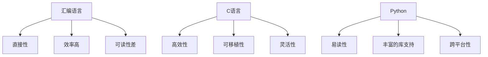

                 

# 汇编、C、Python：AI开发的语言基础

> 关键词：汇编语言, C语言, Python, AI开发, 语言基础, 代码实现, 项目实战, 应用场景, 工具推荐

> 摘要：本文旨在探讨汇编语言、C语言和Python在AI开发中的基础作用及其相互联系。通过逐步分析和推理，我们将深入理解这些语言的核心概念、算法原理、数学模型，并通过实际代码案例进行详细解释。此外，本文还将探讨这些语言在AI开发中的实际应用场景，并提供学习资源和开发工具推荐，帮助读者更好地掌握AI开发的基础知识。

## 1. 背景介绍

在人工智能（AI）开发领域，选择合适的编程语言至关重要。不同的编程语言具有不同的特性和适用场景，能够满足不同层次的需求。本文将探讨汇编语言、C语言和Python在AI开发中的基础作用及其相互联系，帮助读者理解这些语言的核心概念、算法原理和数学模型，并通过实际代码案例进行详细解释。

## 2. 核心概念与联系

### 2.1 汇编语言

汇编语言是一种低级编程语言，它直接对应于计算机的硬件指令集。汇编语言的指令与机器指令一一对应，因此可以直接控制硬件资源。汇编语言的主要特点包括：

- **直接性**：汇编语言的指令直接对应于机器指令，可以直接控制硬件资源。
- **效率高**：汇编语言编写的程序通常具有较高的执行效率。
- **可读性差**：汇编语言的代码可读性较差，需要熟悉特定的硬件架构。

### 2.2 C语言

C语言是一种高级编程语言，它结合了汇编语言的高效性和高级语言的可读性。C语言的主要特点包括：

- **高效性**：C语言编写的程序具有较高的执行效率。
- **可移植性**：C语言具有较好的跨平台特性。
- **灵活性**：C语言提供了丰富的数据类型和控制结构，可以灵活地实现各种算法。

### 2.3 Python

Python是一种高级编程语言，它具有简洁易读的语法和丰富的库支持。Python的主要特点包括：

- **易读性**：Python的语法简洁易读，易于学习和使用。
- **丰富的库支持**：Python拥有大量的第三方库，可以方便地实现各种功能。
- **跨平台性**：Python具有较好的跨平台特性。

### 2.4 核心概念原理与架构

#### 2.4.1 汇编语言原理

汇编语言的指令与机器指令一一对应，可以直接控制硬件资源。汇编语言的指令通常由操作码和操作数组成。例如，一条汇编指令 `MOV AX, 100` 表示将数值100移动到寄存器AX中。

#### 2.4.2 C语言原理

C语言是一种高级编程语言，它结合了汇编语言的高效性和高级语言的可读性。C语言的语法结构包括变量声明、数据类型、控制结构、函数定义等。C语言的程序通常由多个源文件组成，每个源文件可以包含多个函数。

#### 2.4.3 Python原理

Python是一种高级编程语言，它具有简洁易读的语法和丰富的库支持。Python的语法结构包括变量声明、数据类型、控制结构、函数定义等。Python的程序通常由一个或多个模块组成，每个模块可以包含多个函数和类。

### 2.5 Mermaid流程图



## 3. 核心算法原理 & 具体操作步骤

### 3.1 汇编语言中的算法原理

汇编语言中的算法通常通过汇编指令实现。例如，一个简单的加法算法可以通过以下汇编指令实现：

```assembly
ADD AX, BX
```

### 3.2 C语言中的算法原理

C语言中的算法通常通过函数实现。例如，一个简单的加法算法可以通过以下C语言代码实现：

```c
int add(int a, int b) {
    return a + b;
}
```

### 3.3 Python中的算法原理

Python中的算法通常通过函数实现。例如，一个简单的加法算法可以通过以下Python代码实现：

```python
def add(a, b):
    return a + b
```

## 4. 数学模型和公式 & 详细讲解 & 举例说明

### 4.1 汇编语言中的数学模型

汇编语言中的数学模型通常通过汇编指令实现。例如，一个简单的加法算法可以通过以下汇编指令实现：

```assembly
ADD AX, BX
```

### 4.2 C语言中的数学模型

C语言中的数学模型通常通过数学公式实现。例如，一个简单的加法算法可以通过以下C语言代码实现：

```c
int add(int a, int b) {
    return a + b;
}
```

### 4.3 Python中的数学模型

Python中的数学模型通常通过数学公式实现。例如，一个简单的加法算法可以通过以下Python代码实现：

```python
def add(a, b):
    return a + b
```

## 5. 项目实战：代码实际案例和详细解释说明

### 5.1 开发环境搭建

#### 5.1.1 汇编语言开发环境

为了开发汇编语言程序，需要安装一个汇编器（如NASM）和一个调试器（如GDB）。安装步骤如下：

1. 安装NASM：
   ```sh
   sudo apt-get install nasm
   ```

2. 安装GDB：
   ```sh
   sudo apt-get install gdb
   ```

#### 5.1.2 C语言开发环境

为了开发C语言程序，需要安装一个C编译器（如GCC）。安装步骤如下：

1. 安装GCC：
   ```sh
   sudo apt-get install gcc
   ```

#### 5.1.3 Python开发环境

为了开发Python程序，需要安装Python解释器。安装步骤如下：

1. 安装Python：
   ```sh
   sudo apt-get install python3
   ```

### 5.2 源代码详细实现和代码解读

#### 5.2.1 汇编语言代码实现

以下是一个简单的汇编语言程序，实现两个数的加法：

```assembly
section .data
    num1 db 10
    num2 db 20

section .text
    global _start

_start:
    mov al, [num1]
    add al, [num2]
    mov [result], al

    ; 退出程序
    mov eax, 1
    xor ebx, ebx
    int 0x80

section .bss
    result resb 1
```

#### 5.2.2 C语言代码实现

以下是一个简单的C语言程序，实现两个数的加法：

```c
#include <stdio.h>

int add(int a, int b) {
    return a + b;
}

int main() {
    int result = add(10, 20);
    printf("Result: %d\n", result);
    return 0;
}
```

#### 5.2.3 Python代码实现

以下是一个简单的Python程序，实现两个数的加法：

```python
def add(a, b):
    return a + b

result = add(10, 20)
print("Result:", result)
```

### 5.3 代码解读与分析

#### 5.3.1 汇编语言代码解读

- `section .data`：定义数据段，存储常量。
- `section .text`：定义代码段，存储程序代码。
- `_start`：程序入口点。
- `mov al, [num1]`：将`num1`的值加载到寄存器`al`中。
- `add al, [num2]`：将`num2`的值加到寄存器`al`中。
- `mov [result], al`：将寄存器`al`的值存储到`result`中。
- `mov eax, 1`：设置退出程序的系统调用号。
- `xor ebx, ebx`：清空寄存器`ebx`。
- `int 0x80`：执行系统调用，退出程序。

#### 5.3.2 C语言代码解读

- `#include <stdio.h>`：包含标准输入输出库。
- `int add(int a, int b)`：定义一个函数`add`，接受两个整数参数并返回它们的和。
- `int main()`：定义主函数。
- `int result = add(10, 20)`：调用`add`函数，计算10和20的和，并将结果存储到`result`中。
- `printf("Result: %d\n", result)`：输出结果。
- `return 0`：返回0，表示程序正常结束。

#### 5.3.3 Python代码解读

- `def add(a, b)`：定义一个函数`add`，接受两个整数参数并返回它们的和。
- `result = add(10, 20)`：调用`add`函数，计算10和20的和，并将结果存储到`result`中。
- `print("Result:", result)`：输出结果。

## 6. 实际应用场景

### 6.1 汇编语言应用场景

汇编语言通常用于实现底层硬件控制和优化性能。例如，嵌入式系统开发、操作系统内核开发、实时系统开发等。

### 6.2 C语言应用场景

C语言通常用于实现底层系统编程和高性能应用。例如，操作系统内核开发、嵌入式系统开发、高性能计算等。

### 6.3 Python应用场景

Python通常用于实现快速开发和原型设计。例如，数据分析、机器学习、Web开发等。

## 7. 工具和资源推荐

### 7.1 学习资源推荐

- **书籍**：
  - 《汇编语言》（John R. Hubbard）
  - 《C程序设计语言》（Brian W. Kernighan, Dennis M. Ritchie）
  - 《Python编程：从入门到实践》（Eric Matthes）
- **论文**：
  - 《汇编语言编程》（John R. Hubbard）
  - 《C语言编程》（Brian W. Kernighan, Dennis M. Ritchie）
  - 《Python编程》（Eric Matthes）
- **博客**：
  - 汇编语言博客（如：https://www.tutorialspoint.com/assembly_programming/）
  - C语言博客（如：https://www.tutorialspoint.com/cprogramming/）
  - Python博客（如：https://realpython.com/）
- **网站**：
  - 汇编语言网站（如：https://www.tutorialspoint.com/assembly_programming/）
  - C语言网站（如：https://www.tutorialspoint.com/cprogramming/）
  - Python网站（如：https://realpython.com/）

### 7.2 开发工具框架推荐

- **汇编语言**：
  - NASM：一个流行的汇编器。
  - GDB：一个强大的调试器。
- **C语言**：
  - GCC：一个流行的C编译器。
  - GDB：一个强大的调试器。
- **Python**：
  - PyCharm：一个流行的Python集成开发环境（IDE）。
  - Jupyter Notebook：一个交互式的Python开发环境。

### 7.3 相关论文著作推荐

- **汇编语言**：
  - 《汇编语言编程》（John R. Hubbard）
- **C语言**：
  - 《C程序设计语言》（Brian W. Kernighan, Dennis M. Ritchie）
- **Python**：
  - 《Python编程：从入门到实践》（Eric Matthes）

## 8. 总结：未来发展趋势与挑战

### 8.1 未来发展趋势

- **汇编语言**：随着硬件技术的发展，汇编语言的应用场景将更加广泛，特别是在嵌入式系统和高性能计算领域。
- **C语言**：C语言将继续保持其在底层系统编程和高性能应用中的重要地位。
- **Python**：Python将继续保持其在快速开发和原型设计中的优势，特别是在数据分析和机器学习领域。

### 8.2 挑战

- **汇编语言**：汇编语言的学习难度较高，需要熟悉特定的硬件架构。
- **C语言**：C语言的语法相对复杂，需要掌握大量的语法和库函数。
- **Python**：Python的性能相对较弱，特别是在处理大规模数据和高性能计算时。

## 9. 附录：常见问题与解答

### 9.1 问题1：汇编语言和C语言的区别是什么？

**解答**：汇编语言直接对应于机器指令，可以直接控制硬件资源，但可读性较差；C语言结合了汇编语言的高效性和高级语言的可读性，具有较好的跨平台特性。

### 9.2 问题2：Python和C语言的区别是什么？

**解答**：Python具有简洁易读的语法和丰富的库支持，但性能相对较弱；C语言具有较高的执行效率和较好的跨平台特性，但语法相对复杂。

### 9.3 问题3：如何选择合适的编程语言？

**解答**：选择合适的编程语言需要根据具体的应用场景和需求。例如，嵌入式系统开发和高性能计算可以选择汇编语言或C语言；快速开发和原型设计可以选择Python。

## 10. 扩展阅读 & 参考资料

- **书籍**：
  - 《汇编语言》（John R. Hubbard）
  - 《C程序设计语言》（Brian W. Kernighan, Dennis M. Ritchie）
  - 《Python编程：从入门到实践》（Eric Matthes）
- **论文**：
  - 《汇编语言编程》（John R. Hubbard）
  - 《C语言编程》（Brian W. Kernighan, Dennis M. Ritchie）
  - 《Python编程》（Eric Matthes）
- **网站**：
  - 汇编语言网站（如：https://www.tutorialspoint.com/assembly_programming/）
  - C语言网站（如：https://www.tutorialspoint.com/cprogramming/）
  - Python网站（如：https://realpython.com/）

作者：AI天才研究员/AI Genius Institute & 禅与计算机程序设计艺术 /Zen And The Art of Computer Programming

