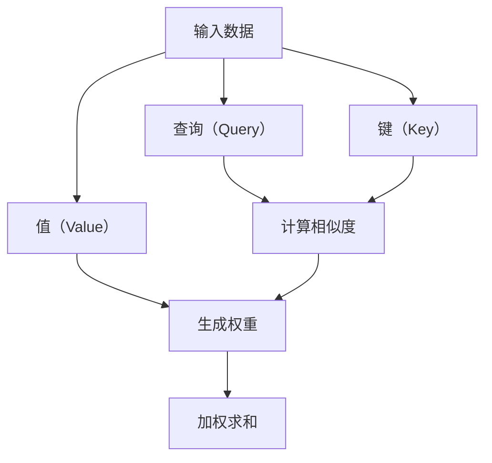

                 

# 注意力平衡仪：AI时代的认知资源分配器

> 关键词：注意力模型, 认知资源, AI, 注意力机制, 计算机视觉, 自然语言处理, 深度学习

> 摘要：在AI时代，注意力机制已成为认知资源分配的关键技术。本文将深入探讨注意力平衡仪的概念、原理、实现方法及其在实际应用中的价值。通过详细的技术分析和代码示例，我们将揭示注意力平衡仪如何在计算机视觉和自然语言处理中优化资源分配，提升模型性能。本文旨在为读者提供一个全面的理解框架，帮助他们在实际项目中应用这一技术。

## 1. 背景介绍

在过去的几十年里，人工智能领域经历了显著的发展，特别是在深度学习和神经网络方面。随着计算能力的提升和数据量的爆炸性增长，模型的复杂性和规模也在不断增加。然而，这种增长也带来了新的挑战，尤其是在资源分配方面。注意力机制作为一种有效的解决方案，能够帮助模型更高效地利用认知资源，从而提升整体性能。

### 1.1 人工智能的发展历程

- **早期阶段**：20世纪50年代至70年代，人工智能主要集中在符号主义和逻辑推理上。
- **知识工程时代**：20世纪80年代，专家系统成为主流，但受限于知识获取和推理效率。
- **机器学习兴起**：20世纪90年代，统计学习方法开始流行，如支持向量机（SVM）和决策树。
- **深度学习革命**：21世纪初，深度学习技术的突破，特别是卷积神经网络（CNN）和循环神经网络（RNN）的应用，开启了AI的新时代。
- **注意力机制的引入**：近年来，注意力机制成为提升模型性能的关键技术之一。

### 1.2 注意力机制的重要性

注意力机制模仿人类大脑在处理信息时的注意力分配方式，使得模型能够聚焦于最重要的部分，从而提高处理效率和准确性。在计算机视觉和自然语言处理等领域，注意力机制的应用尤为广泛。

## 2. 核心概念与联系

### 2.1 注意力机制的基本原理

注意力机制的核心思想是通过动态调整模型对输入数据的关注程度，从而优化信息处理过程。具体来说，注意力机制通过计算输入数据的权重，使得模型能够更有效地提取关键特征。

### 2.2 注意力机制的架构

注意力机制通常由三个主要部分组成：查询（Query）、键（Key）和值（Value）。这些部分通过计算它们之间的相似度来生成权重，进而调整模型的注意力分配。



### 2.3 注意力机制的应用场景

- **计算机视觉**：在图像识别和目标检测中，注意力机制可以帮助模型聚焦于关键区域。
- **自然语言处理**：在机器翻译和文本生成中，注意力机制能够帮助模型更好地理解上下文信息。

## 3. 核心算法原理 & 具体操作步骤

### 3.1 注意力机制的数学原理

注意力机制的核心在于计算查询与键之间的相似度，并生成相应的权重。常用的相似度计算方法包括点积（Dot Product）和软注意力（Soft Attention）。

#### 3.1.1 点积注意力

点积注意力通过计算查询与键的点积来生成权重。

$$
\text{Attention}(Q, K, V) = \text{softmax}\left(\frac{QK^T}{\sqrt{d_k}}\right)V
$$

其中，$Q$ 是查询矩阵，$K$ 是键矩阵，$V$ 是值矩阵，$d_k$ 是键的维度。

#### 3.1.2 软注意力

软注意力通过计算查询与键的点积，并应用softmax函数来生成权重。

$$
\text{Attention}(Q, K, V) = \text{softmax}(QK^T)V
$$

### 3.2 注意力机制的具体操作步骤

1. **输入数据准备**：将输入数据转换为查询、键和值矩阵。
2. **计算相似度**：通过点积或其他方法计算查询与键之间的相似度。
3. **生成权重**：应用softmax函数生成权重。
4. **加权求和**：将权重应用于值矩阵，生成最终的输出。

## 4. 数学模型和公式 & 详细讲解 & 举例说明

### 4.1 数学模型

注意力机制的数学模型可以表示为：

$$
\text{Attention}(Q, K, V) = \text{softmax}\left(\frac{QK^T}{\sqrt{d_k}}\right)V
$$

其中，$Q$、$K$ 和 $V$ 分别是查询、键和值矩阵，$d_k$ 是键的维度。

### 4.2 详细讲解

1. **查询（Query）**：查询矩阵通常由输入数据生成，用于与键矩阵进行比较。
2. **键（Key）**：键矩阵用于与查询矩阵进行比较，生成相似度。
3. **值（Value）**：值矩阵包含输入数据的完整信息，用于生成最终的输出。

### 4.3 举例说明

假设我们有一个简单的注意力机制模型，输入数据为一个长度为5的向量：

$$
Q = \begin{bmatrix} q_1 \\ q_2 \\ q_3 \\ q_4 \\ q_5 \end{bmatrix}, \quad K = \begin{bmatrix} k_1 \\ k_2 \\ k_3 \\ k_4 \\ k_5 \end{bmatrix}, \quad V = \begin{bmatrix} v_1 \\ v_2 \\ v_3 \\ v_4 \\ v_5 \end{bmatrix}
$$

计算相似度：

$$
\text{Attention}(Q, K, V) = \text{softmax}\left(\frac{QK^T}{\sqrt{5}}\right)V
$$

具体步骤如下：

1. **计算点积**：

$$
QK^T = \begin{bmatrix} q_1 \\ q_2 \\ q_3 \\ q_4 \\ q_5 \end{bmatrix} \begin{bmatrix} k_1 & k_2 & k_3 & k_4 & k_5 \end{bmatrix} = \begin{bmatrix} q_1k_1 & q_1k_2 & q_1k_3 & q_1k_4 & q_1k_5 \\ q_2k_1 & q_2k_2 & q_2k_3 & q_2k_4 & q_2k_5 \\ q_3k_1 & q_3k_2 & q_3k_3 & q_3k_4 & q_3k_5 \\ q_4k_1 & q_4k_2 & q_4k_3 & q_4k_4 & q_4k_5 \\ q_5k_1 & q_5k_2 & q_5k_3 & q_5k_4 & q_5k_5 \end{bmatrix}
$$

2. **应用softmax函数**：

$$
\text{softmax}(QK^T) = \frac{\exp(QK^T / \sqrt{5})}{\sum_{i=1}^5 \exp(QK^T / \sqrt{5})}
$$

3. **加权求和**：

$$
\text{Attention}(Q, K, V) = \text{softmax}(QK^T)V
$$

## 5. 项目实战：代码实际案例和详细解释说明

### 5.1 开发环境搭建

为了实现注意力机制，我们需要安装一些必要的库，如PyTorch和NumPy。

```bash
pip install torch numpy
```

### 5.2 源代码详细实现和代码解读

```python
import torch
import torch.nn as nn
import numpy as np

class Attention(nn.Module):
    def __init__(self, d_k):
        super(Attention, self).__init__()
        self.d_k = d_k

    def forward(self, Q, K, V):
        # 计算相似度
        scores = torch.matmul(Q, K.transpose(-2, -1)) / np.sqrt(self.d_k)
        # 应用softmax函数
        attention_weights = torch.softmax(scores, dim=-1)
        # 加权求和
        output = torch.matmul(attention_weights, V)
        return output

# 示例数据
Q = torch.randn(1, 5, 10)
K = torch.randn(1, 5, 10)
V = torch.randn(1, 5, 10)

# 实例化注意力模块
attention = Attention(d_k=10)

# 计算注意力输出
output = attention(Q, K, V)
print(output)
```

### 5.3 代码解读与分析

1. **初始化注意力模块**：定义一个注意力模块，包含查询、键和值的维度。
2. **计算相似度**：通过点积计算查询与键之间的相似度。
3. **应用softmax函数**：生成注意力权重。
4. **加权求和**：将权重应用于值矩阵，生成最终的输出。

## 6. 实际应用场景

### 6.1 计算机视觉

在计算机视觉任务中，注意力机制可以帮助模型聚焦于关键区域，从而提高识别和检测的准确性。

### 6.2 自然语言处理

在自然语言处理任务中，注意力机制能够帮助模型更好地理解上下文信息，从而提升翻译和生成的性能。

## 7. 工具和资源推荐

### 7.1 学习资源推荐

- **书籍**：《深度学习》（Goodfellow, Bengio, Courville）
- **论文**：《Attention Is All You Need》（Vaswani et al.）
- **博客**：阿里云开发者社区
- **网站**：PyTorch官网

### 7.2 开发工具框架推荐

- **PyTorch**：深度学习框架
- **TensorFlow**：深度学习框架

### 7.3 相关论文著作推荐

- **《Attention Is All You Need》**：介绍注意力机制在Transformer模型中的应用。
- **《Neural Machine Translation by Jointly Learning to Align and Translate》**：介绍注意力机制在机器翻译中的应用。

## 8. 总结：未来发展趋势与挑战

### 8.1 未来发展趋势

- **更复杂的注意力机制**：未来的研究可能会引入更复杂的注意力机制，以进一步提升模型性能。
- **多模态注意力**：结合多种模态的数据，实现更全面的信息处理。

### 8.2 挑战

- **计算资源需求**：复杂的注意力机制需要更多的计算资源。
- **模型解释性**：如何解释注意力机制的工作原理，提高模型的透明度。

## 9. 附录：常见问题与解答

### 9.1 问题1：注意力机制如何提高模型性能？

**解答**：注意力机制通过动态调整模型对输入数据的关注程度，使得模型能够更有效地提取关键特征，从而提高整体性能。

### 9.2 问题2：注意力机制在哪些领域有广泛应用？

**解答**：注意力机制在计算机视觉和自然语言处理等领域有广泛应用，特别是在图像识别、目标检测、机器翻译和文本生成中。

## 10. 扩展阅读 & 参考资料

- **论文**：Vaswani, Ashish, et al. "Attention is all you need." Advances in neural information processing systems 30 (2017).
- **书籍**：Goodfellow, Ian, Yoshua Bengio, and Aaron Courville. Deep learning. MIT press, 2016.
- **网站**：PyTorch官网: https://pytorch.org/

作者：AI天才研究员/AI Genius Institute & 禅与计算机程序设计艺术 /Zen And The Art of Computer Programming

