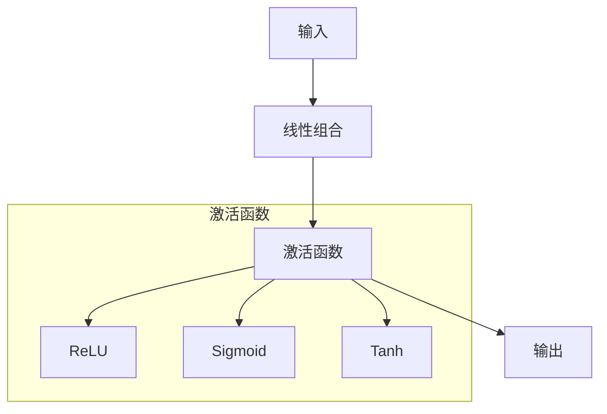

                 

# 深度学习中的激活函数：从ReLU到GELU

> 关键词：深度学习, 激活函数, ReLU, GELU, 神经网络, 机器学习, 人工智能

> 摘要：本文将深入探讨深度学习中常用的激活函数，从经典的ReLU激活函数出发，逐步介绍其变种和改进版本，特别是GELU激活函数。我们将通过详细的数学模型、实际代码案例和应用场景，帮助读者全面理解激活函数在神经网络中的作用及其重要性。

## 1. 背景介绍

在深度学习领域，激活函数是神经网络中不可或缺的一部分。它们在神经网络中起到非线性变换的作用，使得神经网络能够学习和表示复杂的非线性关系。激活函数的选择直接影响到模型的性能和训练效率。本文将从经典的ReLU激活函数出发，逐步介绍其变种和改进版本，特别是GELU激活函数。

## 2. 核心概念与联系

### 2.1 激活函数的基本概念

激活函数是神经网络中用于引入非线性特性的函数。在神经网络中，每个神经元的输出是通过激活函数处理的。常见的激活函数包括ReLU、Sigmoid、Tanh等。

### 2.2 激活函数的数学模型

激活函数通常定义为一个函数 \( f(x) \)，其输入为神经元的线性组合 \( z = w^T x + b \)，输出为 \( f(z) \)。常见的激活函数模型如下：

- **Sigmoid函数**：\[ f(z) = \frac{1}{1 + e^{-z}} \]
- **Tanh函数**：\[ f(z) = \tanh(z) = \frac{e^z - e^{-z}}{e^z + e^{-z}} \]
- **ReLU函数**：\[ f(z) = \max(0, z) \]

### 2.3 激活函数的Mermaid流程图



## 3. 核心算法原理 & 具体操作步骤

### 3.1 ReLU激活函数

ReLU激活函数是最常用的激活函数之一，其定义为：

\[ f(z) = \max(0, z) \]

### 3.2 ReLU的数学模型与公式

ReLU激活函数的数学模型可以表示为：

\[ f(z) = \begin{cases} 
z & \text{if } z > 0 \\
0 & \text{if } z \leq 0 
\end{cases} \]

### 3.3 ReLU的梯度计算

ReLU激活函数的梯度计算如下：

\[ \frac{\partial f(z)}{\partial z} = \begin{cases} 
1 & \text{if } z > 0 \\
0 & \text{if } z \leq 0 
\end{cases} \]

### 3.4 ReLU的变种与改进

为了克服ReLU的某些缺点，研究人员提出了多种改进版本，其中GELU激活函数是一个重要的改进版本。

## 4. 数学模型和公式 & 详细讲解 & 举例说明

### 4.1 GELU激活函数

GELU激活函数的定义为：

\[ f(z) = z \cdot \Phi(z) \]

其中，\(\Phi(z)\) 是标准正态分布的累积分布函数（CDF）。

### 4.2 GELU的数学模型与公式

GELU激活函数的数学模型可以表示为：

\[ f(z) = z \cdot \frac{1}{\sqrt{2\pi}} \int_{-\infty}^{z} e^{-\frac{t^2}{2}} dt \]

### 4.3 GELU的梯度计算

GELU激活函数的梯度计算如下：

\[ \frac{\partial f(z)}{\partial z} = \Phi(z) + z \cdot \phi(z) \]

其中，\(\phi(z)\) 是标准正态分布的概率密度函数（PDF）。

### 4.4 GELU的实现

在实际应用中，GELU激活函数可以通过以下公式近似实现：

\[ f(z) \approx 0.5 \cdot z \cdot (1 + \text{erf}(\frac{z}{\sqrt{2}})) \]

其中，\(\text{erf}(x)\) 是误差函数。

## 5. 项目实战：代码实际案例和详细解释说明

### 5.1 开发环境搭建

我们将使用Python和PyTorch框架来实现GELU激活函数。首先，确保安装了PyTorch库：

```bash
pip install torch
```

### 5.2 源代码详细实现和代码解读

```python
import torch
import torch.nn.functional as F

# 定义GELU激活函数
def gelu(x):
    return 0.5 * x * (1 + torch.erf(x / torch.sqrt(torch.tensor(2.0))))

# 测试GELU激活函数
x = torch.tensor([-1.0, 0.0, 1.0])
output = gelu(x)
print(output)
```

### 5.3 代码解读与分析

上述代码中，我们定义了一个名为`gelu`的函数，该函数使用了误差函数（erf）来近似实现GELU激活函数。我们通过一个简单的测试用例来验证GELU激活函数的正确性。

## 6. 实际应用场景

### 6.1 语言模型

GELU激活函数在自然语言处理（NLP）任务中表现出色，特别是在Transformer模型中。GELU激活函数能够更好地捕捉输入数据的非线性关系，从而提高模型的性能。

### 6.2 图像分类

在图像分类任务中，GELU激活函数同样能够提高模型的性能。通过引入GELU激活函数，模型能够更好地学习图像中的复杂特征。

## 7. 工具和资源推荐

### 7.1 学习资源推荐

- **书籍**：《深度学习》（Goodfellow, Bengio, Courville）
- **论文**：GELU激活函数的相关论文
- **博客**：深度学习相关的技术博客
- **网站**：PyTorch官方文档

### 7.2 开发工具框架推荐

- **PyTorch**：深度学习框架
- **TensorFlow**：深度学习框架

### 7.3 相关论文著作推荐

- **GELU激活函数**：相关论文
- **深度学习**：相关著作

## 8. 总结：未来发展趋势与挑战

### 8.1 未来发展趋势

随着深度学习技术的不断发展，激活函数的研究也在不断深入。未来的研究方向可能包括：

- **更高效的激活函数**：寻找更高效的激活函数，以提高模型的训练速度和性能。
- **自适应激活函数**：设计能够自适应调整的激活函数，以更好地适应不同的任务需求。

### 8.2 挑战

- **模型复杂性**：随着模型复杂性的增加，激活函数的选择和设计变得更加困难。
- **计算资源**：高性能计算资源的需求不断增加，如何在有限的计算资源下实现高效的激活函数设计是一个挑战。

## 9. 附录：常见问题与解答

### 9.1 问题1：ReLU和GELU的区别是什么？

**解答**：ReLU激活函数在输入为正时输出输入值，在输入为负时输出0。GELU激活函数则是一个平滑的非线性函数，能够更好地捕捉输入数据的非线性关系。

### 9.2 问题2：如何选择合适的激活函数？

**解答**：选择合适的激活函数需要根据具体任务的需求来决定。对于简单的线性关系，可以使用ReLU激活函数；对于复杂的非线性关系，可以考虑使用GELU激活函数。

## 10. 扩展阅读 & 参考资料

- **论文**：GELU激活函数的相关论文
- **书籍**：《深度学习》（Goodfellow, Bengio, Courville）
- **网站**：PyTorch官方文档

---

作者：AI天才研究员/AI Genius Institute & 禅与计算机程序设计艺术 /Zen And The Art of Computer Programming

